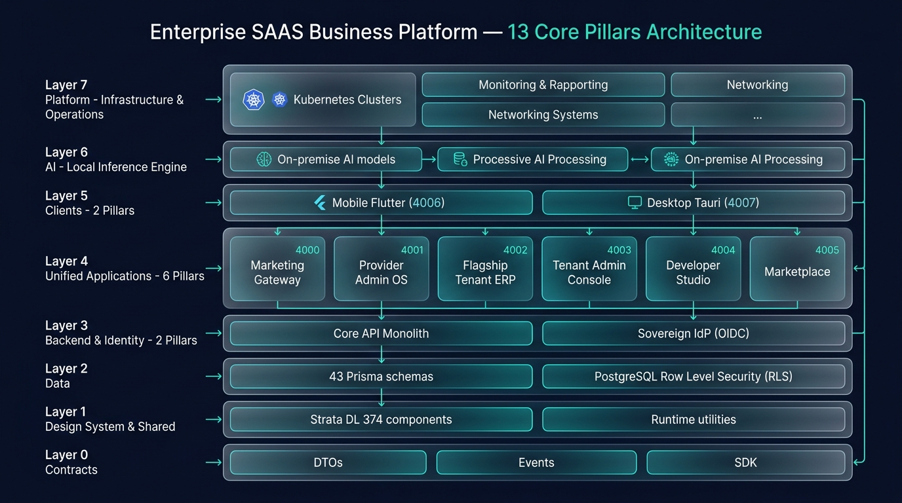
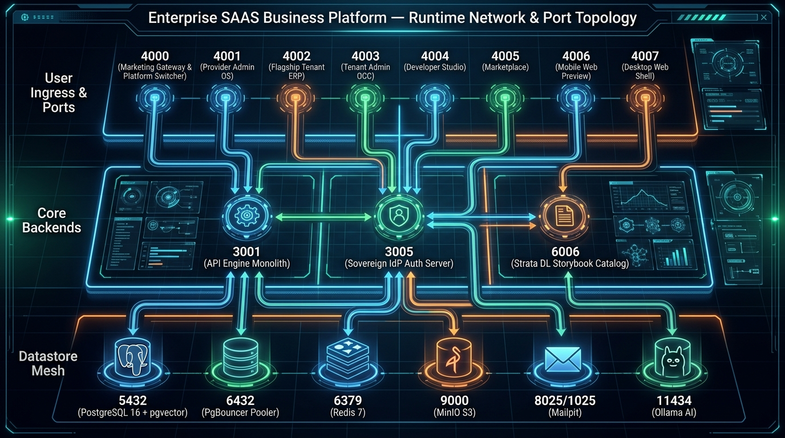
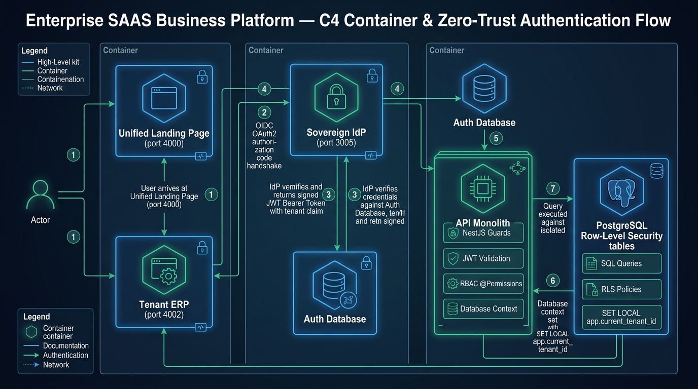
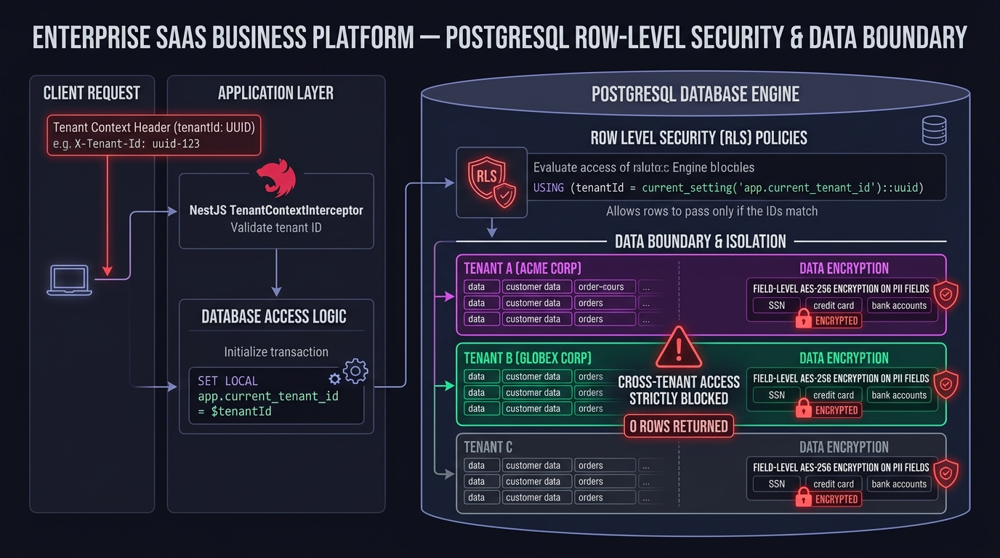

# Enterprise SAAS Business Platform — Master Architecture

This document presents the official architecture, port topology, container flow, and multi-tenant security model for the **Enterprise SAAS Business Platform**, organized into **13 Brand-Neutral Pillars** across an 8-layer Strata model.

---

## 1. Strata 8-Layer Architecture (13 Core Pillars)

The platform is structured into 8 discrete Strata layers (L0 to L7) with strict unidirectional dependencies.

### Layer Distribution:
- **Layer 0 (Contracts)**: `@kannan19302/contracts` — TypeScript DTOs, domain events, client SDK.
- **Layer 1 (Design System & Shared)**:
  - `design-system` — Strata DL 2.0 (374 accessible UI components, zero raw literals, WCAG 2.2 AA).
  - `shared` — Unified framework runtime, configuration management, logging & telemetry.
- **Layer 2 (Data Persistence)**: `data` — 43 Prisma schemas, 1,910 models, PostgreSQL Row Level Security (RLS).
- **Layer 3 (Core Backends & Sovereign Identity)**:
  - `api` — Core NestJS monolithic backend (574 domain controllers, BullMQ workers, sandbox services).
  - `idp` — Sovereign Identity Provider (OIDC / OAuth2 / Single Sign-On server).
- **Layer 4 (Unified Application Mesh)**:
  - `marketing-site` (Port 4000) — Unified Landing Page, Product Showcase & Platform Switcher.
  - `provider-admin-os` (Port 4001) — Cloud Operator Control Plane (`PLT-PAO`).
  - `tenant-apps` (Port 4002) — Flagship Multi-Tenant ERP Business Suite (CRM, Finance, HR, SCM).
  - `tenant-apps/tenant-admin` (Port 4003) — Tenant Admin Console (`PLT-TAD`).
  - `developer-platform` (Port 4004) — Visual App & Site Studio / Developer Console.
  - `developer-platform/marketplace` (Port 4005) — Extension, Template & Module Marketplace.
- **Layer 5 (Edge Clients & Previews)**:
  - `mobile` (Port 4006) — Flutter Web Client Preview (430 screens).
  - `desktop-app` (Port 4007) — Tauri Desktop Web Shell.
- **Layer 6 (AI & Automation)**: Local LLM inference engine & embeddings (`ollama` on port 11434).
- **Layer 7 (Platform Infrastructure & Operations)**: `platform` — Docker Compose, Terraform, Kubernetes, and developer tooling.

---

## 2. Runtime Network & Port Topology

The runtime environment operates on a contiguous, zero-collision port matrix mapped 1:1 between local host and Docker containers.

### Master Port Allocation Matrix:
| Port | Component | Operational Role |
| :--- | :--- | :--- |
| **`4000`** | `marketing-site` | Unified Master Landing Page, Product Showcase & Platform Switcher |
| **`4001`** | `provider-admin-os` | Cloud Operator Control Plane (`PLT-PAO`) |
| **`4002`** | `tenant-apps` | Flagship Multi-Tenant ERP Business Suite (Finance, CRM, HR, SCM) |
| **`4003`** | `tenant-apps/tenant-admin` | Tenant Admin Console (`PLT-TAD`) |
| **`4004`** | `developer-platform` | Visual App/Site Studio & Developer Console |
| **`4005`** | `developer-platform/marketplace` | Extension, Template & Module Marketplace |
| **`4006`** | `mobile` | Flutter Web Client Preview |
| **`4007`** | `desktop-app` | Tauri Desktop Web Shell |
| **`3001`** | `api` | Core NestJS Backend Engine (574 Controllers) |
| **`3005`** | `idp` | Sovereign Identity Provider (OIDC / OAuth2 / SSO) |
| **`6006`** | `design-system/storybook` | Strata DL Component Catalog & Workbench |
| **`5432`** | `postgres` | Multi-Tenant PostgreSQL 16 with Row-Level Security (RLS) |
| **`6432`** | `pgbouncer` | Transaction Connection Pooler |
| **`6379`** | `redis` | Cache, BullMQ Queues, Rate-Limiters |
| **`8025 / 1025`** | `mailpit` | Local Transactional Email Capture (Web UI / SMTP) |
| **`9000 / 9001`** | `minio` | S3-Compatible Object Storage & Console |
| **`11434`** | `ollama` | Local AI Inference Server |

---

## 3. C4 Container Architecture & Zero-Trust Authentication Flow

Authentication and session lifecycle across all 13 pillars are governed by sovereign OpenID Connect (OIDC) protocols.

### Request Lifecycle:
1. **User Navigation**: User lands on the Unified Landing Page (`http://localhost:4000`) or deep-links directly into an application (`http://localhost:4002/apps`).
2. **OIDC Handshake**: Unauthenticated requests redirect to Sovereign IdP (`http://localhost:3005/login`) for authentication.
3. **Session Issuance**: Upon credential validation, IdP signs a cryptographic JWT Bearer Token containing `sub`, `email`, `role`, and active `tenantId`.
4. **API Invocation**: Frontend client issues REST/GraphQL calls with `Authorization: Bearer <token>` to the API Engine Monolith (`http://localhost:3001`).
5. **Zero-Trust Guarding**: NestJS `JwtAuthGuard` validates the token signature, and `RbacGuard` verifies controller `@Permissions('domain:resource:action')`.
6. **Tenant Context Binding**: Interceptors execute `SET LOCAL app.current_tenant_id = $tenantId` on the database transaction connection.
7. **Database Execution**: PostgreSQL evaluates Row-Level Security policies to ensure zero cross-tenant leakage.

---

## 4. Multi-Tenant PostgreSQL Row-Level Security (RLS) & Data Boundaries

Tenancy is enforced at the database kernel level using PostgreSQL Row-Level Security with a non-bypassable role.

### Security Invariants:
1. **Universal Tenancy**: Every business table enforces `tenantId UUID NOT NULL` and active RLS via `ENABLE ROW LEVEL SECURITY` and `FORCE ROW LEVEL SECURITY`.
2. **Fail-Closed Assertion**: Any query executed without an initialized tenant session (`app.current_tenant_id`) returns exactly **0 rows**.
3. **Field-Level Encryption**: Sensitive PII fields (SSN, credit card, bank accounts) are transparently encrypted at rest with AES-256-GCM.
4. **Zero Mocks**: All financial ledgers and metric cards derive strictly from real database transactions.
