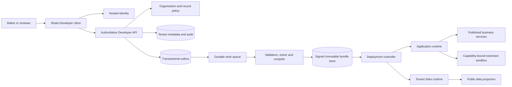
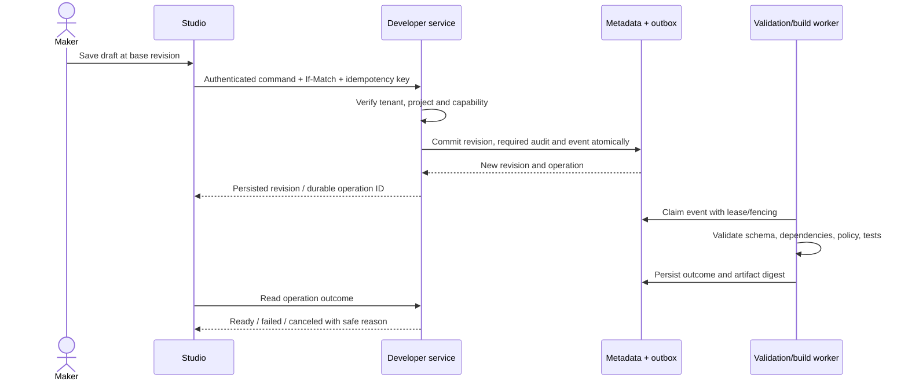

# Architecture and technical design

## Context, ownership and implementation boundaries

| Capability | Accountable owner | Existing implementation / contract | Integration rule |
| --- | --- | --- | --- |
| Developer shell and authoring | PLT-DEV | developer-platform; API Developer module | Typed public contract; never cross-repository source imports |
| Artifact/package source | PLT-DEV with PLT-BIZ persistence | unierp-contracts, api, data | Immutable revision and content-hash boundary |
| Websites/public runtime | PLT-SITE | tenant-sites, web-studio, tenant-site-template | Developer links/hosts authoring capability; site owner publishes |
| Business records | PLT-BIZ / owning domain | api + data | Builders reference typed interfaces; no duplicate supplier ledger |
| Sign-in/session/machine identity | PLT-IAM | idp/auth and published identity contracts | OIDC handoff and server-verified tenant/principal |
| Organization policies | PLT-TAD | tenant-admin / OCC contracts | Inherited policy, explicit authorized requests |
| Extension execution | PLT-DEV | extension-api + sandbox | Signed manifest, host capability checks, isolated execution |
| Commercial listing/install | PLT-MKT | marketplace | Technical package publication is distinct from marketplace commerce |
| Shared UI | PLT-DS | design-system / @kannan19302/ui | Approved public exports and token versions |
| Workloads/recovery | PLT-OPS | infra/kernel/service-kit and owning services | Durable jobs, bounded pools, telemetry and recovery contracts |

Do not assume one service per row. Prefer existing modular services until a measured isolation/scaling need justifies decomposition. Directory placement of web controllers does not change site ownership.

## Container view

Trust zones: untrusted browser/editor content; authenticated control-plane API; tenant-scoped persistence; isolated build/extension workers; public serving; external connectors; provider operations. Every crossing has explicit authentication/capability, timeout, payload limits and redaction. Tenant routing metadata is not customer content.

## Shared implementation model

One editor per builder, parameterized by project/library scope. Server capability manifest determines allowed owner scopes, consumers, install modes and runtime. The frontend registry is a projection and cannot authorize compatibility. Artifact identity/discovery remains BuilderArtifact. Immutable ArtifactRevision holds canonical ArtifactEnvelopeV1. Compiler/preview/runtime adapters consume that versioned envelope; concrete builder tables are transitional projections.

A project release resolves its full dependency graph to exact revision/package hashes, policy version, migrations, tests and environment binding declarations. Mutable branch pointers and library heads never enter production locks. Managed packages expose configuration slots; unlocked packages accept separately owned overlays; internal packages remain controlled; forks carry provenance.

## Save, publish and deploy sequence

A publish/release request additionally verifies signature, independent approvals, compatibility and evidence on the exact digest. Deployment verifies the same bundle, performs compatible migration, smoke-checks before activation and retains the previous serving revision until transition is proven. Any phase failure has explicit recovery.

## Runtime independence and scale

Accepted ADR-0006 permits an initial single cell while requiring opaque tenant placement and no synchronous global authoring dependency for normal serving. Runtime uses local signed bundles and policy caches. A control-plane outage must not stop ordinary serving solely because the editor is unavailable; expired/unknown security or revocation state still fails closed for the affected privileged capability. Model that degraded policy separately from a general service outage.

Isolate build, preview, runtime extension and integration pools; enforce tenant budgets at admission and execution. Bound graph size, metadata size, compilation memory, query cardinality, export bytes and fanout. Queue fairness prevents noisy-neighbor starvation. Multi-region deployment/relocation requires separate qualification, not an immediate implementation task.

## Key architecture decisions

Accepted: immutable lifecycle; exact production locks; unknown-field preservation; deterministic metadata migration; runtime independence; Strata shell. Proposed implementation defaults: existing service boundaries, optimistic revision concurrency, durable operation polling/events, tenant-isolated ephemeral previews, deny-by-default server capabilities. Pending choices include solution grouping, source-control authority and simultaneous visual/source merge policy; see 15. No new generic engine or datastore should be created before the two pilot slices demonstrate need.

## Evidence and seams

The source scan found 35 Developer controller files and 403 route declarations, plus 28 developer metadata models. These are structural observations, not proof of working API behavior. Read evidence/OBSERVED_API_ROUTES.json and OBSERVED_MODELS.json alongside the source; route prefixes/version decorators and runtime guards require full verification.

Test seams: schema/serializer conformance; controller-to-service authorization; service-to-RLS transaction; outbox-to-worker redelivery; solver-to-signed-store reproducibility; deployment-to-runtime activation; public-domain-to-tenant isolation; cross-repository consumer compatibility.
