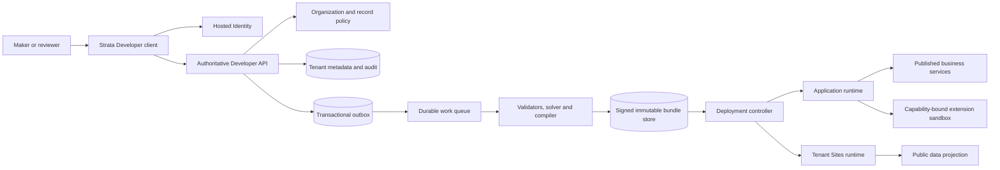
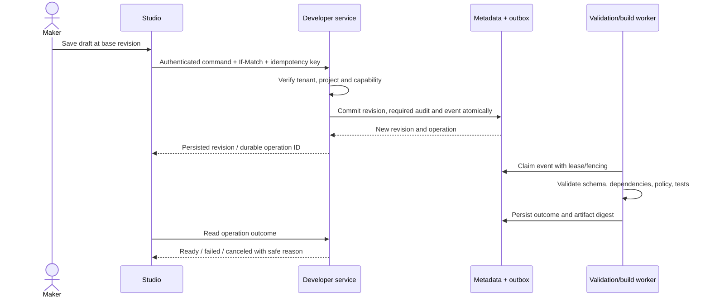

# UniERP Developer Platform v1 — comprehensive development handoff

Combined reference edition. The numbered source chapters remain the editable planning documents. Implementation readiness is conditional on the accepted governance gates.

---

Source chapter: [00_START_HERE.md](00_START_HERE.md)

# Developer Platform v1 — prerequisites and development entry point

This is the consolidated design and delivery baseline for 108 screen concepts. It includes the original 76 selected designs and 32 enterprise additions, all ordered in ../design/SCREEN_MANIFEST.json. Use ../design/index.html for visual review. The numeric sequence is the user journey, not a mandate to implement one screen at a time.

## Readiness decision

**The handoff package is actionable; unrestricted feature development is not yet cleared.** The inspected [readiness audit](../../../../unierp-workspace/governance/UNIERP_SAAS_READINESS_AUDIT_2026-08-28.md) records broad development and production NO-GO. [FND-PA-001 owner acceptance](../../../../unierp-workspace/governance/FND-PA-001_OWNER_REVIEW.md) permits the ordered P0 remediation, not broad expansion. This design task does not close those gates or supersede them. Start with the named prerequisite backlog and run the applicable continuation checks against current evidence. Do not infer readiness from old audit counts or screenshots.

The package contains completed design/planning deliverables. Product requirements proposed here still need incorporation into their authoritative owners; contracts and runtime behavior must then be proved. No certificate, production capability or market parity is claimed.

## Reading and execution order

| Step | Document | Outcome |
| --- | --- | --- |
| 1 | [01_CHANGE_CONTRACT](01_CHANGE_CONTRACT.md) | Scope, authority and safety boundaries |
| 2 | [02_PRODUCT_REQUIREMENTS](02_PRODUCT_REQUIREMENTS.md) | Personas, outcomes, functional acceptance |
| 3 | [03_INFORMATION_ARCHITECTURE](03_INFORMATION_ARCHITECTURE.md) | Screen sequence, navigation and flows |
| 4 | [04_ARCHITECTURE](04_ARCHITECTURE.md) | Ownership, runtime boundaries and component model |
| 5 | [05_DATA_AND_CONTRACTS](05_DATA_AND_CONTRACTS.md) | Existing model/contract reuse and lifecycle |
| 6 | [06_SECURITY_THREAT_MODEL](06_SECURITY_THREAT_MODEL.md) | Threats, permission decisions and proof |
| 7 | [07_BUILDER_ENGINEERING_GUIDE](07_BUILDER_ENGINEERING_GUIDE.md) | Shared builder implementation and conformance |
| 8 | [08_DESIGN_SYSTEM_ACCESSIBILITY](08_DESIGN_SYSTEM_ACCESSIBILITY.md) | Deterministic UI and accessible authoring |
| 9 | [09_ENVIRONMENT_SETUP](09_ENVIRONMENT_SETUP.md) | Tooling and isolated development prerequisites |
| 10 | [10_TEST_STRATEGY](10_TEST_STRATEGY.md) | Pilot proof and quality gates |
| 11 | [11_RELEASE_MIGRATION_RECOVERY](11_RELEASE_MIGRATION_RECOVERY.md) | Immutable promotion and recovery |
| 12 | [12_OBSERVABILITY_SLO_CAPACITY](12_OBSERVABILITY_SLO_CAPACITY.md) | Qualification budgets, alerts and runbooks |
| 13 | [13_EPICS_STORIES_SPRINTS](13_EPICS_STORIES_SPRINTS.md) | Delivery waves, owners and planning |
| 14 | [14_GUIDED_DEVELOPMENT](14_GUIDED_DEVELOPMENT.md) | Repeatable execution instructions |
| 15 | [15_DECISIONS_AND_READINESS](15_DECISIONS_AND_READINESS.md) | Decisions and release/start gates |
| 16 | [16_ENTERPRISE_GAP_REVIEW](16_ENTERPRISE_GAP_REVIEW.md) | Market references and added screen rationale |
| 17 | [17_TRACEABILITY](17_TRACEABILITY.md) | Requirements/screens/stories/evidence mapping |
| 18 | [18_IMPLEMENTATION_BACKLOG](18_IMPLEMENTATION_BACKLOG.md) | Story-level acceptance and dependencies |
| 19 | [19_ACCEPTANCE_HANDOFF](19_ACCEPTANCE_HANDOFF.md) | Ready/Done definitions and approval packet |

## Governing sources

- [Platform catalog](../../../../unierp-platform/docs/PLATFORM_CATALOG.md).
- [Developer requirements](../../../../unierp-platform/docs/platforms/developer-platform/REQUIREMENTS.md), [security](../../../../unierp-platform/docs/platforms/developer-platform/SECURITY.md), [contracts](../../../../unierp-platform/docs/platforms/developer-platform/CONTRACTS.md).
- [Tenant Sites requirements](../../../../unierp-platform/docs/platforms/tenant-sites/REQUIREMENTS.md) and [contracts](../../../../unierp-platform/docs/platforms/tenant-sites/CONTRACTS.md).
- [Accepted artifact lifecycle](../../../../unierp-platform/docs/adr/ADR-0005-developer-platform-artifact-and-package-lifecycle.md), [runtime independence](../../../../unierp-platform/docs/adr/ADR-0006-developer-platform-cells-and-runtime-independence.md), [compatibility](../../../../unierp-platform/docs/adr/ADR-0007-developer-platform-compatibility-and-portability.md).
- [Accepted portability matrix](../../../../unierp-platform/docs/platforms/developer-platform/ARTIFACT-PORTABILITY-MATRIX.md) and [pilot acceptance](../../../../unierp-platform/docs/platforms/developer-platform/PILOT-ACCEPTANCE.md).
- [Strata ADR](../../../../unierp-platform/docs/adr/ADR-0009-strata-enterprise-design-language.md) and [Strata skill](../../../../unierp-workspace/governance/skills/unierp-strata-design/SKILL.md).
- [Advanced customization plan](../../../../unierp-platform/docs/platforms/developer-platform/ADVANCED-CUSTOMIZATION-PLAN.md) is a draft; accepted ADRs and owning specifications prevail.

## First work packet

Assign accountable people to the Product, Architecture, Security, Data, SRE and QA roles in document 15. Revalidate readiness and the source baseline. Close project/portability/contract decisions. Provision a disposable tenant-isolation test environment. Then execute the App and Site pilots through the same artifact/installation/release services. These are independently tracked prerequisite stories FND-01..12; screen stories must not bypass them.

---

Source chapter: [01_CHANGE_CONTRACT.md](01_CHANGE_CONTRACT.md)

# Developer Platform v1 — design and implementation handoff contract

Date: 2026-09-08. Package status is recorded in ../evidence/VERIFICATION.md. This is an R2 cross-platform design/planning handoff with R1 additive file effects, not authorization to implement or deploy all planned behavior.

## 1. Request and outcome

Consolidate the selected 76 designs, order them by user journey, close enterprise design gaps, and supply end-to-end product, architecture, security and delivery prerequisites. Deliver 108 selected screens: 76 consolidated plus 32 additions. Preserve the previous folders and selected source bytes. One design folder contains one selected PNG per screen, with explicit old-to-new IDs.

Acceptance: 108 selected images; all 76 earlier IDs mapped once; 32 gap treatments reviewed; complete prerequisite suite; screen/story/requirement traceability; actual repository/API/model observations; valid links and image files; preserved baseline; candid readiness decision. No product code, migration, remote message, commit, push, deployment or contract publication is in scope.

## 2. Authority and ownership

Accountable product: PLT-DEV; website lifecycle PLT-SITE; policy PLT-TAD; identity PLT-IAM; commercial marketplace PLT-MKT; domain data PLT-BIZ; UI PLT-DS; recovery/runtime PLT-OPS. Repositories are listed in 04_ARCHITECTURE.md. Applicable DEV/SITE FR/NFR, DEV-SEC/API/DATA/INT requirements and accepted ADR-0005/0006/0007/0009 are linked in 00_START_HERE.md.

Inspected: owning specifications, accepted portability matrix, canonical artifact contracts, builder definitions, Developer controllers, Prisma metadata models, sandbox boundary, package scripts and readiness records. Existing artifacts take precedence over invented replacements. The older raster handoff used frontend registry scopes as intended portability; that is corrected here: the accepted portability matrix is controlling, while registry mismatch is implementation drift.

## 3. Decisions and assumptions

The user authorized additive consolidation, additional raster designs and comprehensive prerequisite documents. Sources are copied, never moved or deleted. The name v1 is the version of this consolidated handoff, not a downgrade of source artwork. New capabilities outside owning requirements are explicit proposal requirements DP-RQ-* and cannot silently become accepted product scope.

Current DevProject identifies exactly one APP or SITE; a unified home and document tabs can span projects. Earlier multi-surface overview imagery is presentation grouping, not permission to remove the project-kind constraint. A durable multi-app solution container requires a separate accepted decision. Broad implementation and production remain NO-GO under the inspected prerequisite audit until their continuation gates pass.

## 4. Change design and invariants

No executable application changes. Proposed implementation retains immutable revisions, packages, installations and release locks; server tenant/record authorization; atomic state/outbox writes; append-only required audit; recoverable durable operations; optimistic concurrency and request idempotency. Library linking preserves source ownership; fork creates new ownership; overlays remain consumer-owned. Runtime serves verified local bundles independently of authoring availability, subject to security-policy freshness.

Failure behavior includes validation, forbidden, stale revision, duplicate intent, worker loss, partial deployment, revocation and offline conflict. Concrete test cases, contract fields and lifecycle transitions are in 05/06/10/11. No new schema or endpoint is published by this folder. Data classification, retention, residency, erasure and recovery must be closed per resource before implementation. No real secrets or business data are used in designs.

Strata light concepts use canonical floorplans, document tabs and contextual inspectors. Deterministic implementation must use approved UI tokens/components and pass keyboard, screen-reader, reflow, RTL and contrast proof. The static gallery is a local document viewer, not a shipped product shell. NFR targets are proposed qualification budgets, not measured achievements.

## 5. Delivery safety

Begin with authority/readiness closure and two isolated pilots, then migrate builders in controlled waves. No broad release until proof. Use immutable build artifacts and exact dependency locks; feature availability follows server capabilities. Compatibility windows require published owner decisions. Rollback only where data compatibility permits; otherwise forward recovery. Keep source revisions and independent library resources during archive/import/restore.

## 6. Verification plan

| Claim | Boundary | Expected proof |
| --- | --- | --- |
| Consolidation | Source/target SHA256 | 76 identical selected copies and complete old/new map |
| Enterprise additions | Generated PNG + visual review | 32 selected, readable and coherent screens |
| Coverage | Manifest/story/requirement graph | 108 unique contiguous IDs; no unmapped screen |
| Preservation | Initial baseline hashes | Zero modifications to previous design files |
| Handoff | Links, JSON/CSV, source inventory | No missing links, empty discovery or invented implementation evidence |
| Future runtime | Real API/DB/browser/workers | Tenant A/B/no-context, denied roles, duplicate/concurrent writes, timeout/recovery, migration and accessibility evidence |

## 7. Knowledge delta and completion

Knowledge delta UPDATED in this dated design proposal and planning evidence. Normative authorities remain at their owning paths and are linked rather than replaced. Publishing any new requirement or changing an accepted boundary is a future owner-governed change. Final outcome, acceptance counts and exact checks are in ../evidence/VERIFICATION.md. Development-readiness gates and decisions are in 15_DECISIONS_AND_READINESS.md.

The market runner was inspected but is unsuitable as this package's verification command: its direct execution commits/pushes all repositories and writes a ledger, and some market metrics are static claims. No such action is authorized here. Use scoped evidence checks; do not treat that runner's percentages as runtime proof.

---

Source chapter: [02_PRODUCT_REQUIREMENTS.md](02_PRODUCT_REQUIREMENTS.md)

# Product requirements — Developer Studio v1

Status: implementation proposal constrained by accepted authorities. DP-RQ identifiers are local handoff IDs, not newly published normative requirements.

## Product intent and identity

A tenant maker moves from an idea to a versioned, testable application or website in one Strata workbench. A specialist can build reusable resources in the organization library and attach compatible immutable versions to projects later. UniERP's identity is an explicit context band, persistent document tabs, layered navigation and a consistent left-toolbox / canvas / right-inspector arrangement. Enterprise controls appear at the relevant decision, not as a wall of dashboard tiles.

The default unit of deployment remains one APP or SITE DevProject. Organization home groups them, and tabs allow concurrent work across projects. No duplicate identity platform, business database, workflow engine, commercial marketplace or provider console is created.

## Personas and outcomes

| Persona | Core job | Success evidence |
| --- | --- | --- |
| Maker | Build a form/page and bind data without losing scope | Both pilot journeys complete with correct persisted content |
| Professional developer | Extend typed source, API and logic safely | Unknown fields survive round trip; contracts and sandbox tests pass |
| Library maintainer | Publish/reuse/upgrade without breaking consumers | Pinned consumers unchanged until explicit upgrade |
| Reviewer / QA | Assess change and evidence independently | Approval is invalidated when the candidate digest changes |
| Tenant security admin | Enforce data and capability boundaries | Negative permission and tenant tests pass at the service |
| Release operator | Promote and recover known artifacts | Identical locks across stages; verified recovery |
| Site editor | Publish localized public content safely | Public allowlist, consent, SEO and accessibility checks pass |
| End user / visitor | Use delivered app/site securely | Runtime functions when authoring is down within policy limits |

## Functional requirement groups

### DP-RQ-01 — Workspace and context

Project-scoped navigation, document tabs, hosted sign-in and utilities. Authority anchor: DEV-SEC-001.

### DP-RQ-02 — Reusable artifacts

Library ownership, exact versions, typed installations, overlays and retirement. Authority anchor: ADR-0005.

### DP-RQ-03 — Website authoring

Pages, CMS, assets, SEO, consent and immutable publication. Authority anchor: SITE-FR-001..005.

### DP-RQ-04 — Application authoring

Forms, data, workflows, rules, mobile and navigation. Authority anchor: PILOT-ACCEPTANCE.

### DP-RQ-05 — Integration and extension

Versioned APIs, SDK, connectors, events and sandbox. Authority anchor: DEV-FR-001..005.

### DP-RQ-06 — Quality and release

Tests, impact, immutable manifests, approval, deployment and recovery. Authority anchor: ADR-0005/0007.

### DP-RQ-07 — Security and operations

Identity, record policy, secrets, audit, quotas and service health. Authority anchor: DEV-SEC-001..005.

Each group is refined into screen stories in 18 and mapped in 17. Acceptance common to every operation: server-derived scope; supported capability; validated input; persisted version/operation result; deterministic error; safe retry; audit where required; loading/empty/error/forbidden recovery; keyboard access. Buttons with no functioning destination are incomplete.

## High-impact acceptance

- A library author creates a draft without a project, publishes an immutable package and installs it through typed mappings. Missing mappings or capabilities block installation.
- Managed source cannot be edited by consumers. Unlocked customization is a separate overlay. Forking produces a distinct owner/id and provenance.
- Linked ranges may propose upgrades in development; production resolves exact versions and hashes. No running release follows mutable head.
- Saving a stale revision returns conflict and preserves both drafts. Closing a dirty tab requires a recoverable choice.
- A package with changed executable capability, broken contract, missing tests or revoked signer cannot silently publish or activate.
- Release approval binds to candidate digest, environment and policy version, with no self-approval. A later mutation invalidates approval.
- Long-running actions expose operation ID, phase, progress, last checkpoint and terminal result; request timeout does not imply failure or success.
- Public website data is an explicit projection, not anonymous access to general tenant APIs. Optional trackers remain inactive until allowed consent.
- Quarantine, credential rotation and restore show affected consumers and retain a durable audit path.
- AI suggestions are untrusted draft proposals. They cannot grant themselves tools, publish, obtain production data or bypass review.

## Measures and qualification targets

Measure time-to-first-successful-preview, pilot task success, recoverable save failures, upgrade rejection accuracy and release failure/recovery rate. Establish a baseline in moderated pilot sessions before promising numerical improvement. Document 12 proposes technical qualification budgets; product outcomes are not benchmarked in this design task.

## Scope boundaries and sequencing

V1 design covers primary paths for the dated inventory plus 32 identified enterprise gaps. Shared patterns cover repeatable dialogs and failure states. Additional customer-specific industries, native runtime redesign, arbitrary new project kinds, provider-wide operations and commercial billing are external platform work. UI links do not transfer their ownership.

Enterprise credibility requires proven behavior, operability, accessibility and compatibility; adding screens alone cannot establish Salesforce/SAP parity. Prioritize the two shared pilots and security/lifecycle foundations before expanding the catalog.

---

Source chapter: [03_INFORMATION_ARCHITECTURE.md](03_INFORMATION_ARCHITECTURE.md)

# Information architecture and screen sequence

The ordered catalog is ../design/SCREEN_MANIFEST.json. Stable references use DP-001..DP-108. Original IDs are retained as originId; old numbers must not be confused with new filenames. The design directory contains one selected image per stable screen ID. Do not implement the ordinal as a URL.

## Journey order

- 01 Start and navigate: 12 screens.
- 02 Compose and reuse: 14 screens.
- 03 Build websites: 16 screens.
- 04 Build applications: 18 screens.
- 05 Integrate and extend: 15 screens.
- 06 Validate and deliver: 16 screens.
- 07 Secure and operate: 17 screens.

Entry: hosted Identity handoff → Developer getting started or project home → project/library → artifact editor → validate/review → release → observe/recover. A returning user resumes authorized document tabs; a first-time user receives setup guidance. Lack of project access shows an empty/forbidden state rather than a broken canvas.

## Shell hierarchy

1. Global header: tenant context, global search, platform launcher, help, notifications and account.
2. Document tabs: resource title/type, dirty or sync status, close and overflow. Active tab owns its breadcrumb, authorization and query state.
3. Context navigation: project or library and active capability; settings and operations appear where entitled.
4. Page tools: primary action plus task-specific filters; no competing global primary actions.
5. Work area: canonical floorplan. Inspectors and drawers disclose advanced features without obscuring the primary task.
6. Status: actual save/validation/operation state with actionable detail.

Cross-platform destinations: Developer, Marketplace, OCC, tenant website and Account Center. Use each platform's published navigation/session contract. Do not embed provider authority or forge authentication through URL parameters.

## Tabs, search and navigation rules

A tab key includes tenant, scope, resource ID and mode; two records with equal display names remain separate. Opening an existing resource focuses its tab unless the user explicitly chooses a comparison. Reorder, pin, close others and reopen last closed preserve server authorization. Limit restored active editors with lazy mounting, and unload private state when tenant changes or access is revoked. Browser URL reflects the active resource; browser back/forward restores the corresponding state. Use roving tabindex and accessible tab/tabpanel relationships; never hijack browser-reserved shortcuts.

Search groups Projects, Resources, Actions and Help, filters server-side by access and shows why an action is unavailable when safe. Results open in a document tab or external platform according to destination ownership. Notifications preserve originating tenant/project; opening one rechecks access.

## Project versus organization library

Current domain: one DevProject is an APP or SITE. Organization catalogs and grouping views can show both. The older “Supplier experience” container in some images is a presentation label, not a new aggregate. A durable multi-project solution is decision D-02; do not change the existing XOR model implicitly.

The accepted portability matrix is the target authority. Frontend navigation scopes are observed current behavior and must converge with server capabilities. Show unsupported kinds as unavailable with reason until the adapter/service passes conformance, rather than pretending all library options work.

## Pattern mapping

Use DataWorkspace for catalogs/audit, RecordShell for version/package detail, SplitViewShell for delivery/error triage, SettingsShell for bindings/identity/consent, PlanningWorkspace for work and release planning, StudioShell for visual editors, and TabbedConsole for the containing shell. A page can compose these only through approved exports.

Repeatable states: skeleton loading, empty authorized catalog, retryable dependency error, forbidden, missing resource, stale revision, offline draft, operation pending/canceled/failed and partial recovery. Screens DP-001/025/026 and their mapped patterns are design references, not separate mandatory routes for every feature. Field-level validation and destructive-review details are specified by each story.

## Responsive behavior

At desktop width retain canvas and both docks. At intermediate width collapse the less-used dock with an accessible control. At narrow widths choose list/inspector or preview mode; complex authoring may be restricted only with an explicit product decision and useful alternative. All content must reflow and remain navigable at zoom. Render RTL using logical properties; code, URLs and opaque IDs remain directionally isolated.

---

Source chapter: [04_ARCHITECTURE.md](04_ARCHITECTURE.md)

# Architecture and technical design

## Context, ownership and implementation boundaries

| Capability | Accountable owner | Existing implementation / contract | Integration rule |
| --- | --- | --- | --- |
| Developer shell and authoring | PLT-DEV | developer-platform; API Developer module | Typed public contract; never cross-repository source imports |
| Artifact/package source | PLT-DEV with PLT-BIZ persistence | unierp-contracts, api, data | Immutable revision and content-hash boundary |
| Websites/public runtime | PLT-SITE | tenant-sites, web-studio, tenant-site-template | Developer links/hosts authoring capability; site owner publishes |
| Business records | PLT-BIZ / owning domain | api + data | Builders reference typed interfaces; no duplicate supplier ledger |
| Sign-in/session/machine identity | PLT-IAM | idp/auth and published identity contracts | OIDC handoff and server-verified tenant/principal |
| Organization policies | PLT-TAD | tenant-admin / OCC contracts | Inherited policy, explicit authorized requests |
| Extension execution | PLT-DEV | extension-api + sandbox | Signed manifest, host capability checks, isolated execution |
| Commercial listing/install | PLT-MKT | marketplace | Technical package publication is distinct from marketplace commerce |
| Shared UI | PLT-DS | design-system / @kannan19302/ui | Approved public exports and token versions |
| Workloads/recovery | PLT-OPS | infra/kernel/service-kit and owning services | Durable jobs, bounded pools, telemetry and recovery contracts |

Do not assume one service per row. Prefer existing modular services until a measured isolation/scaling need justifies decomposition. Directory placement of web controllers does not change site ownership.

## Container view

Trust zones: untrusted browser/editor content; authenticated control-plane API; tenant-scoped persistence; isolated build/extension workers; public serving; external connectors; provider operations. Every crossing has explicit authentication/capability, timeout, payload limits and redaction. Tenant routing metadata is not customer content.

## Shared implementation model

One editor per builder, parameterized by project/library scope. Server capability manifest determines allowed owner scopes, consumers, install modes and runtime. The frontend registry is a projection and cannot authorize compatibility. Artifact identity/discovery remains BuilderArtifact. Immutable ArtifactRevision holds canonical ArtifactEnvelopeV1. Compiler/preview/runtime adapters consume that versioned envelope; concrete builder tables are transitional projections.

A project release resolves its full dependency graph to exact revision/package hashes, policy version, migrations, tests and environment binding declarations. Mutable branch pointers and library heads never enter production locks. Managed packages expose configuration slots; unlocked packages accept separately owned overlays; internal packages remain controlled; forks carry provenance.

## Save, publish and deploy sequence

A publish/release request additionally verifies signature, independent approvals, compatibility and evidence on the exact digest. Deployment verifies the same bundle, performs compatible migration, smoke-checks before activation and retains the previous serving revision until transition is proven. Any phase failure has explicit recovery.

## Runtime independence and scale

Accepted ADR-0006 permits an initial single cell while requiring opaque tenant placement and no synchronous global authoring dependency for normal serving. Runtime uses local signed bundles and policy caches. A control-plane outage must not stop ordinary serving solely because the editor is unavailable; expired/unknown security or revocation state still fails closed for the affected privileged capability. Model that degraded policy separately from a general service outage.

Isolate build, preview, runtime extension and integration pools; enforce tenant budgets at admission and execution. Bound graph size, metadata size, compilation memory, query cardinality, export bytes and fanout. Queue fairness prevents noisy-neighbor starvation. Multi-region deployment/relocation requires separate qualification, not an immediate implementation task.

## Key architecture decisions

Accepted: immutable lifecycle; exact production locks; unknown-field preservation; deterministic metadata migration; runtime independence; Strata shell. Proposed implementation defaults: existing service boundaries, optimistic revision concurrency, durable operation polling/events, tenant-isolated ephemeral previews, deny-by-default server capabilities. Pending choices include solution grouping, source-control authority and simultaneous visual/source merge policy; see 15. No new generic engine or datastore should be created before the two pilot slices demonstrate need.

## Evidence and seams

The source scan found 35 Developer controller files and 403 route declarations, plus 28 developer metadata models. These are structural observations, not proof of working API behavior. Read evidence/OBSERVED_API_ROUTES.json and OBSERVED_MODELS.json alongside the source; route prefixes/version decorators and runtime guards require full verification.

Test seams: schema/serializer conformance; controller-to-service authorization; service-to-RLS transaction; outbox-to-worker redelivery; solver-to-signed-store reproducibility; deployment-to-runtime activation; public-domain-to-tenant isolation; cross-repository consumer compatibility.

---

Source chapter: [05_DATA_AND_CONTRACTS.md](05_DATA_AND_CONTRACTS.md)

# Data, contracts and lifecycle prerequisites

## Existing sources of truth

- [Canonical artifact contracts](../../../../unierp-contracts/src/developer-artifacts.ts): ArtifactEnvelopeV1, kinds, interfaces, capabilities, tests and extensions.
- [Developer metadata schema](../../../../data/prisma/schema/developer-platform.prisma): inspect current model names/relations before changing DDL.
- [Artifact revision controller](../../../../api/src/modules/developer/controllers/artifact-revisions.controller.ts): observed numeric If-Match and idempotent revision commands.
- [Package controller](../../../../api/src/modules/developer/controllers/developer-packages.controller.ts): observed package editability, install modes, capability mappings and signing/revocation.
- [Release controller](../../../../api/src/modules/developer/controllers/project-releases.controller.ts): observed candidate/release/deployment schemas.
- [Extension bundle format](../../../../extension-api/src/bundle.ts): canonical serialization, manifest/file digest and Ed25519 signature.

No endpoints or tables in this handoff are newly published. The observed API inventory records controller-relative paths only; deployment prefixes and compatibility policy must be resolved from owning contracts.

## Resource design table

| Concept | Identity / invariant | Lifecycle and consistency |
| --- | --- | --- |
| DevProject | Tenant-scoped; exactly one APP or SITE target | Draft → active → archived; no implicit ownership transfer |
| BuilderArtifact | Stable discovery identity; source owner project or library | Discovery metadata is not release source |
| ArtifactRevision | Immutable versioned envelope and hash | Append revision under optimistic concurrency |
| Package / version | Namespace/name, semantic version and signed immutable composition | Draft validation → reviewed publication → deprecation/revocation |
| Installation | Consumer project + exact package and mappings | Proposed → validated → installed → upgrade/uninstall review |
| Overlay | Consumer-owned source targeting declared extension point | Rebase against new package; unresolved conflict blocks upgrade |
| Change set | Base candidate, proposed revisions and impact | Draft → validating → reviewable → accepted/rejected |
| Release | Exact dependency lock, signatures, policy and evidence | Prepared → approved → built; later changes create a new candidate |
| Deployment | Release + target environment + durable operation | Queued → applying → verifying → active, or failed/canceled/recovery |
| Environment binding | Stable non-secret key → managed reference/version | Pending mapping → validated → bound → rotation/revocation |
| Test run | Candidate hash, fixture, environment, principal policy | Queued/running → passed/failed/not-run/canceled; no zero-discovery pass |
| Audit event | Immutable actor, scope, action, target and causality | Append-only with policy-governed retention/export |
| Preview session | Tenant/principal/candidate-bound temporary runtime | Provisioning → ready → expired/revoked; synthetic fixture defaults |

Exact schema models remain in the source inventory. Extend matching models rather than creating synonyms.

## Canonical envelope and compatibility

Required envelope: apiVersion, kind, metadata identity, spec, typed interfaces, dependencies, capabilities, tests and extensions. Each builder provides a versioned schema and semantic diff. Unknown fields survive visual/source/visual and import/export round trips. Do not accidentally discard unsupported fields through schema parsing. Dependency aliases map to typed interfaces at install time; portable source must not embed destination row IDs or secret material.

Canonical export includes metadata, schemas, tests, manifests, exact dependency locks, source provenance and non-secret binding declarations. Import first validates format, signatures, size/path limits, schema compatibility and policy; then resolves mappings in a dry run. A clean-tenant round trip must reproduce equivalent normalized source and lock resolution.

## Command contract checklist

Every command must specify actor, tenant/project/library target, permission/capability, schema version, validation, expected revision, idempotency semantics, operation/result envelope, audit event and retry behavior. Use existing canonical errors: unauthenticated, forbidden, validation, conflict, rate limit, dependency unavailable and internal failure with safe correlation.

Observed example: POST under dev/library/artifacts/:artifactId/revisions requires builder.write, idempotency and numeric If-Match. Do not generalize this observation as proof that every route meets the same boundary. Existing HTTP status details must be verified against published errors; changing them is a compatibility change.

Idempotency keys scope to tenant/principal/operation and payload digest. Same key + different payload rejects; concurrent equal requests produce one durable result. Revision comparison happens in the write transaction. On timeout, read operation state rather than blindly repeating side effects. Approval records bind to candidate digest and environment/policy; they expire or invalidate on change.

## Transactions, events and reconciliation

Commit state, required audit intent and outbox atomically. Event envelope includes ID/type/version, aggregate, tenant, time, correlation and causation. Consumers keep durable deduplication, bounded retry/backoff, dead-letter state and authorized replay. Order only where the aggregate requires it; use version checks rather than relying on global FIFO.

Build/sign/store operations span systems: write an intent, use content-addressed storage, verify digest, then finalize metadata with reconciliation for orphaned bundles or interrupted uploads. Deployment uses a fenced state machine, not one transaction across all services. A database restore and runtime rollback are different operations.

## Data lifecycle and migration plan

| Data class | Default treatment | Required decision/proof |
| --- | --- | --- |
| Artifact source and package metadata | Tenant intellectual property; encrypt and authorize | Owner retention schedule; export and legal hold behavior |
| Business data bindings | References only in portable source | Domain owner controls record lifecycle and public projection |
| Secrets | Managed vault references only | Rotation, dual-version overlap, revocation and access audit |
| Test data | Synthetic/minimized; isolated fixtures | Fixture provenance, cleanup, expiry and no production cloning |
| Logs/audit/evidence | Redacted, scope-filtered and integrity-protected | Distinct retention/residency/legal hold per class |
| Backups | Encrypted recovery material | Region, retention, key access and restore rehearsal |
| Public site content | Explicit reviewed projection | Consent/versioned cache invalidation and unpublish propagation |

Do not adopt dates or budgets from raster sample content as policy. Choose retention/residency and erasure behavior with the owning authority before persisting each resource.

Migrations use expand → resumable backfill → reconcile → mixed-version proof → contract. Every new tenant model needs server filtering and ENABLE/FORCE RLS with NOBYPASSRLS positive/negative/no-context tests. Preserve immutable history. Archive must not cascade-delete independent library sources or business records. Recheck cascade relations in existing schema before implementing archive/uninstall.

---

Source chapter: [06_SECURITY_THREAT_MODEL.md](06_SECURITY_THREAT_MODEL.md)

# Security, privacy and threat model

Scope: browser authoring, API, metadata persistence, package supply chain, preview/build workers, extensions, public sites, connectors and operator actions. Controls are requirements; this document does not assert they are implemented.

## Permission and identity model

Hosted Identity owns sign-in, federation, session recovery and machine principals. The API derives tenant and principal from verified credentials, resolves project membership and evaluates action plus record/field policy. UI capability filtering improves clarity only. OCC organization policy is inherited; Developer cannot grant provider pcc.* authority.

Observed builder.read/write/manage names exist in controllers. Product roles Maker, Reviewer, Release operator and Security admin are proposed mappings, not new permission strings. Reuse the canonical catalog and authorizer; publish additions before implementation.

| Action | Maker | Reviewer | Release operator | Tenant security admin |
| --- | --- | --- | --- | --- |
| Read authorized source | Scoped | Scoped | Scoped | Scoped |
| Edit draft | Granted project only | Only if separately granted | Only if separately granted | Only if separately granted |
| Approve candidate | No self-approval | Granted scope, independent | Independent if granted | Policy review if granted |
| Promote release | Not implied by edit | Not implied by review | Granted target + approved digest | Not implied by admin title |
| Rotate binding/revoke extension | Request if granted | Review if granted | Operational action if granted | Granted scope and audit |
| Export source/audit | Separate permission | Separate permission | Separate permission | Separate permission |

Effective access is intersection of tenant/project grants, resource policy, environment, capability, entitlement and current revocation. Deny unknown/missing context. A platform test SUPER_ADMIN is for authorized setup and smoke only; negative tests require controlled limited-role fixtures and an application database role without BYPASSRLS. Never treat super-admin success as isolation proof. Retrieve approved test credentials from the existing secure setup; do not copy them into this package.

## Threat-to-control-to-proof matrix

| ID | Threat / boundary | Required control | Failure proof |
| --- | --- | --- | --- |
| T01 | Cross-tenant resource ID / API | Verified scope + RLS + scoped lookup | Tenant A cannot read/write B; no-context denied |
| T02 | Forged project membership | Authoritative membership check | Same tenant, unauthorized project denied |
| T03 | UI role escalation | Server catalog and action enforcement | Hidden control invoked directly still denied |
| T04 | OIDC callback replay | State/nonce/PKCE, issuer/audience/expiry checks | Replayed/mismatched callback creates no session |
| T05 | Draft/source injection | Schema validation, safe preview isolation | Script/HTML payload cannot escape permitted runtime |
| T06 | Sandbox escape | Isolate + no ambient host objects + host checks | Escape suite cannot access host filesystem/process/network |
| T07 | SSRF / egress bypass | Approved HTTPS hosts; DNS/private-address/redirect controls | Private/metadata/rebinding/redirect targets rejected |
| T08 | Resource exhaustion | CPU/memory/query/bytes/concurrency budgets | Infinite loop, large result and fanout terminated safely |
| T09 | Tampered package | Canonical manifest + file digests + trusted signer | Modified capability or file invalidates verification |
| T10 | Revoked signer/extension | Shared durable revocation, bounded freshness | New execution denied after revocation; unknown state fails closed |
| T11 | Secret exfiltration | Vault references, scoped host bridge, redaction | No secret in bundle, export, logs or browser response |
| T12 | Supply-chain vulnerability | SBOM/license/provenance review on exact digest | Critical finding/unknown signature blocks release |
| T13 | Concurrent approval/edit | Approval bound to immutable candidate | Edit after approval invalidates promotion |
| T14 | Duplicate command/event | Idempotency + optimistic concurrency + dedup | Retry yields one effect; mismatch rejects |
| T15 | Unsafe public data | Public projection and anonymous route policy | Anonymous user cannot access private fields/project APIs |
| T16 | Restore/export privilege abuse | Purpose/target-bound authorization + audit | Wrong tenant/region/expired access cannot restore/export |
| T17 | AI prompt/tool injection | Untrusted content, allowlisted tools, draft-only review | Embedded instruction cannot grant tools or publish |
| T18 | Audit loss or tampering | Mandatory durable audit/outbox and immutable storage | Required audit failure cannot silently report completed action |
| T19 | Stale policy during outage | Explicit policy freshness and fail-closed privileged actions | Runtime degradation follows policy, no stale privileged grant |
| T20 | Dangerous upload/import | Size/path/type limits, scan, archive-bomb protection | Traversal, oversized or malicious archive rejected before writes |

The existing [sandbox implementation](../../../../sandbox/src/index.ts) and [threat evidence](../../../../unierp-platform/docs/platforms/developer-platform/evidence/sandbox-threat-model.md) are starting points; re-run proof against the exact build and deployed isolation mechanism.

## Privacy and lifecycle

Classify source IP, principals, business fixture data, audit, telemetry, bindings and public content separately. Minimize collection, use purpose-bound exports, enforce field masking server-side, and keep real data out of preview by default. Retention, residency, consent and legal-hold values must come from owning policies, not generated imagery. Implement rights requests in their owning platform with Developer contribution/export hooks; do not create a second account/privacy center.

## Quarantine and incident actions

Tenant-scoped disable/revoke is distinct from provider fleet containment. Show affected installations, active runs, serving versions, data side effects and recovery dependencies. A request is not effective until propagation is acknowledged. Bound revocation latency and test shared-state loss. Signing-key compromise requires identifying every signed release, preventing new trust, assessing current serving policy and issuing a reviewed remediation package.

Every production action needs the exact human authorization required by repository governance. Security review produces scoped evidence and findings, never a blanket compliant/certified badge.

---

Source chapter: [07_BUILDER_ENGINEERING_GUIDE.md](07_BUILDER_ENGINEERING_GUIDE.md)

# Shared builder engineering guide

This is proposed implementation guidance subordinate to the accepted portability matrix and ADRs 0005–0007. The editor registry is discovery evidence, not an ownership contract. A registered route does not establish save, compile, preview, export or runtime support.

## One lifecycle, several authoring experiences

Use the existing BuilderArtifact, ArtifactRevision, package, installation and release services. Editors must not introduce their own project identity, release tables or secret storage. DevProject remains exactly one APP or SITE; Library is an independent owner scope. A project-group view may filter related projects without becoming a new persistence aggregate.

Every builder adapter must expose the following behavior through versioned contracts. Names below describe responsibilities, not new API names to implement blindly.

| Responsibility | Required behavior | Proof |
| --- | --- | --- |
| Discover | Advertise supported artifact kind, subtype, schema versions, permitted owner scopes and runtime trust class | Registry matches accepted matrix; unsupported combination denied server-side |
| Load | Fetch an authorized revision, preserve unknown fields, distinguish missing from inaccessible safely | Foreign tenant, stale revision and deleted reference cases |
| Edit | Typed commands over a normalized document; semantic undo/redo; bounded history | Undo/redo retains stable node IDs and dependency references |
| Validate | Schema, semantic, dependency and policy diagnostics with node/field pointers | Invalid graph cycle, type mismatch and unsafe expression cases |
| Save | Optimistic concurrency and command idempotency; immutable saved revision | Two editors start at r12; second writer receives conflict and keeps local edits |
| Compile | Deterministic output from exact revisions, compiler version and dependency lock | Same inputs produce same digest in clean runs |
| Preview | Isolated runtime with explicit environment, principal, bindings and synthetic fixtures | Preview cannot escalate to production data or author credentials |
| Package | Dependencies, capabilities, tests, migrations and nonsecret schemas | Missing transitive dependency prevents package validation |
| Export/import | Canonical portable representation, mapping dry run and version adapters | Export to clean tenant, rebind, import and semantic roundtrip |
| Run | Use signed local bundles and bounded host capabilities | Control-plane outage does not require synchronous authoring-plane lookup |
| Retire | Impact inspection, consumer remapping and audit | Cannot remove a referenced installation or silently delete business records |

## Artifact families and design entry points

These are coverage anchors. A screen can author several kinds; the mapping does not create new enum members. Exact scope/portability conditions remain in ARTIFACT-PORTABILITY-MATRIX.md.

| Accepted kind(s) | Design area | Additional engineering obligations |
| --- | --- | --- |
| FORM, ADVANCED_FORM | Application form and advanced form editors, DP-043–060 | Accessible controls, validation summary, conditional visibility, server validation |
| WORKFLOW, BPMN_PROCESS | Workflow/process editors and DP-060 | Deterministic state transitions, timers, retry, compensation, independent approval |
| DASHBOARD, DASHBOARD_WIDGET | Dashboard/widget builders and DP-058 | Governed metric units, aggregation, row policy, accessible tabular equivalent |
| DATA_OBJECT | Data model builder | Tenant ownership, safe schema evolution, references and decimal/unit types |
| RULE_SET | Rule and policy builders | Typed expression AST, bounded execution, explainable simulation |
| API_ENDPOINT, SAVED_QUERY | API/query builders and DP-069 | Parameterization, schema compatibility, permission and row/field policy |
| SCRIPT | Script/extension authoring | Sandbox only, no ambient filesystem/network/DB or raw secrets |
| MOBILE_APP | Mobile builder | Project-only ownership; adaptive layout, device permissions and offline conflict policy |
| ETL_PIPELINE | Data pipeline builder, DP-075 and DP-082 | Checkpoints, rejected-row reconciliation, idempotent sink and compensation |
| THEME | Theme/token authoring | Approved tokens, contrast, platform accent and density validation |
| PAGE, PAGE_SECTION, COMPONENT | Website canvas/component editor, DP-027–042 | Semantic DOM, stable nodes, responsive rules and dependency extraction |
| COLLECTION, BLOG_POST, MENU | CMS/content/navigation editors | Content versions, reference integrity, locale fallback; BLOG_POST stays project content |
| ASSET | Asset library | Content scanning, metadata minimization, size/type limits and safe delivery |
| SEO_PROFILE, AB_TEST | Website SEO/experiments | Canonical URLs, locale relationships, consent; AB_TEST remains project content |
| TEST_SUITE | DP-077–078 | Reproducible assertions, immutable run evidence and explicit Not run |
| CONNECTOR_DEFINITION | Connector library, DP-074 | Schema/capability declaration only; credentials supplied through bindings |
| DATA_MIGRATION | DP-082 | Expand/backfill/verify/contract, checkpoints and mixed-version compatibility |
| POLICY | DP-097 and DP-060 | Server-enforced rules, simulation parity, deny overrides and audit |
| SECRET_REFERENCE | DP-098 | References only, managed vault resolution, version/rotation/revocation |

Notification/document templates (DP-059) and semantic reports (DP-058) must reuse an accepted kind/subtype if semantics fit. Otherwise request a reviewed contract addition; do not invent TEMPLATE or REPORT enum values in the frontend.

## Two mandatory vertical pilots

**App pilot:** create an APP project; define a synthetic supplier object; author a form with required name and optional region; attach independent approval; save r1; create a managed library form component; install it pinned; test validation and tenant denial; package, preview, approve and promote in an isolated environment; export and import to a clean tenant. Negative proof includes stale save, missing binding, self-approval, cross-tenant query and revoked dependency.

**Site pilot:** create a SITE project; author Home and authenticated Supplier pages; bind only an explicit anonymous field allowlist; add a reusable section, locale and consent policy; preview anonymous and signed-in principals separately; publish through Tenant Sites ownership; verify canonical URLs and cache invalidation; export/import with clean bindings. Negative proof includes anonymous private fields, draft-content exposure, unverified domain and unsafe embedded script.

Do not spread implementation over all 108 screens before both lifecycle pilots pass. Then add adapters in families, keeping the same conformance suite. Third-party builders remain unavailable until the conformance, supply-chain and runtime trust gates pass.

---

Source chapter: [08_DESIGN_SYSTEM_ACCESSIBILITY.md](08_DESIGN_SYSTEM_ACCESSIBILITY.md)

# Strata UI and accessibility implementation contract

The PNGs communicate layout and interaction intent. Production must use @kannan19302/ui, approved semantic tokens and accepted Strata floorplans. Do not sample colors, reconstruct icons from pixels or treat generated text, sample scores, dates and counts as authoritative product values.

## Visual identity

Use a quiet light surface, dark ink, a restrained Developer platform accent, compact outlined icons and the UniERP layered mark. Favor a stable work area over dashboard decoration. The global bar contains organization context, search, platform launcher, help, notifications and profile. Below it, document tabs retain the user's working set. Contextual navigation changes with project or library scope; the inspector is progressive detail, not another permanent dashboard column.

Use existing typography and spacing tokens. A proposed desktop layout budget is a 224–256 px navigation rail and 320–400 px optional inspector; validate these against the library's floorplans before implementation. Canvas width takes priority. Use compact and comfortable density through approved tokens, never locally scattered numeric overrides. Status always has text plus an icon, not color alone.

## Component behavior

| Element | Interaction and acceptance |
| --- | --- |
| Document tabs | Stable tenant/project/artifact identity; dirty indicator; close, pin, reorder and reopen; overflow list; keyboard operation; closing dirty content offers Save/Discard/Cancel |
| Organization switch | Reauthorize destination, cancel pending requests, clear scoped caches and preview principals; don't restore foreign-tenant tab contents |
| Platform launcher | Icon plus name, current platform, permission-aware destinations to Developer, Marketplace, OCC and tenant website; explicit handoff without privilege inference |
| Notification center | Read/unread, category and scope; details preserve linked target; failed target access gives a safe explanation; bulk mark-read is scoped |
| Avatar/account | Identity-owned profile, active organization, account center, session/sign-out; no duplicate credentials implementation |
| Object lists | Search/filter/sort persisted by scope; pagination or bounded virtualization; selected count reflects current result selection; bulk actions show exact scope |
| Builder canvas | DOM/layer-tree alternative to drag-and-drop; keyboard insert/move/resize; inspector labels; zoom does not change saved geometry |
| Inspector | Selected node name and type, grouped properties, dirty state and validation; changes announce without stealing focus |
| Diff/review | Semantic changes first, raw source optional; Base/Server/Local are distinct; resolved thread does not automatically resolve document conflict |
| Destructive review | Exact resource, environment, consumer impact, retention and recovery; required reason; server permission checked again at execution |

## State contract for every screen

Loading uses bounded skeletons with a programmatic busy state. Empty distinguishes no resources from no search results and offers a permitted next action. Error includes a safe correlation ID and recoverable retry. Forbidden hides data and offers the owning access-request handoff. Offline preserves eligible local edits without claiming server save; secrets and sensitive payloads never enter local persistence. Stale data shows timestamp and explicit refresh. Conflict retains all versions. Partial completion shows per-item outcomes and resumes idempotently. Not run, pending, failed and passed are different states.

Drawers/dialogs return focus to their trigger, support Escape when safe and explain blocked close when unsaved. Persistent diagnostics link to the affected field/node. Toasts supplement durable status rather than being the only record. Confirmation is for consequential execution; ordinary draft editing should remain direct.

## WCAG 2.2 AA proof plan

Implement semantic landmarks, headings, labeled controls, visible focus, skip links and correct tab/tree/grid/dialog patterns. Verify text contrast and nontext controls using design-system checks. Test 200% zoom and reflow at 320 CSS px; a genuinely two-dimensional canvas may scroll, but its controls and alternative tree must remain usable. Provide at least the WCAG minimum target size or a valid exception; aim for comfortable larger hit regions.

Perform keyboard-only completion of both pilots, including tab overflow, canvas insertion, conflict resolution and release review. Run automated accessibility checks, then NVDA with Edge/Chrome and a supported screen-reader/browser pair selected by QA. Record focus order, announced name/role/state, validation announcements and focus return. Respect reduced motion and forced colors. Test English expansion, Tamil strings and Arabic RTL with human language review; language selection must not be represented by country flags.

The static gallery and PNG review are not accessibility certification. Production DOM, token checks, assistive-technology evidence and responsive testing remain implementation gates.

---

Source chapter: [09_ENVIRONMENT_SETUP.md](09_ENVIRONMENT_SETUP.md)

# Environment and repository setup prerequisites

Do not run broad implementation until the current governance continuation gate permits the specific work packet. Use a disposable local/integration environment; this document does not authorize staging/production mutation or dependency upgrades.

## Source baseline

Read root AGENTS.md, enterprise brain, accepted ADRs and owning specifications. Review each affected repository's status/diff before editing. evidence/REPOSITORY_BASELINE.json records the inspected revisions and package scripts; it is a dated observation, not a substitute for a fresh check. Preserve uncommitted human work and isolate authorized work in an appropriate branch/worktree.

Observed developer-platform tooling is Node >=22 <23 and pnpm 9.15.4. Use repository-pinned tooling and frozen lockfiles; don't upgrade framework or packages as incidental setup. Private package access must come from the approved developer environment, never pasted into a document, command log or design prompt.

## Ordered setup checklist

1. Name the engineer, reviewer, tenant-isolation owner and environment owner. Record approved work packet and repository revisions.
2. Verify Node/pnpm and package registry access; install using the owning repository's documented frozen-lockfile process.
3. Provision disposable PostgreSQL, object storage, queue and managed secret references according to existing development configuration. Keep databases isolated from shared services.
4. Establish a NOBYPASSRLS database test role and two isolated tenant contexts plus a no-context case. A super-admin login cannot establish denial proof.
5. Apply only reviewed migrations to the verified disposable target, using the data repository workflow. Never use reset/force or shared rollback as setup shortcuts.
6. Seed the mandatory universal agent testing account through the existing seed path. Retrieve credentials from the approved environment instructions; do not copy passwords into this package. Negative authorization tests use scoped fixtures/claims through the approved test harness, not invented login credentials.
7. Configure hosted Identity callback allowlists and developer frontend origin. Observed developer dev command uses port 4008; do not assume other service ports or global API prefixes from controller declarations.
8. Resolve contract/SDK versions, sandbox host capabilities and nonsecret environment bindings. Verify no raw secrets reach browser storage or bundles.
9. Start only services required for the chosen pilot. Confirm health and safe test tenant before write tests.
10. Run baseline gates, record discovered tests and failures, then begin the authorized vertical slice.

## Observed commands to select from

Run in the named repository after checking its current package.json. This design-only task does not run production builds or migrations.

| Repository | Relevant observed scripts |
| --- | --- |
| developer-platform | pnpm typecheck; pnpm check:nav; pnpm check:tokens; pnpm test:e2e; pnpm lint; pnpm build |
| api | pnpm typecheck; pnpm lint; pnpm build; pnpm test; pnpm security:plane1; pnpm security:federation; pnpm architecture:check |
| data | pnpm db:generate; pnpm typecheck; pnpm test; reviewed migration workflow only after target verification |
| contracts | pnpm typecheck; pnpm build; pnpm test |
| sdk | pnpm typecheck; pnpm build; no declared test script observed, so add/approve a real consumer verification gate |
| extension-api | pnpm build; test files exist but no declared test script observed—resolve runner and discovery before claiming proof |
| sandbox | pnpm typecheck; pnpm lint; pnpm build; pnpm test; pnpm test:hardening; pnpm test:governor; pnpm test:escape |
| design-system | pnpm typecheck; pnpm lint; pnpm build; pnpm test; pnpm check:tokens; pnpm check:contrast; pnpm check:density; pnpm check:inventory; pnpm check:platform-accents; pnpm check:mobile-tokens |
| tenant-sites | pnpm test plus affected lint/build/typecheck from current package; observed passWithNoTests means zero tests cannot count as proof |
| web-studio | pnpm typecheck; pnpm lint; pnpm build; pnpm test:e2e |

Observed developer lint invokes next lint. Verify compatibility with the installed framework; if unsupported, record the baseline failure and fix the declared lint pipeline in an authorized prerequisite change. Do not relabel a skipped command as passed. Focused test file arguments depend on the actual script wrapper; inspect before appending flags.

The enterprise market runner is intentionally not a setup command: inspected code stages, commits and pushes across repositories. Publication is outside this request. Use scoped gates and recorded evidence instead.

---

Source chapter: [10_TEST_STRATEGY.md](10_TEST_STRATEGY.md)

# Test and qualification strategy

Screens are design coverage, not test coverage. Every production story needs proof at the boundary that can fail. The universal super-admin account supports navigation, but tenant denial requires a NOBYPASSRLS role and restricted principals in the approved harness.

## Boundary matrix

| Boundary | Required test | Failure that must be caught |
| --- | --- | --- |
| Identity/session | Hosted callback, expired session, wrong audience, revoked membership | Client-supplied tenant or stale membership grants access |
| Tenant persistence | Positive tenant A, negative tenant B, no context, NOBYPASSRLS | Reads/writes escape service or PostgreSQL policy |
| Artifact save | Concurrent r12 writers, repeated command, invalid schema | Lost update, duplicate revision or malformed metadata persisted |
| Library installation | Pinned version, managed overlay, fork provenance, missing dependency | Mutable published source or upgrade without impact review |
| Package export | Unknown fields, dependency lock, clean tenant rebind | Dropped metadata, hidden source import or leaked secret |
| Sandbox | Escape, SSRF/DNS/redirect, CPU/memory/timeout, revoked capability | Ambient DB/network access or noisy-neighbor exhaustion |
| Event/job | Crash after commit, duplicate, reorder, DLQ replay, checkpoint resume | Lost event, duplicate business effect or replay across tenants |
| Release | Signature/hash, same bundle promotion, stale approval, self-approval | Unreviewed bytes activate or failed health probe switches traffic |
| Website runtime | Anonymous/private/draft separation, cache keys, domain verification | Private tenant data or draft content becomes public |
| Recovery | Snapshot integrity, isolated restore, manifest reconciliation | Restore reports success with missing dependencies/bindings |
| Accessibility | Automated plus keyboard and screen-reader pilot | Inaccessible canvas, trapped focus or silent validation |
| Performance | Representative projects and concurrent tenants | Unbounded query, editor freeze or quota starvation |

## Pilot evidence packet

For each App and Site pilot, preserve: repository revisions; environment ID and sanitized configuration digest; contract/schema versions; exact test commands; discovered/executed/skipped counts; safe fixture IDs; output artifacts; trace IDs; negative test outcomes; release/package digest; export/import semantic diff; accessibility observations; performance workload and percentiles. No credentials or real tenant data in evidence.

The reviewer must independently inspect the outputs. A mocked controller unit test is useful for logic but does not prove RLS, signing, sandbox isolation or runtime publication. A route inventory is not execution evidence. Failures must be classified as new defect, reproduced baseline defect, environment blocker or invalid test; never weaken assertions to make a gate green.

## Entry and exit

Entry: approved scope, accepted contract or additive reviewed change, disposable environment, deterministic fixture and known expected failure. Exit: typecheck, focused tests, affected lint/build, contract consumer proof and relevant security/UI gates pass. Database paths also need generation, migration and RLS integration evidence. UI stories need token and accessibility checks plus relevant end-to-end coverage. Required Not run means not done.

Use story-specific acceptance in STORY_BACKLOG.json with this matrix. Run focused checks first, broaden to affected gates once, and repeat only after changes or unresolved failures. Keep source and test revisions bound to the same candidate; test evidence for another hash cannot approve the release.

---

Source chapter: [11_RELEASE_MIGRATION_RECOVERY.md](11_RELEASE_MIGRATION_RECOVERY.md)

# Release, migration and recovery runbook

This is a proposed engineering runbook, not execution authorization. Production/staging changes, publication and restoration require explicit target-specific approval under existing governance.

## Candidate and promotion

1. Freeze exact ArtifactRevision IDs, dependency lock, compiler version and migration references into an immutable candidate.
2. Produce reproducible output; record digest, SBOM, license review, vulnerability results, signing identity and provenance. Pending signature or revoked key blocks use.
3. Resolve environment bindings independently; packages contain references, not credentials. Recheck entitlements and tenant policy at execution.
4. Run required functional, isolation, accessibility and performance gates against the exact candidate. Failed and Not run are blocking when required.
5. Obtain an independent approval with scope, environment, hash, expiry and reason. Changes invalidate prior approval; the requester cannot approve their own release.
6. Promote the same immutable bundle through approved stages. Do not rebuild different bytes silently in production.
7. Execute safe migrations and health probes before activation. Record the currently serving version separately from the candidate.
8. Activate only after all required checks pass; monitor defined burn-rate and business smoke signals. Record release outcome and atomic audit/outbox events.

## Schema and metadata change

Expand with additive compatible fields; backfill in bounded idempotent batches; reconcile rejected records; verify both old/new readers and writers; contract only after the approved compatibility window and consumer evidence. Keep immutable revisions. A UI metadata migration and a physical database migration may have different owners and execution gates; don't combine them through a client button that bypasses Data governance.

Paused backfill must report attempted/accepted/rejected/remaining with explicit definitions. A rejected record is not silently counted as successful. Resume uses checkpoint plus idempotency; changing transformation logic creates a reviewed new migration plan. Never use a destructive down migration as automatic recovery.

## Failure decision table

| Failure | Safe response | Proof before continuing |
| --- | --- | --- |
| Build or signature validation | Reject candidate; keep serving version | Corrected candidate digest and fresh security evidence |
| Binding unavailable | Hold activation; repair reference through owner | Capability and connection check, no credential copied |
| Migration partially applied | Pause; reconcile; prefer compatible roll forward | Checkpoint, rejected-row review, mixed-version proof |
| Health probe fails before activation | Keep prior serving bundle | Safe logs/trace, corrected probe or candidate, new evidence |
| Health degrades after activation | Incident and approved compatible recovery | Data compatibility review; do not roll back schema blindly |
| Signing key/extension revoked | Stop new execution per approved scope; propagate signed revocation | Affected consumers, active-run decision and containment evidence |
| Snapshot corruption/missing object | Fail rehearsal and preserve evidence | Alternate verified snapshot and manifest reconciliation |

## Restore rehearsal

Select a snapshot at or before the requested recovery point and verify metadata signature plus object digests. Restore to a new isolated environment; reconcile artifact store, packages, installations and release manifests. Rebind secret references separately with authorization. Run both runtime and authoring smoke tests and verify audit continuity. Measure achieved recovery point and elapsed recovery time against owner-approved policy. Snapshot presence is not restore success.

Production restore is a separate approved operation owned with PLT-OPS. Record exact target, impact, maintenance communication owner, data-loss expectation, decision authority, rollback/roll-forward options and post-restore reconciliation. This design package performs no restore or deployment.

---

Source chapter: [12_OBSERVABILITY_SLO_CAPACITY.md](12_OBSERVABILITY_SLO_CAPACITY.md)

# Observability, SLOs and capacity qualification

Targets below are proposed qualification starting points, not measured performance, contractual SLA or approved production policy. SRE and Product must approve workload, window, thresholds and exclusions before release. Screen sample metrics are illustrations only.

| Signal | Proposed qualification target | Measurement |
| --- | --- | --- |
| Authoring read/save API | p95 <= 500 ms excluding client network, under agreed pilot load | Trace boundary, payload size and dependency timing |
| Editor response | Common local property edit visible <= 100 ms on agreed reference device | Browser interaction trace, large document fixture |
| Authoring availability | 99.9% over approved monthly window | Valid eligible requests; distinguish user validation errors from service failure |
| Preview startup | p95 <= 10 seconds for a defined warm fixture | Queue, compile, binding and runtime stages separately |
| Event delivery | No lost committed events in fault-injection suite | Outbox-to-consumer reconciliation, retry/DLQ age |
| Tenant fairness | One saturated tenant cannot exhaust another's reserved service | Concurrent tenants, bounded queue/pool and cancellation proof |
| Recovery | RPO/RTO policy-defined, measured in rehearsal | Snapshot point, start/end, integrity and smoke evidence |

Record workload: tenant count, project count, nodes per document, graph edges, schema size, package size, concurrent editors/builds and cold/warm cache. Start with representative small/medium/large fixtures; agree numeric volumes using customer evidence before making capacity promises. Test slow network, interrupted save, large imports and long-running jobs.

Instrument request/command ID, trace/span ID, project/artifact/revision reference, environment, operation stage, outcome and safe error code. Keep tenant identifiers access-controlled and minimize high-cardinality metric labels. Never emit document contents, secrets, raw prompts or personal records into telemetry. Use Pino/Otel conventions from the owning API standards.

Dashboards should expose API latency/errors, compile queue age, save conflict rate, outbox lag, DLQ age, sandbox resource exhaustion, failed bindings, signature/revocation state, release health and quota consumption. Error budgets must use the same numerator/denominator/window as the SLO; a 24-hour sample is not a monthly budget calculation.

Alert on sustained multi-window burn, growing durable backlog, isolation violations, failed integrity checks and revocation lag. Each alert needs an owner, severity, safe diagnostics, runbook, escalation path and resolution condition. Route provider-wide incidents to PLT-OPS; tenant users receive scoped status without provider control privileges.

Quotas are enforced server-side before admission and during bounded execution. OCC owns commercial entitlements. Developer can expose scoped consumption and draft alerts, then hand off requests for increased limits. Hard-limit behavior must define queue/reject/cancel policies explicitly; never silently terminate protected running work. Show cost as unavailable until an authoritative tariff source is integrated.

---

Source chapter: [13_EPICS_STORIES_SPRINTS.md](13_EPICS_STORIES_SPRINTS.md)

# Delivery plan, epics and scrum operating model

This is a proposed sequence, not a committed calendar. Assign named people and size stories during refinement. The machine-readable backlog has 12 foundation packets and 108 screen-linked stories. Large screen stories are vertical feature slices to split before sprint commitment, not estimates of one-day UI work.

| Wave | Epic | Deliverable | Entry dependency | Exit evidence |
| --- | --- | --- | --- | --- |
| 0 | FND | Accepted readiness remediation and contract alignment | Current governance continuation | FND-01–12 evidence; approved scope |
| 1 | EP-01 Workspace/context | Hosted entry, project/library scope, persistent document tabs | Identity and ownership decisions | Scope-switch, forbidden and unsaved-change proof |
| 2 | EP-02 Compose/reuse | Artifact revision, package, installation and portable lifecycle | FND contract/data/security proof | App and Site pilots through shared services |
| 3 | EP-03 Websites | Page/CMS/content/domain/consent/localization authoring | Site pilot and Tenant Sites contract | Anonymous/private boundary and publish evidence |
| 3 | EP-04 Applications | Forms, data, rules, workflows, dashboards and mobile | App pilot and adapter conformance | Author-save-preview-runtime parity |
| 4 | EP-05 Integrations | API/query/connector/extension/event/job tooling | Sandbox and contract gates | Consumer compatibility, isolation and replay proof |
| 5 | EP-06 Delivery | Test/impact/review/migration/environment/release tools | Immutable candidate lifecycle | Same-bundle promotion and recovery rehearsal |
| 6 | EP-07 Operations | Policy, audit, secrets, supply chain, SLOs and budgets | Security and operations decisions | Runbooks exercised; threat-to-test evidence |

Security, accessibility, telemetry and recovery are acceptance criteria from Wave 0 onward, not work postponed until Wave 6. The final operations wave exposes advanced control surfaces after the underlying controls already work.

## Suggested sprint goals after authorization

Sprint A: complete a constrained App lifecycle from project creation to isolated preview with a tenant denial test. Sprint B: complete Site lifecycle and anonymous field allowlist. Sprint C: install one library package into both permitted consumers, upgrade/rebase with a conflict, then export/import into a clean tenant. Sprint D: prove signed promotion, a failed health probe keeping the serving version, and isolated restore. Replan remaining adapter families using actual throughput and risks; no fixed finish date is implied.

Each sprint starts with an approved goal, refined stories, capacity and dependencies. Daily coordination focuses on blockers and evidence. Mid-sprint review checks integration, not only screenshots. Review demonstrates positive and negative journeys against real services. Retrospective updates process and forecasts; it cannot waive security or quality gates.

## Accountability

Product owns outcomes, scope and acceptance. Architecture owns boundaries, ADR alignment and contract decisions. Frontend and backend owners jointly deliver each vertical story. Data owns migration/RLS proof. Security owns threat acceptance and adversarial evidence. QA owns independent scenario coverage and accessibility coordination. SRE owns operational readiness. Scrum Master tracks dependencies, WIP and impediments; this role cannot approve architecture or production changes by proxy.

Definition of Ready: named owner/reviewer, accepted requirement and boundary, testable action, known data/permissions, dependencies cleared, design/state behavior and recovery identified. Definition of Done: implemented plus all applicable tests/gates, reviewed diff, updated authority/traceability and no required Not run. Designed, coded, integrated, deployed and released are separate states.

---

Source chapter: [14_GUIDED_DEVELOPMENT.md](14_GUIDED_DEVELOPMENT.md)

# Guided development instructions

Use one approved vertical story at a time. Read 00_START_HERE and 15_DECISIONS_AND_READINESS before starting; these instructions do not override the current broad-development NO-GO.

## Repeatable work packet

1. Identify the backlog ID and screen ID. Read its action and acceptance, relevant owning specification, accepted ADRs, current source and local AGENTS.md. Record repository status and revision.
2. Classify platform/repository impact and knowledge delta. For cross-repository or high-risk work, complete the canonical change contract with authorization, tenant scope, compatibility, telemetry, rollback and proof.
3. Search existing models, service methods, contracts, events, permissions and UI components. Treat evidence/OBSERVED_API_ROUTES.json as a search index only; resolve runtime prefixes, guards and service behavior in source.
4. Close pending decisions for this slice. Update owning requirements/contracts before implementation when behavior changes; do not implement a frontend-invented endpoint or permission.
5. Define a failing boundary test. For persistence, include tenant A/B/no-context with NOBYPASSRLS. For runtime extensions, include an escape/capability denial case. For public sites, include anonymous private-data denial.
6. Implement service/contract behavior, then connect approved UI components to it. Keep draft save, publish, promote and runtime activation separate. Use semantic tokens and shared state components.
7. Exercise loading/empty/error/forbidden/offline/conflict as applicable. Preserve user edits on recoverable failure. Recheck server authorization at consequential actions.
8. Run focused tests, typecheck and affected lint/build/security/token/accessibility/end-to-end gates. Record exact command, revision, discovery count, result and evidence path.
9. Review the diff and knowledge changes. Link tests and authoritative requirements back to the story. Obtain the required independent review before merging or publishing under separate authorization.
10. End with one honest cycle status and separate designed/implemented/tested/integrated/deployed/released states. Required work remaining means PARTIAL or NOT VERIFIED, not DONE.

## Copyable engineering brief

> Implement story DEV-xxx for screen DP-xxx from this package within the currently approved work scope. Read root/local agent instructions and the owning platform specifications first. Reuse accepted artifact/package/installation/release contracts. Preserve unrelated work. State contract and tenant boundaries before mutation. Implement the smallest vertical slice with real service integration and negative boundary proof. Run applicable gates and update authoritative knowledge plus traceability. Do not deploy, publish, reset data or change accepted ownership without exact authorization. Report evidence and remaining work honestly.

## Examples of correct decomposition

For DP-080 collaboration, first prove revision concurrency and idempotency in the artifact service, then expose semantic conflict data, then build Base/Server/Local UI, then test keyboard resolution and unsaved recovery. Presence avatars alone do not implement collaboration.

For DP-097 policy simulation, first establish the same server evaluator used by runtime, then add safe explainability output, then expose a simulation-only UI. A client-side role matrix is not authorization.

For DP-017 import, validate schemas and complete dependency/binding mapping without destination writes, then execute an authorized idempotent import, then compare canonical export. A successful upload is not portability.

For DP-089 release, bind approval to candidate digest and target, verify independent approver and expiry, execute stage gates, and activate only after health proof. A green pipeline drawing is not a release system.

---

Source chapter: [15_DECISIONS_AND_READINESS.md](15_DECISIONS_AND_READINESS.md)

# Decision register and development entry gates

This package is a complete scoped design/planning deliverable. It is not owner approval, an accepted ADR change or runtime qualification. The inspected readiness audit records broad development and production NO-GO; accepted FND-PA-001 permits ordered P0 remediation only. Revalidate current evidence before starting any implementation packet.

| ID | Decision / recommendation | Accountable role | Evidence to close | Blocks |
| --- | --- | --- | --- | --- |
| D-01 | Reconcile current readiness and authorized remediation sequence with accepted audit | Architecture + governance owner | Dated continuation decision and linked P0 evidence | Broad feature start |
| D-02 | Preserve one APP or SITE per DevProject; treat multi-project grouping as presentation. Any solution aggregate needs a separate ADR | Product + Architecture | Approved project semantics and route contract | Multi-app/site aggregate persistence |
| D-03 | Accepted portability matrix overrides restrictive frontend registry; align supported owner scopes and conditional dependency rules | Developer owner | Matrix-to-contract-to-registry conformance tests | Library portability expansion |
| D-04 | Publish exact API/event/SDK/extension contracts and permission vocabulary; inventories are observed only | Developer + contract owners | Additive reviewed contract and consumer tests | New API/SDK integration |
| D-05 | Keep Tenant Sites publication/runtime, Identity sign-in, OCC policy and Marketplace commerce with their owners | Owning platform leads | Handoff contracts and failure/authorization proof | Cross-platform journeys |
| D-06 | Resolve template/report subtype mapping without speculative enum additions | Product + metadata architect | Accepted schema/subtype and portability decision | DP-058/059 persistence |
| D-07 | Select approved runtime trust classes, capability budgets, signing/revocation and AI tool policy | Security + runtime owner | Threat closure, sandbox/conformance tests | Third-party/AI execution |
| D-08 | Approve data retention, export redaction, audit custody and recovery policy | Data + Security + SRE | Policy references and restore/reconciliation evidence | Operational release |
| D-09 | Approve measured SLO/workload/capacity and entitlement behavior | SRE + Product + OCC owner | Load report and operational acceptance | SLA/capacity claims |
| D-10 | Name delivery owners, refine estimates, resolve lint/test discovery gaps and qualify both pilots | Engineering + QA + Scrum Master | Runnable gates, pilot evidence, release review | Sprint commitment beyond foundations |

All decision closures are **pending** in this package. Recommendations reuse accepted constraints; a pending implementation alignment decision does not suspend the accepted constraint.

## Gate checklist

G0 authority: approved work scope and current continuation decision. G1 contract: accepted semantics, published additive contract and consumer mapping. G2 environment: disposable fixtures, least-privilege DB role and safe bindings. G3 implementation: focused and affected checks pass. G4 experience: token, keyboard, screen-reader, responsive and failure-state proof. G5 runtime: signed immutable bundle, isolation, compatibility and recovery. G6 operations: approved SLO, runbooks, alert ownership and release-specific authorization.

Begin authorized P0 prerequisite remediation at G0. Broad screen implementation requires the applicable gates and D-01 closure. Production release requires all release gates and exact authorization. This document deliberately does not manufacture a readiness percentage from screen count.

---

Source chapter: [16_ENTERPRISE_GAP_REVIEW.md](16_ENTERPRISE_GAP_REVIEW.md)

# Enterprise gap review

Capability references were reviewed on 2026-09-08 to identify lifecycle and governance gaps, not to copy another product's layout or assert competitive parity. The UniERP design retains its Strata light shell, scoped project/library model, layered identity and document tabs.

Salesforce's official DevOps material describes work items, environments, pipeline stages, testing and release governance. This informed the need for linked planning, test evidence, impact review and promotion surfaces. [Salesforce pipeline documentation](https://help.salesforce.com/s/articleView?id=platform.devops_center_build_pipeline.htm&language=en_US&type=5), [Salesforce DevOps update](https://admin.salesforce.com/blog/2026/the-future-of-salesforce-devops-is-here-whats-new-for-admins).

SAP Build's official governance material addresses project creation and content movement controls. This supports explicit environment, policy and transport review rather than treating a builder canvas as a complete enterprise platform. The SAP page is JavaScript-rendered; its indexed official summary was available, not a full feature audit. [SAP Build governance](https://help.sap.com/docs/build-service/build-service-guide/governance).

## 32 additional designs

| Screen | Capability | Enterprise gap addressed |
| --- | --- | --- |
| DP-002 | Developer getting started | Guided project readiness |
| DP-006 | Project work items | Work item planning |
| DP-017 | Project export and import dry run | Portability |
| DP-018 | Library package release and overlays | Package publication |
| DP-019 | Package retirement and uninstall review | Dependency retirement |
| DP-036 | Localization and RTL workbench | Localization |
| DP-037 | Public access and consent | Website consent and public policy |
| DP-058 | Report and metric designer | Governed reporting |
| DP-059 | Notification and document templates | Reusable template design |
| DP-060 | Approval routing and delegation | Approval policy design |
| DP-069 | API contract publication and consumers | Contract compatibility |
| DP-074 | Events webhooks and redelivery | Event delivery |
| DP-075 | Schedules jobs and compensation | Durable job operations |
| DP-077 | Test suite designer | Test authoring |
| DP-078 | Test run evidence | Quality evidence |
| DP-079 | Changeset and dependency impact | Semantic change review |
| DP-080 | Collaborative review and conflicts | Concurrent editing |
| DP-082 | Metadata migration and reconciliation | Schema migration |
| DP-084 | Builder registration and conformance | Builder plugin governance |
| DP-088 | Environment provisioning and synthetic data | Environment readiness |
| DP-089 | Release pipeline and approval | Promotion approvals |
| DP-090 | Deployment failure and recovery | Deployment recovery |
| DP-097 | Record and field policy simulator | Granular authorization |
| DP-098 | Environment secret bindings | Secret reference lifecycle |
| DP-099 | Supply chain and security review | Package security |
| DP-100 | Extension quarantine and revocation | Extension containment |
| DP-101 | Audit trail and evidence export | Audit accountability |
| DP-102 | Restore rehearsal and recovery | Disaster recovery |
| DP-103 | Application health and incidents | SLO and incident response |
| DP-104 | Usage budgets and entitlement limits | Capacity budgets |
| DP-105 | Application identity and session policies | Runtime identity configuration |
| DP-106 | AI-assisted change review | AI governance |

## Coverage interpretation and remaining qualification

108/108 means a selected design exists for this finite baseline: the original76 plus these32 additions. Existing73 page declarations,34 registry definitions and10 owning functional requirement IDs are mapped in TRACEABILITY.json. Registry presence, screenshot count and story count do not prove implementation or market parity.

Remaining work is implementation qualification rather than another speculative page inventory: server authorization/RLS, contract/consumer behavior, deterministic artifact portability, sandbox trust, signed releases, migrations, recovery, accessible DOM and measured SLOs. See the decision register. Loading/error/offline/forbidden/conflict behavior is specified across screens; not every Cartesian combination is drawn separately.

Provider fleet administration, organization-wide identity/entitlements, marketplace commercial operations and tenant business workflows remain in their owning platforms and are reached through reviewed handoffs. This avoids expanding Developer into duplicate control centers. Advanced features beyond the scoped baseline need product evidence and a reviewed requirement, not an unbounded promise of 100% enterprise capability.

---

Source chapter: [17_TRACEABILITY.md](17_TRACEABILITY.md)

# Traceability and sequence

[TRACEABILITY.json](TRACEABILITY.json) maps108screens to108stories and7product requirement groups. It also renumbers the previous73route,34registry and10functional-requirement mappings without changing their historical source meaning.

**Correction to earlier handoff:** observed frontend registry scopes are not intended portability authority. The accepted ARTIFACT-PORTABILITY-MATRIX permits conditional reusable kinds beyond the currently restrictive registry. Resolve the discrepancy through FND-02/D-03; do not implement the old restriction as a product rule. Mapping a dynamic route to a screen does not prove every adapter is implemented.

| Screen | Original ID | Journey | Story | Design |
| --- | --- | --- | --- | --- |
| DP-001 | 73 | 01 Start and navigate | DEV-001 | Sign-in handoff and callback recovery |
| DP-002 | 77 | 01 Start and navigate | DEV-002 | Developer getting started |
| DP-003 | 1 | 01 Start and navigate | DEV-003 | Projects workspace |
| DP-004 | 2 | 01 Start and navigate | DEV-004 | Create project |
| DP-005 | 3 | 01 Start and navigate | DEV-005 | Project overview |
| DP-006 | 78 | 01 Start and navigate | DEV-006 | Project work items |
| DP-007 | 17 | 01 Start and navigate | DEV-007 | Applications catalog |
| DP-008 | 18 | 01 Start and navigate | DEV-008 | Websites catalog |
| DP-009 | 19 | 01 Start and navigate | DEV-009 | Create application |
| DP-010 | 20 | 01 Start and navigate | DEV-010 | Create website and templates |
| DP-011 | 6 | 01 Start and navigate | DEV-011 | Standalone builders |
| DP-012 | 7 | 01 Start and navigate | DEV-012 | Organization library |
| DP-013 | 21 | 02 Compose and reuse | DEV-013 | Application workspace |
| DP-014 | 22 | 02 Compose and reuse | DEV-014 | Website workspace |
| DP-015 | 9 | 02 Compose and reuse | DEV-015 | Link library resource to project |
| DP-016 | 72 | 02 Compose and reuse | DEV-016 | Link confirmation and dependency updates |
| DP-017 | 93 | 02 Compose and reuse | DEV-017 | Project export and import dry run |
| DP-018 | 94 | 02 Compose and reuse | DEV-018 | Library package release and overlays |
| DP-019 | 104 | 02 Compose and reuse | DEV-019 | Package retirement and uninstall review |
| DP-020 | 8 | 02 Compose and reuse | DEV-020 | Reusable component builder |
| DP-021 | 56 | 02 Compose and reuse | DEV-021 | Component lifecycle management |
| DP-022 | 75 | 02 Compose and reuse | DEV-022 | Project lifecycle and general settings |
| DP-023 | 14 | 02 Compose and reuse | DEV-023 | Project settings and access |
| DP-024 | 76 | 02 Compose and reuse | DEV-024 | Developer command center and utilities |
| DP-025 | 16 | 02 Compose and reuse | DEV-025 | Navigation and recovery states |
| DP-026 | 74 | 02 Compose and reuse | DEV-026 | Loading empty error and access states |
| DP-027 | 23 | 03 Build websites | DEV-027 | Page tree and page creation |
| DP-028 | 4 | 03 Build websites | DEV-028 | Website visual builder |
| DP-029 | 24 | 03 Build websites | DEV-029 | CMS collections and records |
| DP-030 | 25 | 03 Build websites | DEV-030 | Collection schema and item editor |
| DP-031 | 26 | 03 Build websites | DEV-031 | Blog publishing workspace |
| DP-032 | 27 | 03 Build websites | DEV-032 | Blog post editor |
| DP-033 | 28 | 03 Build websites | DEV-033 | Asset library and upload |
| DP-034 | 29 | 03 Build websites | DEV-034 | Navigation menu builder |
| DP-035 | 30 | 03 Build websites | DEV-035 | SEO metadata and redirects |
| DP-036 | 95 | 03 Build websites | DEV-036 | Localization and RTL workbench |
| DP-037 | 96 | 03 Build websites | DEV-037 | Public access and consent |
| DP-038 | 31 | 03 Build websites | DEV-038 | A/B experiment design |
| DP-039 | 32 | 03 Build websites | DEV-039 | Website commerce orders |
| DP-040 | 33 | 03 Build websites | DEV-040 | Form submissions inbox |
| DP-041 | 34 | 03 Build websites | DEV-041 | Site settings and domains |
| DP-042 | 35 | 03 Build websites | DEV-042 | Site revisions and rollback |
| DP-043 | 5 | 04 Build applications | DEV-043 | Application visual builder |
| DP-044 | 36 | 04 Build applications | DEV-044 | Forms catalog |
| DP-045 | 37 | 04 Build applications | DEV-045 | Form visual builder |
| DP-046 | 38 | 04 Build applications | DEV-046 | Advanced forms and field library |
| DP-047 | 40 | 04 Build applications | DEV-047 | Dashboard catalog and creation |
| DP-048 | 41 | 04 Build applications | DEV-048 | Dashboard visual builder |
| DP-049 | 42 | 04 Build applications | DEV-049 | Data objects catalog |
| DP-050 | 43 | 04 Build applications | DEV-050 | Object schema and relationships |
| DP-051 | 45 | 04 Build applications | DEV-051 | Decision table and rule designer |
| DP-052 | 44 | 04 Build applications | DEV-052 | BPMN process designer |
| DP-053 | 39 | 04 Build applications | DEV-053 | Workflow catalog and creation |
| DP-054 | 11 | 04 Build applications | DEV-054 | Workflow and interaction builder |
| DP-055 | 47 | 04 Build applications | DEV-055 | Logic script workbench |
| DP-056 | 48 | 04 Build applications | DEV-056 | Mobile app visual builder |
| DP-057 | 49 | 04 Build applications | DEV-057 | Application navigation customization |
| DP-058 | 105 | 04 Build applications | DEV-058 | Report and metric designer |
| DP-059 | 106 | 04 Build applications | DEV-059 | Notification and document templates |
| DP-060 | 107 | 04 Build applications | DEV-060 | Approval routing and delegation |
| DP-061 | 10 | 05 Integrate and extend | DEV-061 | Data and integrations |
| DP-062 | 57 | 05 Integrate and extend | DEV-062 | Connectors catalog and configuration |
| DP-063 | 59 | 05 Integrate and extend | DEV-063 | Visual query builder |
| DP-064 | 60 | 05 Integrate and extend | DEV-064 | Reusable widget builder |
| DP-065 | 61 | 05 Integrate and extend | DEV-065 | ETL pipeline designer |
| DP-066 | 46 | 05 Integrate and extend | DEV-066 | Custom API designer |
| DP-067 | 15 | 05 Integrate and extend | DEV-067 | API and extensions |
| DP-068 | 65 | 05 Integrate and extend | DEV-068 | SDK documentation and quickstart |
| DP-069 | 108 | 05 Integrate and extend | DEV-069 | API contract publication and consumers |
| DP-070 | 68 | 05 Integrate and extend | DEV-070 | Extensions catalog |
| DP-071 | 69 | 05 Integrate and extend | DEV-071 | Extension bundle validation |
| DP-072 | 70 | 05 Integrate and extend | DEV-072 | Sandbox execution console |
| DP-073 | 71 | 05 Integrate and extend | DEV-073 | API diagnostics quotas and deprecations |
| DP-074 | 85 | 05 Integrate and extend | DEV-074 | Events webhooks and redelivery |
| DP-075 | 86 | 05 Integrate and extend | DEV-075 | Schedules jobs and compensation |
| DP-076 | 12 | 06 Validate and deliver | DEV-076 | Preview and quality |
| DP-077 | 81 | 06 Validate and deliver | DEV-077 | Test suite designer |
| DP-078 | 82 | 06 Validate and deliver | DEV-078 | Test run evidence |
| DP-079 | 79 | 06 Validate and deliver | DEV-079 | Changeset and dependency impact |
| DP-080 | 80 | 06 Validate and deliver | DEV-080 | Collaborative review and conflicts |
| DP-081 | 63 | 06 Validate and deliver | DEV-081 | Source control and merge review |
| DP-082 | 99 | 06 Validate and deliver | DEV-082 | Metadata migration and reconciliation |
| DP-083 | 62 | 06 Validate and deliver | DEV-083 | Theme and token editor |
| DP-084 | 100 | 06 Validate and deliver | DEV-084 | Builder registration and conformance |
| DP-085 | 13 | 06 Validate and deliver | DEV-085 | Release review |
| DP-086 | 52 | 06 Validate and deliver | DEV-086 | Cross-project release history |
| DP-087 | 53 | 06 Validate and deliver | DEV-087 | Environments and configuration |
| DP-088 | 103 | 06 Validate and deliver | DEV-088 | Environment provisioning and synthetic data |
| DP-089 | 83 | 06 Validate and deliver | DEV-089 | Release pipeline and approval |
| DP-090 | 84 | 06 Validate and deliver | DEV-090 | Deployment failure and recovery |
| DP-091 | 64 | 06 Validate and deliver | DEV-091 | Mobile packaging and export |
| DP-092 | 50 | 07 Secure and operate | DEV-092 | Manage workspace |
| DP-093 | 51 | 07 Secure and operate | DEV-093 | Developer governance and capacity |
| DP-094 | 55 | 07 Secure and operate | DEV-094 | Developer access control |
| DP-095 | 66 | 07 Secure and operate | DEV-095 | Application credentials inventory |
| DP-096 | 67 | 07 Secure and operate | DEV-096 | Create and rotate credentials |
| DP-097 | 87 | 07 Secure and operate | DEV-097 | Record and field policy simulator |
| DP-098 | 88 | 07 Secure and operate | DEV-098 | Environment secret bindings |
| DP-099 | 89 | 07 Secure and operate | DEV-099 | Supply chain and security review |
| DP-100 | 90 | 07 Secure and operate | DEV-100 | Extension quarantine and revocation |
| DP-101 | 91 | 07 Secure and operate | DEV-101 | Audit trail and evidence export |
| DP-102 | 92 | 07 Secure and operate | DEV-102 | Restore rehearsal and recovery |
| DP-103 | 97 | 07 Secure and operate | DEV-103 | Application health and incidents |
| DP-104 | 98 | 07 Secure and operate | DEV-104 | Usage budgets and entitlement limits |
| DP-105 | 102 | 07 Secure and operate | DEV-105 | Application identity and session policies |
| DP-106 | 101 | 07 Secure and operate | DEV-106 | AI-assisted change review |
| DP-107 | 54 | 07 Secure and operate | DEV-107 | Run logs and trace detail |
| DP-108 | 58 | 07 Secure and operate | DEV-108 | Marketplace packages and installation review |

The original source inventory is preserved under evidence/ORIGINAL_SOURCE_INVENTORY.json. The API inventory contains controller-relative declarations only; resolve actual mounted paths and guards before implementation. The models inventory names existing metadata models without claiming complete runtime behavior. Verification reports the actual mapping counts and preservation checks.

---

Source chapter: [18_IMPLEMENTATION_BACKLOG.md](18_IMPLEMENTATION_BACKLOG.md)

# Implementation backlog

The [JSON backlog](STORY_BACKLOG.json) and [CSV import](STORY_BACKLOG.csv) contain 120 initial work packets: FND-01–12 and DEV-001–108. Every selected design has one explicit primary action and negative acceptance condition. All implementation statuses are Not started; no runtime completion is inferred from existing routes or images.

Foundation packets have ordered dependencies. Screen stories depend on FND-12 qualification; individual implementation acceptance still requires the underlying contract/service and relevant owning platform. During refinement, split large stories into contract, service, editor and proof tasks while preserving the vertical acceptance. Do not import these as 108 independent UI-only tickets.

Priority is a proposed sequencing aid. P0 is foundation readiness, P1 prioritizes lifecycle/security/control surfaces and P2 broadens authoring families. Security and accessibility requirements apply to every priority. Estimates remain explicitly uncommitted until named teams review complexity, existing evidence and capacity.

Each story requires actual evidence paths before completion. The CSV is a neutral local import file; it has not been sent to a project-management service. Product and Scrum Master should add accountable people, release scope, estimates and dependency refinements after the current governance entry decision.

---

Source chapter: [19_ACCEPTANCE_HANDOFF.md](19_ACCEPTANCE_HANDOFF.md)

# Acceptance and handoff

## Design-package acceptance

- One selected PNG per DP-001–DP-108, in seven journey groups, with original numbering retained in the manifest.
- Original 76 selected designs copied without byte changes; previous source folders preserved.
- 32 enterprise additions covering authoring lifecycle, portability, policy, delivery and operations.
- Searchable ordered gallery, screen inventory and traceability to a 120-item initial backlog.
- Product, architecture, data/contracts, security, builder engineering, accessibility, setup, tests, delivery, operations, scrum and decision documents.
- Machine verification for sequence, files, hashes, mappings, links and backlog; visual review of additions and correction of material inconsistencies.

See evidence/VERIFICATION.md for actual results. The package's coverage denominator is the inspected 76-screen baseline plus 32 explicitly scoped additions. It does not claim every conceivable enterprise feature or runtime state has a separate raster.

## Implementation handoff checklist

Product accepts scope and priorities; Architecture reconciles decisions and authoritative requirements; Security confirms threat/test ownership; Data confirms lifecycle and migration plan; QA prepares runnable boundary and accessibility evidence; SRE approves workload, recovery and incident runbooks; Scrum Master refines story estimates and dependencies with named owners.

Each story begins Not started. Existing code is reusable evidence, not a completed story. Before implementation, import the local proposals into owning specifications through reviewed changes. Before release, verify contracts, migrations, consumer integration, tenant isolation, accessibility and operational proof against the exact candidate.

## Explicit remaining work outside this design task

Owner decision closure and governance continuation; implementation of uncovered runtime behavior; meaningful automated and manual tests; integration; deployment; release. No application code, database, deployment or release is changed by this package. Runtime accessibility and performance remain unverified until implementation.

The first required action is FND-01: name the accountable owner and revalidate the current readiness/authorized P0 continuation, then execute the ordered foundation backlog. Unrestricted development is not cleared merely because designs are complete.
