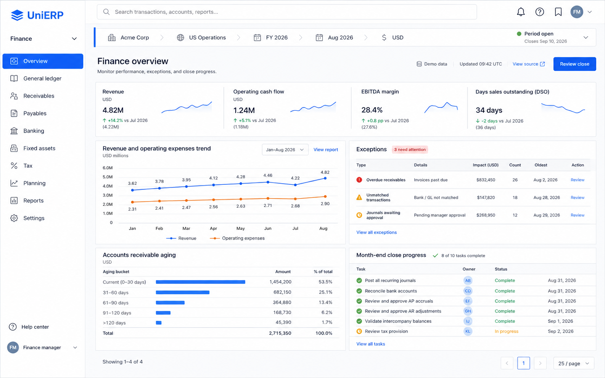
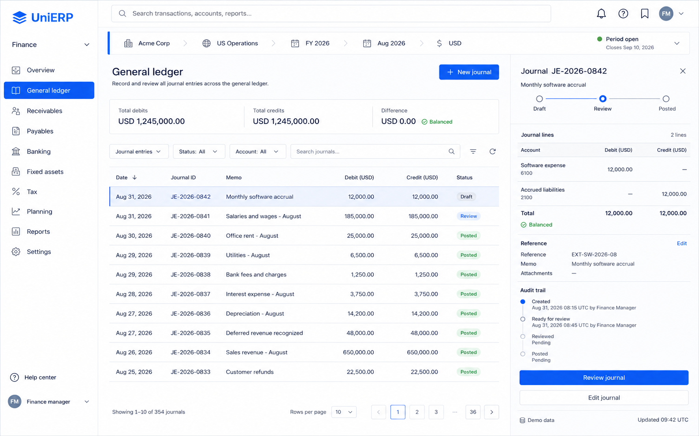
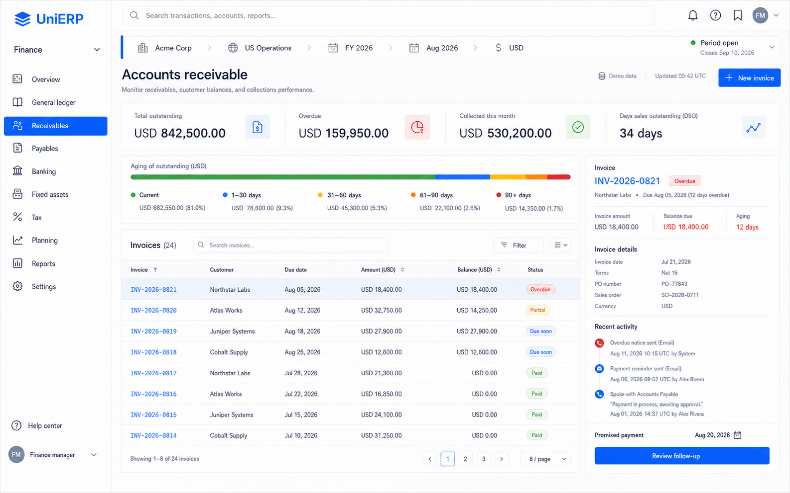
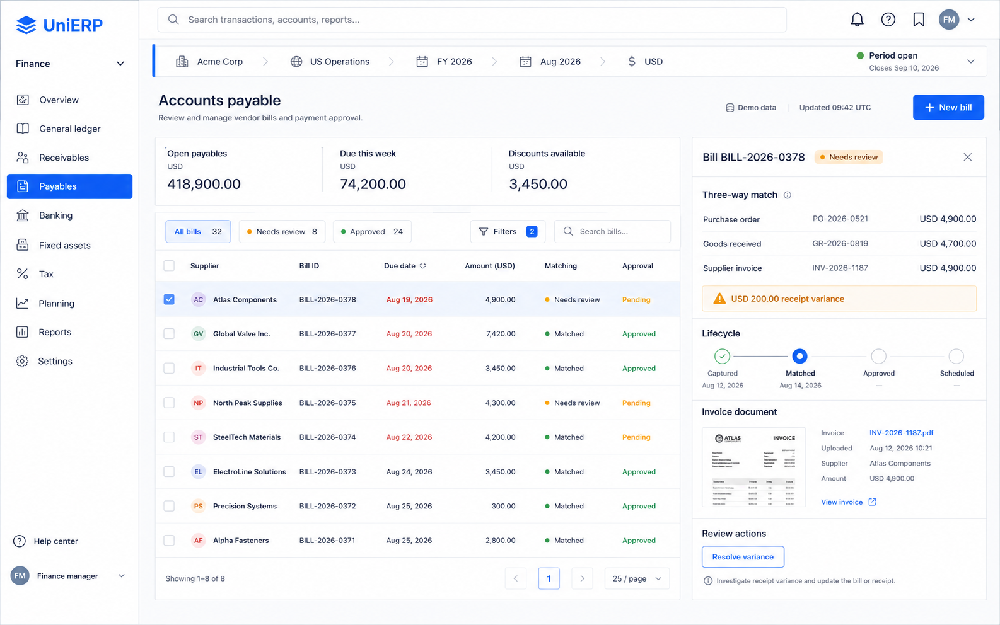
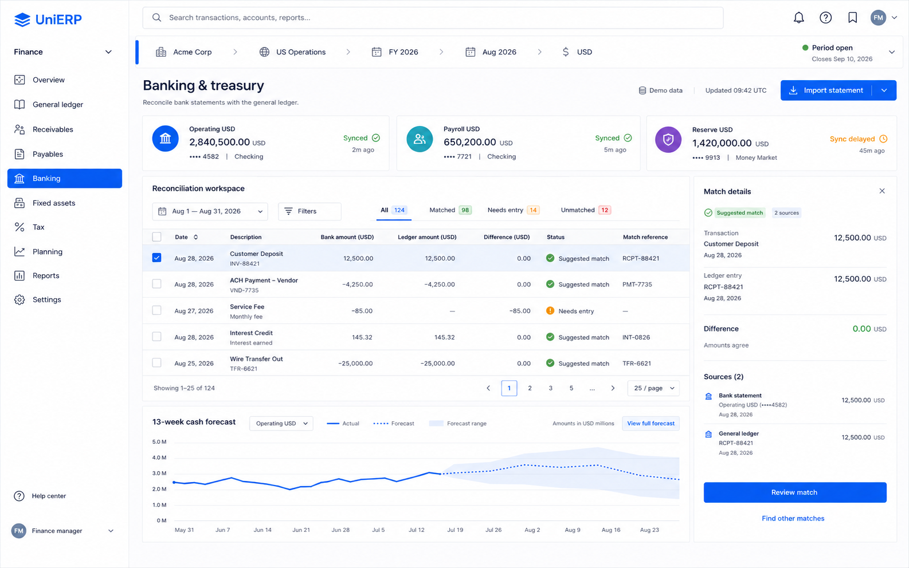
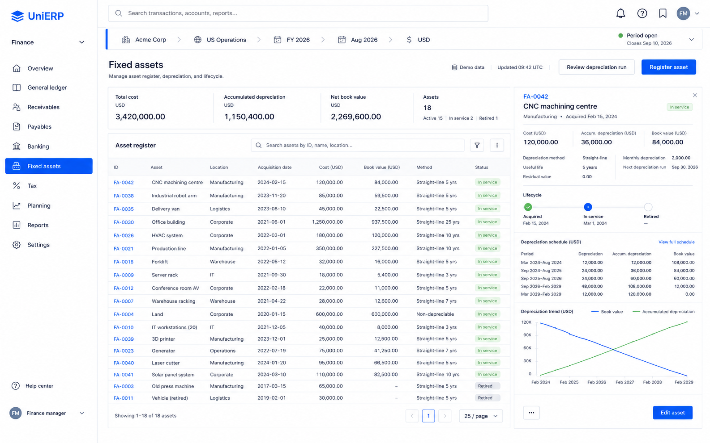
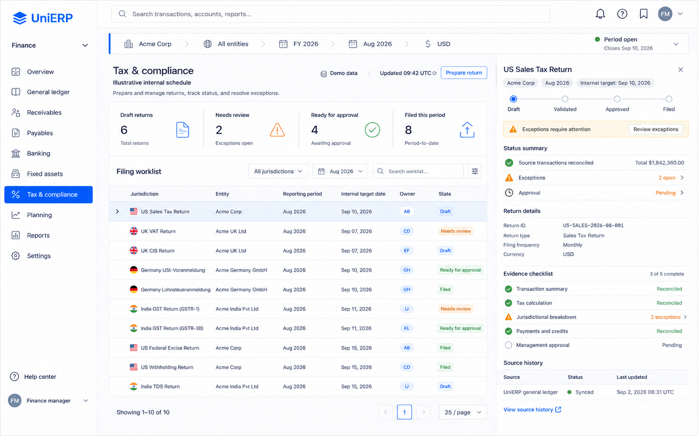
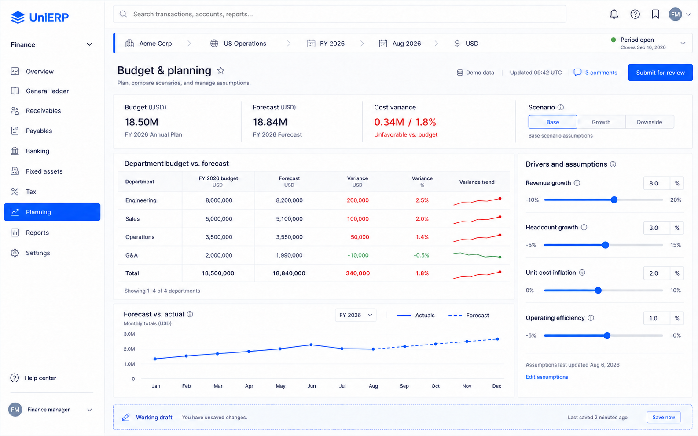
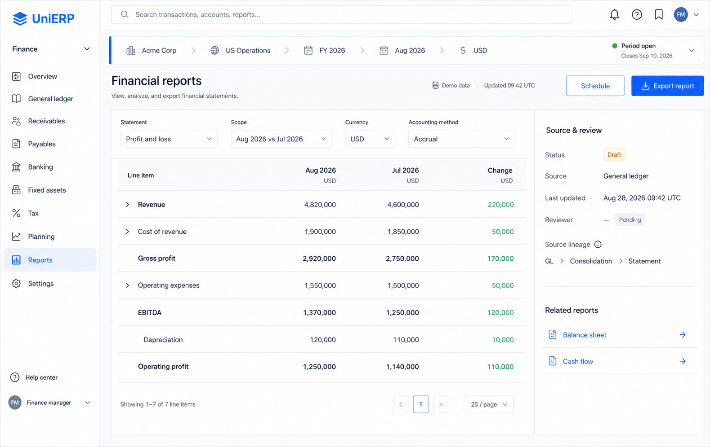
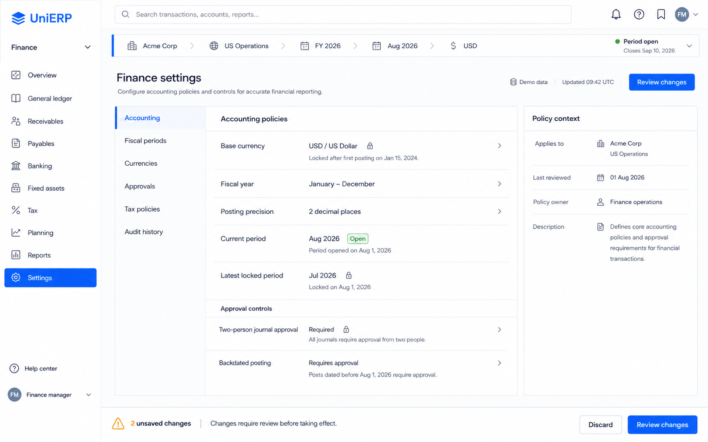

# UniERP Finance — Strata Light v1

Non-normative visual concepts • 2026-09-07 • Built-in image generation

Ten finance screens redesigned around the accepted Strata Workbench language: slate light canvas, white workspaces, cobalt actions, context boundaries, separator-led data surfaces, and workflow-specific inspectors. Existing finance images remain unchanged. Three initial explorations are retained alongside refined selections.

## Selected screens

### Finance overview

### General ledger

### Accounts receivable

### Accounts payable

### Banking & treasury

### Fixed assets

### Tax & compliance

### Budget & planning

### Financial reports

### Finance settings

## Authority and scope

Risk R1: local raster design exploration, with no application or public behavior change. Accountable experience owners: Tenant Apps ERP (PLT-ERP) and Design Platform (PLT-DS). No data or contract mutations.

Sources inspected:
- [Accepted Strata ADR](../../../unierp-platform/docs/adr/ADR-0009-strata-enterprise-design-language.md)
- [Design Platform experience](../../../unierp-platform/docs/platforms/design-system/EXPERIENCE.md)
- [Tenant Apps experience](../../../unierp-platform/docs/platforms/tenant-apps/EXPERIENCE.md)
- [Strata skill](../../../unierp-workspace/governance/skills/unierp-strata-design/SKILL.md)
- [Light theme tokens](../../../design-system/src/tokens/themes/strata.css)

The accepted ADR and owning experience specification guide the visual direction beyond the current application. The images approximate typography, tokens and density; raster generation cannot certify exact component/token conformance.

Knowledge delta: UPDATED — this dated, non-normative concept set, prompts and review notes only. No authoritative requirements, contracts or implementation claims changed. [Prompts](PROMPTS.md) preserve shared and per-screen directions plus refinement instructions.

## Visual review and implementation cautions

All ten selected images were visually inspected for light theme, legibility, workflow layout and clipping. Receivables navigation/aging totals, tax scope/source labels, and planning duplicate navigation were refined in separate files.

These are design references with synthetic data, not executable finance specifications. Remaining raster limitations to resolve if translated into UI:
- Overview has an unnecessary pagination control and generated KPI/bucket rounding inconsistencies.
- Ledger selected row says Draft while its lifecycle shows Review; final implementation must use one authoritative record state. The shown rows are a subset, not proof of the summary total.
- Payables pagination/count labels need reconciliation with filter counts; the match path should explicitly mark the receipt variance as unresolved.
- Banking pagination does not match visible rows; forecast dates must be anchored to the actual reporting date.
- Fixed-asset generated depreciation dates and schedule intervals are inconsistent; recalculate from the source asset, useful life and posting period.
- Reports show expense increases in green; use neutral change figures or explicit favorable/unfavorable labels.
- Exact row heights, selected-state styling and shell spacing vary slightly between generated images.
- Loading, empty, error, forbidden, offline, keyboard and screen-reader behavior require implementation design and testing; no accessibility certification is claimed.

## Cycle report

Protocol 1.1.0. Status: DONE for the requested image concept set.

Objective: create a separate professional light-mode finance screen set grounded in Strata, preserving the originals.
Completed: 10/10 screen concepts, three retained refinements, visual index, generation prompts and review notes.
Incomplete in image-delivery scope: none. Application implementation and production verification are outside this request.
Designed: YES, raster concepts. Implemented: NOT APPLICABLE (no app changes).
Tested: visual review and local file integrity only. Integrated, deployed and released: NOT APPLICABLE.

Verification PASS:
- Inspected all ten original references and all selected generated screens.
- Confirmed all selected PNGs exist and have nonzero dimensions.
- Compared SHA256 hashes of all ten original JPGs before and after; unchanged.
- Reviewed added files for scope; only this new directory was created.

Verification FAIL: none in artifact-delivery checks.
Verification NOT RUN: application typecheck/build/lint, token, density, accessibility and E2E gates — no executable code or token changes; raster images cannot exercise these gates.
Git status: workspace root is not a Git repository; file inventory and original hashes used for local change-scope verification.
Contract, schema, migration, authorization, tenant isolation, privacy and runtime impact: none; illustrative tenant scope and synthetic records only.
Compatibility/rollout/rollback: additive local artifacts; no rollout or migration.
Next required action: none for image delivery. Use the selected images and notes for design review before any separately scoped implementation.

