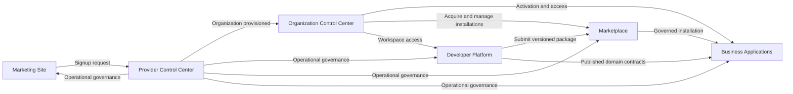

# UniERP Product Master Specification — Volume 0: Master Index & Governance

**Business, Product, Functional, Experience, Data, Security, Technical, Architecture, Infrastructure, Operations & Commercial Blueprint**

## 0.1 Document control

| Field | Value |
| --- | --- |
| Document ID | PMS-VOL-000 |
| Type | Authoritative Product Single Source of Truth — controlled root |
| Document version | 0.3.0 |
| Product version | TBD; independent of document version |
| Status | DRAFT authoring baseline |
| Owner | UniERP Product Governance; named accountable individual TBD |
| Contributors | User master brief; Codex authoring |
| Last update | 2026-09-14 |
| Change log | 0.1.0 initial hierarchy; 0.2.0 authored Volumes 1–2; 0.3.0 authored Marketing Site and 21 module feature records |
| Deprecated requirements | None introduced |
| Superseded architecture | None |
| Migration impact | Documentation only |

### 0.1.1 Authority and sources

The [source brief](SOURCE-BRIEF.md) confirms the requested product scope. This PMS is its master specification and navigation root. Proposed content does not become an accepted architecture decision by being written here. Detailed engineering authority remains at its existing owner, incorporated by reference:

- [Existing product requirements](../../unierp-platform/docs/product/PRD.md)
- [Platform catalog](../../unierp-platform/docs/PLATFORM_CATALOG.md)
- [Existing traceability](../../unierp-platform/docs/product/TRACEABILITY.md)
- [Agent protocol](../../unierp-platform/docs/standards/AI_AGENT_DEVELOPMENT_PROTOCOL.md)
- [Knowledge lifecycle](../../unierp-platform/docs/standards/AI_KNOWLEDGE_LIFECYCLE.md)

The six customer-facing products and thirteen engineering platforms describe different classification levels. Existing platform IDs, repository names and contract owners remain unchanged. The PMS must link existing accepted requirements and contracts rather than create competing copies. Adoption into the existing product-suite navigation remains a tracked governance decision.

### 0.1.2 Change management

1. Identify source authority, requirement owner and affected consumers.
2. Classify risk and durable knowledge delta before changing content.
3. Allocate immutable IDs; preserve previous aliases and decisions.
4. Update the owning requirement, architecture and contract before dependent implementation.
5. Update TOC, registries, dependency edges and traceability together.
6. Record decisions, assumptions, open questions and migration consequences.
7. Validate links, IDs and relevant acceptance evidence.
8. Record exact completion state and next section. Accepted ADRs are superseded, never rewritten.

## 0.2 Executive definition

UniERP is an Enterprise SaaS business platform combining public discovery, provider operations, business applications, developer creation tools, organization administration and ecosystem distribution. It serves prospects, provider personnel, organization owners, business users, developers, publishers and external business participants through explicit authority boundaries.

The PMS must establish what to build, why, who uses it, behavior, interfaces, data, security, experience, commercial mechanics, testing, delivery and operations. Each significant feature must connect the screen and action to validation, authorization, domain execution, database changes, durable events, downstream processes, audit, notifications, telemetry and recovery. Volume 0 reserves this work; it does not claim that detailed features are fully specified.

## 0.3 Canonical terminology

| Term | Meaning |
| --- | --- |
| Organization | Customer-facing administrative/business grouping |
| Tenant | Technical isolation scope verified server-side; organization-to-tenant cardinality remains a design decision |
| Application | Coherent functional grouping inside a product, not necessarily a deployable or SKU |
| Module | Owned subdivision of an application |
| Capability | Business ability realized by specified features |
| Extension | Addition through a published host extension contract |
| Plugin | Host-integrated implementation with declared capabilities |
| Connector | Governed adapter to an external system |
| Marketplace Package | Versioned distributable with provenance, compatibility, dependencies and declared permissions |
| Platform | Engineering ownership boundary in the platform catalog |
| CONFIRMED | Supplied or approved decision; not runtime proof |
| PROPOSED | Recommendation awaiting applicable owner adoption |
| TBD | Required decision/value not established |
| ASSUMPTION | Temporary planning basis with a revisit trigger |

Canonical product names appear in section 0.4. Tenant Admin Console, Tenant Admin and TAC are legacy display aliases for OCC. Provider Admin OS and PAC map to PCC where they mean the provider surface. Tenant Apps maps to Business Applications. Tenant Website and Tenant Web Studio are Developer Platform capabilities. These mappings do not authorize repository, route or permission renames.

## 0.4 Six-product portfolio and Product Registry

| Product ID | Canonical product | Engineering owner mapping | Purpose | Status |
| --- | --- | --- | --- | --- |
| PMS-PRD-MAR | Marketing Site | PLT-MAR | Public digital presence and conversion | CONFIRMED |
| PMS-PRD-PCC | Provider Control Center (PCC) | PLT-PAO | SaaS provider/operator control plane | CONFIRMED |
| PMS-PRD-BIZ | Business Applications | PLT-ERP / PLT-BIZ | Organization business operating layer | CONFIRMED |
| PMS-PRD-DEV | Developer Platform | PLT-DEV / PLT-SITE | Application/full-stack and Website Builder; developer lifecycle | CONFIRMED |
| PMS-PRD-OCC | Organization Control Center (OCC) | PLT-TAD | One-organization administration | CONFIRMED |
| PMS-PRD-MKT | Marketplace | PLT-MKT | Unified ecosystem distribution | CONFIRMED |

IAM, design system and runtime retain PLT-IAM, PLT-DS and PLT-OPS ownership. Mobile and desktop retain PLT-MOB and PLT-DESK delivery ownership. They are not additional top-level products.

## 0.5 Complete multi-level Table of Contents

[Master Table of Contents](MASTER-TABLE-OF-CONTENTS.md) reserves every numbered source subject and application/module hierarchy. Source section identifiers S01–S70 remain stable even if volume ordering changes. Indexed coverage is not authored or approved coverage.

## 0.6 Master registries

[Central registries](MASTER-REGISTRIES.md) establish all twenty required registries. Products live only in section 0.4; applications and modules live in the application registry. Other registries reference their owners. A registry with no functional records explicitly says so, rather than inventing endpoints, permissions or tables.

## 0.7 Initial Application Registry

[Application and Module Registry](APPLICATION-REGISTRY.md) assigns immutable IDs across the six products. Application groupings are PROPOSED authoring boundaries; brief-required capabilities do not imply committed SKUs or v1 release scope. Additional industry and enterprise capabilities require product review.

## 0.8 Requirement ID system

New requirements use `PMS-REQ-{class}-{scope}-{NNNNNN}`. Classes: BUS, PRD, FUN, NFR, SYS, USR, OPS, REG, SEC, DATA. Scopes: MAR, PCC, BIZ, DEV, OCC, MKT, SHARED. SHARED is a specification scope, not a seventh product. Preserve existing UNI-BR and platform IDs as external references.

Each requirement records statement, rationale, source, actor, accountable owner, priority, decision status, release, parent goal, acceptance criteria, feature, architecture, API/event, screen, test and implementation/evidence links. One requirement expresses one verifiable obligation. N/A requires a reason.

Traceability: Business Goal → Business Requirement → Product Requirement → Functional Requirement → Architecture Component → API/Event → Screen → Test → Release. Many-to-many edges are allowed. Missing required edges remain explicit gaps.

## 0.9 Architecture artifact registry

Use `PMS-ARC-{type}-{NNNN}`; types CTX, CTR, CMP, CODE, DOM, DATA, API, EVT, SEC, DEP, REPO, SEQ, STATE, DR. Record purpose, owner, participants, trust boundaries, linked requirements, source authority, revision and validation evidence. Initial reservations appear in the central registries. Reserved artifacts are not completed designs.

## 0.10 Screen ID convention

`PMS-SCR-{scope}-{NNNNNN}` is stable across route/title changes. Fields: product/application/module, route, purpose, personas, permissions, layout/components, data sources, actions, validation, responsive behavior, keyboard and screen-reader behavior, localization, API and analytics links. Explicit states include loading, empty, error, forbidden, offline, stale and conflict where applicable.

## 0.11 API ID convention

`PMS-API-{scope}-{NNNNNN}` identifies a logical operation independently of its URI and major version. Fields: owner, published contract, method/path/version, identity, permission, tenant/record scope, input/output schema, errors, idempotency, concurrency, pagination, resource limits, audit, telemetry and consumer evidence. Search existing catalogs before allocating operations. Example routes never count as deployed endpoints.

## 0.12 Event ID convention

`PMS-EVT-{scope}-{NNNNNN}` identifies the specification record, not a runtime event instance. Fields: canonical event name and major, producer, consumers, aggregate, schema, identity, timestamp, actor, tenant scope, correlation/causation, ordering, atomic outbox boundary, deduplication, retry, DLQ, replay, retention and privacy. Naming is reconciled with published catalogs before an event contract is authored.

## 0.13 Data Entity ID convention

`PMS-ENT-{scope}-{NNNNNN}` identifies a domain concept, not automatically a table. Fields: owning context, aggregate, physical mapping, primary/foreign keys, tenant scope, constraints, indexes, concurrency, classification, lifecycle, retention, erasure/legal hold, encryption, audit, migration and isolation evidence. Reuse existing authoritative concepts before introducing new ones.

## 0.14 Test ID convention

`PMS-TST-{scope}-{NNNNNN}` records requirement, scenario, preconditions, synthetic data, action, expected result, negative/failure case, environment, implementation path, command, revision, timestamp and evidence. Designed, executed and passed are separate states. Include unauthorized, cross-tenant, no-context, duplicate, race, partial-completion and recovery cases where applicable.

## 0.15 ADR convention

`PMS-ADR-{NNNN}` is a PMS proposal identifier. Link existing accepted ADRs without replacing their IDs. Required fields: context, problem, options, decision, rationale, consequences, risks, revisit conditions, status, owner, approval evidence and affected requirements. Proposed decisions cannot override accepted authority.

## 0.16 Assumption, Decision and TBD Register

| ID | Type | Subject and position | Owner / revisit |
| --- | --- | --- | --- |
| PMS-DEC-0001 | CONFIRMED | Exactly six named products | Product governance / portfolio change |
| PMS-DEC-0002 | CONFIRMED | Both builders belong to Developer Platform | Product governance / packaging change |
| PMS-DEC-0003 | CONFIRMED | OCC means Organization Control Center | Product governance / every chapter |
| PMS-DEC-0004 | CONFIRMED | Prefer usage plus fixed/prepaid monthly capacity over mandatory per-user licensing | Commercial / pricing chapter |
| PMS-DEC-0005 | CONFIRMED | Technology direction: Next.js, NestJS, PostgreSQL, Keycloak, Redis, S3/MinIO, Flutter, Docker; Kubernetes where justified | Architecture / technology ADRs |
| PMS-ASM-0001 | ASSUMPTION | Applications are authoring groupings, not separate SKUs | Product / detailed product chapters |
| PMS-ASM-0002 | ASSUMPTION | Modular Markdown under workspace docs is the authoring format | Documentation / publication planning |
| PMS-TBD-0001 | TBD | Named approvers and PMS adoption into existing authority navigation | Product/architecture / before draft promotion |
| PMS-TBD-0002 | TBD | Geographies, price points, currencies, payment providers and commercial entity | Finance/legal / Volume 1 |
| PMS-TBD-0003 | TBD | Dated primary-source TAM/SAM/SOM and competitor research | Strategy / Volume 1 |
| PMS-TBD-0004 | TBD | Measured workloads, SLOs, RPO/RTO and capacity tiers | SRE / Volume 11 |
| PMS-TBD-0005 | TBD | Organization, tenant, legal entity and billing account cardinalities | Data/IAM / Volume 2 |
| PMS-TBD-0006 | TBD | Jurisdiction-specific obligations and certification evidence | Legal/security / Volume 10 |
| PMS-TBD-0007 | TBD | Foundation, MVP, v1.0, v1.x, v2+, Future/Research allocation | Product / roadmap |

Do not infer approved pricing, certification or performance from a planning assumption. Resolution records retain owner, date, evidence, impacted IDs and replaced assumptions.

## 0.17 Cross-product dependency map

Arrows represent product interactions, not direct database writes or permission inheritance. Identity, billing, deployment and notifications are shared contracts behind these interactions. PCC never acquires organization business authority implicitly. Billing has one rating/invoice authority, PCC operational controls, OCC customer views, Marketplace settlement and BIZ/DEV usage producers; the specific commercial domain owner requires confirmation.

| Dependency ID | Interaction | Required failure/security boundary | Owner |
| --- | --- | --- | --- |
| PMS-DEP-0001 | Marketing → signup → provisioning → OCC | Verification, duplicate signup, partial provisioning and orphan recovery | PLT-MAR/PAO/IAM/TAD |
| PMS-DEP-0002 | OCC → Business Applications | Entitlements, explicit grants, activation migration, forbidden and rollback | PLT-TAD/ERP |
| PMS-DEP-0003 | OCC → Marketplace → host | Purchase versus install, permission consent, compatibility, dependencies and uninstall data disposition | PLT-TAD/MKT and host |
| PMS-DEP-0004 | Developer Platform → Marketplace | Signatures, immutable versions, scanning, review, revocation | PLT-DEV/MKT |
| PMS-DEP-0005 | Developer Platform → Business Applications | Versioned contracts, sandbox, tenant scope, least privilege and quotas | PLT-DEV/BIZ |
| PMS-DEP-0006 | PCC → all products | Provider permission, target scope, bounded support access and durable audit | PLT-PAO and target owner |
| PMS-DEP-0007 | Billing → PCC/OCC/MKT/BIZ/DEV | Usage deduplication, rating version, credits, settlement, disputes and reconciliation | Commercial owner TBD |

Each detailed sequence must identify local transaction/outbox boundaries and cross-service compensation. Diagram arrows never imply a distributed atomic transaction.

## 0.18 PMS generation roadmap

| Phase | Volume / work | Exit artifact | Current state |
| --- | --- | --- | --- |
| 1 | 0 — Master Index & Governance | Hierarchy, IDs, registries, assumptions | Authored initial increment |
| 2 | 1 — Business, market, strategy, model, revenue, pricing | Sourced strategy, canvas and labeled financial scenarios | Authored draft; commercial decisions remain proposed/TBD |
| 3 | 2 — Global product and functional architecture | Boundaries, shared capabilities and journeys | Authored draft; detailed designs and evidence pending |
| 4 | 3 — Marketing Site | Page, conversion and administration specifications | Authored draft with 21 module feature records; owner/contract reconciliation pending |
| 5 | 4 — PCC | Complete provider module specifications | NOT STARTED |
| 6 | 5 series — Business Applications | One application/domain per cycle | NOT STARTED |
| 7 | 6 — Developer Platform | Both builders and full-code lifecycle | NOT STARTED |
| 8 | 7 — OCC | Complete organization administration | NOT STARTED |
| 9 | 8 — Marketplace | Distribution, publishers and commerce | NOT STARTED |
| 10 | 9 — Data/API/events/integration/workflow | Owned models and versioned boundaries | NOT STARTED |
| 11 | 10 — Security/IAM/privacy/compliance | Threat models, grants, obligations and proof | NOT STARTED |
| 12 | 11 — Infrastructure/DevOps/reliability/observability/DR | Measurable budgets and recovery specifications | NOT STARTED |
| 13 | 12 — Design/UX/accessibility/mobile/desktop | Screen states and client evidence criteria | NOT STARTED |
| 14 | 13 — QA/testing/release | Boundary tests, environments and gates | NOT STARTED |
| 15 | 14 — Operations/support/documentation/governance | Runbooks and living documentation | NOT STARTED |
| 16 | 15 — Roadmap/risks/ADRs/traceability | Release dependencies and complete traceability | NOT STARTED |
| 17 | 16.1 — Cross-product consistency review | Ownership and integration findings | NOT STARTED |
| 18 | 16.2 — Architecture gap analysis | Missing or ambiguous components | NOT STARTED |
| 19 | 16.3 — Requirement gap analysis | Functional and non-functional gaps | NOT STARTED |
| 20 | 16.4 — Final indexes and registries | Consolidated references and classified gaps | NOT STARTED |

### 0.18.1 Feature completion contract

Every significant feature must fill every field in source section 9, with concrete content or justified N/A. Follow Product → Application → Module → Capability → Feature → Sub-feature → Workflow → Screen/View → Component → User Action → Business Rule → Data Entity → Permission → API → Event → Integration → Notification → Audit Event → Report/Analytics → Test Requirement.

Critical workflows explicitly address invalid input, unauthorized access, permission changes, duplicate requests, network/database/cache/queue/third-party failure, timeout, partial completion, concurrency, races, retry, compensation and recovery. For each failure specify the step, persisted state, user-visible response, retry safety, reconciliation owner and proof.

### 0.18.2 Cycle gate and continuation

Preserve IDs, update TOC and affected registries, record assumptions/decisions/TBDs, review cross-product dependencies, check terminology and traceability, and state the exact next section. Count indexed, authored, reviewed, approved and implemented separately. Product completion requires every dimension in source section 67 and all final audits in section 68.

Authored: [Volume 1](VOLUME-01-BUSINESS-AND-COMMERCIAL-FOUNDATION.md) and [Volume 2](VOLUME-02-GLOBAL-PRODUCT-AND-FUNCTIONAL-ARCHITECTURE.md). Authored: [Volume 3](VOLUME-03-MARKETING-SITE.md) and [feature catalog](VOLUME-03-MARKETING-FEATURES.md). Next: **Volume 4 — Provider Control Center**. No detailed product is represented as fully specified yet. The [allocated ID index](REGISTRY-INDEX.md) links subsequent decisions, assumptions, requirements and artifacts without renumbering prior records.
