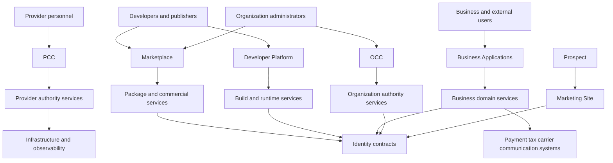
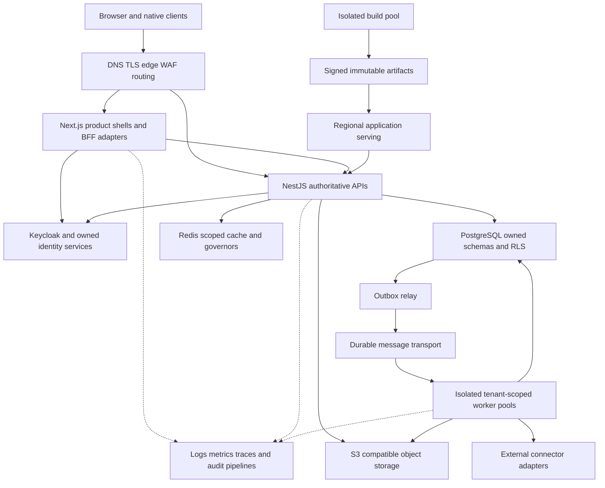
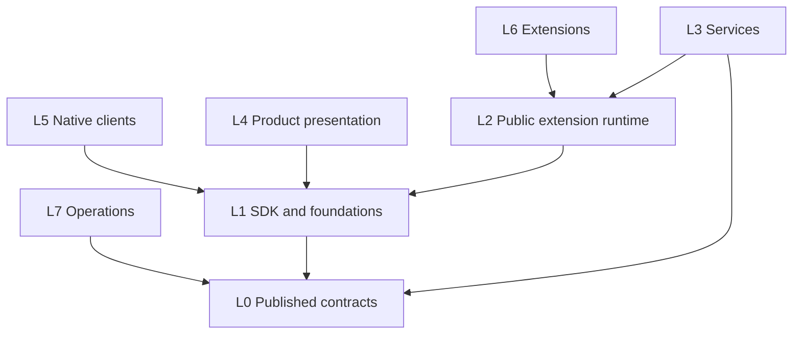
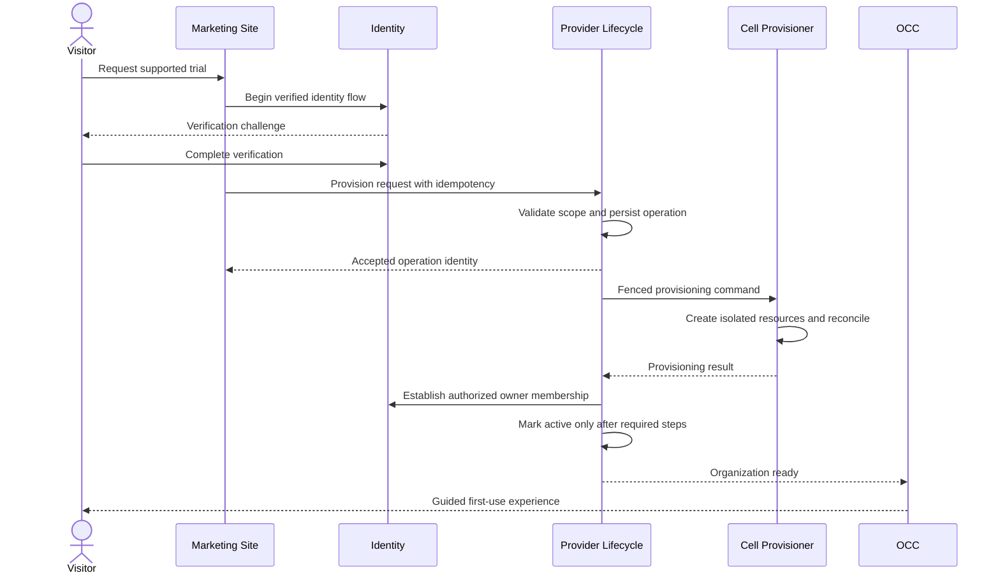
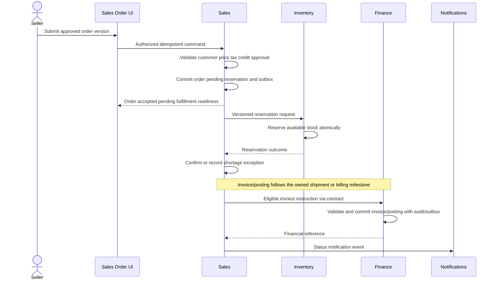

# Part II — Global Product and Functional Architecture

Document ID PMS-VOL-002 · Version 0.1.0 · Updated 2026-09-14 · Status DRAFT.

Owner: UniERP Architecture Governance. Scope references S08, S10–S21, S26–S29, S55, S57–S58. Existing accepted ADRs are incorporated by reference. New decompositions, budgets and operational choices are PROPOSED until adopted. This describes intended architecture, not verified deployed topology.

## 2.1 Authority and architectural constraints

| Authority | Binding decision | PMS consequence |
| --- | --- | --- |
| [ADR-0002](../../unierp-platform/docs/adr/ADR-0002-platform-boundaries.md) | Platforms own requirements; repositories implement them | Six-product packaging does not transfer engineering ownership |
| [ADR-0003](../../unierp-platform/docs/adr/ADR-0003-tenant-context-and-isolation.md) | Server-verified tenant context and persistence isolation | Every request, job, export and search has independently enforced scope |
| [ADR-0004](../../unierp-platform/docs/adr/ADR-0004-modular-business-services-and-outbox.md) | Modular business services with atomic outbox | No premature service split that loses local invariants |
| [ADR-0005](../../unierp-platform/docs/adr/ADR-0005-developer-platform-artifact-and-package-lifecycle.md) | Immutable artifact revisions, packages and releases | Builder projections cannot become unversioned production truth |
| [ADR-0006](../../unierp-platform/docs/adr/ADR-0006-developer-platform-cells-and-runtime-independence.md) | Regional cells and runtime independence | Serving does not require a live authoring/global control plane |
| [ADR-0007](../../unierp-platform/docs/adr/ADR-0007-developer-platform-compatibility-and-portability.md) | Versioned contracts and tested portability | Unknown fields survive round trips; exports include non-secret bindings |
| [ADR-0010](../../unierp-platform/docs/adr/ADR-0010-platform-north-star-and-polyrepo-boundaries.md) | Layered polyrepo, no client DB access, exact arithmetic | Imports respect layers and publication boundaries |

ADR-0010 contains a sub-100ms P99 north-star objective. It is retained as an aspiration requiring operation scope, payload, workload and measurement definition; it is not evidence that every end-to-end transaction meets that latency. PostgreSQL RLS is database-enforced row authorization, not hardware isolation. The accepted ADR's phrase “hardware-enforced” does not establish a technical hardware guarantee; the actual mechanism and proof are PostgreSQL policy and role enforcement. No existing ADR is rewritten here.

## 2.2 System context — PMS-ARC-CTX-0002

The diagram separates human-facing products from owning services. External systems are reached through server-side connectors with declared egress and credential scope. Public discovery exposes no organization business records. External customers and suppliers access only authorized relationship-scoped records through Business Applications or published portal experiences.

## 2.3 Container and physical architecture — PMS-ARC-CTR-0001

Containers are logical deployment units; they do not mandate one Kubernetes workload or microservice per box. APIs may host multiple bounded modules while preserving contracts and transaction ownership. Database, message transport, cache and artifact storage are separate failure domains. Tenant-serving traffic does not synchronously call an authoring workspace to resolve an immutable release.

### 2.3.1 Physical placement

Proposed initial deployment uses one regional cell with private data services, separately governed provider access and independently bounded build/integration/analytics pools. A cell contains tenant serving, required local policy artifacts, data, queues and operational recovery facilities. Global placement metadata maps opaque tenant identifiers to cells; business records do not move into a global directory.

Each cell has explicit capacity ceilings, supported runtime versions, residency classification, deployment manifest and recovery plan. Dedicated tenant placement is a commercial and operational option requiring measured cost and isolation evidence. A shared cell must not claim hardware isolation between tenants. Kubernetes is selected only after operational requirements justify it; the portable runtime and manifest remain independent of the orchestration choice.

### 2.3.2 Network trust zones

Public edge accepts TLS traffic and applies bounded request sizes, rate policies and routing. BFF/API ingress validates origin/authentication as applicable. Data services and control-plane management are private; application code cannot reach cloud metadata or arbitrary internal addresses through user-supplied URLs. Build and extension egress follows explicit allowlists and DNS-resolution checks. Observability exporters use dedicated scoped credentials. Administrative access is separately authenticated, auditable and time-bounded.

## 2.4 Technology baseline and decision rationale

The user's baseline confirms technology direction, not exact versions or unconditional use. Versions must come from repository manifests and support policy when implementation begins. Official documentation was checked on 2026-09-14 for the core mechanisms below.

| Technology | Purpose and owner | Boundary / alternative | Tradeoff, scaling and failure/security implications |
| --- | --- | --- | --- |
| Next.js | Product web shells, rendering and bounded BFF adapters; presentation owners | Server/client composition; alternative separately hosted SPA + APIs | Keep credentials server-side; partition public caching from authenticated data; horizontally scale stateless requests; avoid using rendering as authorization |
| NestJS | Authoritative service modules and adapters; PLT-BIZ/owning domains | Explicit modules; alternative another typed service runtime only through ADR | Module boundaries reduce coupling; worker-heavy work moves off request path; validate every ingress; avoid global state across tenants |
| PostgreSQL | Owned business persistence and transactions; data owner | Relational invariants/RLS; alternatives require equivalent transaction/isolation proof | Connection pools, indexes and partitioning need measured limits; owner/superuser bypass invalidates RLS proof; use NOBYPASSRLS and FORCE policies |
| Keycloak | Standards-based identity provider; PLT-IAM | OIDC/SAML integrations; alternative managed standards-compatible IdP through approved decision | Identity outage affects login/refresh; token validation and revocation policy remain explicit; avoid bespoke token minting |
| Redis | Scoped caches and selected ephemeral governors; PLT-OPS with capability owner | Cache is not business source of truth; alternatives local bounded cache or different service | Include tenant/policy/version in keys; stampede control and TTL; fail closed for security/cost limits when authoritative fallback unavailable |
| S3-compatible storage / MinIO | Objects and immutable artifacts; storage/owning domain | Versioned storage contract; managed S3-compatible or self-operated choice | Signed URLs are short-lived and scoped; malware quarantine, retention and version cleanup; metadata/object consistency requires reconciliation |
| Flutter | Native mobile and supported desktop workflows; PLT-MOB/DESK | Shared domain contracts rather than duplicated business rules; native alternatives by justified exception | Offline data is encrypted, minimized and revocable; conflict handling is domain-specific, not generic last-write-wins |
| Docker | Reproducible application packaging; PLT-OPS | OCI artifact boundary; another OCI builder/runtime may be supported | Pin base artifacts, scan/sign/provenance, non-root runtime; container boundary alone is insufficient for hostile extension isolation |
| Kubernetes, where justified | Scheduling and deployment orchestration; PLT-OPS | Optional operating environment; simpler managed/container hosting is an option | Adds control-plane, networking and upgrade complexity; require quotas, network policy, secret integration and restore/runbook evidence |

Mechanism sources: [Next.js server/client components](https://nextjs.org/docs/app/getting-started/server-and-client-components), [NestJS modules](https://docs.nestjs.com/modules), [PostgreSQL row security](https://www.postgresql.org/docs/18/ddl-rowsecurity.html), [Keycloak application security](https://www.keycloak.org/securing-apps/overview). These sources describe mechanisms, not UniERP implementation evidence.

## 2.5 Repository architecture — PMS-ARC-REPO-0001

The [workspace inventory](../../UniERP.code-workspace) and ADR-0010 own repository/layer facts. This view summarizes the accepted structure as inspected, not new repository creation instructions.

| Layer | Repositories | Responsibility |
| --- | --- | --- |
| L0 | unierp-contracts | Published contracts; zero dependency rule |
| L1 | auth, config, design-system, kernel, sdk, service-kit, shared, storybook | Foundation packages and governed developer/design surfaces |
| L2 | data, framework, extension-api, sandbox, blockchain | Runtime capabilities and persistence implementation |
| L3 | api, idp | Authoritative service execution |
| L4 | tenant-apps, provider-admin-os, tenant-admin, developer-platform, marketplace, marketing-site, web-studio, tenant-sites, tenant-site-template | Product presentation and public experiences |
| L5 | desktop-app, unierp-mobile | Native client delivery |
| L6 | extensions | Public-extension-contract consumers |
| L7 | infra, unierp-workspace | Infrastructure and cross-repository operation |
| Governance | unierp-platform | Product/platform specifications and accepted decisions |

Arrows illustrate downward package dependency, not an exhaustive import permission list. Same-layer private imports and upward imports are prohibited. Cross-platform runtime communication uses authenticated published contracts; it is not a source-code import. Clients do not import database packages even though L2 is lower than L4/L5. Extensions consume the public extension API only, not every lower-layer package.

Each package defines exports, owner, compatibility range, release artifact and consumers. CI checks the actual dependency graph, including transitive private-source imports. Cross-repo changes require producer/consumer tests and an exact release manifest. No coordinated release depends on “latest” resolving to a compatible artifact.

## 2.6 Domain context map — PMS-ARC-DOM-0001

### 2.6.1 Context ownership and aggregate candidates

Domain candidates below guide detailed design; existing schema names are reconciled before new entities are allocated. Each root owns its invariants. Shared party or item references do not grant another context permission to mutate the root.

| Context / subdomain | Root and supporting entities | Value objects | Commands / queries | Domain event family / invariant |
| --- | --- | --- | --- | --- |
| Identity | Principal, membership, session, credential references | Subject, issuer, auth assurance | Invite, revoke; effective access | Membership changed; no implicit provider/tenant authority crossing |
| Organization governance | Organization profile, hierarchy, policy assignment | Locale, timezone, verified domain | Configure hierarchy; organization settings | Policy changed; no hierarchy cycles or cross-tenant parents |
| Provider lifecycle | Tenant lifecycle operation, placement assignment | Opaque tenant ID, cell reference | Provision, suspend, relocate; operation status | Lifecycle completed/failed; one fenced active placement writer |
| Commercial | Subscription, usage, invoice, payment, credits | Money, meter quantity, service period | Rate, finalize, reconcile; cost forecast | Invoice finalized/payment reconciled; no duplicate charge |
| Party/master data | Party and customer/supplier role projections | Address, identifier, tax reference | Register, merge under policy; lookup | Party changed; merge retains lineage and references |
| Finance | Journal, ledger account, fiscal period | Decimal money, currency, posting date | Post, reverse, close; trial balance | Journal posted; debits equal credits per ledger rules |
| Sales | Opportunity, quote, sales order | Price, quantity/UOM, commercial terms | Qualify, approve quote, submit order; pipeline | Order confirmed; commitments follow approved price and credit policy |
| Inventory | Stock movement, reservation, lot/serial | Quantity/UOM, location, valuation | Reserve, receive, issue; availability | Stock moved/reserved; no duplicate physical effect |
| Procurement | Requisition, purchase order, receipt match | Quantity, tolerance, delivery terms | Approve PO, match invoice; supplier commitments | PO approved; matching and approval limits enforced |
| Workforce | Worker, employment, assignment, leave/pay run | Effective interval, pay component | Hire, transfer, approve leave; authorized worker view | Employment changed; effective dates and sensitive fields preserved |
| Manufacturing | BOM revision, routing, production order | Yield, operation duration, material quantity | Plan, release, report output; shortage inquiry | Production completed; consumption/output and costing reconcile |
| Quality | Inspection, nonconformance, corrective action | Measurement, tolerance, disposition | Inspect, hold, release; quality history | Lot released/held; held inventory cannot be silently shipped |
| Maintenance | Maintainable asset, maintenance order | Meter reading, service interval | Schedule, execute, close; asset history | Maintenance completed; downtime and consumed parts attributable |
| Project/services | Project, task, time entry, billing milestone | Duration, rate, progress measure | Approve time, invoice milestone; utilization | Time approved; approved entries amended not silently rewritten |
| Service/field service | Case, service obligation, visit | Priority, SLA clock, appointment window | Assign, escalate, resolve; queue | Case resolved; SLA clock policy and access relationship explicit |
| Commerce/POS | Cart, checkout, tender, return, register shift | Money, discount, tender allocation | Checkout, refund, close shift; order status | Sale settled; payment and stock outcome reconciled |
| Developer artifacts | BuilderArtifact, ArtifactRevision, PackageVersion, ReleaseManifest | Version, hash, capability declaration | Commit revision, build, release; dependency graph | Package built/release deployed; immutable production resolution |
| Marketplace | Listing, submission, installation, settlement | Compatibility range, license terms | Review, install, update; discovery | Installation changed; consented grants and exact version enforced |

Each context uses an owned repository abstraction for persistence and domain services only for invariants spanning entities within its boundary. Application services orchestrate commands and contracts; controllers/BFFs do not own business rules. Query projections may combine authorized published data with freshness metadata but cannot become alternate mutation owners.

### 2.6.2 Context relationships

Identity is upstream for verified principal and access evaluation; organization governance consumes its contracts. Party, item, currency and UOM are shared master-data references with explicit stewardship, not duplicated free-text keys. Finance receives validated posting instructions from sales/procurement/workforce/inventory through published contracts and reconciles source references. Sales requests inventory reservation rather than editing stock rows. Procurement communicates receipt and payable obligations rather than posting through private finance imports.

Developer Platform produces immutable packages; Marketplace governs distribution; a host installation owns tenant bindings and grants. Provider lifecycle controls placement and permitted operational restrictions, while business contexts retain record ownership. Shared workflow executes authorized commands; it cannot bypass the same invariants applied to interactive actions.

## 2.7 Global request and execution contract

### 2.7.1 Synchronous command path

1. Edge bounds method, payload size, content type and abuse rate.
2. Identity validates session/token issuer, audience, signature, time and relevant revocation/assurance policy.
3. Service resolves candidate organization/tenant against authoritative membership and current policy. User-selected tenant/account IDs are selectors only.
4. Authorization checks authority plane, capability, record scope, sensitive fields and required step-up/approval.
5. Input validation normalizes permitted fields and rejects unknown privileged fields, invalid decimals/units and incompatible versions.
6. Application service loads the owned aggregate using tenant-scoped repository access; concurrency/version and idempotency checks apply.
7. Domain service evaluates invariants, entitlement/capacity and approval conditions. A stale approval or policy version reopens required review.
8. Transaction writes state, durable business audit intent and outbox records atomically where required. RLS checks both reads and writes under transaction-local context.
9. Commit yields the authoritative result. Response includes resource/operation identity, version and correlation, without exposing protected data.
10. Relay publishes outbox messages; consumers deduplicate and maintain reconciliation state. Notification failure cannot cause the committed command to be retried as a new business effect.

No database transaction stays open while waiting for an external payment, network workflow or human approval. Such work becomes an explicit operation/saga with retry, timeout and compensation.

### 2.7.2 Asynchronous command contract

Long-running operations expose accepted, queued, running, waiting, succeeded, failed, cancelling and cancelled states as applicable. The operation records request identity, actor, target scope, input revision, progress units, lease/fence, heartbeat, attempts, errors, result references and recovery action. Percent complete is shown only if work units have a finite meaningful denominator.

Worker authorization uses explicit execution policy: delegated user commands re-evaluate necessary permission before protected effects; system maintenance runs under a narrowly scoped service principal. Tenant context is validated, not trusted merely because it is present in a message. Cancel means stop future cancellable effects; already committed effects require documented compensation and remain visible.

### 2.7.3 Common failure semantics

| Failure | Persisted result | Client/worker behavior | Recovery proof |
| --- | --- | --- | --- |
| Invalid input | No business mutation | Field-safe validation; preserve user draft | Invalid decimal/UOM and mass-assignment tests |
| Unauthorized or revoked permission | No new protected effect | Non-disclosing forbidden response; pending work reevaluated | Grant/revoke race and cross-plane negatives |
| Stale aggregate version | No overwrite | Conflict with authorized latest-version metadata | Two writers cannot lose a committed update |
| Duplicate request, same payload | Original result/operation | Return same logical outcome | Concurrent duplicate requests produce one effect |
| Duplicate key, conflicting payload | Original unchanged | Conflict; do not silently reuse key | Payload hash mismatch test |
| Lost response after commit | Commit retained | Retry same key or query operation | Disconnect after commit yields one effect |
| Database unavailable before commit | Transaction rolled back | Bounded retry only if safe; unavailable response | Crash/rollback atomicity test |
| Cache unavailable | Authoritative fallback if safe | Degraded performance; deny sensitive operation if required policy cannot be verified | No stale grant or overspend during outage |
| Queue unavailable | Outbox retained | Accepted business result plus delayed downstream state | Relay restart publishes once logically |
| Third-party timeout | Outcome unknown, operation pending | Reconcile remote operation before retrying effect | One remote charge/shipment despite timeout |
| Consumer duplicate/out-of-order | Delivery ledger retained | Deduplicate; compare aggregate version; park/reconcile gaps | Replay and sequence-gap tests |
| Partial cross-domain completion | Saga state shows committed steps | Compensation or forward recovery by owner | No silent reversal of posted records |
| Resource budget exhausted | No new unreserved costly effect | Explicit quota/limit response and safe recovery access | Concurrent admission cannot exceed hard cap |

## 2.8 Tenant and data isolation architecture

### 2.8.1 Scope model

Tenant is the technical isolation key; organization is the customer-facing concept. Proposed initial mapping is one tenant per organization, with multiple legal entities inside it, but this remains PMS-TBD-0005 until data/IAM approval. Cross-organization collaboration uses explicit contracts and identities; it does not share a tenant context accidentally.

Every tenant-owned table has tenant ownership, service filtering, ENABLE and FORCE RLS and restrictive read/write policy. Positive, wrong-tenant and no-context evidence uses a NOBYPASSRLS application role, not a superuser or table-owner bypass. Tenant context is transaction-local and cleared by transaction end. Pooled connections cannot retain prior tenant settings. Composite tenant-aware references prevent relationships pointing to another tenant's row even where individual IDs are valid.

### 2.8.2 Non-database boundaries

| Surface | Isolation contract | Negative proof |
| --- | --- | --- |
| Objects | Server-resolved tenant prefix/bucket and object ACL; short-lived signed access | Swapped object ID/prefix cannot read another tenant |
| Cache | Tenant + resource + policy/version dimensions; scoped invalidation | Identical record ID across tenants does not collide |
| Search | Tenant filter and current record/field authorization; deletion/revocation propagation | Search facets/snippets/counts reveal no forbidden content |
| Queue/jobs | Validated immutable tenant context; scoped service identity and storage | Forged tenant or omitted context cannot execute |
| Secrets | Tenant/environment/capability binding; value never returned to browser | Extension cannot enumerate or read another binding |
| Logs/telemetry | Minimized tenant identifiers, no payload secrets, scoped access | Provider dashboards do not expose raw tenant data by default |
| Backups/exports | Tenant manifest, encryption, retention and authorized restore/export | Tenant restore cannot overwrite or expose another tenant |
| AI retrieval | Tenant and record/field filtering before context assembly | Prompt cannot retrieve another tenant's vectors or documents |
| Extension runtime | Declared host capabilities, egress/resource limits and sandbox boundary | Package cannot acquire host DB or provider credential access |

Tenant relocation freezes or fences writes at defined points, copies with manifest/checksums, replays bounded change history, reconciles business totals and flips placement atomically. Rollback/forward recovery preserves exactly one authoritative writer. Detailed state machine and RPO/RTO proof belong in lifecycle/operations volumes.

## 2.9 Shared capabilities and functional contracts

| Capability | Owning responsibility | Required behavior | Consumer obligation |
| --- | --- | --- | --- |
| Configuration | Typed versioned settings with inheritance and validation | Effective value explains source, precedence and secret binding; conflicting version rejected | Never merge unknown settings ad hoc in UI |
| Feature flags | Bounded rollout definitions and expiry | Auditable rule, audience, default, kill switch and removal owner | Flag cannot replace authorization or entitlement |
| Entitlements | IAM evaluation using commercial/product grants | Versioned effective capabilities and capacity references | Check server-side at effect boundary |
| Workflow | Versioned definitions, instances and execution history | Human tasks, timers, branches, bounded loops, retry and compensation | Call owned commands; retain definition version for running instance |
| Approvals | Policy and assignment with separation of duties | Effective hierarchy, delegation, escalation, expiry and reapproval on material change | Approved document version must equal acted-on version |
| Notifications | Template, preference, consent and delivery lifecycle | Deduplication, locale, channel routing, retry and delivery outcome | Do not treat email delivery as transaction completion |
| Documents/files | Upload, scan, version, access and retention | Quarantine before trusted use; preserve hashes and deletion/legal-hold state | Reference owned file IDs and authorize download |
| Search | Authorized indexes and query service | ACL-aware ranking/facets, freshness, reindex and removal propagation | Do not expose raw index hits before authorization |
| Reporting/BI | Governed semantic models and execution | Row/field policy, lineage, as-of time, bounded export and scheduling | Use consistent money/UOM and disclose stale data |
| Import/export | Versioned formats and operation state | Dry run, mapping, validation, row errors, idempotency and control totals | Do not count row import as financial reconciliation |
| Scheduler | Durable schedule and lease/fence execution | Timezone/DST rule, missed-run policy, bounded catchup and cancellation | Idempotent business command per scheduled occurrence |
| AI gateway | Model routing, context policy, budget and evaluation | Provider abstraction, prompt version, safe tool declarations, token meter and human review | AI result passes deterministic domain validation |

Capability service ownership beyond existing catalog assignments requires explicit mapping before physical extraction. A shared function does not justify a new service on its own.

## 2.10 Cross-product journeys and recovery contracts

### 2.10.1 Signup and provisioning — PMS-ARC-SEQ-0001

Verification failure creates no active tenant. Resource failure retains the provisioning operation and step state; retry uses the same logical request. Membership failure leaves onboarding pending, never an active organization with an unknown owner. Duplicate signup does not disclose another organization's existence. Compensation removes only resources proven created by that operation and permitted by retention/rollback policy.

### 2.10.2 Required journey inventory

| Journey ID | Trigger and main path | Failure/recovery | Owning products |
| --- | --- | --- | --- |
| PMS-WFL-SHARED-000001 | Visitor → verified signup → provisioning → OCC | Duplicate, unsupported location, partial resources, missing owner | MAR/PCC/OCC |
| PMS-WFL-SHARED-000002 | Trial request → scoped allowance → expiry or purchase | Abuse, exhausted capacity, payment failure, export/retention | MAR/PCC/OCC |
| PMS-WFL-OCC-000001 | Invite user → accept verified identity → explicit role grant | Expired/revoked invite, existing identity, wrong domain | OCC/IAM |
| PMS-WFL-OCC-000002 | Configure SSO → verify domain/metadata → test → enable | Lockout protection, invalid issuer/certificate, rollback to approved recovery | OCC/IAM |
| PMS-WFL-OCC-000003 | Activate app → evaluate entitlement → provision config → grant access | Missing dependency, migration failure, forbidden | OCC/BIZ |
| PMS-WFL-MKT-000001 | Select package → consent/license → resolve dependencies → install exact version | Payment/install mismatch, incompatible version, failed migration | MKT/OCC/host |
| PMS-WFL-DEV-000001 | Create application → model/UI/logic → test → immutable release → deploy | Invalid graph, build failure, missing binding, deploy health failure | DEV/PCC |
| PMS-WFL-DEV-000002 | Create website → CMS/pages/theme → preview → domain verification → publish | DNS/TLS failure, unsafe custom code, content rollback | DEV/PCC |
| PMS-WFL-MKT-000002 | Upgrade package → compatibility preview → approve grants → migrate → health check | New privilege, schema failure, partial rollout; recovery per manifest | MKT/DEV/OCC |
| PMS-WFL-OCC-000004 | Review bill → authorize purchase/payment → reconcile → entitlement update | Unknown payment outcome, callback duplicates, credit insufficiency | OCC/PCC |
| PMS-WFL-PCC-000001 | Suspend for scoped reason → restrict allowed operations → notify | Separate debt/security reasons; preserve recovery and audit | PCC/OCC |
| PMS-WFL-PCC-000002 | Resolve suspension cause → reevaluate all restrictions → reactivate | Payment does not clear security hold; failed resource start stays pending | PCC/OCC |
| PMS-WFL-OCC-000005 | Cancel contract → confirm consequences → schedule end → export/retention | Pending obligations, accidental duplicate cancel, cancellation reversal policy | OCC/PCC |
| PMS-WFL-OCC-000006 | Request organization deletion → verify authority/holds → staged erasure | Legal hold, incomplete exports, backup expiry and downstream failures | OCC/PCC |
| PMS-WFL-OCC-000007 | Authorized export → snapshot/manifest → bounded generation → expiring download | Revoked grant, oversized export, partial archive, expired link | OCC/BIZ |

These are journey-level contracts, not substitutes for feature records. Each owning volume adds screens, input schemas, permissions, detailed states, notification/report links and tests using these stable IDs. Organization creation and first administrator establishment are explicit steps of PMS-WFL-SHARED-000001; they cannot be omitted from its proof.

## 2.11 Business transaction sequence — PMS-ARC-SEQ-0003

The sequence deliberately distinguishes order acceptance from inventory readiness and accounting recognition. Creating an order is not automatically an invoice or ledger posting. Duplicate reservation instructions produce one reservation; stock contention produces a visible shortage. If an invoice instruction fails after shipment, the exception queue retains source references for reconciliation. A posted entry is reversed/amended through finance rules, never deleted to imitate rollback.

## 2.12 Architecture requirements, ADR proposals and gaps

| Requirement ID | Obligation | Authority/goal | Verification reservation |
| --- | --- | --- | --- |
| PMS-REQ-SYS-SHARED-000002 | Product clients use owned published contracts without DB/private-source access | ADR-0002/0010 | PMS-TST-SHARED-000010: dependency graph and client import negatives |
| PMS-REQ-SEC-SHARED-000002 | All tenant paths enforce verified context and persistence isolation | ADR-0003; PMS-GOL-0005 | PMS-TST-SHARED-000011: two-tenant/no-context proof across DB/cache/search/jobs |
| PMS-REQ-DATA-SHARED-000001 | Business changes and outbox/audit intent commit atomically | ADR-0004; PMS-GOL-0001 | PMS-TST-SHARED-000012: crash boundaries and replay |
| PMS-REQ-SYS-DEV-000001 | Production releases resolve immutable revisions and hashes | ADR-0005/0007; PMS-GOL-0003 | PMS-TST-DEV-000001: rebuild/export/import compatibility |
| PMS-REQ-OPS-DEV-000001 | Existing runtime serving survives global authoring/control-plane outage within approved policy bounds | ADR-0006; PMS-GOL-0005 | PMS-TST-DEV-000002: control-plane-loss rehearsal |
| PMS-REQ-FUN-SHARED-000001 | Long-running work exposes persisted outcome and recovery state | PAO-API-002; PMS-GOL-0005 | PMS-TST-SHARED-000013: crash/cancel/retry operation state |

Tests above are defined scenarios, not executed runtime evidence. Detailed entity, permission and endpoint catalogs remain in their owning volumes. No architectural completeness claim is inferred from diagrams.

### 2.12.1 PMS-ADR-0002 — Explicit shared execution contract

**Status PROPOSED. Context:** Interactive commands, workflows and workers must preserve the same business invariants. **Problem:** Different ingress paths may skip authorization or retry policy. **Options:** Independent per-product execution semantics; a shared execution specification with owned implementations; one universal mutation service. **Decision proposed:** Shared specification in sections 2.7–2.8 implemented by domain owners through published foundational contracts. **Rationale:** Consistent proof without centralizing all business state. **Consequences:** Every ingress maps to required policy and transaction steps; exceptions need explicit evidence. **Risks:** A generic wrapper could hide missing domain invariants. **Revisit:** New runtime/trust boundary or incompatible operation class. **Owner:** Architecture/security. **References:** PMS-REQ-SEC-SHARED-000002 and PMS-REQ-DATA-SHARED-000001. No accepted ADR is superseded.

### 2.12.2 Open items

PMS-TBD-0011: reconcile conceptual context roots and proposed billing objects with current schema and contract catalogs before allocating new physical entities; owner Data/Architecture. PMS-TBD-0012: select durable message transport and operational delivery guarantees using workload/recovery evidence; owner PLT-OPS. PMS-TBD-0013: define scope and measurable test workload for ADR-0010 latency objective and clarify its hardware-isolation wording through governance; owner Architecture. PMS-TBD-0014: assign shared-capability operational owners where catalog detail is insufficient; owner Architecture/Product.

Next sequential volume: **Volume 3 — Marketing Site**, fully specifying the public page, conversion, content and administration workflows against these shared boundaries. Data/security/operations volumes later deepen their reserved scope; this global architecture does not replace them.
