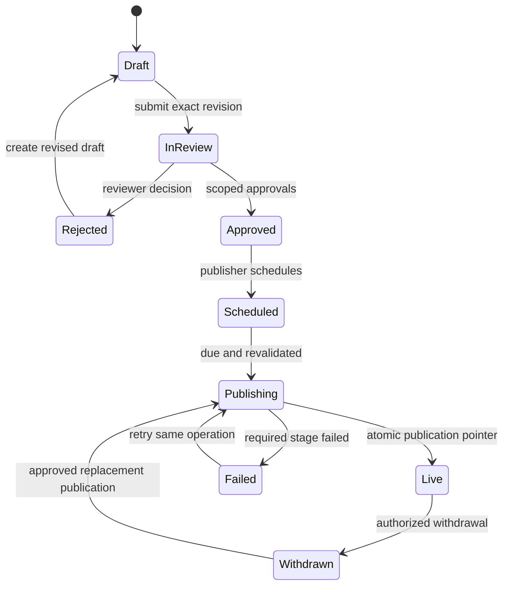
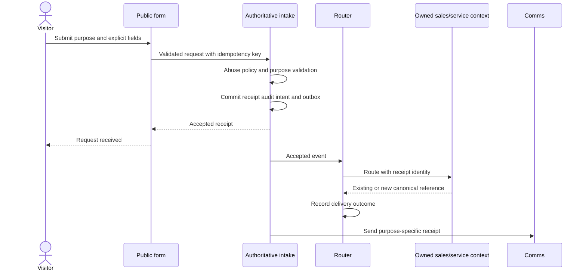

# Part III — Marketing Site

Document PMS-VOL-003 · Version 0.1.0 · Updated 2026-09-14 · DRAFT / PROPOSED functional specification.

Product PMS-PRD-MAR; accountable platform PLT-MAR. Applications: PMS-APP-MAR-001 Digital Experience, PMS-APP-MAR-002 Acquisition, PMS-APP-MAR-003 Content Operations. Existing [Marketing requirements](../../unierp-platform/docs/platforms/marketing-site/REQUIREMENTS.md), [contracts](../../unierp-platform/docs/platforms/marketing-site/CONTRACTS.md), [security](../../unierp-platform/docs/platforms/marketing-site/SECURITY.md) and [experience](../../unierp-platform/docs/platforms/marketing-site/EXPERIENCE.md) remain owning engineering authority. This volume proposes detailed behavior; it does not assert implementation, approved prices or certifications.

## 3.1 Outcome, scope and evidence

The visitor must understand the six products, identify supported business outcomes, evaluate cost, inspect evidence, find documentation and start the appropriate contact/trial journey. Editors must publish accurate, accessible, localized and consent-aware content with a recoverable revision lifecycle.

In scope: corporate/product/solution/industry pages, stories/resources, pricing, lead/contact intake, trial/signup, authentication entry, localization, SEO, CMS, analytics/consent, campaigns, legal content and documentation/developer/Marketplace discovery. Support contact and careers use the same governed intake/content pattern with their own purpose and data minimization; they do not create additional products.

### 3.1.1 Inspected implementation leads and gaps

Read-only inspection on 2026-09-14 found page/API files for leads, subscriptions, analytics, previews, product discovery and administration. The lead route imports local Prisma, returns a lead score and has draft capture behavior. The subscription route upserts an active subscriber. The preview-token route generates a token and URL; that code alone does not prove storage, expiry or verification. [Lead route](../../marketing-site/app/api/leads/route.ts), [subscription route](../../marketing-site/app/api/subscribe/route.ts), [preview route](../../marketing-site/app/api/admin/preview-token/route.ts).

The existing platform PRD identifies local Tenant/User/Lead/Ticket ownership overlap. ADR-0010 prohibits client/presentation direct database access. Therefore these files are implementation evidence to reconcile, not the intended service boundary. No code was changed or runtime-tested in this authoring cycle. Public responses in this specification intentionally omit internal scores, CRM IDs and tenancy discovery.

### 3.1.2 Product acceptance dimensions

Business requirements: MAR-BR-001–005 and PMS-GOL-0002/0004/0005. Functional parent requirements: MAR-FR-001–005. Actors: anonymous visitors, returning prospects, existing customers, developers, partners, content editors, translators, reviewers, publishers, marketing analysts and intake operators. Each permission is independently enforced; an editor role does not imply provider operations or access to prospect records.

The [feature catalog](VOLUME-03-MARKETING-FEATURES.md) defines one significant feature record for every one of the 21 registered modules. Each includes concrete workflow, states, input/output, rules, interface and test mappings, plus the binding common contracts below. Compound modules contain explicitly enumerated sub-features; the shared contract is a single source, not a waiver of feature-specific detail.

## 3.2 Information architecture and Screen Registry

Routes below are PROPOSED product routes. Existing routes require additive migration/redirect mapping before implementation. Public resources have no login requirement; editor/intake pages require authenticated scoped permissions. Locale prefix is applied consistently where supported; canonical default-locale routing is configured, not inferred from visitor IP.

| Screen ID | Route / view | Purpose and principal actions | Feature IDs |
| --- | --- | --- | --- |
| PMS-SCR-MAR-000001 | `/`, `/about`, `/careers`, `/careers/{slug}` | Corporate promise, six-product navigation, company information, recruitment discovery; open supported CTA | PMS-FEA-MAR-000001 |
| PMS-SCR-MAR-000002 | `/products`, `/products/{product}` | Product overview, capability evidence, dependency/availability and trial/contact CTA | PMS-FEA-MAR-000002 |
| PMS-SCR-MAR-000003 | `/solutions`, `/solutions/{solution}` | Business problem → cross-product workflow → prerequisites → next step | PMS-FEA-MAR-000003 |
| PMS-SCR-MAR-000004 | `/industries`, `/industries/{industry}` | Industry outcomes with explicit supported/research status | PMS-FEA-MAR-000004 |
| PMS-SCR-MAR-000005 | `/customers`, `/customers/{story}` | Approved customer story, dated results and methodology | PMS-FEA-MAR-000005 |
| PMS-SCR-MAR-000006 | `/resources`, `/blog`, `/blog/{slug}`, `/events` | Search/filter/read resource; register through governed intake when needed | PMS-FEA-MAR-000006 |
| PMS-SCR-MAR-000007 | Editor SEO panel and public metadata | Set canonical, redirects, title, description and index policy | PMS-FEA-MAR-000007 |
| PMS-SCR-MAR-000008 | Locale selector and translation workbench | Change locale retaining content identity; translate/review revisions | PMS-FEA-MAR-000008 |
| PMS-SCR-MAR-000009 | `/privacy`, `/terms`, `/security`, `/legal/{document}` | Read effective legal version, historical versions and scoped security evidence | PMS-FEA-MAR-000009 |
| PMS-SCR-MAR-000010 | `/pricing`, `/calculator` | Compare approved offers, edit workload estimate, see assumptions and export estimate | PMS-FEA-MAR-000010 |
| PMS-SCR-MAR-000011 | Inline lead form / `/request-demo` | Submit purpose-specific contact details and optional separate marketing preference | PMS-FEA-MAR-000011 |
| PMS-SCR-MAR-000012 | `/contact`, `/help` | Choose sales/support/privacy/security purpose, submit minimal request, view receipt | PMS-FEA-MAR-000012 |
| PMS-SCR-MAR-000013 | `/register`, signup status | Review supported geography/trial terms, start identity verification, follow provisioning | PMS-FEA-MAR-000013 |
| PMS-SCR-MAR-000014 | `/login`, `/admin/login` | Enter owned identity flow and return safely to selected product | PMS-FEA-MAR-000014 |
| PMS-SCR-MAR-000015 | `/campaigns/{slug}`, editor campaign workbench | View targeted content; configure attribution, schedule and expiry | PMS-FEA-MAR-000015 |
| PMS-SCR-MAR-000016 | Marketing analytics dashboard | Aggregate acquisition funnel, consent coverage, errors and source freshness | PMS-FEA-MAR-000016 |
| PMS-SCR-MAR-000017 | Consent banner / preference center | Accept/reject optional purposes, inspect vendors, revise or withdraw consent | PMS-FEA-MAR-000017 |
| PMS-SCR-MAR-000018 | Editorial list/detail/preview/release workbench | Draft, review, preview, schedule, publish, withdraw and restore revision | PMS-FEA-MAR-000018 |
| PMS-SCR-MAR-000019 | `/docs`, `/docs/{category}` | Find correct product/version documentation and follow authoritative destination | PMS-FEA-MAR-000019 |
| PMS-SCR-MAR-000020 | `/marketplace` | Discover public approved packages, inspect compatibility and continue to Marketplace | PMS-FEA-MAR-000020 |
| PMS-SCR-MAR-000021 | `/developers` | Discover SDK/CLI/API/builder resources and enter Developer Platform | PMS-FEA-MAR-000021 |
| PMS-SCR-MAR-000022 | Intake operator queue/detail | Review authorized contact records, assignment and delivery exceptions | PMS-FEA-MAR-000011, PMS-FEA-MAR-000012 |
| PMS-SCR-MAR-000023 | `/status` or approved status destination | Read operational status without exposing internal tenant/service details | PMS-FEA-MAR-000001 |

### 3.2.1 Common UI contract

Use owned `@kannan19302/ui` primitives and approved tokens. Public content has skip link, labeled navigation, one primary heading, meaningful section hierarchy, text alternatives and visible keyboard focus. Cards are navigable links with descriptive names, not nested interactive controls. Pricing tables preserve header relationships on narrow screens. Motion respects preferences; no automatic video/audio playback is required to understand a product.

Forms retain entered values locally while a request fails, associate field errors with controls, focus an error summary after failed submission and announce successful receipts once. Never transmit abandoned/draft personal fields without explicit purpose and consent policy. Do not store sensitive form drafts in durable browser storage by default. A submit button becoming disabled does not itself provide idempotency.

Every public view handles loading (stable geometry), empty results (clear filter reset), unavailable content (safe retry), missing slug (not found with navigation), stale published projection (last updated where material), and offline (honest availability; no claimed submission). Editor views additionally handle forbidden, stale revision, conflict, expired preview and withdrawn content. Public legal pages and essential contact information remain reachable when optional analytics fails.

Accessibility acceptance: WCAG 2.2 AA via automated scanning plus manual keyboard, screen-reader, zoom/reflow, contrast, reduced-motion and locale/RTL review where supported. Shared components do not establish conformance alone. Locale controls announce current language; comparison charts have equivalent tabular text.

## 3.3 Identity, Role and Permission Registries

All permission strings below are proposed semantic identifiers requiring reconciliation with the existing canonical permission catalog before contract publication. They do not grant runtime authority merely by appearing here. Public operations have explicitly bounded anonymous policy instead of authenticated roles.

| Permission ID | Proposed semantic permission | Allowed effect and scope | Denied boundary |
| --- | --- | --- | --- |
| PMS-PER-MAR-000001 | `pcc.marketing.content.read` | Read assigned content workspace and revision history | Prospect PII and provider operations |
| PMS-PER-MAR-000002 | `pcc.marketing.content.edit` | Create/edit drafts in assigned site/locale/content collection | Publish, legal approval or concurrent overwrite |
| PMS-PER-MAR-000003 | `pcc.marketing.content.review` | Approve/reject assigned revision with evidence | Editing approved revision without new review |
| PMS-PER-MAR-000004 | `pcc.marketing.content.publish` | Release/withdraw approved revision under policy | Publishing stale approval or unauthorized legal content |
| PMS-PER-MAR-000005 | `pcc.marketing.translation.edit` | Draft assigned locale translations | Changing source language or publishing automatically |
| PMS-PER-MAR-000006 | `pcc.marketing.intake.read` | Read purpose/assignment-scoped prospect intake | Broad tenant/customer record search |
| PMS-PER-MAR-000007 | `pcc.marketing.intake.route` | Assign/retry authorized intake delivery | Editing identity, business customer master or sending unauthorized marketing |
| PMS-PER-MAR-000008 | `pcc.marketing.analytics.read` | Read approved aggregate reports | Raw form payloads or unrestricted visitor-level export |
| PMS-PER-MAR-000009 | `pcc.marketing.campaign.manage` | Manage campaign content, schedule and source codes | Billing offers or consent defaults |
| PMS-PER-MAR-000010 | `pcc.marketing.legal.approve` | Approve exact legal/security content revision | Blanket compliance certification |
| PMS-PER-MAR-000011 | `pcc.marketing.consent.manage` | Configure reviewed purpose/vendor definitions | Retroactively treating old consent as new consent |

| Role ID | Persona | Proposed grants | Conditions |
| --- | --- | --- | --- |
| PMS-ROL-MAR-000001 | Content editor | 000001, 000002 | Assigned content collection; cannot self-publish |
| PMS-ROL-MAR-000002 | Reviewer | 000001, 000003 | Cannot approve own material change where separation required |
| PMS-ROL-MAR-000003 | Publisher | 000001, 000004 | Exact approved revision; step-up for high-impact changes |
| PMS-ROL-MAR-000004 | Translator | 000001, 000005 | Assigned locales only |
| PMS-ROL-MAR-000005 | Intake operator | 000006, 000007 | Purpose and assignment scope; no general CRM access |
| PMS-ROL-MAR-000006 | Analyst | 000008 | Aggregation/privacy policy |
| PMS-ROL-MAR-000007 | Campaign manager | 000001, 000002, 000009 | Reviewed publication and consent restrictions |
| PMS-ROL-MAR-000008 | Legal/privacy reviewer | 000001, 000003, 000010, 000011 | Domain approval and change audit |

Numeric grants in the role table refer to the matching PMS-PER-MAR suffix. Actual principals and sessions remain IAM-owned. Assigning a role must itself require the owning IAM administrative permission; none of these roles can grant themselves more authority.

## 3.4 Data Entity Registry and lifecycle

The following records are logical schema proposals. Existing equivalent records must be adopted through the authoritative service, not duplicated in Marketing Site. All entities use opaque IDs, version/concurrency metadata, created/updated timestamps and attributable mutation audit. Public content belongs to the provider's publishing domain; prospect data is provider-controlled intake, not arbitrary customer-tenant data. Any tenant-owned association uses server-derived scope and RLS under the owning data service.

| Entity ID | Logical entity / owner | Key fields and constraints | Lifecycle and privacy |
| --- | --- | --- | --- |
| PMS-ENT-MAR-000001 | ContentItem / PLT-MAR content service | ID, type, stable slug identity, product/solution/industry references, owning collection | Identity remains stable across revisions; public projection contains approved fields only |
| PMS-ENT-MAR-000002 | ContentRevision / content service | item ID, immutable revision, locale, structured body, asset refs, evidence refs, hash, approval refs | draft → review → approved/rejected; immutable after approval; new edit creates new revision |
| PMS-ENT-MAR-000003 | Publication / content service | exact revision, locale, route, effective interval, state, release operation, previous publication | scheduled → publishing → live/failed → withdrawn; at most one live revision per route/locale |
| PMS-ENT-MAR-000004 | ClaimEvidence / product/content governance | claim text/scope, product version, evidence URL/ref, owner, review/expiry, approval | Expired evidence blocks new publication and flags live affected pages for review |
| PMS-ENT-MAR-000005 | IntakeReceipt / owning intake service | receipt ID, purpose, minimal contact fields, message, consent refs, source code, idempotency hash, assignment, downstream ref | accepted → routing → delivered/exception → closed; encrypted PII, retention per purpose, deletion/hold reconciliation |
| PMS-ENT-MAR-000006 | ConsentReceipt / privacy capability | pseudonymous subject/optional verified identity binding, policy version, purposes, vendor scope, timestamp, withdrawal | append-only changes; current effective choices derived; no inferred consent from browsing |
| PMS-ENT-MAR-000007 | Campaign / marketing service | ID, source code, audience description, revision refs, schedule, expiry, budget reference if applicable | draft → approved → active → paused/ended; attribution keys contain no PII |
| PMS-ENT-MAR-000008 | RedirectRule / publishing service | source path/locale, target allowlisted internal/canonical route, status, effective time, version | No redirect loops/chains beyond policy; unique active source |
| PMS-ENT-MAR-000009 | DiscoveryEntry / read projection | external owner ID, product/version, title, safe URL, status, last sync, expiry | Never becomes source of package/license/document truth; stale/withdrawn items suppressed |
| PMS-ENT-MAR-000010 | PreviewGrant / content service | exact revision, hashed nonce, actor or reviewer scope, expiry, redemption/revocation, allowed path | Short-lived, no public caching/indexing; token never logged or exported |
| PMS-ENT-MAR-000011 | NewsletterPreference / communication capability | verified contact ref, purpose, policy version, confirmation token hash, subscribed/withdrawn time | requested → confirmed → withdrawn/bounced; no automatic reactivation by repeated public request |
| PMS-ENT-MAR-000012 | EstimateSnapshot / commercial estimate service | offer version, currency, meter inputs, assumptions, computed lines, expiry, checksum | Non-binding; no payment or tenant provisioning side effect; anonymous snapshot excludes personal fields |

Retention values are configurable only after privacy/legal approval. Proposed defaults for planning: unconfirmed newsletter requests expire after 7 days; anonymous estimates after 30 days; rejected spam after 7 days; ordinary closed intake after 180 days absent a justified ongoing relationship/hold. These are proposals, not statements of legal compliance. Published legal-version history and minimum consent/suppression evidence require a separately approved retention schedule. Erasure must cover projections, attachments, search and queued payloads, with documented backup expiry; do not erase the minimal suppression record needed to honor withdrawal without an approved replacement.

## 3.5 API Registry and boundary contracts

Routes below are proposed authoritative-service operations. The presentation may expose compatible BFF routes, but it does not own persistence. Schemas must be published in the owned contract package before implementation. IDs remain stable if route names change during reconciliation.

### 3.5.1 Common API fields

Every operation declares contract major, correlation ID, bounded input size and canonical error body `{code, message, correlationId, fieldErrors?}`. Public errors never include internal score, provider tenant ID, CRM identifier, identity existence or stack trace. Anonymous mutation policy uses server-resolved site, origin/CSRF protection appropriate to the client model, rate limits and accessible abuse challenge. Accepting an origin header alone does not establish trust.

Proposed initial bounds: public JSON ≤16 KiB; email ≤254 characters, name/company ≤200, message ≤2,000; URLs allowlisted rather than arbitrary fetch targets; list page size 1–50 with opaque cursor and stable ID tie-break. Limit values are versioned configuration subject to load/privacy review. Unknown privileged fields are rejected. Rate responses include safe retry guidance; abuse controls avoid exposing which organization/account exists.

| API ID | Proposed operation | Input → output | Identity/policy; consistency/errors |
| --- | --- | --- | --- |
| PMS-API-MAR-000001 | GET `/api/v1/public/content/{slug}` | locale, optional approved type → live immutable revision projection, ETag, effective time | Anonymous published-only; 404 unavailable; 503 dependency; no draft fallback |
| PMS-API-MAR-000002 | GET `/api/v1/public/content` | type, product/topic/locale, cursor → authorized public entries/next cursor | Anonymous; bounded query; deterministic publishedAt + ID order |
| PMS-API-MAR-000003 | GET `/api/v1/public/offers` | region, currency, cadence → approved offer versions and applicability | Anonymous; unavailable geography yields explicit unsupported status; no estimated exchange-rate substitution |
| PMS-API-MAR-000004 | POST `/api/v1/public/estimates` | offerVersion, decimal meter quantities → itemized estimate, assumptions, expiry | Anonymous bounded calculation; 409 retired offer; no purchase effect; reproducible decimal math |
| PMS-API-MAR-000005 | POST `/api/v1/public/intake` | purpose, minimal contact/message, consent version/choices, campaign code, idempotency key → opaque receipt, accepted state | Anonymous purpose policy; durable receipt + outbox; duplicates same payload return same result, mismatch 409 |
| PMS-API-MAR-000006 | GET `/api/v1/public/intake/status` | receipt plus separate high-entropy capability → coarse status only | Possession-limited receipt scope; token redacted; no contact payload; uniform not-found |
| PMS-API-MAR-000007 | POST `/api/v1/public/newsletter/requests` | email, purpose/policy version → generic requested response | No automatic active subscription; rate limits; confirmation sent only within abuse policy |
| PMS-API-MAR-000008 | POST `/api/v1/public/newsletter/confirmations` | single-use signed/hashed token → confirmed/expired generic result | Explicit confirmation; replay returns safe terminal outcome; no PII echo |
| PMS-API-MAR-000009 | POST `/api/v1/public/preferences` | current receipt/version, purpose choices → effective receipt and version | Pseudonymous subject binding; withdrawal immediate locally and durable server reconciliation; no account discovery |
| PMS-API-MAR-000010 | POST `/api/v1/public/telemetry` | approved event enum, content/campaign IDs, coarse context, consent proof/version → accepted batch count | Purpose gate, bounded batch, schema allowlist; no free-text payload; reject revoked/unknown consent |
| PMS-API-MAR-000011 | GET `/api/v1/public/discovery` | kind docs/developer/marketplace, supported filters → approved owner links and freshness | Read projection; revoked/expired entry hidden; target allowlist |
| PMS-API-MAR-000012 | POST `/api/platform/v1/marketing/revisions` | item, baseVersion, locale, structured content/evidence → new draft revision | Content-edit permission and collection scope; optimistic conflict; no raw executable HTML |
| PMS-API-MAR-000013 | POST `/api/platform/v1/marketing/reviews` | exact revision, decision, reason → immutable review | Review/legal grants as required; no self-approval where policy prohibits |
| PMS-API-MAR-000014 | POST `/api/platform/v1/marketing/publications` | approved revision, schedule, expected current publication, idempotency → 202 operation | Publish grant; step-up where policy requires; atomic live pointer and outbox; concurrent 409 |
| PMS-API-MAR-000015 | POST `/api/platform/v1/marketing/preview-grants` | exact revision, allowed path, bounded expiry → private preview capability | Read/review scope; persisted hashed grant; no general site or tenant token |
| PMS-API-MAR-000016 | GET `/api/platform/v1/marketing/operations/{id}` | operation identity → scoped progress/result/recovery | Scoped authenticated actor; no operation enumeration |
| PMS-API-MAR-000017 | POST `/api/platform/v1/marketing/intake-routing` | receipt, expected version, authorized destination/retry reason → routing operation | Intake-route grant and purpose scope; approved destination only; deduplicated downstream effect |
| PMS-API-MAR-000018 | GET `/api/platform/v1/marketing/reports` | approved report, period, dimensions → aggregate with freshness/definition version | Analytics-read; small-cell suppression and export policy; no raw PII |
| PMS-API-MAR-000019 | POST `/api/platform/v1/marketing/campaigns` | campaign revision/schedule/source code → version | Campaign-manage; approval for publication; code uniqueness; no consent override |
| PMS-API-MAR-000020 | POST `/api/platform/v1/marketing/withdrawals` | live publication/version, reason, replacement → 202 operation | Publish/required legal authority; immutable history; invalidate serving/search projections |

Signup and login consume IAM and provider-lifecycle contracts from Volume 2; they do not mint local Marketing Site credentials or create a tenant directly. Final operation IDs/routes for those external owners are allocated in their volumes, not duplicated here.

## 3.6 Event, Integration, Notification and Report Registries

### 3.6.1 Events

Event envelope follows UNI-INT-001 and Volume 2: event ID/type/major/time, producer, aggregate ID/version, actor, applicable verified scope, correlation/causation and schema. Business mutations plus outbox/audit intent commit together. Consumer delivery is deduplicated, retryable, dead-lettered and reconciled. PII is referenced by protected record ID rather than copied into event payloads.

| Event ID | Proposed event | Producer → consumers | Payload / invariant |
| --- | --- | --- | --- |
| PMS-EVT-MAR-000001 | `marketing.content.published.v1` | Content → CDN/search/discovery/analytics | publication/revision/hash/locale/path; exact approved content only |
| PMS-EVT-MAR-000002 | `marketing.content.withdrawn.v1` | Content → CDN/search/discovery | publication/version/reason class; delayed old publication cannot resurrect content |
| PMS-EVT-MAR-000003 | `marketing.intake.accepted.v1` | Intake → routing/notification | receipt/purpose/consent ref; no raw message/email |
| PMS-EVT-MAR-000004 | `marketing.intake.routed.v1` | Router → operator reports | receipt/destination reference/outcome; downstream idempotency key retained |
| PMS-EVT-MAR-000005 | `privacy.preference.changed.v1` | Privacy → telemetry/communication | subject reference/policy version/effective purposes; consumers apply newest version |
| PMS-EVT-MAR-000006 | `marketing.newsletter.confirmed.v1` | Communication → authorized audience projection | preference ref/purpose/version; withdrawal wins over older confirmation |
| PMS-EVT-MAR-000007 | `marketing.campaign.changed.v1` | Campaign → publication/analytics | campaign/version/schedule; no audience PII |
| PMS-EVT-MAR-000008 | `marketing.publication.failed.v1` | Publisher → operations/editor notification | operation/publication/phase/safe error; no fake live state |

### 3.6.2 Integrations

| Integration ID | Contract owner | Use and failure behavior |
| --- | --- | --- |
| PMS-INT-MAR-000001 | IAM | OIDC/login/verification; state/nonce/return URL validation; identity outage shows unavailable rather than local credential fallback |
| PMS-INT-MAR-000002 | Provider lifecycle | Trial/organization provisioning; idempotent operation, queryable progress and compensation |
| PMS-INT-MAR-000003 | Sales/customer service intake owner | Lead/contact routing to canonical records; duplicate receipt maps to same downstream effect; preserve queue on outage |
| PMS-INT-MAR-000004 | Communication capability | Confirmation/receipt/subscription preferences; escaped templates, consent checks, retry/suppression |
| PMS-INT-MAR-000005 | Commercial catalog | Offer projection and estimate rules; immutable version, supported geography/currency, no guessed prices |
| PMS-INT-MAR-000006 | Documentation/Developer Platform/Marketplace | Public discovery projections and allowlisted destinations; expiry and withdrawal handling |
| PMS-INT-MAR-000007 | Content delivery/search | Publish and withdraw revision projections; monotonic versions, cache invalidation and reconciliation |
| PMS-INT-MAR-000008 | Privacy/analytics | Purpose definitions, consent proof and aggregate events; optional collection stops when unavailable or denied |

| Notification ID | Trigger / recipient | Template and delivery contract |
| --- | --- | --- |
| PMS-NTF-MAR-000001 | Intake accepted / submitting contact | Receipt only, no claim of trial activation; purpose/locale-specific, deduplicated by receipt |
| PMS-NTF-MAR-000002 | Newsletter requested / requested contact | Expiring confirmation, no promotional content before confirmation; rate/suppression controls |
| PMS-NTF-MAR-000003 | Routing exception / assigned operator | Protected deep link, safe error, retry owner; no PII in message |
| PMS-NTF-MAR-000004 | Review/publication outcome / assigned editor or publisher | Exact revision and result; failures include safe recovery operation |
| PMS-NTF-MAR-000005 | Claim evidence expiry / content owner | Affected revisions and deadline; deduplicated expiry alert |

| Report ID | Definition / source | Dimensions and access |
| --- | --- | --- |
| PMS-RPT-MAR-000001 | Acquisition funnel: eligible page views → consented CTA → accepted intake → verified signup → activated organization | Fixed cohort/window; versioned attribution, consent eligibility and cross-product event reconciliation; aggregate analyst access |
| PMS-RPT-MAR-000002 | Intake delivery: accepted receipts, delivered/exception count, age and retry outcomes | Purpose/assignment/time; restricted operator view; no public access |
| PMS-RPT-MAR-000003 | Content health: broken links, stale claims, missing translations, publication errors | Collection/locale/product/version; editor scope |
| PMS-RPT-MAR-000004 | Consent quality: effective preference coverage, denied/revoked batches, collection violations | Aggregated purpose/version/window; privacy role; zero violations is a target, not an inferred result |
| PMS-RPT-MAR-000005 | Pricing estimate funnel: selected offer/workload band → purchase handoff | Anonymous aggregate or properly consented cohort; never treat estimate as committed revenue |

KPI denominators exclude bots only through a documented filter version; failures and denied consent are reported honestly. No cross-tenant business analytics is imported into the marketing dashboard. Product-activation KPI PMS-KPI-SHARED-000009 remains defined in Volume 1, not redefined here.

## 3.7 Publication and acquisition workflows

### 3.7.1 Publication state machine — PMS-ARC-STATE-0002

A new content edit never mutates an approved revision. Scheduled publication revalidates permissions, claim evidence, legal approvals, asset scanning and current expected version at execution. Cache/search completion may lag the committed publication pointer; the operation reports projection readiness separately. A release is successful only at its defined serving gate, not because a job was queued. Emergency withdrawal invalidates live access and schedules projection removal; stale delivery must not republish an older version.

### 3.7.2 Lead capture sequence — PMS-ARC-SEQ-0004

The visitor is told that the request was received, not that a trial has been provisioned or a salesperson has replied. Delivery/notification failures retain their own state and do not roll back or duplicate accepted intake. An unknown network outcome retries the same key; email or company alone is not the idempotency key and does not authorize updates to a prior prospect record.

## 3.8 Performance, reliability, privacy and operations

Proposed public-experience budgets: cached content response P95 ≤300ms at regional edge under a declared workload; initial visible content target ≤2.5s on the defined mobile test profile; accepted intake API P95 ≤1s excluding interactive abuse challenge; publication projection readiness ≤60s P95 under nominal load. These are measurement proposals, not achieved SLOs. Workload, geography and concurrency profiles must be fixed before acceptance.

Public content and essential legal/contact information remain available from approved immutable projections during editorial outage. Preview/draft and personalized data are never placed in public caches. Identity outage blocks new authentication; intake outage preserves the local form and shows retry without submission success. Analytics outage stops optional collection or buffers only under approved privacy limits; it cannot block reading or essential contact.

Operations measure content availability, intake accept/delivery latency, oldest undelivered receipt, publication failures, expired live claims, cache invalidation lag, consent violations and external-discovery staleness. Logs contain correlation and safe IDs, never raw messages, email addresses, preview tokens, credentials or full query strings. High-cardinality visitor IDs are not metric labels.

Runbook triggers: publication failure pages the content operations owner according to severity; intake backlog opens service incident after agreed threshold; consent violation disables optional collection and initiates privacy triage; leaked draft/preview revokes grants and invalidates cache; stale price withdraws affected CTA and displays unavailable pending catalog reconciliation. Values for alert windows/escalation must be approved with measured traffic and support hours.

Backup/recovery scope includes content identities/revisions/approvals/publications, consent and suppression evidence, intake routing state and configuration. Rebuild public projections from authoritative revisions. Restore must not resurrect withdrawn content or revoked preferences: replay current revocation/withdrawal state before serving. Restore exercises reconcile publication hashes and intake downstream references; no production restore is authorized by this specification.

## 3.9 Failure-first acceptance matrix

| Condition | Required outcome | Proof |
| --- | --- | --- |
| Invalid input / malicious markup | No business mutation; safe field errors; sanitized approved structured content | Input abuse, stored-XSS and template escaping tests |
| Missing/revoked editor permission | Forbidden; scheduled action re-evaluates permission | Positive/negative grant and delayed-job revocation tests |
| Duplicate submit / lost response | Same receipt, one downstream record and deduplicated notifications | Concurrent same-key and disconnect-after-commit tests |
| Concurrent content publication | One expected-version winner; loser retains draft/conflict | Race test against authoritative store |
| Database failure | Atomic rollback before acceptance, or durable committed receipt afterward | Crash at each transaction boundary |
| Cache failure | Safe public projection fallback; no preview leakage | Authenticated preview/public cache isolation tests |
| Queue failure | Outbox retained, receipt accepted honestly, delivery state delayed | Queue outage/replay/reconciliation test |
| Third-party outage / timeout | Pending delivery; bounded retry by canonical reference | CRM/email/identity/catalog outage tests |
| Partial deployment | Serving gate reflects mixed/failed state; restore known approved revision | Deployment/invalidation failure rehearsal |
| Consent withdrawal race | Stop client collection immediately; server rejects obsolete optional events | Revocation before batch delivery and replay test |
| Translation/claim drift | No silent source overwrite or unsupported promise | Revision/evidence expiry tests |
| Unsupported locale/currency/region | Explicit available alternative or unsupported result | No guessed translation or price conversion |

## 3.10 Traceability, completeness and remaining decisions

Every feature in the companion catalog has a stable requirement/test pair and links its screen, entities, API, event, integration, notification and report. Shared contracts 3.2–3.9 are binding field-level definitions for those records. Runtime test results are NOT RUN; the task is specification authoring, not code implementation.

PMS-TBD-0015: canonical intake/content/consent ownership and migration away from presentation-local persistence; PLT-MAR/PLT-BIZ/IAM before implementation. PMS-TBD-0016: approved retention and consent-purpose rules by market; privacy/legal before public collection. PMS-TBD-0017: exact marketing permission/endpoint alignment with existing catalogs; security/contracts before publication. PMS-TBD-0018: approved offer content and evidence-backed public claims; product/commercial before paid CTA release. PMS-TBD-0019: serving/latency/load/alert thresholds and restore targets; SRE before GA.

The draft covers all 21 Marketing Site modules, with core workflow and shared contract detail. Owner decisions above and implementation evidence remain open; this is not a claim that Marketing Site is built, deployed, legally approved or fully runtime-verified. Next sequential volume: **Volume 4 — Provider Control Center**.
