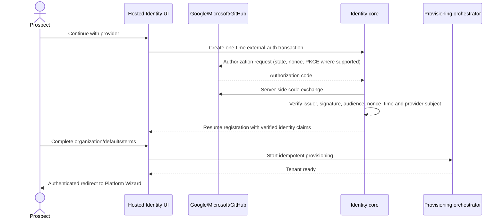
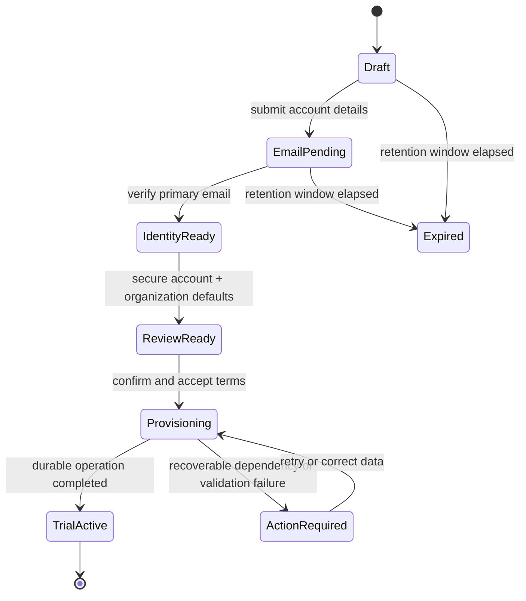
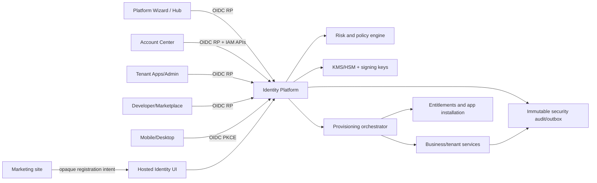

# UniERP Customer Onboarding, Unified Login and IAM Plan

Status: target-state draft for product, design, identity, security and platform teams  
Primary owner: Identity Platform (`PLT-IAM`)  
Participating owners: Marketing (`PLT-MAR`), Runtime Operations (`PLT-OPS`), Tenant Admin (`PLT-TAD`), Tenant Apps (`PLT-ERP`) and Design Platform (`PLT-DS`)

## 1. Outcome and architectural decisions

UniERP shall provide one continuous journey from a marketing call-to-action to a usable, secure tenant:

1. A prospect selects **Start free** or **Start free trial** on any marketing page.
2. UniERP preserves the prospect's plan, module, industry and campaign intent and opens one centrally hosted, multi-step registration experience.
3. The prospect verifies ownership of the primary email address before the tenant becomes fully active.
4. UniERP creates the global account, organization, owner membership, trial, entitlements and initial configuration through a durable provisioning workflow.
5. Registration completion creates the user's first session automatically; the user does not enter the same credentials again.
6. The user lands in the Platform Wizard, sees only entitled platforms, and can enter any of them without another credential prompt.
7. Every UniERP product surface uses the same Identity Provider. Product repositories may retain compatibility `/login` routes, but those routes only redirect to the hosted login and never render or process credentials.
8. A single Account Center manages personal identity, authenticators, verified contact methods, devices, sessions, connected identities, recovery and consent. Role-aware organization IAM administration is linked from the same center without mixing personal and tenant-administrator authority.

The following are non-negotiable design decisions:

- Use OpenID Connect Authorization Code with PKCE for browser, mobile and desktop clients. Do not invent cross-domain shared cookies or pass tokens in URLs.
- Keep the authoritative IdP session cookie on the identity origin only. Each web platform uses a server-side BFF session and exchanges authorization codes server-side.
- Treat the Platform Wizard as an SSO launchpad and entitlement-aware relying party, not as an authentication authority.
- Model a person as one global principal with zero or more tenant memberships. Credentials and personal authenticators belong to the principal; roles, groups and entitlements belong to memberships.
- Prefer phishing-resistant passkeys/WebAuthn. Email, SMS and WhatsApp codes are contact-verification or recovery methods by default, not high-assurance MFA.
- Protect all application pages by default. Public access exists only through a reviewed allowlist for the marketing site, hosted authentication entry points, legal/help pages, OIDC protocol callbacks, and operational endpoints with separate network controls.
- Never report a tenant as ready until durable provisioning has completed. UI animation or a successful HTTP request is not proof of completion.

## 2. Experience principles

- **One identity, many organizations:** the user signs in once and chooses a membership when more than one tenant is available.
- **Progressive collection:** registration asks only for information needed to create a legally and operationally usable trial. Detailed ERP setup is completed after access is established.
- **Resume safely:** every registration and onboarding step is persisted. Closing the browser, changing devices or retrying a failed dependency must not create a duplicate tenant.
- **Explain scope:** every authenticated header shows the current user, organization and environment. Tenant switching is explicit and audited.
- **Secure by default, understandable by humans:** security choices use plain terms such as “Passkey”, “Authenticator app” and “Text message”, with the assurance level and recovery impact disclosed.
- **No dead ends:** denied access, expired links, provisioning failures, federation failures and lost-factor recovery always provide a safe next action and a correlation identifier.
- **Accessible and localizable:** critical flows meet WCAG 2.2 AA, support keyboard and screen readers, do not rely on color alone, and use locale-aware names, addresses, dates and phone numbers.

## 3. End-to-end customer journey

### Stage 0 — Marketing discovery and intent handoff

**Entry points**

- Header: `Start free`
- Product/module page: `Start 30-day free trial`
- Pricing card: `Start free`
- Industry page: `Start with this blueprint`
- Existing customer: `Sign in`

All acquisition CTAs call one intent builder rather than hand-crafting links. It creates a short-lived, signed `registration_intent_id` and redirects to the identity origin. The record may contain:

- requested plan and trial offer version;
- selected module(s) or industry blueprint;
- locale, country hint and preferred currency/time zone hints;
- marketing attribution and consent-safe campaign fields;
- requested return destination;
- terms and privacy document versions presented;
- creation time, expiry and anti-tamper signature.

Do not place email, phone, names, tokens or other personal data in the query string. Query parameters may carry only an opaque intent identifier and approved OIDC values.

**Routing contract**

```text
Marketing CTA
  -> https://auth.unierp.example/register?intent=<opaque-id>
  -> registration workflow
  -> https://hub.unierp.example/?welcome=true&operation=<opaque-id>
```

If the visitor is already authenticated, the IdP asks whether to create a new organization under the existing account. It must not create another credential record for the same person.

### Stage 1 — Multi-step registration

The registration shell is hosted by the Identity Platform and reused by every acquisition entry point. It has a visible step indicator, back navigation, save/resume behavior and server-side validation.

| Step | Required inputs | Optional or derived inputs | Security and UX behavior |
| --- | --- | --- | --- |
| 1. Your account | first name, last name, work email | locale; existing-account detection | Generic account-discovery response; bot/risk check; offer sign-in when ownership can be safely established. |
| 2. Verify email | six-digit code or signed link | resend/change email | Single-use, short-lived, hashed challenge; attempt limit; resend cooldown; same-browser verification auto-advances. |
| 3. Secure account | passkey (preferred) or password | authenticator enrollment; recovery codes | Password follows length/breach rules; never force periodic password changes; disclose recovery consequences. |
| 4. Organization | display name, legal name, country/region, business type/industry, organization size | tax/registration ID when required; requested workspace slug | Country drives only applicable fields. Slug availability must not reveal whether a named company is already a customer. |
| 5. Working defaults | time zone, language, currency, fiscal-year start | date/number format | Suggest from browser and country, but require explicit confirmation because these affect ERP records. |
| 6. Trial and apps | trial plan, accepted terms/privacy versions | recommended apps, blueprint, sample data | Show trial duration, user/storage limits, end date rules and whether payment details are required. No preselected marketing consent. |
| 7. Review | confirmation of collected data | invite teammates later | Display editable summary; create one idempotent provisioning operation on submit. |

Phone number is not universally required. Ask for it only when the customer selects phone-based recovery, SMS/WhatsApp verification, mobile push, a country-specific business requirement, or a later business workflow that genuinely needs it.

#### Existing-account sign-in and registration providers

The hosted login and registration UI shall support real provider redirects, callbacks, identity resolution and session creation. Provider buttons are never placeholders and never simulate success. Selecting a provider must begin a live authorization-code flow against that provider; success returns to the same registration or sign-in intent, while cancellation or failure returns a safe, actionable error.

**Initial UI release:** show exactly these three provider choices, in this order, on both hosted sign-in and the account step of hosted registration:

1. **Continue with Google**
2. **Continue with Microsoft**
3. **Continue with GitHub**

Then show the separator **or continue with email** and the passkey/password flow. Apple, LinkedIn, Amazon Login and other providers remain hidden from customers for now, even if experimental credentials exist. Their adapters may be prepared behind server-side feature flags, but they must not be returned by the public provider-discovery endpoint or rendered in production until their individual readiness gate passes.

| Provider | Initial UI | Protocol/profile source | Minimum requested data | Readiness condition |
| --- | --- | --- | --- | --- |
| Google | visible | OpenID Connect | `openid email profile` | Registered production callback, secret in KMS-backed store, discovery/JWKS validation and E2E test passing. |
| Microsoft | visible | Microsoft identity platform OIDC; work and personal accounts according to policy | `openid email profile` | Authority/tenant policy defined, issuer and tenant claims validated, callback and E2E test passing. |
| GitHub | visible | OAuth 2.0 plus `/user` and verified `/user/emails` | `read:user user:email` | Stable numeric subject and verified email resolution tested; callback and E2E test passing. |
| Apple | hidden/future | Sign in with Apple OIDC | `name email` | Private-relay and one-time name claim handling, client-secret rotation and Apple review complete. |
| LinkedIn | hidden/future | LinkedIn OpenID Connect | `openid profile email` | Product approval, verified issuer/claims handling and E2E test passing. |
| Amazon | hidden/future | Login with Amazon OAuth/OIDC profile APIs | `profile` and minimum email scope | Security review, verified email policy and E2E test passing. |
| Additional providers | hidden/future | Standards-based adapter where possible | minimum necessary | Threat model, privacy review, credential configuration and conformance tests complete. |

The provider registry needs independent flags for `configured`, `enabled`, `visibleForLogin`, `visibleForRegistration` and `healthy`. A client ID and secret alone do not make a provider production-ready. The public `GET /auth/oauth/providers` response returns only providers that are enabled, approved for the requested journey and operational; the UI renders only that response. For the initial release, an additional product allowlist caps the response to Google, Microsoft and GitHub.

**Social registration path**



When the external provider supplies a cryptographically verified email according to its provider-specific policy, that email may satisfy the primary-email verification step. Otherwise UniERP performs its own email verification before activation. The user is not required to create a UniERP password when registering with an external account. The Account Center later offers a passkey and recovery-code enrollment, and allows a password only as an optional policy-permitted fallback.

**Identity resolution and safe account linking**

1. Resolve an existing link only by the provider's canonical issuer plus stable subject (`iss` + `sub`; GitHub uses its stable numeric user ID with UniERP's GitHub issuer identifier).
2. If the external identity is already linked, load the global principal and continue to the requested tenant or organization chooser.
3. If no link exists but a verified email matches an existing UniERP principal, do not silently link on email equality. Ask the user to authenticate the existing UniERP account or approve linking through a recent strong session. This prevents an external-provider account with a recycled or incorrectly asserted email from taking over an account.
4. If no principal exists and the journey is registration, create a provisional global principal and resume at organization details. Do not create a tenant until the final reviewed provisioning command.
5. If no principal exists and the journey is sign-in, explain that no UniERP account is connected and offer **Create account with this provider** while preserving the original return intent.
6. If the principal has multiple tenant memberships, select only after authentication; never require or expose an organization slug merely to discover the account.
7. Linking or unlinking a provider from Account Center requires recent authentication, sends a security notification and cannot remove the last usable sign-in/recovery method.

Provider email is a contact claim, not the identity key. Email changes at Google, Microsoft or GitHub do not create a new UniERP identity after the stable subject is linked.

**Provider callback security**

- Store a one-time external-auth transaction server-side with journey (`login`, `register` or `link`), provider, registration/OIDC intent, tenant hint, PKCE verifier, nonce, creation time and exact return intent. Send only an opaque, high-entropy state handle to the provider.
- Consume `state` exactly once and reject expired, missing, mismatched or replayed transactions. Signed state alone is insufficient if it can be replayed for its full lifetime.
- Perform every code exchange on the IdP server. Provider access tokens, refresh tokens and client secrets never reach browser JavaScript or UniERP platform clients.
- For OIDC providers, validate the ID token cryptographically using cached provider metadata/JWKS and enforce algorithm allowlist, signature, exact issuer, audience/authorized party, expiration, issued-at, nonce and provider-specific tenant claims. Parsing a JWT payload without signature verification is forbidden.
- Use PKCE with upstream providers when supported, even for the confidential server client, and require exact pre-registered HTTPS callback URIs outside local development.
- For GitHub, use the stable numeric ID, fetch the primary verified email (or another verified email under explicit selection rules), apply response timeouts/size limits and discard the provider access token immediately after profile resolution unless the user separately grants a documented integration scope.
- Do not treat Google's `hd` hint, a Microsoft email suffix or any returned domain string as authorization. Tenant/domain admission follows verified membership or an explicit, audited JIT-provisioning policy.
- Encrypt provider secrets through the platform credential service, rotate them without downtime, mask them in administration APIs and never log authorization codes, provider tokens or raw identity claims.
- Apply provider-specific timeouts, circuit breakers and safe fallback. If a provider is degraded, keep email/passkey and other healthy choices available; never bypass validation to preserve availability.

**Real-time completion contract**

- Provider buttons are rendered from the configured/approved provider API at page load, with a short server-controlled cache and no secrets in the response.
- Clicking a button results in an actual HTTP redirect to the provider authorization endpoint.
- The callback creates a normal UniERP IdP session only after verified identity resolution and all applicable risk/policy checks.
- Login resumes the original OIDC authorization request. Registration resumes the exact saved registration draft. Account linking returns to Account Center.
- Provider cancellation, consent denial, missing verified email, duplicate/conflicting link, callback replay and provider outage have distinct internal audit reasons but non-disclosing user messages.
- Every attempt emits start, callback, verification, resolution and outcome security events sharing one correlation ID.

**Registration state machine**



Drafts contain no active tenant membership and cannot access ERP data. A limited bootstrap session may maintain registration continuity, but it must have a registration-only audience and scopes.

### Stage 2 — Provisioning and automatic sign-in

Final registration submission returns `202 Accepted` with an opaque operation ID. A provisioning orchestrator executes idempotent steps and records each outcome:

1. Reserve tenant ID and workspace slug.
2. Create or attach the global principal.
3. Create the tenant and owner membership.
4. Create default least-privilege roles and break-glass policy; do not use a broad `"*"` permission as the normal owner runtime role.
5. Create organization/legal entity and confirmed working defaults.
6. Create the 30-day trial subscription from a versioned offer.
7. Evaluate plan and platform entitlements.
8. Apply the selected industry blueprint and enqueue application installation.
9. Create encryption-key references, storage partition and tenant isolation policy.
10. Emit transactional outbox events for downstream setup.
11. Run readiness checks for identity, tenant persistence, entitlements and required application shell.
12. Mark the tenant `TRIAL_ACTIVE`, elevate the bootstrap session to a normal session, and redirect to the Platform Wizard.

The orchestrator uses a saga, not one long transaction across identity and business databases. Every command includes an idempotency key, registration ID, tenant ID, correlation ID and causation ID. Retrying a step must converge on the same resources. Compensating actions may release a reserved slug or revoke an incomplete membership, but security/audit records are retained.

The browser subscribes to operation status using authenticated polling or server-sent events. Progress labels reflect stored operation states. If a non-critical application install is delayed, the tenant may become usable with a clear “setup continues” state; identity, membership, tenant isolation and base entitlements are always hard readiness gates.

**Automatic sign-in rule:** successful verification and provisioning rotate the bootstrap session identifier, raise its assurance and issue the Platform Wizard authorization code. The user is never asked to type the newly created password again. If the account was created with a passkey, the passkey enrollment ceremony itself satisfies the relevant authentication event.

### Stage 3 — First-run business onboarding

Registration and ERP onboarding are separate journeys. Registration creates safe access; first-run onboarding makes the tenant productive.

The Platform Wizard opens a persistent guided checklist:

1. Confirm organization and legal/tax profile.
2. Review the industry blueprint and installed apps.
3. Confirm localization, fiscal periods and chart-of-accounts template.
4. Invite team members and assign bounded roles.
5. Import or enter master data with validation and rollback reporting.
6. Configure security baseline: owner passkey/MFA, recovery methods and secondary administrator.
7. Review readiness and enter the recommended starting workspace.

Steps can be saved, resumed and skipped only when the underlying business requirement is optional. Invitations use single-use, tenant-bound tokens and never create an active user with privileges before acceptance. Imported data is staged, validated and summarized before commit.

### Stage 4 — Daily sign-in

The single daily sign-in page lives on the identity origin and supports:

- email-first organization discovery without tenant enumeration;
- passkey-first sign-in;
- password plus risk/policy-driven second factor;
- upstream enterprise SAML/OIDC when a verified domain requires federation;
- approved social identity providers when enabled;
- account recovery and accessibility help.

The expected daily path is:

```mermaid
sequenceDiagram
  actor U as User
  participant P as UniERP platform
  participant I as Central IdP
  participant R as Platform BFF
  U->>P: Open protected deep link
  P->>I: OIDC authorize (state, nonce, PKCE, return intent)
  alt No valid IdP session
    I->>U: One hosted sign-in page
    U->>I: Passkey/federation/password + required factor
  end
  I->>R: Single-use authorization code
  R->>I: Server-side code exchange
  I-->>R: ID/access/refresh grants bound to client and session
  R-->>U: Secure platform session; redirect to original deep link
```

The return destination is an allowlisted server-side intent, not an arbitrary URL. Authentication errors remain non-disclosing. The UI may say “We could not sign you in” while the audit event records the safe internal reason.

### Stage 5 — Platform Wizard as SSO launchpad

The Platform Wizard (`hub`) is the default post-login landing page and organization switcher. It requests the entitled platform catalog from the Identity Platform and renders only allowed destinations.

When a user selects a tile:

1. The hub navigates to the platform's normal protected URL; it does not attach a token.
2. The platform starts its own OIDC authorization request.
3. The central IdP recognizes the existing IdP session and evaluates user, tenant, platform, plan and policy entitlements.
4. The IdP returns a new client-specific code without another credential prompt unless step-up is required.
5. The platform BFF establishes its own session and opens the requested page.

This is SSO with independent, audience-bound platform sessions. Compromise of one platform must not provide a reusable bearer token for every other platform.

Deep links use an opaque return-intent record containing platform code, relative path, tenant and expiry. If the target is unavailable, the hub explains whether the platform is not installed, not included in the plan, or forbidden by role without leaking other tenants' state.

### Stage 6 — Account Center and organization IAM

Provide one entry point, for example `https://account.unierp.example`, accessible from every platform's user menu.

**My account — available to every user**

- Profile: name, avatar, locale, time zone and accessibility preferences.
- Contact methods: primary/secondary email and phone numbers with verification state.
- Sign-in methods: passkeys/security keys, password, authenticator apps and connected identities.
- MFA and recovery: active factors, recovery codes, recovery contacts and last recovery review.
- Devices and sessions: device, browser/app, approximate location, last activity and revoke action.
- Security activity: successful/failed sign-ins, factor changes, recovery and sensitive account changes.
- Organizations: memberships, active organization, role summary, leave/request-removal workflow.
- Connected applications: OAuth grants, approved scopes and revoke consent.
- Privacy: export, communication preferences and account deletion/request status.

**Organization IAM — visible only with tenant IAM permissions**

- users, invitations, service accounts, groups, roles and permission packages;
- authentication policy, session duration, allowed factors and step-up rules;
- domain ownership and home-realm discovery;
- enterprise SAML/OIDC federation, certificate/secret rotation and break-glass access;
- SCIM provisioning/deprovisioning and directory synchronization;
- IP/network/device posture rules where the plan supports them;
- audit export, access reviews and emergency session revocation.

**Provider security administration — separate authority**

Provider operators manage IdP health, key lifecycle, global abuse controls and emergency response in Provider Admin OS. A tenant administrator must never gain provider controls merely because both experiences link from the Account Center.

## 4. Target architecture



### Component responsibilities

| Component | Owns | Must not own |
| --- | --- | --- |
| Hosted Identity UI | registration, login, verification, factor and recovery ceremonies | tenant business setup or product-specific credentials |
| Identity core | global principals, authenticators, external identities, sessions, tokens and recovery | ERP records |
| Authorization/entitlement service | membership, effective platform access, scopes and step-up decisions | client-side navigation policy as enforcement |
| Registration service | drafts, consent versions, validation and registration state | long-running provisioning side effects |
| Provisioning orchestrator | durable operations, retries, readiness and compensation | credential verification |
| Platform BFF | client-specific OIDC callback, encrypted/HttpOnly session and CSRF boundary | password/MFA collection or global authorization decisions |
| Account Center | user-facing IAM management and tenant-admin IAM composition | provider-only operations |
| Notification broker | email, SMS, WhatsApp and push delivery with provider abstraction | deciding whether a factor satisfies policy |
| Risk/policy engine | contextual risk, assurance requirement and decision reason | rendering platform pages |

### Identity and IAM data model

The target model separates global identity from tenant authorization:

- `Principal`: global person or workload identity, status and canonical ID.
- `PrincipalAddress`: email/phone value, type, verification state, purpose and normalized hash for lookup.
- `Credential`: password hash metadata or external credential reference; secrets encrypted with KMS-backed envelope keys.
- `Authenticator`: WebAuthn credential, TOTP seed reference, push device binding, recovery code set and assurance characteristics.
- `ExternalIdentity`: issuer, subject, verified claims and link history; unique by trusted issuer and subject.
- `TenantMembership`: principal, tenant, lifecycle status, join source and effective dates.
- `RoleAssignment` / `GroupMembership`: tenant-scoped authority attached to a membership.
- `Session`: global IdP session, assurance (`acr`), methods (`amr`), device binding, absolute/idle expiry and revocation reason.
- `ClientGrant`: OIDC client-specific refresh family, audience, scopes, tenant and reuse-detection state.
- `RegistrationDraft`: intent, encrypted draft data, current state, consent versions and expiry.
- `ProvisioningOperation` / `ProvisioningStep`: idempotent status, attempts, errors and reconciliation data.
- `FederationConnection`: tenant, verified domains, issuer/metadata, encrypted secrets or certificates and rotation state.
- `RecoveryCase`: bounded recovery workflow, evidence, approvals, expiry and audit references.
- `SecurityEvent`: immutable, attributable authentication and administration event with correlation data.

The current tenant-scoped `User` records should be migrated behind a compatibility view/API while global principals and memberships are introduced. Duplicate emails are not merged solely by string equality. Link identities only after proof of control or an administrator-approved, audited migration.

### Token and session profile

- Authorization code lifetime: at most 60 seconds, single use, S256 PKCE required.
- Access token lifetime: 5–10 minutes for browsers; audience and authorized party are explicit.
- Refresh grants: rotated on every use with family reuse detection and bounded absolute lifetime.
- IdP browser session: `Secure`, `HttpOnly`, host-only, appropriate `SameSite`, opaque ID and server-side state.
- Platform browser session: BFF-managed `Secure`, `HttpOnly`, host-only cookie; no refresh token in JavaScript, local storage or URL.
- Mobile/desktop: system browser authorization, PKCE, claimed HTTPS or loopback callback as appropriate, tokens in OS secure storage, device-bound when supported.
- Token claims: minimum necessary `iss`, `sub`, `aud`, `azp`, `exp`, `iat`, `jti`, `sid`, tenant/membership ID, scopes, `acr` and `amr`. Do not place broad permission inventories or sensitive profile data in long-lived tokens.
- Logout: local RP logout plus central session termination and back-channel/front-channel propagation where supported. “Sign out everywhere” revokes every grant family and session for the principal.

## 5. Authentication methods and policy

### Method classification

| Method | Default use | Assurance guidance |
| --- | --- | --- |
| Synced/device passkey | primary sign-in and MFA | Preferred phishing-resistant method. |
| Hardware security key | primary sign-in, admin step-up, recovery anchor | Required option for provider administrators and recommended for tenant owners. |
| Enterprise SAML/OIDC | primary sign-in | Assurance derives from validated federation claims and tenant policy. |
| TOTP authenticator | second factor and fallback | Acceptable MFA, but not phishing-resistant. |
| Mobile push | second factor | Use number matching, signed challenge, device binding and location/context; no blind approve. |
| Password | fallback primary method | Argon2id, long passphrases, breach screening and rate/risk controls. |
| Recovery codes | emergency recovery | One-time, hashed, regenerated as a set after use or compromise. |
| Email OTP/link | email verification and low-risk recovery | Not accepted as a second factor when the password is recoverable through the same mailbox. |
| SMS/WhatsApp OTP | phone verification or policy-approved recovery | Treat as weaker and SIM-swap/social-engineering exposed; never sufficient for provider admin or high-risk financial actions. |

“2FA” is a user-facing shorthand. Internally, policy evaluates authentication methods, independence, phishing resistance, device binding, freshness and assurance level. A second code delivered to the same compromised channel does not automatically satisfy MFA.

### Baseline policy tiers

- **Standard user:** passkey preferred; password allowed; adaptive MFA for new device, risky location, recovery, sensitive profile changes and policy-defined transactions.
- **Tenant administrator/owner:** MFA mandatory, phishing-resistant enrollment strongly preferred, step-up for SSO/policy/role changes, short privileged-session freshness and at least two recovery paths.
- **Provider operator/security/SRE:** hardware-backed phishing-resistant authentication, managed device posture, network restrictions, just-in-time privilege, approval for exceptional access and no SMS/email/WhatsApp factor.
- **Service/agent principal:** no human password. Use workload identity, mTLS/private-key JWT or short-lived delegated token with bounded audience, scope, tenant and lifetime.

## 6. Security architecture and attack resistance

### Edge, bot and credential-attack controls

- CDN/WAF/DDoS controls in front of public identity endpoints with origin shielding.
- Layered rate limits keyed by privacy-preserving IP prefix, account, device, tenant, ASN risk and operation—not IP alone.
- Credential-stuffing and password-spraying detection, progressive delays and compromised-credential screening.
- Bot challenges applied by risk, with accessible alternatives; honeypots are only one signal.
- Uniform account-discovery, reset and verification responses. Detailed reason appears only in protected audit telemetry.
- Strict payload schemas, size limits, content types and canonicalization at every trust boundary.

### Browser and protocol controls

- Server-side OIDC code exchange for every browser RP so refresh tokens never reach browser JavaScript.
- Exact redirect URI matching; signed/opaque return intents; no open redirects.
- Mandatory state, nonce and PKCE; authorization-code replay revokes derived grants.
- CSRF protection on cookie-authenticated mutations, origin checks and Fetch Metadata enforcement.
- CSP with nonces/hashes, Trusted Types where feasible, HSTS preload readiness, frame denial, secure referrer policy and tight permissions policy.
- No authentication secrets in analytics, logs, error pages, browser storage, URLs or support exports.
- Session ID rotation after authentication, factor change, recovery, tenant switch and privilege elevation.
- Idle and absolute timeouts differentiated by actor and assurance; reauthentication rather than silent extension for privileged sessions.

### Credential, key and notification controls

- Password hashing with tuned Argon2id; record hash parameters for future rehash on successful login.
- Authenticator/TOTP seeds and federation client secrets protected by envelope encryption; private signing keys live in KMS/HSM where available.
- Automated signing-key rotation with overlapping verification window, emergency rotation and tested JWKS cache behavior.
- OTP values generated cryptographically, stored as hashes, single-purpose, single-use, short-lived and attempt-limited.
- Notification templates never include passwords or bearer tokens. Sensitive links use opaque, one-time server-side records.
- SMS/WhatsApp/email providers are isolated behind a broker with secret rotation, delivery audit, regional routing and abuse budgets.

### Authorization and tenant isolation

- Deny by default at edge/BFF, service authorization and persistence layers.
- Evaluate active principal, active membership, tenant, platform entitlement, role/permission, record scope and step-up policy server-side.
- Tenant IDs from headers, paths or tokens are never trusted without membership validation.
- PostgreSQL row-level security runs under non-owner, `NOBYPASSRLS` application roles and is covered by negative two-tenant tests.
- Platform audiences are independent. Provider-control-plane authority cannot be expressed through tenant roles, marketplace scopes or agent delegation.
- Invitations, federation JIT provisioning and SCIM updates create memberships through one authoritative lifecycle with conflict and deprovisioning rules.

### Recovery and anti-lockout

- Recovery starts from a dedicated, rate-limited workflow and invalidates or steps up existing risky sessions.
- Factor removal requires recent strong authentication; losing the last strong factor triggers a recovery case rather than an immediate downgrade.
- Tenant SSO enforcement requires verified domain, tested connection, at least two break-glass administrators and a rollback window before activation.
- Break-glass accounts use hardware keys, are excluded from normal federation redirects, monitored continuously and exercised on schedule.
- High-risk recovery can require delayed execution, administrator approval or support verification. Support personnel cannot directly set a password or bypass MFA.

### Audit, monitoring and response

- Emit immutable events for registration, verification, login, failure, risk decision, token reuse, factor changes, recovery, tenant switch, consent, federation and privileged IAM changes.
- Hash or minimize IP/device identifiers according to retention purpose; never log credentials, OTPs, session cookies or tokens.
- Correlate user intent through IdP, provisioning, entitlements and target platform using non-secret IDs.
- Alert on impossible travel only as a risk signal, plus credential stuffing, MFA fatigue, refresh reuse, unusual admin grants, break-glass use and key/federation changes.
- Maintain tested runbooks for account takeover, leaked signing key, refresh-token theft, notification-provider compromise, federation outage/lockout and cross-tenant access.

## 7. Access-gating policy

Every repository uses a shared authentication boundary package and publishes an explicit route manifest.

| Surface | Default | Explicit exceptions |
| --- | --- | --- |
| Marketing site | public | administrative/CMS routes require OIDC; registration and login links redirect to IdP |
| Hosted IdP UI | protected by workflow state | login, registration, verification, recovery and protocol endpoints are public entry points with abuse controls |
| Platform Wizard | authenticated | OIDC callback and tightly scoped session endpoints |
| Account Center | authenticated | callback, recovery handoff and minimal static error assets |
| Tenant Apps/Admin, Developer, Marketplace, Sites Studio | authenticated | callback, logout landing and approved public/customer portals on distinct route groups/origins |
| Provider Admin OS | authenticated + provider entitlement + strong assurance | callback and health endpoint on internal network only |
| APIs | authenticated and authorized | health/readiness and signed webhooks with separate controls |

Middleware performs an early redirect for user experience, but every API and authoritative service independently validates issuer, audience, expiry, session/revocation state where required, membership and permission. Hiding a page or tile is never authorization.

## 8. Important failure and edge journeys

- **Existing email:** offer sign-in or organization creation after authentication; do not reveal tenant memberships before proof.
- **Multiple memberships:** after login, return to the requested tenant if authorized; otherwise show an organization chooser.
- **Expired verification:** preserve the draft, issue a new challenge after cooldown and invalidate prior challenges.
- **Provisioning dependency failure:** show the durable failed step and retry/support action; never create a second tenant from the same registration.
- **User closes the browser:** resume from stored state after verifying the same principal.
- **Invitation email belongs to an existing principal:** attach a pending membership after acceptance; never create a duplicate global account.
- **Federation outage:** apply tenant policy. Use approved break-glass access, not an automatic password bypass.
- **Lost factor:** use recovery codes or bounded recovery; notify verified channels and revoke suspicious sessions.
- **Tenant suspended or trial expired:** authentication may succeed, but entitlement denies business access and routes to a clear billing/admin resolution surface.
- **Platform not entitled:** hub explains the resolution path without leaking install or subscription details to unauthorized users.
- **User removed/deprovisioned:** revoke membership-bound sessions and grants promptly while preserving other organizations and the global account where lawful.

## 9. Implementation plan

### Phase 0 — Contract and threat-model baseline

**Deliverables**

- Inventory every `/login`, `/register`, callback, session and auth middleware implementation across all clients.
- Define canonical OIDC client registrations, redirect URIs, platform audiences and public-route manifests.
- Threat-model registration, SSO launch, account recovery, federation, tenant switching and provisioning.
- Define global principal/membership, registration, provisioning and security-event schemas with retention classifications.
- Establish SLOs, security test harnesses and migration flags.

**Exit evidence**

- No unknown credential-collecting page remains.
- Every route is classified public, authenticated, privileged or internal.
- Threats have owners, mitigations and planned verification.

### Phase 1 — One login and universal platform gates

**Deliverables**

- Make the hosted IdP page the sole password/passkey/MFA collection surface.
- Convert every product `/login` and `/register` page into a shared redirect adapter or remove it after link migration.
- Add shared server-side auth middleware with deny-by-default manifests to every platform.
- Complete BFF callbacks and move authorization-code exchange fully server-side; remove refresh-token handling from client JavaScript.
- Preserve deep links using opaque, expiring return intents.
- Standardize local logout, global logout, tenant switch and step-up redirects.

**Exit evidence**

- E2E test opens every protected page anonymously and observes an IdP redirect.
- One sign-in reaches every entitled platform without another credential prompt.
- Tokens never appear in URL, local/session storage, browser logs or JavaScript-readable cookies.
- A token minted for one platform is rejected by every other audience.

### Phase 2 — Durable multi-step registration and auto-login

**Deliverables**

- Implement signed registration intents and update every marketing CTA to use them.
- Build the accessible, server-validated registration state machine and encrypted draft storage.
- Add live Google, Microsoft and GitHub login/registration adapters to the hosted UI; keep Apple, LinkedIn, Amazon and other adapters hidden behind server-side readiness flags.
- Replace stateless provider callbacks with one-time external-auth transactions, verified OIDC metadata/JWKS processing, exact issuer/audience/nonce validation and safe account-linking confirmation.
- Allow a new external identity to create a provisional principal and resume registration; do not restrict social login to previously registered tenant users.
- Require primary-email verification before activation; add same-browser auto-advance and safe resume.
- Introduce the idempotent provisioning orchestrator and status API/SSE.
- Separate identity transaction, tenant transaction and asynchronous app installation through outbox events.
- Rotate/elevate the registration session on completion and redirect to the hub automatically.

**Exit evidence**

- Repeated final submission creates exactly one principal/membership/tenant/trial.
- Failure injection at every provisioning step recovers or exposes a truthful actionable state.
- Registration can resume on another device after safe reauthentication.
- Email ownership, terms version and trial dates are queryable and audited.
- Google, Microsoft and GitHub complete real provider round trips for sign-in and new-customer registration in staging and production smoke tests; no other provider button is visible.
- Provider JWT tampering, wrong issuer/audience/nonce, callback replay, unverified GitHub email and unsafe email-only linking tests are rejected.

### Phase 3 — Global principal migration and Account Center

**Deliverables**

- Add global principal and tenant membership layers with compatibility APIs for tenant-scoped users.
- Build Account Center profile, verified contacts, authenticators, sessions/devices, organizations, consent and security activity.
- Add passkeys/security keys, TOTP, recovery codes and number-matched mobile push.
- Add factor lifecycle APIs with recent-authentication and step-up enforcement.
- Consolidate existing tenant-app and tenant-admin security/session screens into links or reusable Account Center modules.

**Exit evidence**

- One principal can switch between two tenants without duplicate credentials.
- Revoking one tenant membership does not destroy unrelated memberships.
- Session and factor changes are reflected immediately, audited and protected by step-up.
- WebAuthn origin/RP-ID, cloned-authenticator and user-verification tests pass.

### Phase 4 — Enterprise federation, provisioning and recovery

**Deliverables**

- Add verified-domain discovery, tenant SAML/OIDC configuration, metadata/certificate rotation and test-before-enforce workflow.
- Add SCIM users/groups with idempotency, conflict resolution, deprovisioning and reconciliation.
- Implement policy tiers, conditional access, assurance claims and privileged freshness.
- Add SMS and WhatsApp only through the notification broker and only for approved verification/recovery policies.
- Implement bounded recovery cases, break-glass management and tenant-wide emergency revocation.

**Exit evidence**

- Forged, unsigned, replayed, wrong-audience and wrong-tenant federation assertions are rejected.
- Federation lockout exercise succeeds through monitored break-glass access.
- SCIM replay, concurrent update and deprovisioning tests converge correctly.
- Provider and tenant admins cannot select weak factors for policies that require phishing resistance.

### Phase 5 — Security hardening and production proof

**Deliverables**

- Tune WAF, adaptive throttling, abuse detection and notification budgets using staged load data.
- Complete external protocol/conformance, penetration, DAST/IDOR, dependency/container and secret scans.
- Exercise signing-key rotation, refresh reuse detection, backup/restore and disaster recovery.
- Establish immutable audit export, alert coverage, privacy retention/deletion jobs and quarterly access reviews.
- Roll out by internal tenants, pilot tenants and percentage cohorts with rollback flags.

**Exit evidence**

- Negative two-tenant tests cover every identity and entitlement resource.
- Key rotation and compromise exercises meet the declared recovery objective.
- Load tests meet login, authorize, token and provisioning budgets without weakening fail-closed behavior.
- Security and compliance claims link to current evidence, owner and review date.

## 10. Verification strategy

### Journey tests

- Each marketing CTA preserves its plan/module intent and reaches the same hosted registration shell.
- New user completes email verification, registration, provisioning and auto-login without re-entering credentials.
- Existing signed-in user creates a second organization without creating a duplicate principal.
- User opens a protected deep link, signs in once and returns to the exact authorized path.
- Hub tile opens each entitled client using silent SSO; a forbidden tile/hand-crafted authorize request is denied.
- Trial expiry, tenant suspension and membership removal produce the correct entitlement state without corrupting authentication.
- Google, Microsoft and GitHub each support existing-account sign-in, new-customer registration, cancellation, unavailable-provider fallback and Account Center linking/unlinking.
- The hosted UI shows exactly Google, Microsoft and GitHub when all three are ready, hides any of the three that is disabled or unhealthy, and never exposes Apple, LinkedIn, Amazon or experimental providers in the initial release.

### Security tests

- Account/tenant enumeration, credential stuffing, password spraying and OTP brute-force tests.
- CSRF, XSS/CSP, open redirect, state/nonce/PKCE downgrade and authorization-code replay tests.
- Refresh rotation/reuse, session fixation, cookie scope and logout propagation tests.
- IDOR and cross-tenant tests for memberships, sessions, authenticators, invitations, provisioning operations and federation connections.
- MFA fatigue, factor downgrade, SIM-swap recovery policy and recent-auth bypass tests.
- SAML signature/audience/recipient/time/replay tests and OIDC issuer/nonce/`at_hash`/key-rotation tests.
- RLS tests executed using the production-equivalent non-owner database role.

### Reliability and accessibility tests

- Retry/idempotency and partial-failure tests for every provisioning step and notification provider.
- Load tests for login spikes, token rotation and mass SCIM deprovisioning.
- Screen-reader, keyboard, focus, error-summary, zoom/reflow and reduced-motion coverage for login, registration, MFA and recovery.
- Localization tests for names, phone numbers, right-to-left layouts, time zones, currency and country-specific legal fields.

## 11. SLOs and product measures

Initial targets should be confirmed against deployment capacity:

- IdP authorize/token availability: at least 99.99% monthly; fail closed for authorization.
- Hosted login p95 server response: under 500 ms excluding upstream federation and human factor time.
- Existing-session SSO handoff p95: under 1.5 seconds from platform redirect to restored page.
- Registration draft save p95: under 500 ms.
- Base tenant readiness: 95% under 2 minutes, 99% under 5 minutes; optional app installs tracked separately.
- Session revocation propagation: under 60 seconds for ordinary clients and under 15 seconds for provider-privileged sessions.
- Duplicate tenant creation from retry: zero.
- Cross-tenant access: zero, with automated negative tests on every release.
- Journey measures: CTA-to-registration start, email-verification completion, registration completion, provisioning completion, time to first useful action, day-1/day-7 activation, recovery success and false-positive challenge rate.

Security metrics must not reward fewer challenges at the cost of higher account takeover. Product and security review conversion, abandonment, attack-blocking and recovery outcomes together.

## 12. Current-repository mapping and known gaps

The existing code provides a meaningful foundation:

- Marketing `/login` and `/register` redirect to the hosted IdP.
- Tenant Apps, Tenant Admin, Developer Platform, Marketplace and Provider Admin OS retain redirect-only compatibility login pages rather than collecting credentials.
- The IdP implements hosted login/registration, OIDC discovery/authorize/token/session endpoints, PKCE, asymmetric signing keys, rotating refresh grants, sessions, TOTP, push and OTP endpoints, email verification, password recovery, SAML/OIDC federation and platform entitlements.
- The Platform Wizard is an OIDC relying party and displays an entitlement-filtered platform catalog.
- SaaS services contain a persistent organization/blueprint/localization/team/data-import onboarding model and an end-to-end onboarding test.

Before calling the target journey complete, resolve these observed gaps:

1. The hosted registration page currently submits a single form; it does not implement the durable multi-step state machine above.
2. The Platform Wizard onboarding component holds significant state in React and presents simulated provisioning progress; it must consume the authoritative onboarding and provisioning APIs.
3. Registration currently performs identity and business provisioning inside a mixed, long orchestration path. Replace this with durable per-domain transactions and an outbox/saga.
4. The current `User` schema is tenant-scoped. Introduce a global principal plus membership model for clean multi-organization login and recovery.
5. The Wizard callback's client code receives a token set before sending the refresh token to an HttpOnly cookie route. Move the code exchange into the BFF so the refresh token never enters browser JavaScript.
6. MFA fields are embedded on the user record and do not represent multiple authenticators, assurance characteristics or full factor lifecycle. Normalize authenticators and verified addresses.
7. Email/SMS-style OTP and push exist as endpoints, but method classification, number matching, independent-factor policy and notification-provider controls need explicit proof.
8. Existing security/session settings are spread across Tenant Apps, Tenant Admin, marketing admin and mobile. Establish Account Center as the personal IAM source of experience and Tenant Admin as the organization-policy authority.
9. Route presence and UI claims do not yet prove universal access gating, protocol conformance, key rotation or adversarial isolation. Phase exit evidence is required before marking controls implemented.
10. **Implemented:** Google, Microsoft and GitHub can now create a one-time verified registration handoff for a new customer and resume organization registration without requiring a UniERP password.
11. **Implemented:** Google and Microsoft ID tokens are verified with an RS256 algorithm allowlist, provider JWKS, issuer, audience, expiry and nonce checks. Microsoft tenant policy is enforced before accepting claims.
12. **Implemented for the initial providers:** automatic email-only linking is rejected. Existing authenticated users can connect or disconnect Google, Microsoft and GitHub through the hosted Account Center after recent authentication; a passwordless account cannot remove its last sign-in method.
13. **Implemented:** hosted login and registration render provider buttons from configuration-aware discovery, capped to Google, Microsoft and GitHub. Unconfigured or explicitly disabled providers are hidden.
14. **Implemented:** Google, Microsoft and GitHub share the platform credential registry and environment-schema path, with masked secrets and explicit enable flags. Runtime deployment still requires real provider application credentials and registered callback URLs.

### Initial provider implementation evidence (2026-08-24)

- OAuth/OIDC state and social-registration handoffs are opaque, one-time server-side records backed by Redis in production; production startup fails without Redis.
- Authorization requests use PKCE; OIDC requests also carry nonce. Provider code exchanges and tokens remain server-side.
- Google/Microsoft signature, issuer, audience and nonce checks, callback replay, unsafe email-only linking, passwordless social registration and the three-provider UI allowlist have focused automated tests.
- The hosted Account Center lists all three initial providers, supports authenticated linking/unlinking, enforces a 10-minute recent-authentication window and is linked from the Platform Wizard.
- The hosted-form CSRF boundary now delegates only an exact allowlist of IdP form paths to their HttpOnly synchronizer-token checks; ordinary API writes still require the API CSRF cookie/header pair. The Account Center routes are also explicitly mounted at the issuer root instead of under the API prefix.
- The IDP typecheck and production build pass. Forty-one focused provider, hosted-form CSRF and authentication tests pass.
- **Live GitHub evidence:** a real GitHub authorization callback created a verified passwordless customer, registration completed, the rotated session reached Platform Wizard without a second login, and Account Center reported GitHub as connected.
- **Live Google evidence:** the exact localhost callback is saved in Google Cloud, the authorization-code exchange succeeds with PKCE and nonce validation, the existing passwordless customer linked Google through recent authentication, Account Center reports Google and GitHub as connected, and a clean-session **Continue with Google** sign-in returns directly to the authenticated Platform Wizard without another UniERP login.
- **Live unified logout evidence:** Tenant Applications clears its local refresh session and navigates directly to the IdP `end_session` endpoint before any route guard can start a replacement authorization request. In a fresh session shared by Tenant Applications and Platform Wizard, signing out from Tenant Applications revokes both platform grants; Platform Wizard subsequently reaches the central sign-in page instead of restoring its prior session. The sign-out action remains available when optional profile data fails to load.
- **Microsoft intentionally disabled:** the available personal Microsoft account is not a member of an Entra tenant, so Microsoft remains absent from discovery and the UI until a tenant-backed application registration is available.

## 13. Definition of done

The onboarding and IAM program is complete only when:

- every customer-facing free-trial CTA enters the same resumable registration contract;
- a verified new customer receives exactly one tenant and reaches the hub in an authenticated session without a second login;
- Google, Microsoft and GitHub are real, monitored sign-in and registration paths; Apple, LinkedIn, Amazon and other providers remain architecturally supported but absent from the initial UI;
- every application route is protected by default and every public exception is inventoried and tested;
- the hub provides SSO to all and only entitled platforms using audience-bound OIDC sessions;
- users manage identity and security from one Account Center, while tenant and provider authority remain correctly separated;
- phishing-resistant authentication is available to all users and mandatory for provider privilege;
- registration, recovery, federation, session and tenant-isolation threats have passing negative tests;
- provisioning, revocation, key rotation and recovery satisfy measurable SLOs and practiced runbooks;
- accessibility, localization, privacy, retention and audit evidence are part of release acceptance rather than follow-up work.

## 14. Enterprise Platform Wizard, Account Center and universal experience expansion

This section extends the onboarding and IAM programme with the cross-platform experience, authorization,
branding, trial, recovery-email and accessibility work required for the Platform Wizard and every authenticated
UniERP client. It is normative for this programme. Where an older UI brief conflicts with this section, this
section and the current Design Platform standards take precedence.

### 14.1 Outcomes

1. The Platform Wizard becomes the fast, trustworthy launch surface for every active platform the current
   principal may discover or enter in the selected organization and environment.
2. Visibility and launch permission are separate, policy-backed decisions. A hidden tile is never the security
   control, and a visible tile never implies that the user can obtain a token for it.
3. `kannan19302@gmail.com` is bootstrapped as the named platform super administrator through data and policy,
   never through an email comparison in application code. The principal can see and launch every **active**
   user-facing platform after satisfying provider-realm and step-up requirements. Retired, disabled and
   non-user-facing operational services remain absent.
4. Every platform uses one product logo contract, one navigation/header contract, one avatar-triggered account
   menu, one theme preference contract and one Account Center.
5. Hosted sign-in and registration are separate, focused journeys. Product applications never collect primary
   credentials.
6. Trial status is rendered from one authoritative subscription timestamp as a live, seconds-level countdown
   without creating a noisy screen-reader experience or treating the browser clock as entitlement authority.
7. Password recovery email is observable from queue to provider acceptance and final delivery. Missing provider
   configuration is an operational failure, not a successful background job.
8. Supported workflows meet WCAG 2.2 AA with dated automated, keyboard and representative assistive-technology
   evidence.

### 14.2 Current repository findings and required correction

| Area | Current evidence | Consequence | Required correction |
| --- | --- | --- | --- |
| Wizard data source | `infra/platform-wizard/app/page.tsx` consumes `GET /auth/platforms`; `PlatformsController` and `PlatformEntitlementService` also protect OIDC entry. | The server is already the correct source of truth. | Preserve the shared decision path and version its response contract. |
| Platform grants | The schema describes `USER` grants, but `checkAccess` receives no user ID and explicitly does not evaluate them. | A named-user grant cannot affect the Wizard or authorization despite the data model claiming it can. | Carry `principalId` and `membershipId` through list and authorize decisions; implement user/membership/group assignment evaluation and tests. |
| Baseline visibility | `seed-platform-entitlement.ts` grants P3, P4, P6, P7, P8, P9 and P10 to the wildcard role `*`. | Almost every tenant user sees the same platform set, so specified platform visibility is not represented. | Replace blanket visibility with policy-backed defaults plus explicit plan, role, group, membership and user assignments. |
| Internal boundary | P2 is `INTERNAL`; the service correctly requires provider realm plus a concrete `system.` or `platform.` permission and rejects tenant wildcard authority. | A tenant `SUPER_ADMIN` must not be converted into provider authority merely to show P2. | Keep the boundary. Give the named administrator a separate provider-operator membership and require step-up for P2. |
| Platform lifecycle | `Platform` has audience and tenant requirement but no active/maintenance/retired/discoverability state. P5 is retained as a retired compatibility row. | “All platforms” is ambiguous and stale rows can leak into navigation. | Add lifecycle and discoverability metadata. “All” means every `ACTIVE` user-facing platform, never `RETIRED`. |
| Entitlement performance | The list loads all platforms and performs multiple lookups per platform. | Query count grows with catalog size and makes policy latency difficult to bound. | Batch-load attributes and assignments, evaluate once, cache only by policy/version/context and keep deny decisions short-lived. |
| Account Center | The hosted page currently lists only Google, Microsoft and GitHub connections. | Profile, authenticators, sessions, organizations and preferences remain scattered. | Build the unified information architecture in section 18. |
| Shell account menu | `PlatformShell` already renders an avatar/icon trigger but its menu contains identity text and sign-out only. | The correct navigation affordance exists but does not lead to a unified center. | Extend the shared shell menu; remove client-specific profile menus after migration. |
| Themes | The Wizard header currently exposes every theme in a native select. | A frequent navigation task is mixed with advanced personal preferences. | Keep a one-action Light/Dark toggle in the header; move system and specialist themes, density and accessibility preferences to Account Center. |
| Trial banner | Tenant Apps computes `ceil((trialEndsAt - Date.now()) / day)` once per subscription object. | It is not live and cannot show seconds. | Use the shared authoritative countdown contract in section 20. |
| Login/register | Hosted routes are separate, but both cards display a tab-like sign-in/free-trial switcher and the login includes a custom drag-to-verify control. | The journeys still read as one switching card, while drag interaction creates keyboard, motor and accessible-authentication risk. | Give each route its own focused card and replace the drag puzzle with risk-based, accessible abuse controls. |
| Logo | Marketing, product shells, tenant branding and onboarding each render independent marks or initials. | Brand recognition, dark-mode assets, favicons and email branding drift. | Introduce the brand asset registry and shared `ProductLogo` contract in section 19. |
| Recovery email | `dispatchAuthEmail` is best-effort; the worker returns normally when SMTP is absent, so BullMQ can mark the job completed. | The user sees the intentionally generic security response, but operators receive false success and no email is delivered. | Fail the worker, track delivery lifecycle, configure a transactional provider and ingest signed delivery webhooks. |

## 15. Target component and trust architecture

```text
Global principal + authenticators
        |
        +--> organization/provider memberships, roles and groups
        |                  |
        |                  v
        |          Authorization Decision Service <--- platform catalog
        |          (RBAC + ABAC + plan/feature policy)  subscription/context
        |                  |
        |          decision + reason + obligations
        |             /          |            \
        v            v           v             v
Hosted Identity  Platform     OIDC authorize   platform/API policy
Account Center   Wizard       enforcement      enforcement points
        |            |
        +------------+------> shared Design Platform shell
                               logo, avatar menu, theme, countdown

Identity events ---> Notification outbox/queue ---> provider adapter
                                                   | Resend/SMTP
provider webhooks <--- signed, idempotent ingest <--+ delivery states
```

Ownership is explicit:

- **Identity Platform:** principals, authenticators, sessions, memberships, assurance, access-decision API,
  hosted authentication and Account Center.
- **Platform Catalog:** stable platform ID, lifecycle, audience, entry URL, icon/logo reference,
  discoverability, required context and minimum assurance.
- **Subscriptions/entitlements:** plan and feature facts. A commercial feature gate does not become an identity
  role, and an identity role does not imply a paid entitlement.
- **Design Platform:** shared shell behavior, brand primitives, avatar menu, theme controls, countdown,
  form/auth patterns and accessibility semantics.
- **Platform clients:** compose their workflow and enforce the returned decision at the BFF and API boundary.
  They do not reinterpret policy or maintain local copies of a user's personal profile.
- **Notification broker:** templates, outbox, provider adapters, retry, suppression, delivery webhooks and
  operational telemetry. Marketing campaigns and security mail use separate streams/subdomains and reputation.

## 16. Platform visibility and RBAC/ABAC architecture

### 16.1 Decision model

UniERP shall combine coarse RBAC with contextual ABAC:

- RBAC answers the stable job-function question: provider operator, tenant owner, finance manager, developer,
  employee or auditor.
- ABAC evaluates current subject, resource and environment attributes: organization membership, platform
  audience, lifecycle, tenant requirement, plan entitlement, feature assignment, assurance level, device/risk,
  network zone, environment, support case and time-bounded elevation.
- Explicit deny takes precedence over allow. Missing or stale mandatory attributes fail closed.
- A broad tenant permission such as `*` never satisfies provider-control-plane namespaces.
- Policy changes are versioned, reviewed and auditable. A decision records the policy version and normalized
  reason codes without exposing sensitive policy details to unauthorized users.

The decision request includes:

```ts
interface PlatformDecisionRequest {
  principalId: string;
  membershipId: string;
  tenantId: string;
  realm: "tenant" | "provider";
  platformCode: string;
  action: "discover" | "launch";
  roles: string[];
  groups: string[];
  permissions: string[];
  assuranceLevel: string;
  deviceTrust?: string;
  environment: "production" | "sandbox" | "preview";
  sessionId: string;
}
```

This interface describes the facts evaluated by the service, not fields a browser may assert. The enforcement
point supplies authenticated IDs/session context and the decision service hydrates roles, groups, permissions,
membership, plan and resource attributes from authoritative stores or signed, freshness-bounded claims.

The result is not a bare boolean:

```ts
interface PlatformDecision {
  visibility: "HIDDEN" | "VISIBLE_DISABLED" | "VISIBLE_ENABLED";
  launchAllowed: boolean;
  reasonCodes: string[];
  obligations: Array<"STEP_UP" | "SELECT_TENANT" | "ACCEPT_TERMS" | "REQUEST_ACCESS">;
  policyVersion: string;
  evaluatedAt: string;
  expiresAt: string;
}
```

Rules for rendering:

- `HIDDEN`: omit the platform. Use for internal/security-sensitive or irrelevant resources.
- `VISIBLE_DISABLED`: show only when policy declares the platform discoverable, with a specific safe next step
  such as Request access, Select organization, Complete verification or Upgrade plan.
- `VISIBLE_ENABLED`: show a launch action. The subsequent OIDC authorization evaluates `launch` again.
- Maintenance is a resource lifecycle state, not a denial. Show known maintenance with status and expected
  recovery when the user may discover the platform.
- The UI must never infer access from email, role labels, tile presence or client-side feature flags.

### 16.2 Data changes

Extend or replace `Platform`/`PlatformGrant` with migrations that preserve existing grants:

- `Platform.lifecycle`: `ACTIVE | MAINTENANCE | SUSPENDED | RETIRED`.
- `Platform.surfaceType`: `USER_UI | NATIVE_CLIENT | SERVICE | OPERATIONS`.
- `Platform.isUserFacing`: explicit catalog participation for browser and native launch surfaces.
- `Platform.discoverability`: `PUBLIC | ENTITLED | INTERNAL`.
- `Platform.minimumAssurance`, `category`, `sortWeight`, `iconAssetId`, `entryRoute`, `healthKey`.
- `PlatformAssignment`: effect, subject type (`PRINCIPAL`, `MEMBERSHIP`, `GROUP`, `ROLE`, `PLAN`), subject ID,
  tenant/realm/environment scope, valid-from/until, grant reason, creator and review date.
- `PolicyVersion` and `AccessDecisionAudit` with correlation, subject/resource/action, outcome, reason codes and
  policy version. Do not store raw sensitive device or risk data when a category is sufficient.

The Wizard endpoint should return one batch-evaluated catalog response with `ETag`/policy version and
`Cache-Control: private, no-store` for sensitive contexts. It must not expose internal platform metadata to a
tenant principal whose decision is `HIDDEN`.

### 16.3 Named platform super administrator

`kannan19302@gmail.com` shall be created through an idempotent, environment-controlled bootstrap or invitation
workflow:

1. Configure `BOOTSTRAP_PLATFORM_ADMIN_EMAIL=kannan19302@gmail.com` in the secret/configuration plane; do not
   commit a password and do not compare this address inside authorization code.
2. Normalize and verify the global principal's email. Require passkey/security-key enrollment, a second recovery
   method and stored recovery codes before activation.
3. Create a provider membership with a `platform.super_admin` role containing reviewed **concrete** `system.` and
   `platform.` permissions. Do not seed `*`, `system.*` or `platform.*` as runtime permissions.
4. Create or link the required tenant memberships separately. Provider authority does not manufacture a tenant
   membership, and tenant ownership does not manufacture provider authority.
5. Assign discovery and launch for every `ACTIVE + isUserFacing` platform, including browser and native-client
   surfaces. At the current P1-P10 catalog this includes active surfaces such as P1, P2, P3, P4, P6, P7, P8,
   P9 and P10; P5 remains absent because it is retired and path-preserving only.
6. Require recent phishing-resistant step-up to launch P2 or perform destructive provider actions. Display an
   explicit provider/tenant scope banner and environment in the shell.
7. Emit auditable bootstrap, role-assignment, policy-decision and launch events. Make the bootstrap role subject
   to quarterly review and provide two monitored break-glass principals rather than relying on one mailbox.

Exit tests must prove all of the following:

- the named principal sees every active user-facing platform in the correct context;
- the named principal can launch those platforms only with the required membership and assurance;
- an ordinary tenant user sees exactly their assigned/discoverable set;
- removing an assignment changes both the Wizard response and hand-crafted `/authorize` behavior;
- a tenant `SUPER_ADMIN` with `*` still cannot discover or launch P2;
- a retired or suspended platform cannot become launchable through a stale allow grant;
- allow/deny, role, group, plan, user/membership, time-bound and cross-tenant negative cases are covered.

## 17. Platform Wizard information architecture and UX

The Wizard's single job is: **help an authenticated person enter the right place, in the right organization and
environment, with no ambiguity about access state.** It is not a dashboard, settings page or second app store.

### 17.1 Page anatomy

```text
+--------------------------------------------------------------------------------+
| UniERP logo | Organization / environment | Search | trial | Light/Dark | avatar |
+--------------------------------------------------------------------------------+
| Where do you want to work?                         Recent | All | Admin tools     |
| Search by platform, task or code                                               |
|                                                                                |
| Recent                                                                         |
| [Tenant Applications] [Developer Platform] [Tenant Admin]                      |
|                                                                                |
| All available                                                                  |
| [Platform tile + description + status + action] ...                            |
|                                                                                |
| setup/maintenance/access-request status and support correlation, when needed    |
+--------------------------------------------------------------------------------+
```

Header priority is fixed: product identity; current organization/environment; search; time-sensitive trial
status; Light/Dark toggle; avatar menu. Guided setup appears as a first-run checklist or contextual action, not
as a permanent peer of navigation controls.

### 17.2 Interaction requirements

- Sort by recent/favorite first, then server-provided category and weight; do not sort codes lexically (`P10`
  before `P2`).
- Search matches platform name, task vocabulary and code. `Ctrl/Cmd+K` focuses the same search rather than
  opening a second competing command surface.
- Preserve authorized deep links through opaque return intents. If denied, explain a safe reason and action.
- Allow favorites and recent history as preferences; they never affect entitlement.
- Provide loading skeleton, empty assignment, filtered-empty, offline/degraded, maintenance, forbidden,
  suspended/trial-expired and partial-provisioning states.
- Use genuine links for launch actions so open-in-new-tab and browser history work. Disabled states are not
  focusable unless they contain an actionable Request access/Resolve control.
- On mobile, keep a one-column list with 44 CSS-pixel primary targets. No essential action depends on hover,
  drag or a fine pointer.
- Do not announce the count or countdown every second. Announce load completion, access-state changes and
  meaningful countdown milestones only.

### 17.3 Visual direction

The direction is a calm **enterprise operations atlas**, grounded in the product's job of moving between
business operating surfaces. The signature is a thin scope strip that always names organization, environment
and authority realm; it changes visibly when entering provider operations and makes a dangerous context hard to
miss.

- Palette: Ink `#172033`, Paper `#F7F9FC`, Meridian teal `#0F7C82`, Signal coral `#D94F32`, Success
  `#177245`, dark surface `#111722`. Every semantic pairing must be verified in all supported states.
- Typography: the Design Platform's licensed/approved UI sans for body and controls, with its tabular-numeral
  utility face for codes, countdown and environment data. Do not introduce a display font only for decoration.
- Layout: quiet frame, strong hierarchy, compact status labels, generous target sizes and restrained elevation.
- Motion: one short, reduced-motion-safe transition when the entitled catalog resolves; no ambient animation.

Before implementation, the Design Platform team shall reconcile these proposed colors and typography with the
canonical tokens. The distinctive scope strip survives even if specific palette values change.

## 18. Unified profile and Account Center

### 18.1 Global navigation contract

Every authenticated web platform uses the small avatar/profile image at the right end of the navigation bar.
The trigger has accessible name `Open account menu`, exposes its expanded state and uses the shared focus/menu
behavior. If no uploaded image exists, render stable initials; do not make a third-party avatar service a hidden
privacy dependency.

The compact menu contains, in order:

1. name, primary verified email and current organization/realm;
2. **Account Center**;
3. switch organization/workspace, when applicable;
4. Appearance & accessibility;
5. Help/support and keyboard shortcuts;
6. Sign out of this platform and, in a clearly separated action, sign out everywhere.

Platform-specific preferences may link from the menu but cannot duplicate personal identity, authenticator or
session management.

### 18.2 Account Center information architecture

| Section | Capabilities |
| --- | --- |
| Overview | profile completeness, security recommendations, recent important activity, current organization/realm |
| Personal profile | preferred/display/legal name boundaries, avatar upload/crop/remove, job title, optional pronouns, contact visibility |
| Contact methods | primary/secondary emails and phone numbers, verification, recovery eligibility, change notifications |
| Sign-in & security | passkeys/security keys, password fallback, TOTP, recovery codes, approved push, security questions prohibited |
| Sessions & devices | current session, browser/device/location approximation, last activity, revoke one, revoke others, global logout |
| Connected accounts | Google, Microsoft, GitHub and future approved providers; recent-auth link/unlink and last-method protection |
| Organizations | memberships, role summary, switch organization, leave/request removal, pending invitations; administrative changes link to Tenant Admin |
| Notifications | security notifications mandatory, product/operational preferences, channel and quiet-hours controls where lawful |
| Appearance & accessibility | system/light/dark and specialist themes, density, contrast, text scale, reduced motion, timezone/locale and saved keyboard preferences |
| Privacy & data | consent history, data export, correction, retention information, account closure workflow and legal holds |
| Developer access | personal API tokens and connected developer identities, isolated behind step-up and only when the user has developer capability |

Personal identity and organization administration remain separate authority domains. Account Center may show a
role summary and deep-link to Tenant Admin, but it does not silently let a personal-profile form modify RBAC,
SCIM, SSO or organization policy.

Advanced enterprise capabilities missing from the original list and included in this programme are:

- organization and environment switching with explicit context and audit;
- passkeys, multiple authenticators, recovery codes and recent-auth step-up;
- device/session lifecycle and compromise response;
- access request, approval, time-bound elevation and just-in-time provider access;
- delegated administration, separation-of-duties constraints and break-glass access;
- SCIM/group lifecycle, verified-domain federation and deprovisioning;
- quarterly access certification and stale-access removal;
- privacy export/correction/deletion, consent history and retention visibility;
- security activity, risk notification and immutable audit export;
- localization, right-to-left readiness, timezone and locale-aware names;
- support-safe impersonation with reason, expiry, visible banner and full audit.

## 19. Unified product logo and brand asset architecture

Create a versioned brand asset registry and a Design Platform `ProductLogo` primitive. It owns:

- canonical full wordmark, compact mark, monochrome mark, light/dark assets, favicons, app icons and email-safe
  raster fallbacks;
- intrinsic dimensions, safe area, minimum rendered size, accessible-name behavior and version/hash;
- CDN/object-store URL and cache-busting manifest; clients never hardcode ad-hoc initials or copied SVG paths;
- a distinction between **UniERP product identity** and **tenant white-label identity**. Provider control-plane,
  hosted authentication and Account Center retain trusted UniERP identity; approved tenant surfaces may combine
  `Powered by UniERP` with a validated tenant logo according to plan and policy;
- file validation, malware scanning, size/dimension limits, contrast checks and fallback behavior for tenant
  uploads;
- the same verified identity in headers, hosted auth, emails, native splash screens, metadata and favicons.

The registry is controlled by provider brand administration, versioned and rolled out with visual regression
tests. Tenant settings reference an asset ID; they do not store arbitrary markup.

## 20. Theme and live trial-countdown contracts

### 20.1 Theme placement and persistence

- The navigation bar exposes one button that toggles the **effective** Light/Dark mode and announces the result.
- A first visit follows the operating-system preference without flashing the wrong theme. Once the user chooses
  Light or Dark, that explicit preference wins.
- System, Enterprise, Modern, Minimal, Classic, High Contrast, density, reduced motion and other advanced
  preferences live under Account Center → Appearance & accessibility.
- The preference is stored server-side on the global principal for cross-platform consistency. A versioned
  local bootstrap cache is used only for pre-paint rendering and offline continuity.
- All clients support `prefers-color-scheme`, `prefers-reduced-motion`, `forced-colors`, 200% zoom and 320 CSS
  pixel reflow. A theme cannot remove focus visibility, status meaning or available actions.

### 20.2 Seconds-level trial countdown

The subscription API returns at least:

```json
{
  "status": "TRIAL",
  "trialEndsAt": "2026-09-23T12:00:00.000Z",
  "serverNow": "2026-08-24T12:00:00.000Z",
  "version": "subscription-etag-or-version"
}
```

The shared `TrialCountdown` component computes a server-clock offset once, updates the visible value each second
and renders:

`Your Free Trial is active. Time remaining: 29 days 23:59:59.`

Requirements:

- use absolute `trialEndsAt`; never reset a 30-day duration on reload;
- account for server/browser clock skew and resynchronize on visibility regain, network recovery and at a bounded
  interval;
- pause unnecessary timers in a background tab while deriving the correct value on resume;
- use tabular numerals and reserve width so seconds do not shift layout;
- expose the exact local end date/time in accessible text or a details popover;
- visually update each second, but keep the seconds node out of an assertive live region; announce daily
  milestones, final hour/minutes and expiry at sensible intervals;
- at zero, refetch authoritative subscription state. The UI timer never grants or revokes access by itself;
- reuse the component in the Wizard and every platform that shows trial status;
- cover active, under-24-hours, under-5-minutes, expired, extended, upgraded, suspended, missing timestamp,
  invalid timestamp, clock skew and hydration cases with fake-timer tests.

## 21. Separate and redesign hosted sign-in and registration

### 21.1 Sign-in card

The sign-in route renders one focused card with:

1. canonical UniERP mark and trusted identity origin;
2. heading `Sign in to UniERP` and, when safe, the destination/organization context;
3. passkey action when available;
4. live configured provider buttons in the approved order;
5. `or continue with email`, persistent email/password labels, correct `autocomplete` values and password reveal
   whose accessible name changes between Show and Hide;
6. Forgot password adjacent to the password field;
7. an explicit device-trust/remember choice with a short explanation, not an unexplained pre-checked box;
8. primary `Sign in` action and a plain link to the separate `Create account` route.

Preserve email after a recoverable error, move focus to an error summary, associate field errors, keep messages
non-disclosing and preserve the opaque return intent. Allow password managers, paste and browser autofill.

Remove the custom drag-to-verify puzzle. Use adaptive rate limiting, bot/risk scoring and a standards-based
challenge only when necessary, with keyboard and non-visual alternatives. Authentication cannot require a
dragging movement or manual cognitive puzzle when an accessible mechanism is not available.

### 21.2 Registration card

Registration uses its own route, title, card and resumable stepper defined earlier in this plan. It does not use
tabs to replace the sign-in card in place. The first step collects only account identity; organization,
verification, security, defaults, trial/apps and review remain separate persisted steps. Back navigation never
loses confirmed fields, and duplicate submission remains idempotent.

The two pages share the Design Platform's hosted-auth shell, field primitives, status/error patterns, logo and
support/legal footer, but not a combined card state. At mobile widths the card is the only primary surface; any
illustrative/context panel is removed before it competes with form completion.

## 22. Reliable password-recovery email

### 22.1 Immediate provider decision

Use a provider adapter owned by the notification broker. For the current low-volume rollout, **Resend is the
preferred first production adapter** because the marketing repository already integrates it, the IdP already
supports SMTP, and Resend offers API and SMTP, idempotency and delivery webhooks. Its current free tier is 3,000
emails per month with a 100/day limit and one domain, so it is suitable for development/pilot traffic, not an
enterprise availability commitment.

Brevo is a reasonable free fallback option at 300 sends/day and supports transactional mail, but its free-plan
branding and daily behavior must be accepted before selection. Amazon SES is the low-cost scale option, but its
3,000-message free tier is time-bounded to the first 12 months and AWS account/sandbox/domain setup is heavier.
Do not use a personal Gmail mailbox as the production transactional transport.

Pricing and limits are external configuration assumptions and must be revalidated at procurement/deployment
time. Production launch requires a paid capacity path or explicit quota alarm; “free” is not an SLO.

### 22.2 Delivery architecture

1. Send security mail from a dedicated authenticated subdomain such as `auth-mail.unierp.example`; configure and
   verify SPF, DKIM and DMARC, then monitor DMARC and reputation.
2. Write an `EmailMessage`/outbox record in the same transaction that creates the reset challenge, containing a
   template/version, recipient reference, locale, purpose, idempotency key and expiry. Do not store the plaintext
   reset token outside the minimal delivery payload lifetime.
3. Queue by message ID. Provider adapters render approved templates, apply an idempotency key and record provider
   ID. Separate high-priority security mail from campaigns and bulk notifications.
4. Track `QUEUED`, `PROCESSING`, `ACCEPTED`, `DELIVERED`, `DELAYED`, `BOUNCED`, `COMPLAINED`, `SUPPRESSED`,
   `FAILED` and `DEAD_LETTER`. Provider acceptance is not delivery.
5. If credentials are absent, domain verification is invalid or quota is exhausted, throw a classified worker
   error. Never return normally and mark the job completed.
6. Retry transient network/5xx/rate-limit failures with bounded exponential backoff and jitter. Do not retry hard
   bounce, complaint, suppression or invalid-recipient failures. Use a dead-letter queue and operator replay
   after remediation.
7. Ingest signed provider webhooks idempotently, update delivery state and alert on failure/bounce/complaint,
   queue age and quota thresholds.
8. Provide an operator delivery view keyed by correlation/message ID with masked recipient data, provider state,
   attempts and safe resend. Never display the reset token.
9. Run a scheduled synthetic recovery message to controlled inboxes and alert on missing delivery. Verify the
   public reset URL, TLS, route and expiry in the canary.
10. Use Mailpit/MailHog or a provider test sink in local development. Production startup/readiness fails when
    required transactional-email configuration is missing.

### 22.3 Recovery security and UX gates

- Keep the same user-facing message for existing and non-existing accounts and normalize response timing.
- Add per-IP, per-account-hash and global budgets, resend cooldown and abuse signals.
- Generate cryptographically random, hashed-at-rest, single-use, short-lived tokens and invalidate previous
  unused tokens according to policy.
- Construct links from a validated public Identity origin and the canonical hosted route; prohibit caller-supplied
  host headers and open return redirects. Set a strict referrer policy on reset pages.
- After reset, notify the user, offer/recommend revoking other sessions and require step-up to change factors or
  recovery methods.
- Test missing SMTP/provider config, invalid credentials, sandbox restrictions, domain failure, quota, timeout,
  transient retry, duplicate jobs, webhook replay, bounce, complaint, suppression and cross-tenant token use.

## 23. Accessibility, inclusive UX and quality gates

WCAG 2.2 AA is the baseline for the complete supported page, state and responsive variation—not only isolated
components. Release evidence includes:

- automated axe checks for sign-in, registration, recovery, Account Center, Wizard and representative platform
  shells in light, dark, high-contrast and error/loading/empty/forbidden states;
- keyboard-only journey evidence: skip link, logical focus order, visible unobscured focus, menu/dialog focus
  lifecycle, Escape behavior and no keyboard trap;
- NVDA + Firefox/Chrome on Windows and VoiceOver + Safari on macOS/iOS for critical journeys; TalkBack + Chrome
  for supported Android flows;
- 200% text zoom, 400% browser zoom/320 CSS-pixel reflow, landscape mobile, touch target and pointer-cancellation
  checks;
- forced-colors, reduced motion, dark/light contrast, localization expansion, right-to-left and timezone tests;
- accessible authentication proof: password-manager/autofill compatibility, paste into password and OTP fields,
  passkey choice and no mandatory cognitive puzzle;
- status-message evidence for loading, saved, error, denied, mail requested, session revoked and trial expired;
- human review of language, destructive-action confirmation, error recovery, empty states and non-color meaning.

Design Platform release gates shall prevent a component or token change from silently reducing focus visibility,
target size, contrast or semantics across consuming clients. Conformance remains `UNVERIFIED` until dated route
evidence is linked from the traceability suite.

## 24. Sequenced delivery plan and acceptance matrix

### Phase E0 — Contracts, inventory and policy model

**Deliverables**

- Inventory every product logo, profile menu, theme control, trial banner and credential/recovery page.
- Define platform lifecycle, decision request/result, user preference, brand asset and notification-delivery
  contracts with migration and privacy classifications.
- Threat-model platform discovery, named-admin bootstrap, access request/elevation, Account Center and email
  delivery.
- Establish UX metrics, accessibility matrix, policy-decision SLO and transactional-email SLO.

**Exit:** contracts are reviewed by Identity, Security, Design Platform, Runtime Operations and tenant/provider
owners; no unknown local implementation remains.

### Phase E1 — Authorization correctness and named administrator

**Deliverables**

- Carry principal/membership context through the Wizard and `/authorize`; implement missing USER/membership/group
  evaluation.
- Add lifecycle/discoverability, explicit deny, reason codes, obligations and decision audit.
- Replace wildcard baseline visibility with reviewed defaults and assignments.
- Bootstrap `kannan19302@gmail.com` through the secure provider/tenant membership workflow.
- Batch entitlement evaluation and add cache invalidation on role, group, plan, lifecycle and policy changes.

**Exit:** all access tests in section 16.3 pass, including hand-crafted OIDC requests and two-tenant negatives;
policy-decision p95 meets its declared budget with no per-platform query loop.

### Phase E2 — Shared shell, logo, preferences and countdown

**Deliverables**

- Publish `ProductLogo`, expanded avatar menu, header Light/Dark toggle and `TrialCountdown` from Design Platform.
- Add global preference APIs and pre-paint cache/version handling.
- Migrate Wizard first, then Tenant Apps, Tenant Admin, Provider Admin OS, Developer Platform, Marketplace,
  marketing-authenticated surfaces, desktop and mobile adapters.
- Remove copied marks, advanced theme selectors from headers and static trial calculations.

**Exit:** visual regression demonstrates one logo/header contract; theme/profile preferences follow the principal
across clients; countdown stays correct across clock skew, reload, sleep/resume and expiry.

### Phase E3 — Platform Wizard redesign

**Deliverables**

- Implement the page anatomy, search, recent/favorites, policy states, organization/environment context and
  guided-setup placement from section 17.
- Preserve deep links and provide actionable denial, maintenance, suspension and trial-expiry recovery.
- Add product analytics with privacy-safe events for load, search, launch, denial resolution and time-to-launch.

**Exit:** an entitled returning user can launch a recent platform keyboard-only in under three interactions;
ordinary and privileged visibility matches policy fixtures; no UI-only gate exists.

### Phase E4 — Hosted authentication and Account Center

**Deliverables**

- Split visual sign-in and registration experiences while preserving central hosted routes and protocols.
- Remove the drag verification control; add adaptive accessible abuse protection.
- Build Account Center sections in risk order: profile/preferences, contacts, authenticators/recovery,
  sessions/devices, connected accounts, organizations, privacy and developer access.
- Replace client-local personal/security pages with shared modules or links; retain Tenant Admin organization
  policy and RBAC authority.

**Exit:** one avatar menu reaches the complete personal center from every platform; session/factor/profile changes
propagate and audit immediately; auth/recovery journeys pass the accessibility matrix.

### Phase E5 — Transactional email reliability

**Deliverables**

- Configure the verified sender domain and Resend adapter for pilot, provider secrets and startup/readiness checks.
- Add outbox records, idempotent send, explicit lifecycle, bounded retry/DLQ, signed webhook ingest and operator
  telemetry.
- Correct reset-link origin/route construction and add canary delivery.
- Document Brevo and SES adapter/runbook options and paid-capacity trigger.

**Exit:** real recovery messages reach controlled Gmail, Microsoft and business-domain inboxes; missing config
and provider failures surface as failed jobs/alerts; webhook and duplicate-send tests pass.

### Phase E6 — Enterprise accessibility and operational proof

**Deliverables**

- Complete automated/manual accessibility evidence, localization/RTL proof and cross-client responsive testing.
- Exercise policy rollback, provider outage, quota exhaustion, mass deprovisioning, session compromise,
  break-glass and platform maintenance.
- Establish quarterly access certification, component accessibility regression gates, SLO dashboards and
  ownership/runbooks.

**Exit:** every claim links to dated evidence and an owner; no critical route is marked conformant from component
tests alone; rollback and incident exercises meet declared objectives.

### Request-to-delivery traceability

| Requested outcome | Primary phases | Acceptance evidence |
| --- | --- | --- |
| 1. Proper Platform Wizard UI/UX | E0, E3 | usability, keyboard, responsive and policy-state journey tests |
| 2. Named super admin sees all platforms | E1 | secure bootstrap plus all-active-platform fixture; retired P5 excluded |
| 3. Verify RBAC/ABAC visibility | E1 | decision matrix, `/authorize` negative tests and audit reason codes |
| 4. Unified profile/account center and navbar avatar | E2, E4 | one shared trigger and complete Account Center journey suite |
| 5. Seconds-level trial countdown | E2 | fake-time, clock-skew, sleep/resume, expiry and screen-reader tests |
| 6. Unified logo | E2 | asset manifest, cross-platform visual regression and email/native proof |
| 7. Separate login/register card | E4 | distinct route/page snapshots and resumable registration tests |
| 8. Login UX redesign | E4 | task completion, error recovery, autofill/passkey and accessible-auth proof |
| 9. Reliable forgot-password email | E5 | outbox-to-delivery trace, canary, failure/DLQ and webhook tests |
| 10. Light/Dark header toggle; other themes in profile | E2 | preference sync, no-flash and forced-colors/theme regression tests |
| 11. Overall cross-platform UX | E0-E6 | shared-shell adoption, UX metrics, accessibility and operational evidence |
| Added enterprise gaps | E1, E4, E6 | JIT elevation, SoD, SCIM, access review, break-glass, privacy and audit tests |

## 25. Research and standards basis

This expansion was checked on 2026-08-24 against primary or authoritative sources. External pricing is an
assumption to revalidate, not a permanent product contract.

- W3C, [Web Content Accessibility Guidelines (WCAG) 2.2](https://www.w3.org/TR/WCAG22/) and
  [Understanding Accessible Authentication (Minimum)](https://www.w3.org/WAI/WCAG22/Understanding/accessible-authentication-minimum.html).
- NIST, [SP 800-162: Guide to Attribute Based Access Control](https://csrc.nist.gov/pubs/sp/800/162/upd2/final).
- NIST, [SP 800-63B: Authentication and Authenticator Management](https://pages.nist.gov/800-63-4/sp800-63b.html).
- OWASP, [Forgot Password Cheat Sheet](https://cheatsheetseries.owasp.org/cheatsheets/Forgot_Password_Cheat_Sheet.html).
- Resend, [pricing](https://resend.com/pricing), [SMTP and idempotency](https://resend.com/docs/send-with-smtp)
  and [delivery webhook events](https://resend.com/docs/webhooks/event-types).
- Brevo, [free-plan limits](https://help.brevo.com/hc/en-us/articles/208580669-FAQs-What-are-the-limits-of-the-Free-plan).
- AWS, [Amazon SES pricing and free tier](https://aws.amazon.com/ses/pricing/).

## 26. Authorization policy administration and safe change control

The decision service in section 16 needs a governed administration plane. Editing a database row or deploying
application code is not an acceptable enterprise policy-authoring workflow.

### 26.1 Policy lifecycle

```text
DRAFT -> VALIDATED -> SHADOW -> APPROVED -> SCHEDULED -> ACTIVE -> SUPERSEDED
                  \-> REJECTED                 \-> ROLLED_BACK
```

- **Draft:** editable by an authorized policy author; never affects a live decision.
- **Validated:** schema, references, unreachable clauses, conflicts, forbidden wildcards and separation-of-duties
  rules pass static validation.
- **Shadow:** evaluated beside the active policy without affecting enforcement. Differences are recorded with
  redacted subject/resource identifiers and sampled within privacy limits.
- **Approved:** receives independent approval. Provider-control-plane policy, broad deny/allow, break-glass and
  high-blast-radius changes require two-person approval from different eligible principals.
- **Scheduled:** has an activation time, expiry where applicable, change ticket/reason and rollback version.
- **Active:** immutable; a change creates a new version. Every decision reports this version.
- **Rolled back/superseded:** retained for audit and reproducibility; secrets or sensitive attribute snapshots are
  not embedded in policy history.

### 26.2 Administration capabilities

Provider Admin OS shall provide:

- structured policy authoring with reviewed templates for platform visibility, launch, step-up, JIT elevation,
  maintenance and emergency deny;
- a simulator that accepts synthetic fixtures or access-controlled, minimized production facts and returns the
  decision, reason codes, obligations and policy trace;
- active-versus-candidate decision diff, affected platform/tenant/role counts, newly allowed/newly denied totals,
  critical-principal checks and estimated blast radius;
- mandatory negative fixtures proving tenant wildcard authority cannot reach provider resources;
- conflict analysis across provider baseline, tenant policy, explicit assignment and lifecycle state;
- approval queue, scheduled activation, expiry, rollback and emergency-deny controls;
- immutable change/audit history with author, approver, reason, policy digest and deployment correlation;
- read-only export suitable for access review and incident reconstruction.

### 26.3 Precedence and emergency rules

Precedence is explicit and tested:

1. platform lifecycle safety (`RETIRED`, security suspension or global emergency deny);
2. provider boundary and mandatory assurance/device/network obligations;
3. explicit scoped deny;
4. tenant restrictions and separation-of-duties policy;
5. explicit time-bounded assignment/JIT elevation;
6. role/group/plan allow;
7. default deny.

A tenant cannot override a provider safety rule. A provider support grant cannot silently bypass tenant data
scope; support access uses an approved, time-bounded impersonation/elevation case with visible scope and audit.
Emergency deny may use an abbreviated approval path only when the incident policy permits it; it expires or is
reviewed within a declared interval and never becomes an undocumented permanent rule.

**Exit evidence:** a candidate policy is proven in shadow against representative traffic; simulator fixtures,
approval separation, activation, expiry and rollback tests pass; a deliberately unsafe wildcard policy is
rejected before activation.

## 27. Migration, compatibility and rollout playbook

### 27.1 Migration inventories

Before writing data, produce reconciliation inventories for:

- tenant-scoped users that may map to one global principal;
- duplicate/variant emails, social identities and unverified addresses;
- roles, groups, wildcard permissions and every `PlatformGrant` subject;
- current sessions, refresh grants, recovery factors and outstanding invitations;
- profile/avatar/theme/density/locale preferences across clients;
- brand/logo values and copied static assets;
- local login/register/profile/security routes and inbound bookmarks;
- P5 bookmarks and OIDC clients retained only for compatibility;
- active trials, subscription timestamps and locally computed banner state.

No principals are merged solely because normalized email strings match. Ambiguous matches enter a reviewed
exception queue and preserve both source identities until ownership is proved.

### 27.2 Rollout stages

1. **Schema-first:** add new nullable/versioned structures and compatibility views without changing behavior.
2. **Backfill:** write principals, memberships, assignments, preferences and asset references with idempotent
   checkpoints and per-row provenance.
3. **Dual-read/shadow:** keep the current result authoritative while computing and comparing the new result.
4. **Read cutover:** enable new reads for internal users, test tenants, pilots and percentage cohorts.
5. **Write cutover:** make the new source authoritative while maintaining bounded compatibility writes/events.
6. **Client migration:** Wizard first, then shared web shells, Account Center, native clients and compatibility
   redirect routes.
7. **Retirement:** remove dual-write and obsolete routes only after traffic, bookmarks and rollback windows meet
   the declared threshold.

Every stage has a feature flag scoped by environment/tenant/principal cohort, a named owner, start/end time,
health metrics and an exact rollback action. Flags are temporary governed configuration with expiry and cleanup
owner, not permanent alternate architecture.

### 27.3 Reconciliation and lockout prevention

- Produce before/after counts and exception reports for principals, memberships, assignments and authenticators.
- Compare legacy and candidate Wizard decisions; any newly allowed provider access is a stop condition.
- Require at least two tested provider break-glass principals before provider-policy cutover.
- Preserve current valid sessions during compatible stages, but require reauthentication when subject, tenant,
  audience or assurance semantics change.
- Run synthetic login, recovery, tenant switch and every active-platform launch before each cohort expansion.
- Keep compatibility redirects for published routes and log remaining callers without exposing tokens/query PII.
- Back up and rehearse restore for affected stores; database rollback does not erase immutable security events.
- Define abort thresholds for denial spikes, decision divergence, authentication abandonment, email queue age,
  accessibility blockers and elevated support volume.

**Exit evidence:** the migration can be rerun safely; reconciliation reaches zero unexplained differences; pilot
users retain access; ordinary users gain no new platform; rollback is exercised before general availability.

## 28. Delivery governance, RACI and dependency control

### 28.1 RACI

| Workstream | Accountable | Responsible | Consulted | Required evidence owner |
| --- | --- | --- | --- | --- |
| Global principal, authentication and Account Center | Identity Platform | IDP/Auth team | Security, Privacy, Tenant Admin | Identity QA |
| Platform catalog and decision service | Identity Platform | IDP/Data team | Provider Admin, Subscriptions, Security | Authorization QA |
| Provider super-admin bootstrap/JIT/break-glass | Security | Identity + Provider Admin | Runtime Operations, Audit | Security Assurance |
| Wizard and shared shell | Design Platform | Wizard + Design System teams | Identity, every client owner | Experience QA |
| Logo and personal preferences | Design Platform | Design System + Profile teams | Brand, Privacy, native clients | Visual/A11y QA |
| Trial lifecycle/countdown | Subscriptions owner | Business Services + Design System | Billing, Identity, Tenant Apps | Subscription QA |
| Transactional email | Runtime Operations | Notification/IDP teams | Security, Privacy, Support | Reliability QA |
| Accessibility/localization | Design Platform | Accessibility + client teams | Product, Support, Legal | Accessibility lead |
| Migration and rollout | Programme owner | Platform migration team | All owners above | Release manager |
| Operations/support/incident response | Runtime Operations | SRE + Support | Identity, Security, client owners | Service assurance |

Named people, deputies and escalation contacts belong in the delivery system/runbooks rather than this public
architecture document. Each accountable role must have one named assignee before its phase starts.

### 28.2 Dependency order

```text
contracts/threat model
  -> principal + membership model
  -> platform lifecycle + policy decisions
  -> named-admin bootstrap and negative access proof
  -> shared preference/logo/shell primitives
  -> Wizard + Account Center + hosted-auth migration
  -> client adoption
  -> general rollout and legacy retirement

notification provider/domain -> recovery-email production proof
subscription contract --------> shared countdown and expiry UX
accessibility primitives ------> every UI phase release gate
```

### 28.3 Definition of Ready and Definition of Done

A work item is **Ready** only when it has an owning platform, approved contract, threat/privacy/accessibility
considerations, migration/rollback path, test fixtures, telemetry and unresolved dependency list.

A work item is **Done** only when implementation, negative tests, accessibility evidence, observability,
documentation, runbook, migration/reconciliation and rollback proof are complete in the target environment.
Code merged or a route visually present is not completion.

Programme tracking shall record milestone dates, critical path, capacity assumptions, external-provider lead
times and evidence links. Scope or date changes require an explicit owner and impact note.

## 29. Unified support, access-resolution and incident experience

### 29.1 Consistent help contract

The shared account menu and critical error/empty/denied states expose one consistent Help entry. It opens a
support surface that preserves safe context:

- public correlation ID, platform code, client version, UTC timestamp and broad error category;
- current organization/environment/realm only when the user is authorized to disclose them;
- platform status and relevant self-service instructions;
- accessible contact channels and expected response target;
- a user-approved diagnostic bundle that excludes tokens, cookies, secrets, raw policy, sensitive claims and
  unrelated tenant data.

Help placement and vocabulary remain consistent across Wizard, hosted authentication, recovery and Account
Center. Support links never depend on a working authenticated API when the incident is an identity outage.

### 29.2 Access request and appeal

For a `VISIBLE_DISABLED + REQUEST_ACCESS` decision:

1. Show the platform, safe reason category, requested scope and what approval grants.
2. Collect business justification, requested duration and optional ticket/cost-center reference.
3. Resolve approvers from authoritative organization/provider policy; the requester cannot approve their own
   elevation.
4. Apply separation-of-duties and maximum-duration rules.
5. Notify approvers, allow approve/deny/request-changes and capture reason.
6. Create a time-bounded assignment with activation/expiry events; notify the requester.
7. Reevaluate launch at use time and revoke automatically at expiry.

Users may appeal an incorrect denial without exposing hidden platform metadata. Support cannot bypass policy by
editing a session or setting a password; it routes a governed access/recovery case.

### 29.3 Maintenance and incidents

- Discoverable platforms show operational state sourced from the service catalog/status system, not a local
  hardcoded badge.
- Planned maintenance includes start/end in the user's timezone, affected capability and safe alternative.
- Degraded/outage states distinguish authentication failure, authorization denial, platform outage and network
  failure and preserve a retry path.
- Major incidents can place a verified banner across shells; its content, audience, expiry and translation are
  controlled and audited.
- Recovery mail incidents provide a safe resend/cooldown path and alternate verified support flow without
  revealing whether an account exists.
- Post-incident review includes UX confusion, accessibility impact, false policy decisions and notification
  effectiveness in addition to service metrics.

**Exit evidence:** support can trace an end-to-end synthetic incident using only the public correlation ID;
diagnostic exports contain no secrets; access requests approve, expire and audit correctly; status/help remains
reachable during an IdP API outage.

## 30. Browser, native-client and assistive-technology support policy

Support is declared by release channel rather than by an undated browser name:

| Surface | Initial support policy | Release verification |
| --- | --- | --- |
| Windows web | Current and previous two stable releases of Edge, Chrome and Firefox | automated journeys plus keyboard; NVDA on representative Firefox/Chrome |
| macOS web | Current and previous two stable Safari major releases; current/previous stable Chrome and Firefox | keyboard plus VoiceOver/Safari critical journeys |
| iPhone/iPad | Current and previous two supported iOS/iPadOS major releases using Safari/system web view rules | VoiceOver, zoom, rotation and passkey/provider callbacks |
| Android | Current and previous supported Android major release on current Chrome; declared OEM limits | TalkBack, font scaling, rotation and provider callbacks |
| Desktop app | Supported Windows/macOS versions declared by desktop release policy | system-browser OIDC, deep link, update, secure storage and logout |
| Mobile app | Supported iOS/Android versions declared by mobile release policy | system-browser OIDC, universal/app links, secure storage, offline/expired session |
| High contrast/reduced motion | OS forced-colors/high-contrast and reduced-motion settings on supported clients | token, focus, status and motion regression suite |

Rules:

- Publish the live matrix with last-tested date, known limitations and workflow-level differences.
- A platform is not “supported” because it loads; sign-in, recovery, launch, profile, session revocation, theme and
  critical navigation must work.
- Progressive enhancement preserves core tasks when optional animation, clipboard, Web Share or biometric APIs
  are missing.
- Unsupported clients receive a readable, accessible notice and upgrade guidance; security-critical protocol
  requirements are not weakened for compatibility.
- Give enterprise customers at least 90 days' notice before planned removal when security/vendor support permits;
  urgent security removals follow the incident communication policy.
- Third-party identity-provider embedded web views are prohibited when system-browser authorization is required.

## 31. Accessibility governance and procurement evidence

### 31.1 Required artifacts

- A public accessibility statement naming supported surfaces, target WCAG version/level, last review, known
  limitations, feedback channel and response commitment.
- A route/state conformance ledger linking each critical workflow to automated, keyboard, screen-reader,
  reflow/zoom, contrast/theme and localization evidence.
- An Accessibility Conformance Report using the current VPAT format when required by enterprise procurement;
  it describes evidence and exceptions and is not generated from automated scans alone.
- A third-party component inventory with accessibility evaluation, owner, exception/mitigation and replacement
  plan.
- An accessible design/content checklist in pull requests and release templates.
- Regular independent review of hosted authentication, recovery, Wizard, Account Center and shared shell.

### 31.2 Feedback and defect handling

Accessibility feedback must be reachable without sign-in and accept email/web/assisted channels. It receives a
case ID, triage owner and status communication in an accessible format.

Initial remediation targets:

- **A0 blocker:** prevents authentication, recovery, launch or critical account security for a supported access
  need—stop release; production incident response immediately.
- **A1 critical:** severe loss of an important workflow with no reasonable accessible workaround—mitigate within
  one business day and target a verified fix within seven calendar days.
- **A2 major:** material barrier with a workaround—plan into the next available maintenance release with an owner
  and published exception.
- **A3 minor:** non-blocking usability/conformance defect—normal prioritized backlog with regression coverage.

Targets are reviewed against contractual/regulatory obligations and incident risk; they are maximum planning
targets, not permission to leave a preventable barrier in a release.

### 31.3 Governance

- Design Platform owns primitives and token gates; each client owner remains responsible for complete-page
  conformance.
- Accessibility approval cannot be waived by a product owner alone. Exceptions need accessibility/security/legal
  review as applicable, user impact, workaround, expiry and remediation owner.
- Track escape rate, time to remediate, recurrent component defects and feedback outcomes without incentivizing
  under-reporting.
- Include people with disabilities in formative usability testing and compensate them according to research
  policy.

## 32. End-to-end observability and privacy-safe product measurement

### 32.1 Correlation and tracing

Generate or propagate one correlation context through:

```text
browser/native action
 -> Wizard/BFF
 -> authorization decision
 -> OIDC authorize/token/session
 -> destination BFF/API
 -> audit/security event

recovery request
 -> token/outbox transaction
 -> queue/worker
 -> provider acceptance
 -> signed delivery webhook
```

Use W3C trace context or the platform-standard equivalent between trusted services. Never put access tokens,
authorization codes, reset tokens, passwords, OTPs or raw identity-provider claims in trace attributes.

### 32.2 Required signals

- **Wizard:** catalog latency, decision latency/error, visible/enabled counts by safe aggregate, search-to-launch,
  denied-resolution completion, deep-link recovery and launch handoff success.
- **Authentication:** authorize/token/session availability and latency, provider dependency latency, abandonment
  by safe journey stage, MFA/recovery outcome and throttling health.
- **Account Center:** save/link/unlink/session-revoke outcomes and stale preference/version conflicts.
- **Trial:** timestamp validity, countdown resync/expiry transition and upgrade-resolution outcome.
- **Email:** outbox age, queue age, attempts, provider acceptance, delivered/delayed/bounced/complained/suppressed,
  quota and canary delivery time.
- **Accessibility:** automated regression, manual evidence age, blocker counts and supported-client failures.
- **Policy:** active version, cache age, shadow divergence, newly allowed/denied aggregate and rollback state.

Dashboards name an owner, SLO, alert threshold, runbook and last exercise date. Client telemetry is never the
only source for a security or billing fact.

### 32.3 Analytics privacy

- Maintain a versioned event catalog with purpose, fields, lawful basis/consent where applicable, retention,
  access owner and deletion behavior.
- Prefer coarse categories and pseudonymous short-lived identifiers; avoid email, names, free-form justification,
  exact IP/location and hidden-platform metadata.
- Separate security/audit telemetry from product analytics and apply different access/retention controls.
- Honor analytics choices without disabling mandatory fraud, security or audit events; explain the distinction.
- Apply sampling only where it cannot hide denial, failure, abuse or accessibility incidents.

## 33. Complete trial, conversion and post-trial lifecycle

### 33.1 State model

```text
TRIAL_PENDING -> TRIAL_ACTIVE -> TRIAL_ENDING -> TRIAL_EXPIRED
                      |               |              |
                      +-> PAID_ACTIVE <-+              +-> GRACE_READ_ONLY
                      |                               |       |
                      +-> SUSPENDED                    |       +-> PAID_ACTIVE
                                                      +-> CLOSED/RETENTION
```

`GRACE_READ_ONLY` is an explicit versioned offer/policy choice, never an accidental client behavior. The server
owns state transitions and entitlement; the countdown only presents time.

### 33.2 Time and countdown rules

- Store instants in UTC and return `serverNow`, authoritative end instant, state, offer/policy version and
  subscription version.
- Display the absolute end date/time in the user's locale/timezone alongside the relative countdown.
- Define extension behavior as an audited server mutation with reason, actor, previous/new end and limits.
- Do not globally exempt the named platform administrator from tenant subscription policy. Provider operations
  use provider realm; tenant launch still evaluates the selected tenant unless an audited support/JIT case exists.
- Reevaluate state after sleep, offline recovery, clock changes, version conflicts and zero crossing.

### 33.3 Product behavior by stage

- **Active:** countdown, plan limits and upgrade path are visible without blocking normal work.
- **Ending:** milestone notices use a documented cadence; final-hour notices remain accessible and do not update
  an assertive live region each second.
- **Expired:** authentication can succeed, but business actions follow the authoritative expired/grace policy.
  Explain retained access, billing resolution, export and support.
- **Grace/read-only:** allow only explicitly declared read/export/billing/security actions; APIs enforce it.
- **Paid conversion:** update subscription and entitlements idempotently, remove stale trial banners and preserve
  the current authorized destination.
- **Payment failure/cancellation:** use separate states and remediation; do not label them “trial expired.”
- **Closure/retention:** show export/deletion dates, legal holds and recovery limits without promising deletion
  earlier than the authoritative retention policy.

Banner dismissal is a versioned personal preference. It may hide ordinary active notices, but cannot permanently
hide materially changed terms, imminent expiry, read-only transition, payment failure or required action.

**Exit evidence:** fake-time and integration tests cover every transition, extension, upgrade race, timezone,
offline resume, read-only API enforcement, data export and banner-preference rule.

## 34. Unified Notification Center

### 34.1 Scope and ownership

The Notification Center is a shared cross-platform experience backed by the notification broker, not a separate
local inbox in each client. It includes:

- security events: new sign-in/device, factor/contact/provider change, recovery, suspicious activity and
  break-glass/JIT use;
- access events: request, approval, denial, changes requested, activation and expiry;
- provisioning/operations: tenant/app setup, import, maintenance, degradation and restoration;
- subscription/billing: trial milestones, upgrade, invoice/payment failure, grace and closure;
- product/workflow notifications only when their owning platform publishes the approved event contract.

### 34.2 Data and delivery contract

Each notification has stable ID, principal/membership/tenant scope, category, severity, title/body message key and
parameters, safe action/deep link, created/expiry time, read/archive state, source/correlation and delivery policy.
Store message keys plus safe parameters where localization at read time is required; immutable legal/security
notices retain the exact rendered/versioned content presented.

- Read/unread/archive state synchronizes across clients with optimistic concurrency and idempotent updates.
- Deep links use the same authorized return-intent mechanism and reevaluate access.
- Mandatory security/legal notifications cannot be disabled; users may choose eligible channels for optional
  product notifications.
- Quiet hours and digests never delay critical security, recovery, access-expiry or billing-required-action events.
- Email/push/in-app delivery attempts share one notification ID but independent delivery state.
- Retention, deletion and export vary by category; an audit/security record is not deleted merely because the
  user archives its notification.

### 34.3 Experience and accessibility

- The shell bell exposes unread count with a textual accessible name; do not announce every background arrival.
- Provide category filters, mark one/all read, archive, safe action and a clear empty/offline/error state.
- Severity is communicated by text/icon as well as color. Focus does not move when a notification arrives.
- A notification action states what it will do; destructive/security actions require the appropriate step-up and
  confirmation outside the notification list.
- Tenant/provider scope is visible so an operator cannot mistake one organization's event for another.

**Exit evidence:** the same notification read state appears across two web clients and one native client;
mandatory preferences cannot be disabled; deep links deny stale access; critical events bypass quiet hours;
screen-reader and keyboard journeys pass.

## 35. External-provider governance, capacity and exit strategy

### 35.1 Provider onboarding gate

Email, identity, SMS/push, CAPTCHA/risk and analytics providers require:

- security/privacy review, data-flow and subprocessors inventory;
- contract/DPA, residency/transfer/retention assessment and deletion/export behavior;
- service limits, SLA/support path, incident notification and status dependency;
- domain/application ownership, least-privilege credentials, KMS/secret-store location, rotation and revocation;
- sandbox/test behavior, production verification and synthetic monitoring;
- cost model, free-tier expiry, quota alarms and paid-capacity trigger;
- portability/exit plan, data export/deletion and credential/domain cutover procedure.

An integration is not production-ready merely because credentials exist.

### 35.2 Email capacity and failover

- Maintain provider-neutral notification/outbox contracts and keep templates/source content under UniERP control.
- Declare a primary provider and a tested secondary adapter; do not simultaneously send through both.
- Fail over only after the primary attempt reaches a classified safe state. Unknown timeouts require provider
  lookup or idempotent replay, not immediate duplicate delivery.
- Reuse the stable UniERP message/idempotency key where the provider permits and maintain a cross-provider send
  ledger.
- Separate security transactional traffic from marketing reputation, quotas and suppression policy while honoring
  legitimate global complaint/bounce protections.
- Test sender-domain authentication, sandbox exit, quota exhaustion, provider outage, credential rotation,
  webhook delay/replay, failover and return to primary.
- Define the volume/cost threshold at which Resend free/pilot capacity moves to paid Resend, SES or another
  approved provider. Capacity changes require deliverability warm-up/reputation planning where applicable.

### 35.3 Provider outage behavior

- Authentication-provider outage preserves other configured sign-in methods; it never weakens token validation
  or silently links accounts.
- Email outage preserves the generic recovery response, queues bounded work, surfaces operator failure and offers
  safe alternatives only under the recovery policy.
- CAPTCHA/risk outage follows a reviewed fail-open/fail-closed rule by journey/risk; provider administration and
  high-risk recovery fail closed.
- Analytics outage cannot block authentication, authorization or Account Center security actions.
- Every provider dependency has a circuit breaker, bounded timeout, runbook and customer-communication owner.

**Exit evidence:** provider loss and credential revocation exercises meet the declared recovery objective with no
duplicate security email, unsafe authentication fallback, hidden queue loss or cross-region policy violation.

## 36. Final integrated release gate

General availability requires one signed release record confirming:

- policy simulation/shadow/approval/rollback evidence and named-admin negative tests;
- completed migration reconciliation, cohort health and exercised rollback;
- accountable owner/deputy and current runbook for every workstream;
- supported-client and assistive-technology matrix with dated results;
- published accessibility statement, conformance ledger and no open A0/A1 release blockers;
- end-to-end trace and synthetic journey health for login, recovery email, Wizard launch and trial expiry;
- trial/grace/export/billing state enforcement at API and UI layers;
- Notification Center scope, preference and critical-delivery tests;
- provider capacity, quota, DPA/residency, incident and exit/failover readiness;
- support/status/access-request journeys and safe diagnostic export;
- security, privacy, legal/commercial and operational approvals appropriate to the rollout scope.

If an item is not applicable, the release record names the decision owner and evidence. “Deferred” without an
owner, expiry and user/risk impact is not an acceptable exception.

## 37. Implementation checkpoint — 2026-08-24

This checkpoint records repository and local-stack evidence; it is not a substitute for the signed GA evidence
in section 36. A control is marked **implemented** only for the listed scope.

| Workstream | Current implementation evidence | Remaining release evidence |
| --- | --- | --- |
| Platform catalog and RBAC/ABAC | Additive catalog/grant migration; lifecycle, surface, discoverability, assurance, allow/deny, temporal and conditional grants; batch decision evaluation; policy version/reasons/obligations; P5 retired. The local database contains 10 platforms and 61 grants. | Apply through the governed production migration train; shadow comparison, p95/SLO, cache invalidation and two-tenant adversarial evidence. |
| Named platform administrator | `kannan19302@gmail.com` is explicitly assigned `platform.admin` with 13 concrete provider permissions and 9 active-platform grants. Provider login selects an authorized principal by role and permission, not email. P2 requires AAL2. | The principal is currently passwordless and has no MFA in the local fixture; the owner must set a credential and enroll MFA before interactive provider access is accepted. Hardware-backed provider assurance remains the GA target. |
| Platform Wizard | Policy-state tiles, search/category filters, disabled-state reasons, launch-only deep links, scope strip, guided setup, avatar Account Center entry, shared mark and header Light/Dark control. Favorites and five-entry recency are sanitized, principal/tenant-scoped, device-cached and synchronized through the global profile preference document; they only reorder/intersect the fresh policy result and cannot reveal or authorize a platform. The live unauthenticated entry was verified to complete the Authorization Code + PKCE redirect to the hosted sign-in route. | Usability timing, full supported-browser matrix, analytics/SLO dashboards and dated manual accessibility runs. |
| Shared design and client adoption | Canonical web mark, seconds countdown, shell skip link/scope strip/avatar menu/theme toggle, theme compatibility cookie and reduced-motion preference. Adopted by Wizard, Tenant Apps, Provider Admin OS, Tenant Admin root, Developer Platform, Marketplace root, marketing, tenant-site attribution, desktop and mobile shells. Tenant Admin's missing resource modules and Marketplace's missing accessible onboarding component/typed state transitions are restored; both now type-check and production-build. | Publish the next immutable `@kannan19302/ui` version and update consumer lockfiles; visual regression and all-route adoption ledger. |
| Hosted auth and Account Center | Separate sign-in/registration cards; accessible abuse controls; explicit tenant/provider scope; unified profile, verified contact methods, sessions, connected identities, organizations, appearance, notifications, privacy, billing and support navigation; CSRF-protected mutations. Registration renders real Terms/Privacy destinations with server-authoritative version/effective-date identifiers; the accepted versions are stored in tenant settings and emitted as a dedicated audit event. Production boot rejects local/insecure application or legal URLs and draft/development legal versions. Discoverable WebAuthn passkeys support recent-auth enrollment, user-verification-required passwordless sign-in, synced/device-bound metadata, optimistic counters, replay-safe Redis ceremonies, factor removal and other-session revocation. Verified same-identity organization switching reissues a destination-tenant session; users may leave a non-current membership with recent auth, last-owner protection, membership deactivation and target-session revocation. Portable subject export excludes secrets/public keys; self-deletion enters a cancellable 14-day cooling-off and blocks the last owner. The privacy worker atomically claims eligible requests, enforces cooling-off and reviewed entity scope, revokes identity authority, crypto-shreds subject keys, anonymizes identifiers, respects active legal holds and records completion/retention/failure state. Primary and additional recovery-email contacts have verified/pending states, recent-auth add/resend/remove controls, hashed one-use verification tokens, tenant RLS and audit events. | Legal approval of the configured documents/re-consent policy, manual accessible-authentication evidence and object-store deletion reconciliation for any future file-backed subject export/attachment. |
| Recovery email | IdP queue module is active; identity mail uses the dedicated `identity-email` queue so the API worker cannot consume it; Resend primary, Brevo fallback and SMTP final adapters; retry/failure/idempotency tests; loopback-only Mailpit for local delivery. Exhausted jobs enter an idempotent `identity-email-dead-letter` queue and emit masked structured operator alerts; intermediate failures remain retryable. Provider-neutral tables retain HMAC recipient fingerprints, accepted delivery/message state, idempotent events, active suppression and retry-stable daily quota reservations. Resend callbacks use timestamp-bounded Svix HMAC verification; Brevo callbacks use constant-time Basic authentication and payload deduplication. Hard bounces, complaints and invalid addresses suppress before provider disclosure; a low-volume canary feeds readiness and Prometheus metrics. Provider 429 failover, ledger-failure no-double-send behavior and all database controls are tested. | Configure a verified sender, real provider API/webhook secrets and a dedicated canary inbox; register the HTTPS callback URLs and complete a real external-inbox/domain-authentication exercise. |
| Native clients and customer sites | Flutter mark/theme/Account Center shell passes analysis and 255 tests; desktop launch honors `launchAllowed`, exposes policy reason and passes syntax/build checks; tenant sites preserve tenant brand and add canonical UniERP attribution. | Device/browser/AT matrix, signed mobile/desktop release packages, offline/clock-skew trials and visual evidence. |
| Runtime and migration | Every previously raw-applied identity migration was reconciled into Prisma history with checksum records. The older developer-platform migration and the privacy/email migrations were each transaction-rehearsed and then applied through normal `prisma migrate deploy`; the local database reports 219 migrations and no pending schema change. Passkeys, contacts, privacy operations and email operations use forced tenant RLS plus narrow SECURITY DEFINER entry points for exact pre-auth/provider/worker cases. Correct-tenant app-role contact reads return one while wrong-tenant reads return zero. The IdP runs the current workspace Database/Auth artifacts; health, readiness and metrics are live. A live Authorization Code + PKCE check receives HTTP 200 from `/api/v1/auth/platforms`, with policy version/timestamp/request id, eight well-formed visible platform decisions, baseline tenant access and P2/P5 correctly excluded. Mailpit, IdP, Redis and Postgres are running on the retained persistent stack. | Governed production deployment, cohort observation and exercised production rollback approval remain release-management gates. |

### 37.1 Verification record

- `data`: type-check and build pass; platform seed is idempotent against the local database.
- `idp`: type-check and build pass; the focused policy, hosted-login, auth, CSRF, OAuth and email suites pass.
- `design-system`: type-check/build pass; 26 files and 219 tests pass, including axe checks (jsdom emits known
  canvas/pseudo-style limitations).
- `platform-wizard`: type-check/build pass; 28 tests pass.
- `tenant-apps`, `provider-admin-os`, `developer-platform`, `marketing-site` and `tenant-sites`: type-check pass;
  tenant-sites production build passes.
- `unierp-mobile`: `flutter analyze` passes and all 255 tests pass.
- `desktop-app`: JavaScript syntax and static build checks pass.
- `tenant-admin`: missing admin/super-admin resources and strict state/index typing are repaired; type-check and
  the 113-route production build pass. No Vitest files currently exist, so `pnpm test` reports an empty suite.
- `marketplace`: an accessible, live-synchronized onboarding checklist and strict collection/calendar/connect
  state typing are restored; type-check and the 20-route production build pass. No Vitest files currently
  exist, so `pnpm test` reports an empty suite.
- All changed repositories pass `git diff --check`; the merged development compose configuration validates.
- In-app browser evidence: hosted sign-in, registration and password-recovery pages render at desktop and
  390 x 844 mobile width; semantic snapshots expose labelled inputs/buttons/links; Light/Dark switching works;
  the Platform Wizard redirects unauthenticated users to the hosted OIDC login with return intent and PKCE
  parameters intact; no browser console warnings or errors were observed in that journey.
- Registration Terms and Privacy links resolve to HTTP 200 marketing documents locally rather than `#`;
  semantic output announces the server-selected versions and new-tab behavior. The remaining legal blocker is
  approval/ownership of the documents and material-change/re-consent policy, not missing application wiring.
- Cross-client registration cannot enlist the main and IdP Prisma clients in one transaction. The provisioning
  saga now records whether the identity transaction committed and compensates only its newly generated tenant
  (whose tenant-scoped rows cascade) if identity provisioning fails; a focused failure test proves cleanup and
  prevents deletion after commit.
- Hosted navigation is server-configured through `PLATFORM_WIZARD_URL` and `TENANT_APP_URL`; production schema
  validation requires HTTPS and rejects loopback origins. Account Center route tests verify the derived MFA,
  notification, privacy, billing and support destinations, and the focused configuration/auth/controller run
  passes 28 tests.
- Wizard personalization persists at `preferences.platformWizard`, uses a tenant-and-principal-scoped local
  fallback, caps/deduplicates untrusted values and never participates in access decisions. The shared favorite
  control is a separate 44 px pressed button rather than an interactive element nested inside the launch link;
  the design-system contrast/token/type/build gates, 11 focused grid tests, Wizard type-check, 28 tests and its
  production build pass.
- Explicit Bearer mutations bypass only the cookie double-submit CSRF layer and remain subject to JWT/session
  verification; cookie-authenticated mutations still require CSRF. Self-profile read/write derives ownership
  from the verified subject and is RLS-scoped by the verified tenant instead of requiring administrative
  `auth.read`/`auth.update`. Negative CSRF and controller-metadata tests pass. The live OAuth probe updated
  `preferences.platformWizard` with HTTP 200, read it back, restored the original JSON document in `finally`,
  and deleted its exact temporary session.
- The IdP Docker stage graph caches Shared/Database/Auth independently from application source. An earlier
  source-only image build proved that the workspace layers are reusable, and the IdP `dist` host bind was
  removed after proving it could overlay fresh image output with stale JavaScript. The current local email/auth
  source was compiled on the host and refreshed in the retained development container; a clean immutable release
  image remains a release gate and must consume published internal packages rather than that development overlay.
- Exhausted identity-email jobs are retained in a dedicated idempotent dead-letter queue with source job,
  tenant, attempt count and failure context; logs mask recipients and distinguish DLQ success from retention
  failure for operator alerting. Seven focused processor tests cover delivery/fallback/DLQ behavior. After the
  live queue-topology update, hosted password recovery returned 201 and Mailpit increased from one to two
  messages with subject `Reset your UniERP password`.
- WebAuthn uses SimpleWebAuthn server 13.3.2, ES256/RS256 only, exact RP ID/origin validation, required user
  verification and discoverable credentials. Ceremony handles are random, hashed at rest, atomically consumed
  from Redis and expire after five minutes; enrollment and removal require a session no older than ten minutes.
  Registration stores the public key, monotonic counter, transports, AAGUID and backup/device state under forced
  tenant RLS; passwordless lookup is a narrow app-role function and all subsequent work re-enters tenant RLS.
- The complete IdP suite passes (32 files, 319 tests), including passkey replay, recent-auth, counter-race,
  last-sign-in-method, account-governance and verified-contact cases. Both Prisma schemas validate. A Linux development image builds and loads the shared
  Auth package as CommonJS after aligning its build metadata/configuration with its emitted artifact.
- The live passkey verifier completed a real P-256 `none`-attestation registration and signed assertion against
  the running IdP: Account Center rendered the enrolled factor, user verification was required, passwordless
  session issuance succeeded, reuse of the consumed authentication challenge returned HTTP 400, governed factor
  deletion succeeded, and the verifier's exact passkey/sessions were removed. A semantic browser snapshot of
  `/oidc/login` exposes `Sign in with a passkey` as a labelled button between social and password choices.
- Account governance is tenant-enforced rather than a client-only switcher. A narrow database resolver lists
  only active, verified same-email identities; the live verifier rendered both organizations, switched into a
  newly issued destination session, generated a redacted JSON subject export, created a 14-day deletion request,
  cancelled it during cooling off and removed every exact temporary record.
- A separate live membership-offboarding verifier rendered Switch and Leave only for a verified non-current
  organization, deactivated that target identity, revoked all target sessions and confirmed the organization
  disappeared from Account Center. The service refuses current-workspace removal and last-owner departure.
- Verified account contacts use a tenant/user/contact composite foreign key, forced RLS, 30-minute random tokens
  stored only as SHA-256 hashes and an atomic one-use pre-auth consume function. The running IdP live verifier
  rendered pending controls, delivered `Verify your UniERP recovery email` through the real queue to Mailpit,
  verified the address, rendered its verified state, rejected the same link on replay, removed the contact and
  confirmed zero temporary sessions/contacts remained.
- Privacy operations passed an app-role live proof: the worker claimed exactly one eligible request after cooling
  off, incremented attempts once, revoked sessions/identities/roles/tokens/passkeys/contacts, removed governed
  metadata, anonymized the user, crypto-shredded its audit reference and completed the request. A separate active
  legal-hold proof retained the identity and completed with explicit retentions; every temporary proof row was
  removed.
- Email operations passed 26 focused tests plus the full suite and a runtime-role database proof. One stable job
  reservation consumed quota once across retries, the next job was refused at quota, provider events were
  idempotent, replay was deduplicated, a hard bounce created one suppression, the next send was refused before a
  provider call and the delivered canary satisfied readiness. The running IdP exposes email metrics and returns
  401 for both unauthenticated webhook endpoints.
- The dated accessibility ledger records the shared 219-test axe/keyboard-alternative suite, enforced Light/Dark
  contrast, and 390 × 844 rendered sign-in/registration/recovery semantics and reflow. The browser run found and
  fixed a broken WebAuthn regex, missing main/skip landmarks and CSP-blocked inline control handlers; live theme,
  password and provider-scope interactions now pass without new console errors. Manual AT/zoom/forced-colors/RTL
  evidence remains explicitly unclaimed.
- `@kannan19302/ui` 1.0.16 builds as a 328,605-byte, 480-entry immutable candidate tarball with SHA-256
  `77c082def8a1e4559854fe7977483f82968feb84ee0eae9b0935b9f15a6eb288`; its required new exports import cleanly
  and the consumer adoption matrix identifies only registry publication/lock refresh work.

### 37.2 Production activation inputs

The implementation can proceed without embedding secrets, but production activation cannot. The release owner
must provide through the secret manager—not source control or chat history:

1. a verified transactional sender domain, provider API/webhook secrets, registered HTTPS callback URLs and a dedicated canary inbox;
2. registry publication authority and an attested internal-package release train: publish the schema-bearing
   `@kannan19302/database` build, rebuild/publish `@kannan19302/auth` against it, build the IdP production image
   against those exact versions, and publish the prepared immutable Design Platform 1.0.16 artifact before
   refreshing every consumer lockfile;
3. the named administrator's user-chosen credential/MFA enrollment (or the future hardware-backed passkey flow);
4. governed production migration-window/rollback approval for the already reconciled 219-migration train;
5. dated browser/mobile/desktop, keyboard, screen-reader, forced-colors, reduced-motion, localization and RTL
   evidence for the release candidate; and
6. approved, versioned Terms of Service and Privacy Policy documents with durable URLs, consent-record
   retention requirements, effective dates, ownership and a material-change/re-consent procedure.

### 37.3 Final scope audit and added release gates

The original eleven requests are all represented in the implementation and evidence model. This matrix prevents
the release programme from treating a visual implementation as completion of the associated security or
operational control.

| Original outcome | Repository/local status | Gate before production claim |
| --- | --- | --- |
| 1. Platform Wizard UI/UX | Implemented and browser/build verified | Timed usability study, supported-browser and manual accessibility evidence |
| 2. Named super administrator/all platforms | Explicit role, permissions and active-platform grants implemented | User-chosen credential plus phishing-resistant MFA; quarterly access review |
| 3. Wizard RBAC/ABAC visibility | Server-side batch decisions, deny/condition handling and non-authoritative personalization implemented | Production shadow/adversarial tests, decision SLO and cache-invalidation evidence |
| 4. Unified Account Center/profile entry | Unified hosted center, avatar entry, contacts, passkeys, sessions, identities, organizations, preferences and privacy controls implemented | Legal approval, assisted-support ownership and manual accessible-authentication evidence |
| 5. Seconds-level trial countdown | Shared, server-deadline-based countdown implemented and tested | Production billing/entitlement clock-skew and expiry transition exercise |
| 6. Unified logo | Canonical shared mark adopted across listed web/native surfaces | Visual-regression ledger and brand-owner approval |
| 7. Separate login/register cards | Separate hosted journeys and routes implemented | Production analytics funnel and abuse-rate review |
| 8. Login UX redesign | Accessible labels, password reveal, passkey/social hierarchy, recovery and mobile reflow implemented | Dated browser/AT/usability evidence |
| 9. Reliable forgot-password email | Queue, three adapters, DLQ, webhook verification, suppression, quota, failover, canary and metrics implemented | Verified sender/domain, real secrets/callbacks/canary and external-inbox exercise |
| 10. Navbar Light/Dark toggle | Shared two-state quick toggle implemented; advanced appearance remains in Account Center | Cross-client visual/forced-colors/reduced-motion evidence |
| 11. Overall enterprise UX/accessibility | Shared shell/tokens, policy explanations, responsive auth, accessibility statement and evidence ledger implemented | Full route/device/locale/RTL/AT matrix and product SLO dashboards |

The final audit adds these cross-cutting gates:

1. **Internal package provenance and release order.** The current published Database/Auth packages predate the
   new identity schema. CI must build, test, generate an SBOM, sign/attest and publish immutable Database and Auth
   versions before building the production IdP image. Development filesystem overlays are not release evidence.
2. **Development-stack resource envelope.** Assign CPU/memory/file-watcher budgets per service, run inactive
   surfaces on production builds or profiles instead of starting every Next.js watcher, add health checks and
   fail the local readiness aggregate when a running container is not responsive. The 2026-08-24 audit observed
   Tenant Admin, Marketplace and Developer Platform watchers returning `ENOMEM` while their source type-checks
   and production builds remained green.
3. **Storage-erasure reconciliation.** Before any subject export or attachment uses object storage, persist the
   object key in the erasure manifest, delete it idempotently, retry/reconcile failures and retain proof without
   retaining the subject identifier. Database metadata deletion alone is not a complete file-erasure claim.
4. **Supply-chain promotion evidence.** Pin the released package/image digests in deployment manifests, run
   dependency/container/secret scans, produce an SBOM and provenance attestation, deploy to a non-production
   cohort, and exercise rollback using the same artifacts.
5. **Operational ownership.** Name on-call owners for identity, authorization, email and privacy queues; publish
   dashboards/alerts/runbooks for decision latency, login/recovery success, mail suppression/quota/canary, queue
   age/DLQ and privacy-request deadlines; rehearse backup/restore and incident communications.
