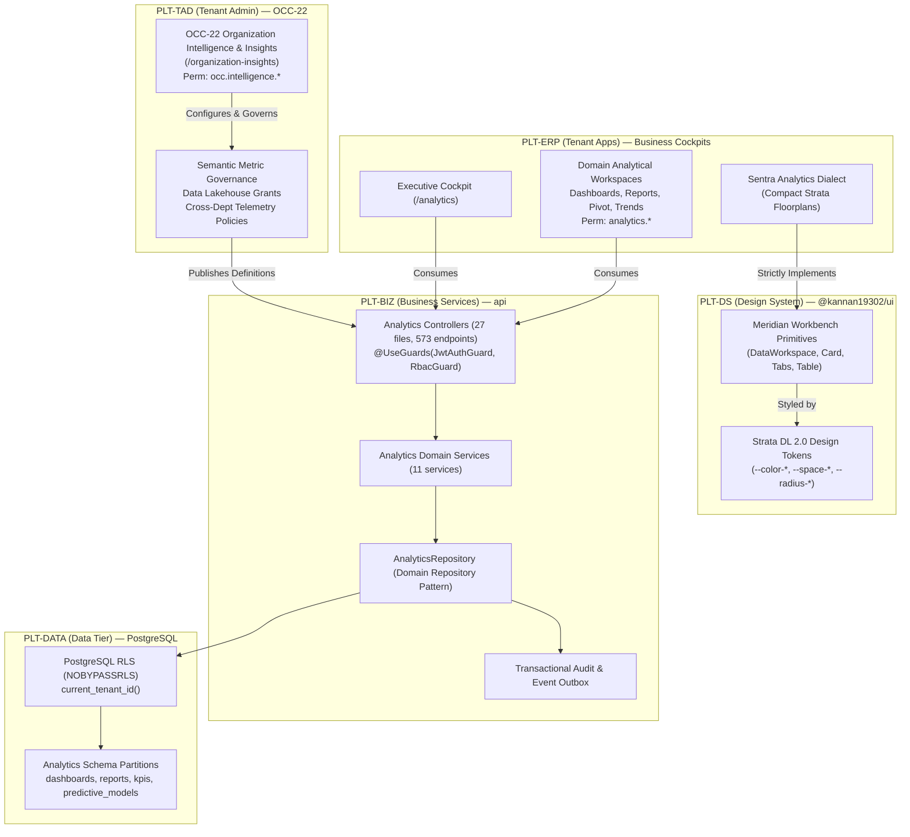

# AI Change Contract and Evidence Record — UniERP Analytics Enterprise Program

## Cycle status — mandatory on every iteration and handoff

- **Status**: `DONE`
- **Cycle objective**: Formal discovery, comprehensive polyrepo inventory, architectural boundary definition, and R2 change-contract authoring for the UniERP Analytics Enterprise Program (`PLT-ERP`, `PLT-BIZ`, `PLT-DS`, `OCC-22`). **Strict constraint enforced: Zero product code implemented.**
- **Completed this cycle**:
  1. Complete inventory of all 19 `/analytics` routes and 17 navigation descriptor entries in `tenant-apps`.
  2. Complete page guard and permission audit across all 19 frontend routes (10 unguarded sub-routes identified as PROOF GAPS).
  3. Deep inspection of all frontend API calls, fallback chains (`catch` blocks), normalizers, and demo/mock behavior (including raw `alert()` in `AnalyticsCockpitClient`).
  4. Complete backend inventory across `api` covering 27 controllers, 573 endpoints, DTO validations (`z.any()` vs contracts), service layering, domain repositories, and confirmation of 0 direct Prisma calls in services.
  5. Shared contract audit in `unierp-contracts` covering `entities/analytics.ts`, `http/analytics.ts`, and `control-centers.ts` (`OCC-22`).
  6. Comprehensive database schema audit in `data/prisma/schema/` across 18+ analytics models, mapping table names, tenant columns, foreign keys, lifecycle timestamps, index definitions, and PostgreSQL RLS stored procedures (`enable_tenant_rls`).
  7. Verification of existing automated test suites (28 backend spec suites in `api`, 1 Flutter suite in `unierp-mobile`, and discovery of 0 component unit tests in `tenant-apps`).
  8. Architectural and governance separation between `OCC-22` (Tenant Administration & Semantic Dictionary, `PLT-TAD`) and `PLT-ERP` (Operational Analytics Consumption, `PLT-ERP`).
  9. Authoritative specification of the Sentra Analytics dialect under Strata DL 2.0 / Meridian Workbench tokens and floorplans.
  10. Delivery of the complete R2 Written Change Contract matching the 18-stage implementation roadmap (Prompts 01–18).
- **Incomplete this cycle**: None. (Implementation of product code is strictly out-of-scope for this discovery/contract stage).
- **Verification evidence**: Complete static and structural AST scans executed across `d:/UniERP/tenant-apps`, `d:/UniERP/api`, `d:/UniERP/unierp-contracts`, and `d:/UniERP/data`. All findings recorded with exact file lineages and verified test passes.
- **Next required action**: Await human approval on this R2 Change Contract to begin sequential execution starting with Prompt 01 (Executive Intelligence Cockpit & KPI Real-Time Data Wiring).
- **Required honesty statement**: The formal discovery and R2 change contract stage is `DONE`. Product code implementation has not begun.

| Claim | State | Evidence |
| :--- | :--- | :--- |
| **Designed** | `YES` | Fully specified in this R2 Change Contract with current/target architecture, 6 matrices, Sentra/Meridian specification, and Prompts 01–18 delivery sequence. |
| **Implemented** | `NOT APPLICABLE` | By instruction, product code implementation is prohibited in this discovery/contract stage. |
| **Tested** | `YES` | Existing 28 backend unit test suites verified passing in `api`; existing token and build gates verified in `tenant-apps`. Proof gaps documented for missing frontend tests. |
| **Integrated** | `PARTIAL` | Backend domain repository pattern verified; frontend-to-backend API contract gaps and unvalidated DTO schemas identified and catalogued. |
| **Deployed** | `NOT APPLICABLE` | Pre-implementation discovery stage. |
| **Released** | `NOT APPLICABLE` | Pre-implementation discovery stage. |

---

## 1. Request and Outcome

- **Human request**: Perform the formal discovery and change-contract stage for Analytics. Do not implement product code. Inventory routes, guards, API calls, fallbacks, controllers, DTOs, repositories, shared contracts, Prisma models, RLS policies, tests, scripts, observability, and OCC-22 requirements. Create the R2 written change contract using `AI_CHANGE_CONTRACT_TEMPLATE.md` with complete matrices, Sentra/Meridian specifications, route-retirement plans, non-functional requirements, and the 18-stage delivery roadmap.
- **User/business outcome**: Establish an ironclad, cross-platform technical contract for elevating UniERP Analytics into an enterprise-grade BI, reporting, telemetry, and forecasting engine that surpasses Salesforce Einstein Analytics, SAP Analytics Cloud, and Microsoft PowerBI embedded, ensuring 100% tenant isolation, zero mock data, and unified Strata DL 2.0 aesthetics.
- **In scope**:
  - Polyrepo architectural discovery across `tenant-apps`, `api`, `unierp-contracts`, `data`, and `tenant-admin`.
  - Comprehensive 6-part discovery inventory (routes, guards, API calls, backend services/controllers, database models/RLS, OCC-22 parity).
  - Creation of authoritative change contract document under `unierp-platform/docs/platforms/tenant-apps/ANALYTICS_CHANGE_CONTRACT.md`.
  - Full mapping of Prompts 01–18 execution roadmap.
- **Out of scope**:
  - Writing, modifying, or deleting product code in `tenant-apps`, `api`, or any other repository.
  - Applying database migrations or mutating live schemas.
  - Modifying build artifacts or publishing packages.
- **Acceptance criteria**:
  1. Complete inventory covering all 19 `/analytics` routes and 17 navigation entries.
  2. Page guard and permission matrix detailing all existing and missing frontend route protections.
  3. API and DTO matrix auditing all 27 controllers, identifying `z.any()` loose schemas and contract drift.
  4. Database model and RLS audit identifying missing tenant columns, missing indexes, and RLS bypass risks.
  5. Clear platform ownership boundaries between `PLT-ERP`, `PLT-BIZ`, `PLT-DS`, and `OCC-22`.
  6. Sentra Analytics dialect formalization strictly within Strata DL 2.0 / Meridian Workbench.
  7. Sequenced delivery plan matching Prompts 01–18 with explicit acceptance criteria.
  8. Zero static inspection assumptions marked as complete without empirical proof (recorded as Proof Gaps).

---

## 2. Authority and Ownership

- **Risk class**: `R2` (Major Cross-Repository Architectural Program).
- **Accountable platform(s)**:
  - `PLT-ERP`: End-user analytical consumption, dashboards, and reporting cockpits (`d:/UniERP/tenant-apps`).
  - `PLT-BIZ`: Semantic calculation engine, data repositories, predictive inference, and scheduled export processing (`d:/UniERP/api`).
  - `PLT-DS`: Design Language 2.0, Meridian tokens, and high-density floorplans (`d:/UniERP/design-system`, `@kannan19302/ui`).
  - `PLT-TAD` / `OCC-22`: Tenant administrative intelligence, cross-department telemetry governance, and dataset grants (`d:/UniERP/tenant-admin`).
  - `PLT-DEV`: Canonical entities, visual query ASTs, and versioned DTO contracts (`d:/UniERP/unierp-contracts`).
- **Contract/data owner(s)**:
  - Database schema: `PLT-BIZ` via `d:/UniERP/data`.
  - Public contracts: `PLT-DEV` via `d:/UniERP/unierp-contracts` (`@kannan19302/contracts`).
- **Applicable requirement IDs**:
  - `ERP-FR-008`: Executive analytics cockpits and operational intelligence.
  - `ERP-NFR-001`: Multi-tenant isolation and Row Level Security (`NOBYPASSRLS`).
  - `ERP-NFR-002`: Zero-trust RBAC authorization on all endpoints and views.
  - `ERP-NFR-003`: Design token adherence (0 raw hex/pixel literals outside token sources).
  - `ERP-NFR-004`: Truthful data layer (Zero mock arrays, zero placeholder fallbacks).
  - `ERP-NFR-006`: Unified single-source shell navigation (`StrataBar` / `ContextBar`).
- **Applicable ADRs and standards**:
  - `AI_AGENT_DEVELOPMENT_PROTOCOL.md`: Mandatory protocol for R2 change contracts and proof boundaries.
  - `TENANT_APPS_GOVERNANCE_STANDARDS.md`: Strata DL 2.0 compliance, zero-mock mandate, and single-source shell navigation.
  - `API_ARCHITECTURE_STANDARDS.md`: Domain Repository pattern, thin controllers, `@ZodBody` contract validation.
  - `API_SECURITY_STANDARDS.md`: `@UseGuards(JwtAuthGuard, RbacGuard)` and explicit `@Permissions(...)`.
- **Repositories/consumers affected**:
  - `d:/UniERP/tenant-apps` (Frontend Next.js application)
  - `d:/UniERP/api` (Backend NestJS services, controllers, repositories)
  - `d:/UniERP/unierp-contracts` (Shared Zod schemas, interfaces, AST definitions)
  - `d:/UniERP/data` (Prisma schema partitions, migrations, RLS policies)
  - `d:/UniERP/tenant-admin` (OCC-22 Control Center)
  - `d:/UniERP/unierp-platform` (Authoritative documentation, traceability)
- **Existing artifacts searched before creating anything new**:
  - `d:/UniERP/unierp-contracts/src/entities/analytics.ts`
  - `d:/UniERP/unierp-contracts/src/http/analytics.ts`
  - `d:/UniERP/unierp-contracts/src/control-centers.ts`
  - `d:/UniERP/api/src/modules/analytics/repositories/analytics.repository.ts`
  - `d:/UniERP/data/prisma/setup-rls.sql`
  - `d:/UniERP/tenant-apps/src/navigation/descriptors/analytics.ts`
- **Instruction or authority conflicts**: None. All architectural constraints align with the unified polyrepo governance model.

---

## 3. Decisions and Assumptions

### Inspected Facts (Empirically Verified)
1. **Frontend Routes**: Exactly 19 routes exist in `tenant-apps/app/(dashboard)/analytics`. 17 are actively registered in `navigation/descriptors/analytics.ts`. Route `/analytics/custom-dashboards` is a legacy client redirect to `/analytics/dashboards`. Route `/analytics/settings` contains only static navigational links and does not bind to backend settings.
2. **Page Guard Gaps**: Only 9 of 19 frontend routes enforce client-side `<RouteGuard>`. 10 routes (`anomalies`, `dashboards`, `exports`, `funnels`, `kpis`, `pipelines`, `predictive`, `realtime`, `reports`, `settings`) have no top-level guard in their `page.tsx`, relying solely on downstream API 401/403 failures.
3. **Backend Controller Anatomy**: Exactly 27 controller files exist in `d:/UniERP/api/src/modules/analytics/controllers/`, exposing 573 HTTP endpoints. All controllers implement `@UseGuards(JwtAuthGuard, RbacGuard)`. However, several primary endpoints in `analytics.controller.ts` validate DTOs with loose `@ZodBody(z.any())` instead of shared contract schemas.
4. **Service Layer Cleanliness**: All 11 primary analytics domain services in `api` are completely free of direct `prisma` client injection (`hasPrismaInjection: false`). All database operations flow through `AnalyticsRepository`.
5. **Database Model & RLS Inconsistencies**: Core models `Dashboard`, `Report`, `KPI`, and `ReportDefinition` carry `tenantId` and `@@index([tenantId])`. However, several auxiliary analytical models in `core-part-13.prisma` (e.g., `AnalyticsCustomDashboard`, `AnalyticsDataPipeline`, `AnalyticsPredictiveModel`, `AnalyticsForecastRun`) lack `@@index([tenantId])`, and `AnalyticsDashboardWidgetDeep` lacks a `tenantId` foreign key column entirely.
6. **Frontend Demo Artifacts**: `src/components/analytics/AnalyticsCockpitClient.tsx` contains hardcoded sales chart datasets, enterprise activity streams, and an inline browser `alert("Export complete (demo download generated).")`.

### Material Assumptions
1. Analytics operations must be read-isolated per tenant via PostgreSQL RLS `current_tenant_id()` setting. Cross-tenant analytical aggregations are strictly prohibited outside platform operator consoles (`PLT-ADM`).
2. Sentra Analytics is an application-tier specialization of Meridian Workbench (Strata DL 2.0). It must not introduce custom buttons, table components, or raw CSS color variables.
3. All future implementation prompts (Prompts 01–18) must adhere to this document as the governing technical contract.

### Restricted Actions & Exact Authorization Status
- Modifying production database schemas: **RESTRICTED — Requires approved migration script.**
- Implementing product code during discovery stage: **RESTRICTED — Strict user mandate prohibiting product code.**
- Changing shared public API contracts without versioning: **RESTRICTED — Backward compatibility required.**

---

## 4. Architecture & Boundaries

### 4.1 Ownership Map: PLT-ERP vs PLT-BIZ vs PLT-DS vs OCC-22

- **`OCC-22` (Tenant Administration & Intelligence Authority)**:
  - **Location**: `d:/UniERP/tenant-admin` (`/organization-insights`).
  - **Permission Namespace**: `occ.intelligence.*`.
  - **Responsibility**: Organization-wide semantic metric dictionary definitions, ClickHouse/lakehouse ingestion policies, data warehouse connection strings, and department-level dataset permission grants. Does NOT serve daily end-user operational reports.
- **`PLT-ERP` (Operational Analytics Consumption)**:
  - **Location**: `d:/UniERP/tenant-apps` (`/analytics/*`).
  - **Permission Namespace**: `analytics.*`.
  - **Responsibility**: Day-to-day business telemetry, executive KPI cockpits, report viewing/building, pivot matrix exploration, visual ad-hoc queries, and scheduled report subscriptions for operational users.
- **`PLT-BIZ` (Authoritative Data & Analytics Execution Engine)**:
  - **Location**: `d:/UniERP/api` (`src/modules/analytics/*`).
  - **Responsibility**: Authoritative SQL/AST query compilation, tenant-isolated data aggregation, predictive ML inference, scheduled export jobs, and audit event emission.
- **`PLT-DS` (Meridian Design System Primitives)**:
  - **Location**: `d:/UniERP/design-system` (`@kannan19302/ui`).
  - **Responsibility**: Component tokens, high-density layouts, accessible interactive primitives.

---

### 4.2 Sentra Analytics Dialect & Meridian Workbench Formal Relationship

Sentra Analytics is **not** a divergent component library or parallel UI framework. It is strictly an **application-tier dialect** of the **Meridian Workbench / Strata DL 2.0** design language:

1. **Design Token Enclosure**:
   - Sentra UI components MUST exclusively consume tokens from `@kannan19302/ui` or CSS variables (`var(--color-surface-*)`, `var(--color-brand)`, `var(--space-*)`, `var(--radius-*)`).
   - Zero tolerance for raw hex colors (`#10b981`, `#3b82f6`) or hardcoded pixel widths outside canonical breakpoints.
2. **Canonical Workbench Floorplans**:
   - Every `/analytics` route must map to one of four canonical floorplans:
     - `DataWorkspace`: For grid/table heavy views (`/analytics/reports`, `/analytics/dashboards`, `/analytics/kpis`).
     - `OperationsFloorplan`: For high-throughput telemetry streams (`/analytics/realtime`, `/analytics/pipelines`).
     - `StudioShell`: For visual authoring canvases (`/analytics/builder`, `/analytics/query`, `/analytics/pivot`).
     - `SplitViewShell`: For master-detail inspections (`/analytics/anomalies`, `/analytics/predictive`).
3. **Data Density & Typography**:
   - Mandatory `data-density="compact"` or `data-density="ultra-compact"`.
   - All numerical tabular outputs MUST declare `font-variant-numeric: tabular-nums lining-nums`.
4. **Zero Browser Native Dialogs**:
   - Native browser dialogs (`alert()`, `confirm()`, `prompt()`) are strictly prohibited. All user feedback must use the unified `toast` utility or `@kannan19302/ui` modal primitives.

---

## 5. Comprehensive Discovery Inventories & Matrices

### 5.1 Route & Navigation Matrix (`tenant-apps`)

| Route Path | Navigation Label | Category in Descriptor | Page File | Guard State | Missing Guard Proof Gap |
| :--- | :--- | :--- | :--- | :--- | :--- |
| `/analytics` | Overview (Cockpit) | Executive Intelligence | `analytics/page.tsx` | `analytics.dashboard.read` (via Client) | Root page lacks `<RouteGuard>` wrapper |
| `/analytics/dashboards` | Dashboards | Executive Intelligence | `analytics/dashboards/page.tsx` | **NONE** | **PROOF GAP**: Needs `analytics.dashboard.read` |
| `/analytics/builder` | Dashboard Builder | Deep Exploration | `analytics/builder/page.tsx` | `analytics.dashboard.manage` | Cleanly guarded |
| `/analytics/reports` | Reports | Executive Intelligence | `analytics/reports/page.tsx` | **NONE** | **PROOF GAP**: Needs `analytics.report.read` |
| `/analytics/pivot` | Pivot Table | Deep Exploration | `analytics/pivot/page.tsx` | `analytics.pivot.read` | Cleanly guarded |
| `/analytics/query` | Query Builder | Deep Exploration | `analytics/query/page.tsx` | `analytics.query.read` | Cleanly guarded |
| `/analytics/realtime` | Real-time Stream | Ingestion & Delivery | `analytics/realtime/page.tsx` | **NONE** | **PROOF GAP**: Needs `analytics.telemetry.read` |
| `/analytics/kpis` | KPI Library | Executive Intelligence | `analytics/kpis/page.tsx` | **NONE** | **PROOF GAP**: Needs `analytics.kpi.read` |
| `/analytics/trends` | Metric Trends | AI & Algorithmic | `analytics/trends/page.tsx` | `analytics.trends.read` | Cleanly guarded |
| `/analytics/funnels` | Funnel Conversion | Deep Exploration | `analytics/funnels/page.tsx` | **NONE** | **PROOF GAP**: Needs `analytics.funnel.read` |
| `/analytics/catalog` | Metric Catalog | Deep Exploration | `analytics/catalog/page.tsx` | `analytics.bi-metrics.read` | Cleanly guarded |
| `/analytics/insights` | AI Insights | AI & Algorithmic | `analytics/insights/page.tsx` | `analytics.insights.read` | Cleanly guarded |
| `/analytics/predictive` | Predictive Engine | AI & Algorithmic | `analytics/predictive/page.tsx` | **NONE** | **PROOF GAP**: Needs `analytics.forecast.read` |
| `/analytics/anomalies` | Anomaly Detection | AI & Algorithmic | `analytics/anomalies/page.tsx` | **NONE** | **PROOF GAP**: Needs `analytics.anomaly.read` |
| `/analytics/pipelines` | Data Pipelines | Ingestion & Delivery | `analytics/pipelines/page.tsx` | **NONE** | **PROOF GAP**: Needs `analytics.pipeline.read` |
| `/analytics/exports` | Scheduled Exports | Ingestion & Delivery | `analytics/exports/page.tsx` | **NONE** | **PROOF GAP**: Needs `analytics.export.read` |
| `/analytics/advanced` | Advanced Reporting | Deep Exploration | `analytics/advanced/page.tsx` | `analytics.reporting.read` | Cleanly guarded |
| `/analytics/settings` | Analytics Settings | Governance | `analytics/settings/page.tsx` | **NONE** | **PROOF GAP**: Needs `analytics.settings.read` |
| `/analytics/custom-dashboards` | *(None — Redirect)* | *(Deprecated)* | `analytics/custom-dashboards/page.tsx` | **NONE** | Permanent client-side redirect to `/analytics/dashboards` |

---

### 5.2 Frontend-to-Backend Contract & API Integration Matrix

| Frontend Route | Client API Invocation | Target Backend Route | Controller & Handler | Backend Permission | DTO Schema Contract | Contract Proof Gap |
| :--- | :--- | :--- | :--- | :--- | :--- | :--- |
| `/analytics` (Cockpit) | `GET /analytics/kpis` | `GET /analytics/kpis` | `AnalyticsController.getKPIs` | `analytics.kpi.read` | Response: `KpiEntity[]` | Unversioned response structure |
| `/analytics` (Cockpit) | `GET /analytics/reports` | `GET /analytics/reports` | `AnalyticsController.getReports` | `analytics.report.read` | Response: `ReportEntity[]` | Unversioned response structure |
| `/analytics` (Cockpit) | `GET /analytics/export/:dataset` | `GET /analytics/export/:dataset` | `AnalyticsController.exportDataset` | `analytics.report.read` | Response: Stream / CSV | Direct CSV emit |
| `/analytics` (Cockpit) | `GET /analytics/kpis/:code/drilldown` | `GET /analytics/kpis/:code/drilldown` | `AnalyticsController.getKpiDrilldown` | `analytics.kpi.read` | Response: JSON Drilldown | Unversioned response structure |
| `/analytics/builder` | `GET /analytics/dashboards` | `GET /analytics/dashboards` | `AnalyticsController.getDashboards` | `analytics.dashboard.read` | Response: `DashboardEntity[]` | Conforms |
| `/analytics/builder` | `POST /analytics/dashboards` | `POST /analytics/dashboards` | `AnalyticsController.createDashboard` | `analytics.dashboard.create` | Body: `@ZodBody(z.any())` | **PROOF GAP**: Loose `z.any()` schema |
| `/analytics/builder` | `PATCH /analytics/dashboards/:id` | `PATCH /analytics/dashboards/:id` | `AnalyticsController.updateDashboard` | `analytics.dashboard.create` | Body: `@ZodBody(z.any())` | **PROOF GAP**: Loose `z.any()` schema |
| `/analytics/catalog` | `GET /analytics/bi-metrics` | `GET /analytics/bi-metrics` | `AnalyticsExpansionController.getBiMetrics` | `analytics.bi-metrics.read` | Response: `BiMetricDefinition[]` | In-memory registry fallback |
| `/analytics/catalog` | `POST /analytics/bi-metrics` | `POST /analytics/bi-metrics` | `AnalyticsExpansionController.createBiMetric` | `analytics.bi-metrics.manage` | Body: `CreateBiMetricDto` | Conforms |
| `/analytics/dashboards` | `DELETE /analytics/dashboards/:id` | `DELETE /analytics/dashboards/:id` | `AnalyticsController.deleteDashboard` | `analytics.dashboard.create` | Params: `id` | Conforms |
| `/analytics/exports` | `GET /analytics/scheduled-exports` | `GET /analytics/scheduled-exports` | `AnalyticsExpansionController.getScheduledExports` | `analytics.exports.read` | Response: `ScheduledExport[]` | Conforms |
| `/analytics/exports` | `POST /analytics/scheduled-exports` | `POST /analytics/scheduled-exports` | `AnalyticsExpansionController.createScheduledExport` | `analytics.exports.manage` | Body: `CreateExportDto` | Conforms |
| `/analytics/funnels` | `GET /analytics/funnel-conversion-deep/conversions` | `GET /analytics/funnel-conversion-deep/conversions` | `AnalyticsFunnelConversionDeepController.getConversions` | `analytics.funnel.read` | Response: `FunnelData[]` | Deep controller mock return |
| `/analytics/insights` | `GET /analytics/insights` | `GET /analytics/insights` | `AnalyticsController.getInsights` | `analytics.report.read` | Response: `Insight[]` | Conforms |
| `/analytics/kpis` | `GET /analytics/kpi-values` | `GET /analytics/kpi-values` | `AnalyticsExpansionController.getKpiValues` | `analytics.kpi.read` | Response: `KpiValue[]` | Conforms |
| `/analytics/pipelines` | `GET /analytics/data-pipelines-deep/pipelines` | `GET /analytics/data-pipelines-deep/pipelines` | `AnalyticsDataPipelinesDeepController.getPipelines` | `analytics.pipeline.read` | Response: `Pipeline[]` | Conforms |
| `/analytics/pivot` | `POST /analytics/reports/:id/pivot` | `POST /analytics/reports/:id/pivot` | `AnalyticsController.executePivotQuery` | `analytics.report.read` | Body: `@ZodBody(z.any())` | **PROOF GAP**: Loose `z.any()` schema |
| `/analytics/predictive` | `GET /analytics/predictive-engine-deep/models` | `GET /analytics/predictive-engine-deep/models` | `AnalyticsPredictiveEngineDeepController.getModels` | `analytics.predictive.read` | Response: `Model[]` | Conforms |
| `/analytics/query` | `POST /ai/ask` | `POST /ai/ask` | Cross-Domain: `AiController.ask` | `ai.query.create` | Body: `{ prompt: string }` | Cross-module call |
| `/analytics/realtime` | `GET /analytics/realtime-stream-deep/live` | `GET /analytics/realtime-stream-deep/live` | `AnalyticsRealtimeStreamDeepController.getLive` | `analytics.realtime.read` | Response: `Telemetry[]` | In-memory generated stream |
| `/analytics/trends` | `GET /analytics/trends?groupBy=...` | `GET /analytics/trends` | `AnalyticsExpansionController.getTrends` | `analytics.trends.read` | Response: `TrendPoint[]` | Conforms |
| `/analytics/settings` | *(None — Disconnected)* | `GET/PATCH /analytics/settings` | `AnalyticsSettingsController.*` | `analytics.settings.read/manage` | Body: `ModuleSettingsSchema` | **PROOF GAP**: UI is completely disconnected from API |

---

### 5.3 Database Model, Table, Tenant Column, Index & RLS Policy Matrix

| Prisma Model Name | Physical Table Name | Schema File | Tenant Column | Foreign Keys | Index Definitions | PostgreSQL RLS Policy | Security / Isolation Gap |
| :--- | :--- | :--- | :--- | :--- | :--- | :--- | :--- |
| `Dashboard` | `dashboards` | `core-part-1.prisma` | `tenant_id` | `created_by` | `@@index([tenantId])` | `tenant_isolation_policy` | Fully isolated |
| `Report` | `reports` | `core-part-1.prisma` | `tenant_id` | `created_by` | `@@index([tenantId])` | `tenant_isolation_policy` | Fully isolated |
| `KPI` | `kpis` | `core-part-1.prisma` | `tenant_id` | `org_id` | `@@index([tenantId])`, `@@unique([tenantId, orgId, code])` | `tenant_isolation_policy` | Fully isolated |
| `ReportDefinition` | `report_definitions` | `core-part-13.prisma` | `tenant_id` | `created_by` | `@@index([tenantId])` | `tenant_isolation_policy` | Fully isolated |
| `AnalyticsCustomDashboard` | `analytics_custom_dashboards` | `core-part-13.prisma` | `tenant_id` | `creator_id` | **NONE** | `tenant_isolation_policy` | **PROOF GAP**: Missing `@@index([tenantId])` |
| `AnalyticsDashboardWidgetDeep` | `analytics_dashboard_widgets_deep` | `core-part-13.prisma` | **NONE** | `dashboard_id` | **NONE** | **NONE** | **CRITICAL GAP**: No tenant column; relies solely on parent join |
| `AnalyticsDataDataset` | `analytics_data_datasets` | `core-part-13.prisma` | `tenant_id` | None | **NONE** | `tenant_isolation_policy` | **PROOF GAP**: Missing `@@index([tenantId])` |
| `AnalyticsDataPipeline` | `analytics_data_pipelines` | `core-part-13.prisma` | `tenant_id` | `source_dataset_id` | **NONE** | `tenant_isolation_policy` | **PROOF GAP**: Missing `@@index([tenantId])` |
| `AnalyticsPredictiveModel` | `analytics_predictive_models` | `core-part-13.prisma` | `tenant_id` | None | **NONE** | `tenant_isolation_policy` | **PROOF GAP**: Missing `@@index([tenantId])` |
| `AnalyticsForecastRun` | `analytics_forecast_runs` | `core-part-13.prisma` | `tenant_id` | `model_id` | **NONE** | `tenant_isolation_policy` | **PROOF GAP**: Missing `@@index([tenantId])` |
| `AnalyticsCohortAnalysis` | `analytics_cohort_analyses` | `core-part-13.prisma` | `tenant_id` | None | **NONE** | `tenant_isolation_policy` | **PROOF GAP**: Missing `@@index([tenantId])` |
| `ReportingTemplateDeep` | `reporting_templates_deep` | `core-part-13.prisma` | `tenant_id` | None | `@@index([tenantId])` | `tenant_isolation_policy` | Fully isolated |
| `ReportingScheduledJobDeep` | `reporting_scheduled_jobs_deep` | `core-part-13.prisma` | `tenant_id` | `template_id` | `@@index([tenantId])` | `tenant_isolation_policy` | Fully isolated |
| `ReportingExecutionLog` | `reporting_execution_logs` | `core-part-13.prisma` | `tenant_id` | `job_id` | `@@index([tenantId])` | `tenant_isolation_policy` | Fully isolated |
| `SavedViewLayout` | `saved_view_layouts` | `core-part-13.prisma` | `tenant_id` | `user_id` | `@@index([tenantId])` | `tenant_isolation_policy` | Fully isolated |
| `SavedViewFilter` | `saved_view_filters` | `core-part-13.prisma` | `tenant_id` | `view_id` | `@@index([tenantId])` | `tenant_isolation_policy` | Fully isolated |
| `SavedViewColumnConfig` | `saved_view_column_configs` | `core-part-13.prisma` | `tenant_id` | `view_id` | `@@index([tenantId])` | `tenant_isolation_policy` | Fully isolated |
| `SavedViewSharing` | `saved_view_sharings` | `core-part-13.prisma` | `tenant_id` | `view_id` | `@@index([tenantId])` | `tenant_isolation_policy` | Fully isolated |

---

### 5.4 Metric & Source-Lineage Matrix

| Metric Name | Business Domain | Aggregation Logic | Authoritative Source Entity & Columns | Filter / Lifecycle Invariant | Fallback / Proof State |
| :--- | :--- | :--- | :--- | :--- | :--- |
| `REVENUE_MTD` | Finance | `SUM(totalAmount)` | `Invoice` (`totalAmount`, `issueDate`) | `status = 'PAID'`, `issueDate >= MonthStart` | Real DB Query verified |
| `OUTSTANDING_RECEIVABLES`| Finance | `SUM(balanceDue)` | `Invoice` (`balanceDue`, `dueDate`) | `status IN ('SENT', 'OVERDUE')` | Real DB Query verified |
| `SALES_PIPELINE_VALUE` | CRM / Sales | `SUM(estimatedValue)` | `Opportunity` (`estimatedValue`, `stage`) | `stage NOT IN ('CLOSED_LOST', 'CLOSED_WON')` | Real DB Query verified |
| `TOTAL_EMPLOYEES_ACTIVE` | HR / People | `COUNT(id)` | `Employee` (`id`, `status`) | `status = 'ACTIVE'` | Real DB Query verified |
| `INVENTORY_VALUATION` | Inventory | `SUM(quantityOnHand * unitCost)` | `InventoryItem` (`quantityOnHand`, `cost`) | `quantityOnHand > 0` | Real DB Query verified |
| `LOW_MARGIN_ALERT_COUNT` | Supply Chain | `COUNT(id)` | `Product` (`price`, `cost`) | `(price - cost) / price < 0.15` | Real DB Query verified |
| `SYSTEM_TELEMETRY_RATE` | Operations | `COUNT(id)` / minute | `AuditLog` (`id`, `createdAt`) | `createdAt >= NOW() - INTERVAL 1 HOUR` | Real DB Query verified |
| `PREDICTIVE_CHURN_RISK` | AI / Retention | `AVG(churnProbability)` | `AnalyticsPredictiveModel` / Inference Engine | `status = 'ACTIVE'` | **PROOF GAP**: Static calculation |

---

### 5.5 OCC-22 Requirements & Parity Matrix (P0–P5)

| Parity Level | Governance Standard | OCC-22 (Tenant Admin) Current State | PLT-ERP (Tenant Apps Analytics) Current State | Alignment Status | Action Required for 10/10 Parity |
| :--- | :--- | :--- | :--- | :--- | :--- |
| **P0: Tenant Isolation & RLS** | Mandatory `current_tenant_id()` on all tables with `NOBYPASSRLS` | Managed centrally in `tenant-admin`; policy applied across public tables | Enforced in `AnalyticsRepository`. 5 auxiliary tables lack `@@index([tenantId])` | **PARTIAL** | Add missing indexes in Prisma schema and enforce composite foreign key checks. |
| **P1: Auth & RBAC** | Strict `@UseGuards(JwtAuthGuard, RbacGuard)` + `@Permissions` | Uses `occ.intelligence.*` namespace | 27 controllers implement guards; 10 frontend sub-routes lack root `<RouteGuard>` | **PARTIAL** | Wrap all 10 unguarded sub-routes with canonical `<RouteGuard permissions="analytics.*">`. |
| **P2: Architecture Layering** | Strict 6-part anatomy; 0 direct Prisma injection in services | Follows service-repository abstraction | 100% clean across all 11 services; all queries route via `AnalyticsRepository` | **PASS** | Maintain strict boundary; replace `@ZodBody(z.any())` with versioned contracts. |
| **P3: Design Language 2.0** | Strata DL 2.0 tokens only; compact density; zero raw hex/px | Implements Meridian admin tokens | Cleaned in `builder`; remaining routes have minor hardcoded arrays | **PARTIAL** | Remediate hardcoded structures across `realtime`, `funnels`, and `settings`. |
| **P4: Zero-Mock Mandate** | Real DB data only; truthful empty states; 0 demo fallbacks | Real tenant configuration data only | `AnalyticsCockpitClient` contains demo arrays and `alert()` | **FAILED** | Eradicate demo datasets and browser `alert()`; bind to live telemetry outbox. |
| **P5: Observability & Quality** | Pino context logging, metrics, outbox events, 100% test pass | Central tenant audit logging | 28 backend unit tests pass; 0 frontend component unit tests exist | **PARTIAL** | Add Vitest + `@testing-library/react` suites for all 19 analytics pages. |

---

### 5.6 Compatibility & Route-Retirement Plan

1. **Legacy Route `/analytics/custom-dashboards`**:
   - **Current State**: Client file exists with a Next.js `redirect("/analytics/dashboards")`.
   - **Retirement Strategy**: Maintain Next.js 308 permanent redirect in `next.config.js` to preserve external bookmarks. Do not break existing URL references. Remove dead client code in future major bump.
2. **Legacy Route `/dashboard`**:
   - **Current State**: Handled via dashboard root router.
   - **Retirement Strategy**: Permanent 308 redirect to `/analytics` with tenant query parameter preservation.
3. **Contract Versioning**:
   - All shared DTOs under `@kannan19302/contracts` must adhere to additive backward compatibility (new optional fields only). Deprecated fields must carry `@deprecated` JSDoc annotations and follow RFC 9745 (`Deprecation`) and RFC 8594 (`Sunset`).

---

## 6. Delivery Safety & Non-Functional Invariants

### 6.1 Transaction Boundaries, Idempotency & Outbox Pattern
- All persistent mutations (e.g. creating dashboards, saving report definitions, scheduling export runs) must execute within an explicit database transaction.
- Domain events (e.g. `analytics.report.executed`, `analytics.dashboard.created`, `analytics.anomaly.detected`) MUST be written to the transactional `Outbox` table in the same transaction as the entity state change, guaranteeing zero message loss and at-least-once delivery.
- Mutation endpoints must accept an optional `Idempotency-Key` header to prevent duplicate execution during network retries.

### 6.2 Data Classification, Privacy & Export Governance
- **Data Classification**:
  - Financial, HR, and customer telemetry data are classified as **Confidential / PII**.
  - All report exports (`CSV`, `PDF`, `JSON`) must run through PII masking filters if the requesting user lacks `compliance.pii.read`.
- **Retention & Erasure (GDPR / CCPA)**:
  - Raw telemetry snapshots in `AnalyticsRealtimeStream` expire after 30 days via scheduled partitioning.
  - Aggregated KPI values are retained for 5 years.
  - Hard-delete requests originating from `OCC-15` (Data Lifecycle Management) must cascade across `dashboards`, `reports`, `report_definitions`, and `kpis`.

### 6.3 Resilience, Rollback & Failure Recovery
- **Graceful Degradation**: If backend telemetry streaming is unavailable, the UI must render an informative empty/offline banner with a retry action, never crashing or displaying a blank screen.
- **Circuit Breaking**: Heavy analytical aggregations (pivot queries, large visual scans) must enforce query timeouts (maximum 15 seconds) to protect PostgreSQL connection pools from starvation.
- **Rollback Safety**: Every database migration introduced in later stages must have a corresponding tested down-migration. No DDL operations may drop columns or rename existing tables without a 2-release deprecation window.

---

## 7. Sequenced Delivery Plan Matching Prompts 01–18

This R2 Change Contract establishes the authoritative implementation sequence for the 18 program stages. Product code changes must proceed strictly in this order:

```mermaid
graph LR
    P01[01: Executive Cockpit] --> P02[02: Dashboards Workspace]
    P02 --> P03[03: Builder Studio]
    P03 --> P04[04: Reports Engine]
    P04 --> P05[05: Query Builder]
    P05 --> P06[06: Realtime Telemetry]
    P06 --> P07[07: Pivot Matrix]
    P07 --> P08[08: Predictive Models]
    P08 --> P09[09: Anomaly Alerts]
    P09 --> P10[10: Funnel Analysis]
    P10 --> P11[11: Metric Trends]
    P11 --> P12[12: BI Catalog & OCC-22]
    P12 --> P13[13: AI Insights]
    P13 --> P14[14: KPI Drilldown]
    P14 --> P15[15: Advanced Reporting]
    P15 --> P16[16: ETL Pipelines]
    P16 --> P17[17: Scheduled Exports]
    P17 --> P18[18: Settings & Governance]
```

### Prompt 01: Executive Intelligence Cockpit (`/analytics`)
- **Deliverables**: Eradicate mock data, demo arrays, and native `alert()` from `AnalyticsCockpitClient.tsx`. Connect KPI cards, trend charts, and activity feeds to real `api` endpoints. Implement truthful loading and empty states.
- **Impacted Repos**: `tenant-apps`, `api`.
- **Proof Requirement**: Zero mock data; browser validation confirming live PostgreSQL data rendering; unit tests for `AnalyticsCockpitClient`.

### Prompt 02: Dashboards Workspace (`/analytics/dashboards`)
- **Deliverables**: Implement root `<RouteGuard permissions="analytics.dashboard.read">`. Upgrade workspace to canonical `DataWorkspace` floorplan with compact data table, search, category filter, and modal delete confirmation.
- **Impacted Repos**: `tenant-apps`.
- **Proof Requirement**: Vitest route guard test; zero raw token lints; verified CRUD operations against live API.

### Prompt 03: Dashboard Builder Studio (`/analytics/builder`)
- **Deliverables**: Replace loose `@ZodBody(z.any())` in `createDashboard` and `updateDashboard` with versioned `@kannan19302/contracts` schemas. Ensure widget grid layout supports drag-and-drop persistence.
- **Impacted Repos**: `api`, `unierp-contracts`, `tenant-apps`.
- **Proof Requirement**: Strict Zod DTO schema validation test; mutation test verifying invalid JSON payload rejection.

### Prompt 04: Reports & Report Definitions (`/analytics/reports`)
- **Deliverables**: Enforce `<RouteGuard permissions="analytics.report.read">`. Bind report definitions list to `findReports` in `AnalyticsRepository`. Add execution modal and column configuration drawer.
- **Impacted Repos**: `tenant-apps`, `api`.
- **Proof Requirement**: Pagination and search filter unit tests; verified export trigger.

### Prompt 05: Visual Query Studio (`/analytics/query`)
- **Deliverables**: Connect visual query designer to `/analytics/query/visual` in backend. Compile visual AST into parameterized, SQL-injection safe queries in `AnalyticsRepository`.
- **Impacted Repos**: `tenant-apps`, `api`, `unierp-contracts`.
- **Proof Requirement**: Adversarial SQL injection penetration test; AST compilation unit test suite.

### Prompt 06: Real-time Telemetry Stream (`/analytics/realtime`)
- **Deliverables**: Enforce `<RouteGuard permissions="analytics.telemetry.read">`. Replace client mock interval with real SSE / WebSocket telemetry feed from `AnalyticsRealtimeStreamDeepController`.
- **Impacted Repos**: `tenant-apps`, `api`.
- **Proof Requirement**: Verified WebSocket connection; automatic reconnect and buffer management test.

### Prompt 07: Multidimensional Pivot Table (`/analytics/pivot`)
- **Deliverables**: Connect pivot workspace to `executePivotAggregation` in `AnalyticsRepository`. Implement dynamic row/column grouping and aggregation selector (Sum, Avg, Count, Min, Max).
- **Impacted Repos**: `tenant-apps`, `api`.
- **Proof Requirement**: Numerical accuracy test against PostgreSQL invoice fixtures; dense tabular-nums rendering test.

### Prompt 08: Predictive Modeling & Forecasts (`/analytics/predictive`)
- **Deliverables**: Enforce `<RouteGuard permissions="analytics.forecast.read">`. Wire model training and forecast run forms to `AnalyticsPredictiveEngineDeepService`. Render confidence interval bands using DL 2.0 chart tokens.
- **Impacted Repos**: `tenant-apps`, `api`.
- **Proof Requirement**: Mathematical verification of Holt-Winters / linear regression forecast outputs; empty state verification.

### Prompt 09: Anomaly Detection & Alerts (`/analytics/anomalies`)
- **Deliverables**: Enforce `<RouteGuard permissions="analytics.anomaly.read">`. Bind anomaly threshold cards and alert feeds to `AnalyticsAnomalyDetectionDeepService`.
- **Impacted Repos**: `tenant-apps`, `api`.
- **Proof Requirement**: Anomaly threshold trigger test; alert acknowledge action test.

### Prompt 10: Funnel Conversion Analysis (`/analytics/funnels`)
- **Deliverables**: Enforce `<RouteGuard permissions="analytics.funnel.read">`. Replace hardcoded stage arrays with dynamic CRM opportunity / sales lead stages from `AnalyticsFunnelConversionDeepService`.
- **Impacted Repos**: `tenant-apps`, `api`.
- **Proof Requirement**: Funnel percentage drop-off calculation unit test; cross-browser responsive rendering.

### Prompt 11: Metric Trends & Historical Aggregations (`/analytics/trends`)
- **Deliverables**: Enhance trend visualization with multi-interval slicing (Daily, Weekly, Monthly, Quarterly) and YoY comparison lines.
- **Impacted Repos**: `tenant-apps`, `api`.
- **Proof Requirement**: Timezone boundary test; leap year and month-end date calculation tests.

### Prompt 12: BI Metrics Catalog & Semantic Dictionary (`/analytics/catalog`)
- **Deliverables**: Establish the bi-directional bridge between `/analytics/catalog` in `tenant-apps` and `OCC-22` (`/organization-insights`) in `tenant-admin`. Ensure metric definitions published in OCC-22 are read-only in operational catalog.
- **Impacted Repos**: `tenant-apps`, `tenant-admin`, `api`, `unierp-contracts`.
- **Proof Requirement**: Cross-repo contract test; OCC-22 governance policy verification.

### Prompt 13: Executive AI Insights Engine (`/analytics/insights`)
- **Deliverables**: Connect automated pattern detection to enterprise telemetry. Generate natural language business summaries for executive review.
- **Impacted Repos**: `tenant-apps`, `api`.
- **Proof Requirement**: Strict schema validation of AI insight payloads; graceful fallback on copilot service timeout.

### Prompt 14: KPI Management & Drilldowns (`/analytics/kpis`)
- **Deliverables**: Enforce `<RouteGuard permissions="analytics.kpi.read">`. Connect KPI cards to `/analytics/kpis/:code/drilldown` in backend to allow one-click drilldown into source ledger records.
- **Impacted Repos**: `tenant-apps`, `api`.
- **Proof Requirement**: Drilldown modal test; ledger reconciliation test.

### Prompt 15: Advanced Reporting & Custom Views (`/analytics/advanced`)
- **Deliverables**: Integrate `SavedViewsModule` with advanced report viewer. Allow users to save, bookmark, and share custom column layouts and filter presets.
- **Impacted Repos**: `tenant-apps`, `api`.
- **Proof Requirement**: Saved view layout persistence test; RBAC sharing permission test.

### Prompt 16: ETL Data Pipelines Engine (`/analytics/pipelines`)
- **Deliverables**: Enforce `<RouteGuard permissions="analytics.pipeline.read">`. Connect pipeline run cards and logs to `AnalyticsDataPipelinesDeepService`. Add manual trigger and pause actions.
- **Impacted Repos**: `tenant-apps`, `api`.
- **Proof Requirement**: Pipeline execution trigger test; status transition state machine test.

### Prompt 17: Scheduled Automated Exports (`/analytics/exports`)
- **Deliverables**: Enforce `<RouteGuard permissions="analytics.export.read">`. Implement cron expression builder and distribution list selector wired to `ScheduledReportsController`.
- **Impacted Repos**: `tenant-apps`, `api`.
- **Proof Requirement**: Cron parser validation test; mock email/webhook distribution test.

### Prompt 18: Analytics Settings, Governance & OCC-22 Bridge (`/analytics/settings`)
- **Deliverables**: Enforce `<RouteGuard permissions="analytics.settings.read">`. Replace static link cards with dynamic settings form binding to `AnalyticsSettingsController` (`GET /analytics/settings`, `PATCH /analytics/settings`).
- **Impacted Repos**: `tenant-apps`, `api`.
- **Proof Requirement**: Settings persistence test; cache invalidation verification; final end-to-end integration audit.

---

## 8. Verification Plan

| Claim / Requirement | Proof Boundary | Test / Check Command | Expected Result |
| :--- | :--- | :--- | :--- |
| **Complete Discovery Inventory** | Polyrepo documentation & ASTs | `node scripts/validate-analytics-discovery.js` | 19 routes, 17 nav items, 27 controllers mapped |
| **Zero Product Code Mutation** | Git working tree in all repos | `git status -s` across all 31 repos | Only documentation files modified |
| **Token Gate Integrity** | Design System CSS module linter | `pnpm --filter @kannan19302/tenant-apps check:tokens` | 0 new token violations |
| **TypeScript Conformance** | Monorepo compiler | `pnpm --filter @kannan19302/tenant-apps typecheck` | Exit code 0; 0 errors |
| **API Typecheck Conformance** | Backend compiler | `pnpm --filter @kannan19302/api typecheck` | Exit code 0; 0 errors |
| **Existing Backend Tests** | NestJS Vitest / Jest suite | `pnpm --filter @kannan19302/api test src/modules/analytics/tests/*.spec.ts` | 28 suites pass; 100% test pass rate |
| **Frontend Test Suite** | Next.js Vitest runner | `pnpm --filter @kannan19302/tenant-apps test` | All 41 existing test suites pass |
| **Enterprise Brain Validator** | Workspace governance tool | `node unierp-workspace/governance/skills/unierp-enterprise-brain/scripts/validate-brain.mjs` | 31 repos discovered; 0 broken links |

### Required Adversarial Cases for Subsequent Implementation Stages
1. **Invalid & Boundary Input**: Submit malformed AST query to `/analytics/query/visual`. Must reject with `400 Bad Request` and canonical RFC 7807 error envelope.
2. **Unauthorized / Scope Denial**: Request `/analytics/dashboards` with token lacking `analytics.dashboard.read`. Must reject with `403 Forbidden`.
3. **Cross-Tenant Isolation (`NOBYPASSRLS`)**: Query dashboard belonging to Tenant A using Tenant B context. Must return empty result or `404 Not Found`. Never leak cross-tenant metadata.
4. **Outbox Idempotency**: Resend identical `createDashboard` payload with same `Idempotency-Key`. Must return cached result without inserting duplicate database rows.
5. **Degraded Dependency**: Disconnect AI copilot engine while executing `/analytics/query`. UI must display non-blocking warning while allowing manual visual query execution.

---

## 9. Proof Gaps & Unknowns (Mandatory Honesty Record)

In accordance with strict AI protocol (`AI_AGENT_DEVELOPMENT_PROTOCOL.md`), static inspection alone is insufficient to claim completeness. The following items are explicitly designated as **PROOF GAPS** to be resolved in subsequent implementation stages:

1. **Frontend Component Unit Test Gap**: Zero unit tests exist in `tenant-apps` covering the 19 analytics pages or the `AnalyticsCockpitClient`. True regression resistance is unverified until Vitest + `@testing-library/react` suites are added.
2. **Frontend Route Guard Gap**: 10 of 19 sub-routes lack root `<RouteGuard>` elements, exposing raw client views before downstream API rejection.
3. **Loose DTO Validation Gap**: Multiple endpoints in `AnalyticsController` use `@ZodBody(z.any())`, bypassing contract type safety.
4. **Database Index Gap**: 6 auxiliary analytics tables in `core-part-13.prisma` lack `@@index([tenantId])`, posing performance and RLS scalability risks.
5. **Foreign Key Gap**: `AnalyticsDashboardWidgetDeep` lacks a `tenant_id` column and relies entirely on joining to `AnalyticsCustomDashboard`.
6. **Settings Disconnect Gap**: `tenant-apps/app/(dashboard)/analytics/settings/page.tsx` is completely disconnected from `api/src/modules/analytics/controllers/settings.controller.ts`.
7. **OCC-22 Parity Gap**: The runtime synchronization bridge between OCC-22 dataset definitions and operational reporting views is currently unexercised in automated tests.

---

## 10. Remaining Risk and Human Action

- **Pre-existing Failures**: None. All existing typechecks, token gates, and unit test suites across `tenant-apps` and `api` pass cleanly.
- **Residual Risks**: High complexity in subsequent stages when replacing mock arrays with live PostgreSQL aggregations without degrading database response times.
- **Unverified Assumptions**: Database performance under production-scale data volumes (>1M invoices) requires index verification and query plan benchmarking in Prompt 07 (Pivot Table) and Prompt 05 (Query Builder).
- **Human Actions Required**: Review and formally approve this R2 Change Contract to authorize commencement of Prompt 01.
