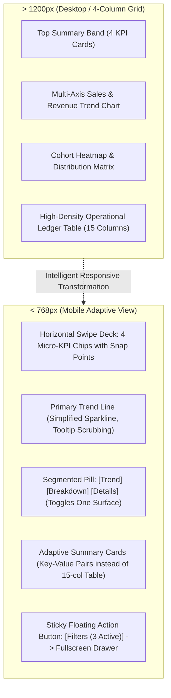

# Sentra Analytics — Product and Experience Architecture Specification

> **Normative Platform Authority**: This document defines the authoritative product experience, user personas, information architecture, floorplans, visual dialect, global interactions, and responsive design for the **UniERP Analytics Enterprise Program** (`PLT-ERP`, `PLT-BIZ`, `PLT-DS`). It layers strictly on Meridian Workbench (`ADR-0008`) and Strata DL 2.0 (`ADR-0009`), formalized under `ADR-0011`.

---

## 1. User Groups, Access Models & Default Workspaces

Sentra Analytics enforces strict role-based and scope-isolated access across 8 enterprise personas. UI visibility is never treated as authorization; every view and action corresponds to server-enforced RBAC and Row Level Security (`NOBYPASSRLS`).

```mermaid
graph TD
    subgraph Enterprise_Governance ["Data & Security Governance"]
        DS["Data Steward<br/>Scope: Tenant Catalog<br/>Perm: bi-metrics.manage"]
        SEC["Security Admin<br/>Scope: Tenant Exports/Audit<br/>Perm: exports.manage"]
    end

    subgraph Analytical_Authoring ["Analytics & BI Engineering"]
        RA["Report Author<br/>Scope: Org / Tenant<br/>Perm: dashboard.manage"]
        BA["Business Analyst<br/>Scope: Tenant Ad-Hoc<br/>Perm: query.read, pivot.read"]
        DA["Delegated Auditor<br/>Scope: Time-Boxed Snapshot<br/>Perm: report.read (Watermarked)"]
    end

    subgraph Operational_Business ["Business Leadership & Operations"]
        EXEC["Executive (CXO)<br/>Scope: Multi-Entity Rollup<br/>Perm: dashboard.read, kpi.read"]
        MGR["Dept Manager<br/>Scope: Org Unit / Branch<br/>Perm: report.read, trends.read"]
        OPS["Operational User<br/>Scope: Location / Team<br/>Perm: telemetry.read"]
    end

    EXEC -->|Default| W_EXEC["/analytics (Overview Cockpit)"]
    MGR -->|Default| W_DASH["/analytics/dashboards?category=dept"]
    OPS -->|Default| W_REP["/analytics/reports (Operational)"]
    BA -->|Default| W_PIV["/analytics/pivot & /analytics/query"]
    RA -->|Default| W_BLD["/analytics/builder (Studio)"]
    DS -->|Default| W_CAT["/analytics/catalog & /analytics/pipelines"]
    SEC -->|Default| W_EXP["/analytics/exports & /analytics/settings"]
    DA -->|Default| W_AUD["/analytics/reports?category=audit"]
```



### Detailed Persona Matrix

| User Group | Primary Jobs-to-be-Done (JTBD) | Server Permissions | Tenant / Org Scope | Row & Column Access Security | Default Workspace |
| :--- | :--- | :--- | :--- | :--- | :--- |
| **1. Executives** *(CEO, CFO, COO, Board)* | • Evaluate macro business health across revenue, burn, and margin.<br/>• Inspect forward-looking AI forecasts and downside risks.<br/>• Drill into subsidiary variance against board-approved targets. | `analytics.dashboard.read`<br/>`analytics.kpi.read`<br/>`analytics.insights.read`<br/>`analytics.report.read` | **Tenant-Wide**: Multi-entity rollup across all subsidiaries. | **Aggregate Level**: Executive summaries; individual customer PII, employee SSNs, and granular tax IDs masked. | Executive Cockpit (`/analytics`) |
| **2. Department Managers** *(Sales VP, Plant Mgr, Controller)* | • Track team KPI achievement against quarterly quota.<br/>• Monitor operational exceptions (stockouts, overdue AR, line stoppage).<br/>• Dispatch corrective operational tasks directly from telemetry. | `analytics.dashboard.read`<br/>`analytics.report.read`<br/>`analytics.trends.read`<br/>`analytics.kpi.read` | **Organization Unit**: Scoped to user's assigned `orgId` / cost center. | **Departmental Rows**: Full ledger lines for assigned cost center; cross-department operational details redacted. | Department Dashboards (`/analytics/dashboards`) |
| **3. Operational Users** *(Accountants, Dispatchers, Reps)* | • Monitor day-to-day transaction processing queues.<br/>• Triage real-time telemetry alerts and shipping status.<br/>• Validate individual invoice matching and inventory moves. | `analytics.report.read`<br/>`analytics.telemetry.read`<br/>`analytics.exports.read` | **Branch / Facility**: Scoped to user's warehouse, store, or team. | **Operational Line Items**: Detailed transaction rows; bounded strictly by location / facility security policies. | Operational Reports (`/analytics/reports`) or Stream (`/analytics/realtime`) |
| **4. Business Analysts** *(BI Analysts, FinOps, RevOps)* | • Slice ad-hoc data across customer cohorts and product tiers.<br/>• Formulate multi-dimensional pivot matrices and funnel models.<br/>• Correlate anomaly spikes with supply chain disruptions. | `analytics.query.read`<br/>`analytics.pivot.read`<br/>`analytics.trends.read`<br/>`analytics.funnel.read`<br/>`analytics.anomaly.read` | **Tenant-Wide Read**: Full analytical query access across domains. | **Granular Datasets**: Access to transaction tables; sensitive fields (credit cards, bank numbers) tokenized or masked. | Pivot Table (`/analytics/pivot`) or Query Studio (`/analytics/query`) |
| **5. Report Authors** *(BI Champions, Analytics Eng)* | • Construct curated dashboard boards for leadership.<br/>• Author standardized report templates and calculated metrics.<br/>• Publish saved views and configure widget grid layouts. | `analytics.dashboard.manage`<br/>`analytics.report.create`<br/>`analytics.reporting.manage`<br/>`saved-views.manage` | **Tenant Authoring**: Can create tenant-wide or department templates. | **Schema-Wide Definition**: Design-time schema metadata; run-time preview executes in author's actual tenant context. | Dashboard Builder (`/analytics/builder`) |
| **6. Data Stewards** *(Chief Data Officer, Governance)* | • Curate the enterprise Semantic Metric Dictionary.<br/>• Certify trusted business metrics (e.g. standard EBITDA formula).<br/>• Monitor ETL pipeline freshness, lag, and data warehouse ingestion. | `analytics.bi-metrics.manage`<br/>`analytics.pipeline.read`<br/>`analytics.pipeline.manage`<br/>`occ.intelligence.*` | **Enterprise Governance**: Cross-org data governance; bridge to `OCC-22`. | **Metadata & Lineage**: Full metadata, lineage ASTs, and pipeline run logs; zero plain-text customer data access. | Metric Catalog (`/analytics/catalog`) & Pipelines (`/analytics/pipelines`) |
| **7. Security & Compliance Admins** *(CISO, DPO, Auditors)* | • Inspect analytical audit logs and execution histories.<br/>• Enforce cryptographic export policies and DLP masking rules.<br/>• Validate GDPR/CCPA data retention and erasure compliance. | `analytics.audit.read`<br/>`analytics.exports.manage`<br/>`compliance.audit.read`<br/>`occ.security.*`<br/>`occ.data-lifecycle.*` | **Tenant Security**: Tenant-wide security and compliance boundary. | **Audit & Key Access**: Access to execution logs, distribution lists, and encryption keys; masked underlying business rows. | Scheduled Exports (`/analytics/exports`) & Settings (`/analytics/settings`) |
| **8. Delegated External Analysts** *(External Auditors)* | • Conduct statutory financial year-end attestation.<br/>• Verify trial balances and revenue recognition schedules.<br/>• Review frozen historical audit packages. | `analytics.report.read`<br/>`analytics.audit.read`<br/>*(Time-bounded RBAC grant)* | **Restricted Snapshot**: Scoped strictly to specified audited fiscal periods. | **Frozen Read-Only**: Tamper-evident, watermarked historical snapshots; ad-hoc queries, mutation, and sharing disabled. | Audit Reports (`/analytics/reports?category=audit`) |

---

## 2. Information Architecture & Navigation Hierarchy

### 2.1 Authoritative Workspace Tree

The Analytics module is structured into 4 logical functional clusters across 17 distinct routes:

```
/analytics (Executive Cockpit)
├── Executive Intelligence
│   ├── /analytics/dashboards     # Curated Dashboards Directory & Board Viewer
│   ├── /analytics/reports        # Standardized Operational & Financial Reports
│   └── /analytics/kpis           # Key Performance Indicators & Target Baselines
├── Deep Exploration & BI Studio
│   ├── /analytics/builder        # Drag-and-Drop Dashboard Layout Studio
│   ├── /analytics/pivot          # Multidimensional Cross-Tabulation Matrix
│   ├── /analytics/query          # Visual Query Builder & Natural Language Copilot
│   ├── /analytics/advanced       # Advanced Report Definition & Custom Drilldown
│   └── /analytics/catalog        # Semantic Metric Dictionary & Certified Formulas
├── AI & Algorithmic Intelligence
│   ├── /analytics/insights       # Automated Cross-Domain Business Insights Feed
│   ├── /analytics/predictive     # Predictive Machine Learning Models & Forecasts
│   ├── /analytics/trends         # Historical Trend Aggregations & YoY Slicing
│   ├── /analytics/anomalies      # Telemetry Anomaly Detection & Incident Alerts
│   └── /analytics/funnels        # Customer & Operational Conversion Funnels
└── Ingestion, Delivery & Governance
    ├── /analytics/realtime       # High-Throughput Live Telemetry Event Stream
    ├── /analytics/pipelines      # ETL Data Replication & Lakehouse Ingestion
    ├── /analytics/exports        # Scheduled Automated Reports & Distribution Lists
    └── /analytics/settings       # Module Configuration, Retention & OCC-22 Bridge
```

### 2.2 Single-Source Shell Navigation & Tab Navigation Retirement

To enforce institutional clarity and eliminate visual clutter:
1. **Single-Source Context Provider**: The `ContextBar` (`StrataBar`) in `app/(dashboard)/layout.tsx` is the ONE AND ONLY breadcrumb and operational context provider across the application shell. Pages MUST NOT render secondary breadcrumbs in page headers.
2. **Sidebar Ownership**: The left-hand navigation sidebar defined in `tenant-apps/src/navigation/descriptors/analytics.ts` is the single source of truth for routing between analytics workspaces.
3. **Retirement of Duplicate Tab Strips**:
   - Module-level horizontal tab navigation bars (`ModuleTabLayout`) that duplicate sidebar links are strictly prohibited and retired.
   - Internal page-level view toggle (e.g., switching between "Grid View" and "Board View" on `/analytics/dashboards`) must be implemented as an in-page `<SegmentedControl>` or compact `<Tabs>` primitive that alters local state or query params (`?view=board`), NEVER replacing or duplicating global navigation.
4. **Route Retirement & Alias Resolution**:
   - Route `/analytics/custom-dashboards` is permanently retired; it redirects with HTTP 308 to `/analytics/dashboards`.
   - Route `/dashboard` permanently redirects with HTTP 308 to `/analytics`.

---

## 3. Canonical Floorplan Mapping

Every route in Sentra Analytics is mapped to one of the 7 authoritative Meridian / Strata floorplans (`ADR-0008` & `ADR-0009`). Floorplans ensure structural consistency, responsive grid boundaries, and uniform accessibility states.

| Route Path | Canonical Floorplan | Layout Structure | Key Interactive Surfaces |
| :--- | :--- | :--- | :--- |
| `/analytics` | `OperationsFloorplan` | Executive telemetry cockpit with high-density KPI summary band (top), split trend/distribution stage (middle), and real-time operational activity log (bottom). | Universal time filter, drill-through drawers, quick action dispatchers. |
| `/analytics/dashboards` | `DataWorkspace` | Standard tabular directory with filter sidebar (left) and high-density data grid (right), supporting switchable card-deck presentation. | Search input, category filter pills, modal delete confirmation, board clone action. |
| `/analytics/builder` | `StudioShell` | Three-panel authoring studio: Widget component palette (left), drag-and-drop 12-column responsive canvas (center), and contextual property inspector (right). | Drag handle, column span toggles, live data preview toggle, JSON AST drawer. |
| `/analytics/reports` | `DataWorkspace` | Institutional enterprise data grid with persistent filter bar, batch selection actions, and column configuration drawer. | Quick filter chips, column reorder drawer, scheduled execution modal, bounded CSV export. |
| `/analytics/pivot` | `StudioShell` | Dual-pane multidimensional workspace: Dimension & Measure selector drawer (left) and high-density cross-tab matrix (right). | Row/Column dropzones, aggregation function selector (Sum, Avg, Min, Max), cell heat-map toggle. |
| `/analytics/query` | `StudioShell` | Interactive split-canvas: Visual query blocks & AI Copilot prompt bar (top), live SQL/AST inspector (middle), and virtualized data table (bottom). | AI query generator, table schema picker, filter expression builder, execution timer. |
| `/analytics/realtime` | `OperationsFloorplan` | High-frequency telemetry dashboard: Streaming metrics bar (top), live sparkline charts (middle), and auto-scrolling telemetry event log (bottom). | Stream pause/resume button, buffer speed controller, event filter chips, replay slider. |
| `/analytics/kpis` | `DataWorkspace` | Structured scorecard grid displaying organizational KPIs, current values, targets, and variance indicators. | Category tabs, target edit modal, quarterly baseline history drawer. |
| `/analytics/trends` | `SplitViewShell` | Master-detail analytics workspace: Metric trend list (left) and interactive historical comparison chart with YoY overlay (right). | Interval dropdown (Daily/Weekly/Monthly/Quarterly), baseline comparison toggle. |
| `/analytics/funnels` | `SplitViewShell` | Conversion model workspace: Stage configuration list (left) and horizontal funnel flow diagram with drop-off percentages (right). | Stage reorder handles, cohort filter dropdown, drop-off root-cause drawer. |
| `/analytics/catalog` | `DataWorkspace` | Governance dictionary grid displaying metric keys, certified formulas, source entity bindings, and data steward signatures. | Formula editor drawer, certification status badge, upstream source lineage graph. |
| `/analytics/insights` | `SplitViewShell` | Insight triage console: Categorized AI finding cards (left) and detailed causal analysis report with action buttons (right). | Severity filters (Info/Warning/Critical), "Create Task" button, feedback rating buttons. |
| `/analytics/predictive`| `SplitViewShell` | Machine learning model workbench: Model registry list (left) and forecast visualization with confidence intervals (right). | Horizon selector (30/60/90 days), model training trigger, algorithm comparison tab. |
| `/analytics/anomalies` | `SplitViewShell` | Telemetry incident workspace: Anomaly alert queue (left) and time-series spike inspection chart with contextual logs (right). | Acknowledge alert button, threshold sensitivity slider, incident escalation modal. |
| `/analytics/pipelines` | `OperationsFloorplan` | ETL replication console: Ingestion health overview (top), active pipelines list (middle), and execution log stream (bottom). | Run pipeline button, retry failed job button, schema synchronization trigger. |
| `/analytics/exports` | `DataWorkspace` | Scheduled distribution registry: Recurring jobs table with distribution channels (Email, Webhook, S3). | Cron expression builder modal, recipient distribution list drawer, test run trigger. |
| `/analytics/settings` | `SettingsWorkspace` | Form-driven configuration console: General analytics settings, ClickHouse data warehouse connections, retention policies, and OCC-22 sync. | Setting input fields, connection test button, cache purge button, OCC-22 import button. |

---

## 4. Sentra Design Dialect Principles

Sentra Analytics is a specialized enterprise dialect designed for high-information-density workflows, institutional governance, and mathematical precision.

```
┌────────────────────────────────────────────────────────────────────────────────────────┐
│ SENTRA COMPONENT ANATOMY                                                               │
│                                                                                        │
│  [Cert Badge]  Metric Title                              Freshness: 2m ago [Lineage]   │
│  ────────────────────────────────────────────────────────────────────────────────────  │
│  $14,829,102.50                       +12.4%  ▲ vs Prior Month                         │
│  (tabular-nums lining-nums)           (--color-success with directional icon)          │
│  ────────────────────────────────────────────────────────────────────────────────────  │
│  [====================================...........] 74.2% of Q3 Target ($20.0M)         │
│  Restrained Chart Canvas (Tokenized Palette, Zero Raw Hex, Gridlines #f1f5f9)          │
└────────────────────────────────────────────────────────────────────────────────────────┘
```

### 4.1 Density & Spatial Hierarchy
- **Standard Density**: `compact` (28px row height in grids; 16px widget padding).
- **Expert Density**: `ultra-compact` (24px row height in financial ledgers and pivot tables). Minimum text size strictly clamped to `11px` to guarantee WCAG 2.2 AA readability.
- **Surface Elevation**: Low-elevation, border-driven hierarchy. Ground is Slate 50 (`var(--color-surface-ground)`), cards are elevated white (`var(--color-surface-elevated)`), wells are sunken Slate 100 (`var(--color-surface-sunken)`), separated by hairline 1px borders (`var(--color-border)`). Drop shadows are minimized.

### 4.2 Typography Triad
- **Display & Headings**: *Plus Jakarta Sans / Instrument Sans* for structural, geometric headers.
- **Data & Body Text**: *Inter* with strict tabular numeral rules:
  ```css
  font-variant-numeric: tabular-nums lining-nums;
  ```
  Guarantees that decimal points, commas, and currency symbols align with optical perfection down financial columns.
- **Identifiers & Formulas**: *JetBrains Mono / Martian Mono* for SQL queries, UUIDs, pipeline hashes, and AST formula strings.

### 4.3 Chart Grammar & Color Semantics
- **Zero Raw Literals**: Hardcoded hex strings (`#10b981`, `#3b82f6`) are strictly banned.
- **Canonical Palette Mapping**:
  - Primary Series: `var(--color-brand)` (Strata Cobalt)
  - Secondary Series: `var(--color-accent-teal)` / `var(--color-accent-purple)`
  - Positive / Target Met: `var(--color-success)` (Forest Green)
  - Warning / Approaching Breach: `var(--color-warning)` (Amber)
  - Danger / Breached / Anomaly: `var(--color-danger)` (Crimson)
  - Inactive / Historical Baseline: `var(--color-text-muted)` (Slate 400)
- **Zero Baseline & Gridlines**: All bar and area charts must anchor to a true `0.00` baseline. Gridlines must use subtle, non-intrusive border tokens (`var(--color-border-subtle)`).
- **Dual-Axis Restraint**: Dual-axis charts are restricted to rate-vs-volume comparisons (e.g. Sales Volume in Bars vs Conversion Rate in Line) and must clearly label both axes with unit symbols (`$` and `%`).

### 4.4 Institutional Comparison Grammar
- Comparisons must never display a raw percentage without explicit context.
- **Standard Syntax**: `[Directional Icon] [Signed Value] vs [Baseline Context]`
  - *Example 1*: `▲ +14.2% vs Prior Month (MTD)` (Rendered in `--color-success`)
  - *Example 2*: `▼ -3.8% vs Q3 Budget Target` (Rendered in `--color-danger`)
  - *Example 3*: `● 0.0% vs Prior Day` (Rendered in `--color-text-secondary`)

### 4.5 Trust Invariants: Freshness, Certification & Lineage
Every metric card, dashboard widget, and report grid must expose three trust attributes:
1. **Freshness Timestamp**: Displayed in the header micro-copy (`"Updated 4m ago"` or `"Live Stream Active"`). If data is older than the configured refresh threshold, render an Amber stale-data indicator.
2. **Certification Badge**: Metrics approved by Data Stewards display a Gold Checkmark badge (`Certified Metric`). Uncertified ad-hoc calculations display an Info badge (`User Formula`).
3. **Inspectable Lineage**: Clicking the lineage icon opens a side drawer visualizing the upstream data lineage:
   `PostgreSQL Invoice Table` ➔ `ETL Ingestion Pipeline` ➔ `Semantic Metric: Net_Revenue` ➔ `Widget Canvas`.

---

## 5. Global Controls & Workspace Interactions

Sentra Analytics provides a coherent suite of global controls shared across all 17 workspaces:

```
┌────────────────────────────────────────────────────────────────────────────────────────┐
│ GLOBAL ANALYTICS CONTROL BAR (Sub-header in Data & Operations Floorplans)             │
│                                                                                        │
│  [ Date: Last 30 Days ▼ ]  [ Compare: vs Previous Period ▼ ]  [ Entity: Global Corp ▼ ]│
│  [ Dimension Filter: All Departments ▼ ]   [ Saved View: Executive Default ▼ ]         │
│                                            [ Share ] [ Export ▼ ] [ Auto-Refresh: 5m ] │
└────────────────────────────────────────────────────────────────────────────────────────┘
```

1. **Global Time Range Picker**:
   - Presets: *Today, Yesterday, Last 7 Days, Last 30 Days, Month-to-Date (MTD), Quarter-to-Date (QTD), Year-to-Date (YTD), Trailing 365 Days*.
   - Custom: Dual calendar picker accepting exact ISO timestamps with timezone indicators.
2. **Global Comparison Selector**:
   - Toggles: *None, Previous Period (sequential), Previous Year (YoY), Budget Baseline*.
3. **Universal Dimensional Filter Bar**:
   - Supports multi-select facet pills for *Legal Entity, Geographic Region, Business Unit, Product Category, Currency*.
   - Filter state persists across route transitions within the user's active session via URL query params (`?timeRange=30d&entity=corp1`).
4. **Saved Views & Personalization**:
   - Powered by `SavedViewsModule`. Users can save custom combinations of filters, active columns, and sorting as personal or team-shared views.
5. **Drill-Through Interactions**:
   - Clicking on a metric card, chart bar, or table cell opens a contextual slide-over drawer displaying the underlying atomic transaction records, with one-click navigation to the source document (e.g. clicking an invoice amount opens `/finance/invoices/:id`).
6. **Annotations & Collaboration**:
   - Users can pin textual annotations to specific chart dates or data points to record business explanations for variance (e.g. "Spike due to ERP migration launch").
7. **Scheduled Delivery & Subscriptions**:
   - Any report or dashboard can be subscribed to with one click, delivering periodic PDF/CSV snapshots via email or Webhook.
8. **Command Palette & Keyboard Acceleration (`Cmd+K` / `Ctrl+K`)**:
   - Full search over all metrics, reports, dashboards, and saved queries.
   - Global analytical shortcuts:
     - `G` then `O`: Go to Overview Cockpit
     - `G` then `D`: Go to Dashboards
     - `G` then `R`: Go to Reports
     - `G` then `Q`: Go to Query Studio
     - `G` then `P`: Go to Pivot Matrix
     - `Alt+R`: Force refresh active data queries
     - `Alt+E`: Open export drawer
     - `?`: Display keyboard shortcut help modal

---

## 6. Mobile & Narrow-Screen Responsive Prioritization

Indiscriminate card stacking—converting a complex 4-column enterprise dashboard into an endless, unusable 10,000-pixel vertical scroll on mobile—is **explicitly rejected** as an anti-pattern. Sentra Analytics implements structured progressive disclosure:



### Responsive Rules
1. **Viewport Thresholds**:
   - Desktop: `> 1200px` (Full 12-column grid, persistent filter bars, side-by-side split views).
   - Tablet: `768px - 1199px` (2-column grids, collapsible filter sidebars).
   - Mobile: `< 768px` (Single-column prioritized layout with horizontal carousels).
2. **Top KPI Prioritization**:
   - On mobile, top metric cards collapse into a **horizontal swipe deck** with CSS scroll-snap (`scroll-snap-type: x mandatory`). Users swipe smoothly through key figures without pushing core content off-screen.
3. **Progressive Chart Disclosure**:
   - Secondary distributions and complex scatterplots are hidden by default behind `<SegmentedControl>` tabs (`[Overview] | [Breakdown] | [Ledger]`). Only one primary chart is rendered at a time.
4. **Table-to-Card Transformation**:
   - Enterprise tables with >5 columns do not scroll infinitely horizontally. Below 768px, rows automatically transform into structured key-value summary cards with a "View Details" tap target.
5. **Off-Canvas Control Drawer**:
   - The global filter bar and dimension selectors collapse into a single sticky filter badge at the bottom of the viewport. Tapping it opens a native-feeling full-screen bottom sheet.

---

## 7. Page-Level Acceptance Criteria

### 7.1 Overview Cockpit (`/analytics`)
- [ ] Rendered within `OperationsFloorplan` with `data-density="compact"`.
- [ ] Displays top 4 certified KPI cards (`Revenue MTD`, `Outstanding Receivables`, `Active Pipeline`, `Active Employees`).
- [ ] Binds exclusively to live PostgreSQL database aggregations via `AnalyticsRepository`.
- [ ] 100% free of hardcoded mock datasets, demo activity streams, and browser `alert()`.
- [ ] Renders truthful empty states if no transaction records exist.
- [ ] Mobile view collapses KPI cards into swipeable horizontal deck.

### 7.2 Dashboards Workspace (`/analytics/dashboards`)
- [ ] Rendered within `DataWorkspace` floorplan.
- [ ] Enforces root `<RouteGuard permissions="analytics.dashboard.read">`.
- [ ] Provides search input, category filter pills (Executive, Sales, Finance, Supply Chain), and view switcher (Table vs Cards).
- [ ] Delete action opens accessible modal confirmation, not native browser `confirm()`.
- [ ] Empty state renders "Create Dashboard" primary button directing to `/analytics/builder`.

### 7.3 Dashboard Builder Studio (`/analytics/builder`)
- [ ] Rendered within `StudioShell` floorplan.
- [ ] Enforces `<RouteGuard permissions="analytics.dashboard.manage">`.
- [ ] Palette allows dragging Chart, KPI, Table, and Text widgets onto a 12-column grid.
- [ ] Form mutations validate against `@kannan19302/contracts` schemas (zero `z.any()`).
- [ ] Saving triggers transactional persist and outbox event `analytics.dashboard.saved`.

### 7.4 Reports Workspace (`/analytics/reports`)
- [ ] Rendered within `DataWorkspace` floorplan.
- [ ] Enforces `<RouteGuard permissions="analytics.report.read">`.
- [ ] Displays report definitions with search, pagination, and sorting.
- [ ] Click row to open Report Viewer with column configuration drawer.
- [ ] Export action initiates asynchronous streaming export with progress indicator.

### 7.5 Pivot Table Studio (`/analytics/pivot`)
- [ ] Rendered within `StudioShell` floorplan with `data-density="ultra-compact"`.
- [ ] Enforces `<RouteGuard permissions="analytics.pivot.read">`.
- [ ] Supports dragging dimensions into Row and Column dropzones.
- [ ] Computes aggregations (Sum, Avg, Count) server-side via `AnalyticsRepository.executePivotAggregation`.
- [ ] Numerical cells formatted with `tabular-nums lining-nums`.

### 7.6 Visual Query Studio (`/analytics/query`)
- [ ] Rendered within `StudioShell` floorplan.
- [ ] Enforces `<RouteGuard permissions="analytics.query.read">`.
- [ ] Allows visual selection of domain entities, fields, and filter conditions.
- [ ] Compiles AST into parameterized SQL with strict AST validation (zero raw string injection).
- [ ] AI Copilot prompt translates natural language into visual AST blocks with error fallback.

### 7.7 Real-time Telemetry Stream (`/analytics/realtime`)
- [ ] Rendered within `OperationsFloorplan`.
- [ ] Enforces `<RouteGuard permissions="analytics.telemetry.read">`.
- [ ] Subscribes to live telemetry feed; displays event throughput per second.
- [ ] Includes Pause, Resume, and Buffer Clearing controls.
- [ ] Auto-reconnects with exponential backoff if WebSocket connection drops.

### 7.8 Metric Trends (`/analytics/trends`)
- [ ] Rendered within `SplitViewShell`.
- [ ] Enforces `<RouteGuard permissions="analytics.trends.read">`.
- [ ] Allows multi-interval grouping (Daily, Weekly, Monthly, Quarterly).
- [ ] Renders YoY comparison overlay with tokenized delta micro-copy.

### 7.9 Funnel Conversion (`/analytics/funnels`)
- [ ] Rendered within `SplitViewShell`.
- [ ] Enforces `<RouteGuard permissions="analytics.funnel.read">`.
- [ ] Computes drop-off percentages between sequential operational stages from real database records.
- [ ] Responsive chart preserves readability on narrow viewports.

### 7.10 BI Metric Catalog (`/analytics/catalog`)
- [ ] Rendered within `DataWorkspace`.
- [ ] Enforces `<RouteGuard permissions="analytics.bi-metrics.read">`.
- [ ] Displays certified semantic metrics dictionary synchronized with `OCC-22`.
- [ ] Shows formula, unit, source entity, and steward certification status.

### 7.11 AI Insights Engine (`/analytics/insights`)
- [ ] Rendered within `SplitViewShell`.
- [ ] Enforces `<RouteGuard permissions="analytics.insights.read">`.
- [ ] Categorizes business findings by severity (Critical, Warning, Opportunity).
- [ ] Provides one-click action buttons to dispatch corrective ERP tasks.

### 7.12 KPI Library (`/analytics/kpis`)
- [ ] Rendered within `DataWorkspace`.
- [ ] Enforces `<RouteGuard permissions="analytics.kpi.read">`.
- [ ] Displays scorecards with baseline target, current value, and quarterly progress bar.
- [ ] Click card to open transaction drilldown drawer.

### 7.13 Predictive Engine (`/analytics/predictive`)
- [ ] Rendered within `SplitViewShell`.
- [ ] Enforces `<RouteGuard permissions="analytics.forecast.read">`.
- [ ] Displays trained forecast models, accuracy scores, and forecast horizons.
- [ ] Renders forecast curves with shaded confidence interval bands.

### 7.14 Anomaly Detection (`/analytics/anomalies`)
- [ ] Rendered within `SplitViewShell`.
- [ ] Enforces `<RouteGuard permissions="analytics.anomaly.read">`.
- [ ] Displays active anomaly alerts with threshold breach magnitude.
- [ ] Includes "Acknowledge" and "Investigate" action triggers.

### 7.15 Data Pipelines (`/analytics/pipelines`)
- [ ] Rendered within `OperationsFloorplan`.
- [ ] Enforces `<RouteGuard permissions="analytics.pipeline.read">`.
- [ ] Lists ETL replication jobs, sync frequencies, source/target tables, and last run statuses.
- [ ] Includes manual "Run Now" trigger.

### 7.16 Scheduled Exports (`/analytics/exports`)
- [ ] Rendered within `DataWorkspace`.
- [ ] Enforces `<RouteGuard permissions="analytics.export.read">`.
- [ ] Displays recurring export schedules with cron syntax, format (CSV/PDF), and destination.
- [ ] Modal allows configuring new scheduled export with recipient validation.

### 7.17 Analytics Settings & OCC-22 Bridge (`/analytics/settings`)
- [ ] Rendered within `SettingsWorkspace`.
- [ ] Enforces `<RouteGuard permissions="analytics.settings.read">`.
- [ ] Binds dynamically to `AnalyticsSettingsController` (`GET/PATCH /analytics/settings`).
- [ ] Configures default dashboard, retention days, refresh interval, and OCC-22 lakehouse connection.

---

## 8. Route-Retirement & Alias Resolution Map

| Requested / Legacy Route | Canonical Target Route | HTTP Status / Client Strategy | Preservation Rationale |
| :--- | :--- | :--- | :--- |
| `/analytics/custom-dashboards` | `/analytics/dashboards` | **308 Permanent Redirect** in `next.config.js` | Legacy route consolidated into unified Dashboards workspace. Preserves external links and browser bookmarks. |
| `/dashboard` | `/analytics` | **308 Permanent Redirect** in `next.config.js` | Historical root dashboard route redirected to institutional Executive Cockpit. Preserves tenant query parameters. |
| `/analytics/reporting` | `/analytics/reports` | **308 Permanent Redirect** in `next.config.js` | Alias consolidation to standard plural noun convention. |
| `/analytics/builder/:id` | `/analytics/builder?id=:id` | Client Router Normalization | Standardizes studio query parameters for unified layout loading. |
