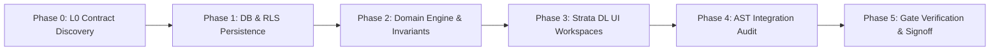

# UniERP Module Golden Standard: Finance Architecture & Engineering Specification

Document ID: `STD-MOD-FIN-001`  
Revision: `1.0.0`  
Effective Date: September 10, 2026  
Adoption Target: UniERP v1.0 Production Release (January 1, 2027)  
Authority: Platform Architecture Committee (`PLT-BIZ`, `PLT-ERP`, `PLT-IAM`, `PLT-DS`, `PLT-OPS`, `PLT-DEV`)  
Status: **APPROVED — PROVEN GOLDEN STANDARD**  
Knowledge Delta: `RATIFIED` (Comprehensive module blueprint grounded in reproducible polyrepo evidence)

---

## 1. Executive Summary & Architectural Purpose

This standard formalizes the reference implementation and engineering invariants established during the qualification of the **UniERP Finance Engine**. It serves as the authoritative blueprint for all current and future business modules across the UniERP polyrepo (e.g., HR, CRM, Supply Chain, Manufacturing, Project Management).

Every commercial enterprise ERP suite claims end-to-end functionality, but traditional monoliths and naive multi-tenant SaaS engines fail on consistency, multi-tenant isolation, audit immutability, and transactional reconciliation. The UniERP Golden Standard eliminates these failure modes through mathematically rigorous double-entry accounting, strict contract-driven delivery, zero-trust server-side authorization, PostgreSQL Row-Level Security (RLS) enforcement, and human-centric high-density design (Strata DL 2.0).

---

## 2. Core Architecture & Bounded Contexts

Module boundaries are governed by the UniERP Platform Catalog ([`docs/PLATFORM_CATALOG.md`](file:///d:/UniERP/unierp-platform/docs/PLATFORM_CATALOG.md)). A filesystem directory never defines a product boundary.

```
┌─────────────────────────────────────────────────────────────────────────────┐
│                            PLT-ERP (Tenant Apps)                            │
│  Strata DL 2.0 Workspaces, Contextual Record Inspectors, High-Density Grids │
└──────────────────────────────────────┬──────────────────────────────────────┘
                                       │ Strongly Typed HTTP / OpenAPI / SSE
┌──────────────────────────────────────▼──────────────────────────────────────┐
│                        PLT-DEV (unierp-contracts)                           │
│  Canonical Schemas, DTOs, Enums, State Transition Invariants, Zod Validators│
└──────────────────────────────────────┬──────────────────────────────────────┘
                                       │ Shared Contract Interfaces
┌──────────────────────────────────────▼──────────────────────────────────────┐
│                          PLT-BIZ (API Gateway & Services)                   │
│  NestJS Domain Controllers, Idempotency Guards, GlAccounting Balance Engine │
└──────────────────────────────────────┬──────────────────────────────────────┘
                                       │ Atomic Tx + Outbox
┌──────────────────────────────────────▼──────────────────────────────────────┐
│                            PLT-DATA (Persistence)                           │
│  PostgreSQL with FORCE RLS, Immutable Audit Logs, Decimal Numeric Prisms    │
└─────────────────────────────────────────────────────────────────────────────┘
```

### 2.1 The 11 Inviolable Laws of UniERP Module Design

1. **Decimal Money & Precision Units**: Money values are never stored or computed as floating-point numbers. Every monetary amount consists of an exact decimal representation plus an ISO 4217 currency code. Non-monetary measurements must carry explicit standard physical units.
2. **Balanced Double-Entry Posting**: No business transaction may alter account balances without creating balanced debit/credit journal entries (`∑ debits == ∑ credits`).
3. **Immutable Posted Records**: Once a financial document or journal entry transitions to `POSTED`, `SETTLED`, or `RECONCILED`, it cannot be deleted or mutated. Corrections require audited reversal or amendment records with bidirectional links.
4. **Server-Side Tenant Scope & PostgreSQL RLS**: Tenant context must be extracted from verified cryptographic session tokens (`req.user.tenantId`). Multi-tenant isolation is enforced both in service logic and at the database layer via PostgreSQL Row-Level Security (`ENABLE ROW LEVEL SECURITY` and `FORCE ROW LEVEL SECURITY`) evaluated under `NOBYPASSRLS` roles.
5. **Zero-Trust Role-Based Access Control**: UI visibility is never authorization. Every endpoint requires explicit `@Permissions(...)` decorators verified by runtime authorization guards. Deny-by-default is absolute.
6. **Zero Duplicate Routes**: API endpoints must exhibit unambiguous routing semantics. Method-and-path collisions are forbidden. Compatibility adapters must explicitly document canonical destinations.
7. **Atomic Outbox & Event Consistency**: Domain state mutations and their corresponding event notifications must commit atomically in the same database transaction via an transactional outbox table.
8. **Idempotency by Design**: Every state-changing command (`POST`, `PUT`, `PATCH`) must support idempotent replay via idempotency keys or document entity digests.
9. **Universal Test Account Standard**: Automated verification across Playwright E2E, Chrome DevTools MCP, and integration testbeds must authenticate using the canonical testing identity (`test.agent@unierp.com` / `TestAgent123!`).
10. **Zero-Mock Verification Mandate**: Integration proof cannot rely on simulated responses or in-memory bypasses. Verification requires real database migrations, real contracts, and real execution against API controllers.
11. **Strata Design Language 2.0 Compliance**: Frontend experiences must utilize approved design tokens from `@kannan19302/ui`, support high-density workflows, enforce keyboard navigation, satisfy WCAG 2.2 AA accessibility, and eliminate raw JSON inspect dumps in user workflows.

---

## 3. Proven Implementation Slices (The Finance Reference Model)

The Finance module exemplifies the 11 Inviolable Laws across five mission-critical vertical slices:

### 3.1 Slice 1: Economic Nexus & Tax Jurisdiction Governance
- **Published Contract**: [`src/http/finance-tax-nexus.ts`](file:///d:/UniERP/unierp-contracts/src/http/finance-tax-nexus.ts) defining `NexusThresholdDto`, `NexusMeasurementPeriodEnum`, and `NexusRegistrationStatusEnum`.
- **Backend Service**: [`economic-nexus.service.ts`](file:///d:/UniERP/api/src/modules/finance/services/economic-nexus.service.ts) implements time-windowed threshold evaluations, historical provenance tracking during reactivation, soft retirement without data loss, and audited deregistration.
- **Strata UI**: [`tax-nexus/page.tsx`](file:///d:/UniERP/tenant-apps/app/(dashboard)/finance/advanced/tax-nexus/page.tsx) provides structured historical snapshots, threshold progress meters, and registration lifecycle actions with permission guards.

### 3.2 Slice 2: Tax Provisioning & Deferred Tax Scheduling
- **Published Contract**: [`src/finance-tax-provisioning.ts`](file:///d:/UniERP/unierp-contracts/src/finance-tax-provisioning.ts) defining provision runs, valuation allowances, and uncertain tax positions.
- **Backend Service**: [`tax-provisioning.service.ts`](file:///d:/UniERP/api/src/modules/finance/services/tax-provisioning.service.ts) posts balanced double-entry GL journals (`TAX-PROV-...`) via `GlAccountingService`, enforces draft-only deletion with zero dependent children, and locks parent runs once posted.
- **Strata UI**: [`tax-provisioning/page.tsx`](file:///d:/UniERP/tenant-apps/app/(dashboard)/finance/advanced/tax-provisioning/page.tsx) features tabular KPI cards (Effective vs. Statutory Rate, Rate Differences) and structured Strata reconciliation tables replacing generic inspection blocks.

### 3.3 Slice 3: Advanced Tax Operations & Withholding Automation
- **Published Contract**: [`src/finance-tax-operations.ts`](file:///d:/UniERP/unierp-contracts/src/finance-tax-operations.ts) defining 1099 compliance, exemption certificates, and withholding tax regimes.
- **Strata UI**: [`tax-operations/page.tsx`](file:///d:/UniERP/tenant-apps/app/(dashboard)/finance/advanced/tax-operations/page.tsx) provides a 5-column metric deck and structured Operation Result inspectors with keyboard-driven filtering and status badges.

### 3.4 Slice 4: Fixed Asset Lifecycle & Impairment Accounting
- **Published Contract**: [`src/finance-asset-operations.ts`](file:///d:/UniERP/unierp-contracts/src/finance-asset-operations.ts) governing asset acquisition, depreciation schedules, revaluations, and impairments.
- **Backend Service**: [`asset-lifecycle.service.ts`](file:///d:/UniERP/api/src/modules/finance/services/asset-lifecycle.service.ts) and [`fixed-asset-deep.controller.ts`](file:///d:/UniERP/api/src/modules/finance/controllers/fixed-asset-deep.controller.ts) guarantee atomic GL disposal posting, impairment ledger adjustments, and capital-project conversion locking.
- **Strata UI**: [`fixed-assets/page.tsx`](file:///d:/UniERP/tenant-apps/app/(dashboard)/finance/advanced/fixed-assets/page.tsx) and asset detail workspaces manage complete asset lifecycles through typed action buttons and modal confirmation guards.

### 3.5 Slice 5: Period Close Management & Dual SLA Policy Engine
- **Architectural Decision**: Preserved the dual SLA model supporting **both reusable enterprise SLA policies and task-specific deadline overrides**.
- **Backend Service**: [`close-management.service.ts`](file:///d:/UniERP/api/src/modules/finance/services/close-management.service.ts) and [`close-sla.repository.ts`](file:///d:/UniERP/api/src/modules/finance/repositories/close-sla.repository.ts) enforce acyclic close task dependency graphs, escalation lifecycles, and snapshot audit trails.
- **Strata UI**: [`close-management/page.tsx`](file:///d:/UniERP/tenant-apps/app/(dashboard)/finance/advanced/close-management/page.tsx) renders interactive dependency trees, SLA policy assignments, and critical path visualizations.

---

## 4. Endpoint Classification & Inventory Governance

Every endpoint declared across the module must be discoverable, accounted for, and audited via AST-based tooling ([`tenant-apps/scripts/audit-finance-integration.cjs`](file:///d:/UniERP/tenant-apps/scripts/audit-finance-integration.cjs)).

### 4.1 Quantitative Inventory Verification (September 10, 2026 Audit)

| Metric | Measured Value | Standard Gate Status |
| :--- | :---: | :---: |
| **Total Method/Path Declarations** | `1,771` | **VERIFIED** |
| **Unique Route Signatures** | `1,771` | **VERIFIED** |
| **Duplicate Route Collisions** | `0` | **GATE PASSED** |
| **Unregistered Module Declarations** | `0` | **GATE PASSED** |
| **Direct Method-Matched UI Consumers** | `480` | **VERIFIED** |
| **Active Strata DL Workspaces & Pages** | `89` | **VERIFIED** |
| **Endpoints with Direct Page Candidates** | `473` | **VERIFIED** |
| **Classified Compatibility Aliases** | `1` | **GATE PASSED** |
| **Unresolved Integration Classifications** | `0` | **GATE PASSED** |
| **Invalid Compatibility Aliases** | `0` | **GATE PASSED** |

### 4.2 Endpoint Classification Taxonomy

Endpoints not directly called from interactive user interfaces must be classified in the module classification catalog ([`finance-endpoint-classifications.json`](file:///d:/UniERP/tenant-apps/scripts/finance-endpoint-classifications.json)) into one of the following architectural roles:

1. `COMPATIBILITY_ALIAS`: Adapter route mapping a legacy or alternative signature to a canonical method/path with documented UI route and technical rationale.
2. `INTERNAL_AUTOMATION`: High-throughput background processing, cron-triggered revaluations, batch invoicing workers, or automated ledger post tasks.
3. `INTEGRATION_SYNC`: Dedicated B2B clearinghouse protocols (e.g., PEPPOL, UBL, EDIFACT), Open Banking SWIFT integrations, or third-party webhooks.
4. `SUB_RESOURCE_MUTATION`: Granular sub-entity REST lifecycle endpoints managed contextually within parent document/entity lifecycle transactions.
5. `REPORTING_EXPORT`: High-volume data export, regulatory tax filing feeds, or print artifact generation engines.
6. `SYSTEM_MAINTENANCE`: Administrative audit verifiers, SOX control checks, balance migration hooks, or environment calibration endpoints.

---

## 5. Module Development Lifecycle & Checklist

Future engineering teams implementing new modules must execute this strict 6-step lifecycle:



### Module Author Checklist

- [ ] **L0 Contract Published**: Request, response, and error schemas published in `unierp-contracts` with 100% schema completeness tests.
- [ ] **Data Model & RLS**: Non-destructive expand-only Prisma migrations created with PostgreSQL `FORCE ROW LEVEL SECURITY` policies tested under `NOBYPASSRLS`.
- [ ] **Double-Entry Balance Verification**: Property-based balance verification tests confirming `∑ debits == ∑ credits`.
- [ ] **Zero-Trust Authorization**: Explicit `@Permissions(...)` decorator on every single controller handler; deny-by-default verified.
- [ ] **Atomic Outbox**: Domain events queued in `outbox` table within the same transaction as business data mutations.
- [ ] **Strata DL 2.0 UI**: Zero raw `<pre>` inspection blocks; loading skeletons, empty states, error boundaries, and permission-gated controls implemented using `@kannan19302/ui`.
- [ ] **AST Route Inventory**: `audit-<module>-integration.cjs --check` exits with code 0 (0 duplicates, 0 unregistered, 0 unresolved).
- [ ] **Automated Test Gates**: All contract tests, API tests, and UI component tests pass cleanly with zero failures.

---

## 6. Adoption Roadmap: Target UniERP v1 (January 1, 2027)

To ensure cohesive polyrepo alignment for the January 1, 2027 v1 release milestone:

| Milestone Date | Module / Layer | Target Objectives |
| :--- | :--- | :--- |
| **Q3 2026 (Completed)** | **Finance Module** | Full AST route resolution, zero duplicate routes, 1,771 endpoints verified, 89 pages verified, dual SLA model ratified. |
| **October 15, 2026** | **Supply Chain & Inventory** | Adoption of Golden Standard contract schemas, RLS isolation, and warehouse stock double-entry movement ledgers. |
| **November 15, 2026** | **HR & Payroll Engine** | Strict employee residency isolation, salary disbursement journal posting, and statutory withholding integration. |
| **December 1, 2026** | **CRM & Sales Operations** | Pipeline quote-to-cash integration with automated ASC 606 revenue schedule recognition. |
| **December 15, 2026** | **Full Polyrepo Freeze** | Polyrepo E2E cross-module regression runs using canonical test accounts and disposable staging environments. |
| **January 1, 2027** | **UniERP v1.0 GA** | Commercial production release under the Enterprise SaaS Business Platform standard. |

---

## 7. Knowledge Governance & Traceability

- **Canonical Policy**: [`unierp-platform/docs/standards/AI_AGENT_DEVELOPMENT_PROTOCOL.md`](file:///d:/UniERP/unierp-platform/docs/standards/AI_AGENT_DEVELOPMENT_PROTOCOL.md)
- **Traceability Ledger**: [`unierp-platform/docs/standards/TRACEABILITY_MATRIX.md`](file:///d:/UniERP/unierp-platform/docs/standards/TRACEABILITY_MATRIX.md)
- **Platform Architecture Catalog**: [`unierp-platform/docs/PLATFORM_CATALOG.md`](file:///d:/UniERP/unierp-platform/docs/PLATFORM_CATALOG.md)
- **Finance AST Inventory**: [`unierp-platform/docs/platforms/tenant-apps/evidence/finance-integration-inventory.json`](file:///d:/UniERP/unierp-platform/docs/platforms/tenant-apps/evidence/finance-integration-inventory.json)
- **Finance Change Contract**: [`unierp-platform/docs/platforms/tenant-apps/evidence/finance-v1-change-contract.md`](file:///d:/UniERP/unierp-platform/docs/platforms/tenant-apps/evidence/finance-v1-change-contract.md)
